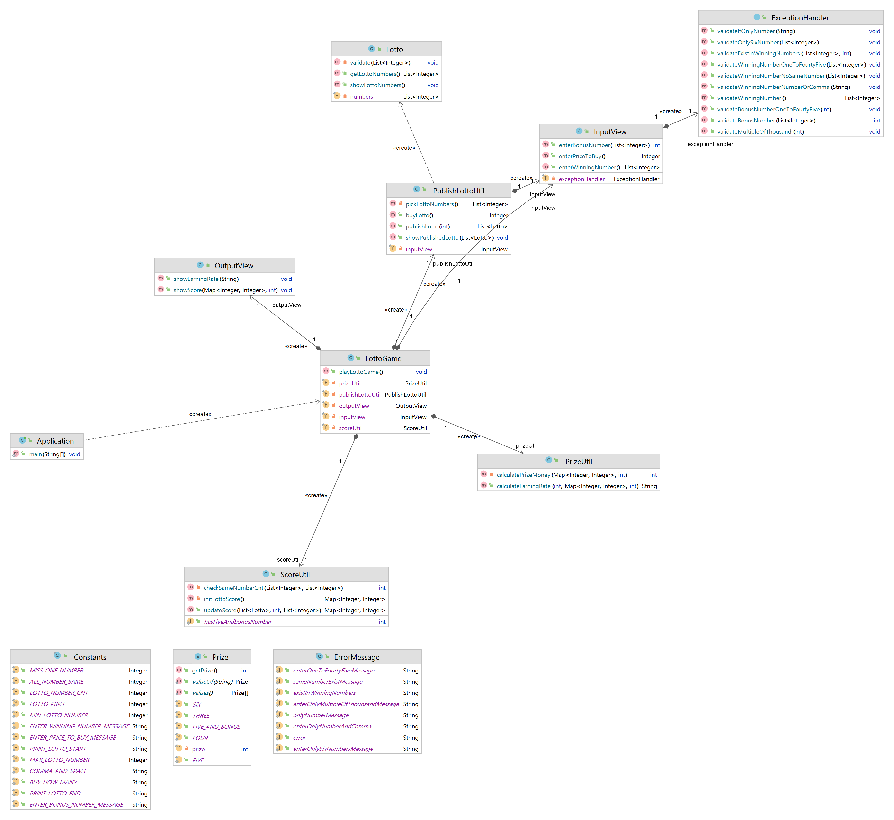

# 💲로또 

## 😸프로젝트 구조 

## 😃프로젝트 내용 

#### 1. 프로젝트 개요 
> 로또를 원하는 수량 만큼 구입하고 당첨 번호와 비교하여 최종 수익률을 구하는 프로그램
#### 2. 프로젝트 기능 
> * 원하는 수량 만큼 로또를 구입하는 기능 - PublishLottoUtil.buyLotto()
> * 구입한 로또 만큼 서로 다른 6개의 숫자를 자동 생성하여 발행하는 기능 - PublishLottoUtil.publishLotto()
> * 구입한 로또의 번호를 출력하는 기능 - PublishLottoUtil.showPublishedLotto()
> * 당첨 번호와 비교하여 몇개의 숫자가 동일한 지 확인하는 기능 - ScoreUtil.checkSameNumberCnt()
> * 당첨 결과를 집계하는 기능 -  ScoreUtil.updateScore()
> * 
