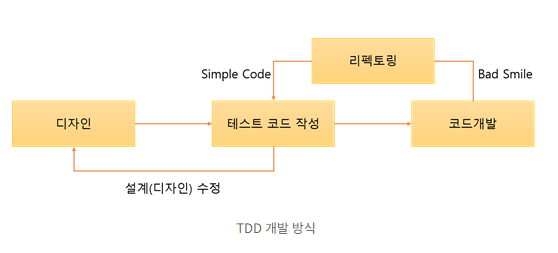

# 미션 - 로또

## 🚀 기능 요구 사항

로또 게임 기능을 구현해야 한다. 로또 게임은 아래와 같은 규칙으로 진행된다.

```
- 로또 번호의 숫자 범위는 1~45까지이다.
- 1개의 로또를 발행할 때 중복되지 않는 6개의 숫자를 뽑는다.
- 당첨 번호 추첨 시 중복되지 않는 숫자 6개와 보너스 번호 1개를 뽑는다.
- 당첨은 1등부터 5등까지 있다. 당첨 기준과 금액은 아래와 같다.
    - 1등: 6개 번호 일치 / 2,000,000,000원
    - 2등: 5개 번호 + 보너스 번호 일치 / 30,000,000원
    - 3등: 5개 번호 일치 / 1,500,000원
    - 4등: 4개 번호 일치 / 50,000원
    - 5등: 3개 번호 일치 / 5,000원
```

- 로또 구입 금액을 입력하면 구입 금액에 해당하는 만큼 로또를 발행해야 한다.
- 로또 1장의 가격은 1,000원이다.
- 당첨 번호와 보너스 번호를 입력받는다.
- 사용자가 구매한 로또 번호와 당첨 번호를 비교하여 당첨 내역 및 수익률을 출력하고 로또 게임을 종료한다.
- 사용자가 잘못된 값을 입력할 경우 `IllegalArgumentException`를 발생시키고, "[ERROR]"로 시작하는 에러 메시지를 출력 후 그 부분부터 입력을 다시 받는다.
    - `Exception`이 아닌 `IllegalArgumentException`, `IllegalStateException` 등과 같은 명확한 유형을 처리한다.

### 입출력 요구 사항

#### 입력

- 로또 구입 금액을 입력 받는다. 구입 금액은 1,000원 단위로 입력 받으며 1,000원으로 나누어 떨어지지 않는 경우 예외 처리한다.

```
14000
```

- 당첨 번호를 입력 받는다. 번호는 쉼표(,)를 기준으로 구분한다.

```
1,2,3,4,5,6
```

- 보너스 번호를 입력 받는다.

```
7
```

#### 출력

- 발행한 로또 수량 및 번호를 출력한다. 로또 번호는 오름차순으로 정렬하여 보여준다.

```
8개를 구매했습니다.
[8, 21, 23, 41, 42, 43] 
[3, 5, 11, 16, 32, 38] 
[7, 11, 16, 35, 36, 44] 
[1, 8, 11, 31, 41, 42] 
[13, 14, 16, 38, 42, 45] 
[7, 11, 30, 40, 42, 43] 
[2, 13, 22, 32, 38, 45] 
[1, 3, 5, 14, 22, 45]
```

- 당첨 내역을 출력한다.

```
3개 일치 (5,000원) - 1개
4개 일치 (50,000원) - 0개
5개 일치 (1,500,000원) - 0개
5개 일치, 보너스 볼 일치 (30,000,000원) - 0개
6개 일치 (2,000,000,000원) - 0개
```

- 수익률은 소수점 둘째 자리에서 반올림한다. (ex. 100.0%, 51.5%, 1,000,000.0%)

```
총 수익률은 62.5%입니다.
```

- 예외 상황 시 에러 문구를 출력해야 한다. 단, 에러 문구는 "[ERROR]"로 시작해야 한다.

```
[ERROR] 로또 번호는 1부터 45 사이의 숫자여야 합니다.
```

#### 실행 결과 예시

```
구입금액을 입력해 주세요.
8000

8개를 구매했습니다.
[8, 21, 23, 41, 42, 43] 
[3, 5, 11, 16, 32, 38] 
[7, 11, 16, 35, 36, 44] 
[1, 8, 11, 31, 41, 42] 
[13, 14, 16, 38, 42, 45] 
[7, 11, 30, 40, 42, 43] 
[2, 13, 22, 32, 38, 45] 
[1, 3, 5, 14, 22, 45]

당첨 번호를 입력해 주세요.
1,2,3,4,5,6

보너스 번호를 입력해 주세요.
7

당첨 통계
---
3개 일치 (5,000원) - 1개
4개 일치 (50,000원) - 0개
5개 일치 (1,500,000원) - 0개
5개 일치, 보너스 볼 일치 (30,000,000원) - 0개
6개 일치 (2,000,000,000원) - 0개
총 수익률은 62.5%입니다.
```

---

## 🎯 프로그래밍 요구 사항

- JDK 17 버전에서 실행 가능해야 한다. **JDK 17에서 정상적으로 동작하지 않을 경우 0점 처리한다.**
- 프로그램 실행의 시작점은 `Application`의 `main()`이다.
- `build.gradle` 파일을 변경할 수 없고, 외부 라이브러리를 사용하지 않는다.
- [Java 코드 컨벤션](https://github.com/woowacourse/woowacourse-docs/tree/master/styleguide/java) 가이드를 준수하며 프로그래밍한다.
- 프로그램 종료 시 `System.exit()`를 호출하지 않는다.
- 프로그램 구현이 완료되면 `ApplicationTest`의 모든 테스트가 성공해야 한다. **테스트가 실패할 경우 0점 처리한다.**
- 프로그래밍 요구 사항에서 달리 명시하지 않는 한 파일, 패키지 이름을 수정하거나 이동하지 않는다.
- indent(인덴트, 들여쓰기) depth를 3이 넘지 않도록 구현한다. 2까지만 허용한다.
    - 예를 들어 while문 안에 if문이 있으면 들여쓰기는 2이다.
    - 힌트: indent(인덴트, 들여쓰기) depth를 줄이는 좋은 방법은 함수(또는 메서드)를 분리하면 된다.
- 3항 연산자를 쓰지 않는다.
- 함수(또는 메서드)가 한 가지 일만 하도록 최대한 작게 만들어라.
- JUnit 5와 AssertJ를 이용하여 본인이 정리한 기능 목록이 정상 동작함을 테스트 코드로 확인한다.

### 추가된 요구 사항

- 함수(또는 메서드)의 길이가 15라인을 넘어가지 않도록 구현한다.
    - 함수(또는 메서드)가 한 가지 일만 잘 하도록 구현한다.
- else 예약어를 쓰지 않는다.
    - 힌트: if 조건절에서 값을 return하는 방식으로 구현하면 else를 사용하지 않아도 된다.
    - else를 쓰지 말라고 하니 switch/case로 구현하는 경우가 있는데 switch/case도 허용하지 않는다.
- Java Enum을 적용한다.
- 도메인 로직에 단위 테스트를 구현해야 한다. 단, UI(System.out, System.in, Scanner) 로직은 제외한다.
    - 핵심 로직을 구현하는 코드와 UI를 담당하는 로직을 분리해 구현한다.
    - 단위 테스트 작성이 익숙하지 않다면 `test/java/lotto/LottoTest`를 참고하여 학습한 후 테스트를 구현한다.

### 라이브러리

- `camp.nextstep.edu.missionutils`에서 제공하는 `Randoms` 및 `Console`
  API를 사용하여 구현해야 한다.
    - Random 값 추출은 `camp.nextstep.edu.missionutils.Randoms`의 `pickUniqueNumbersInRange()`를 활용한다.
    - 사용자가 입력하는 값은 `camp.nextstep.edu.missionutils.Console`의 `readLine()`을 활용한다.

#### 사용 예시

```java
List<Integer> numbers = Randoms.pickUniqueNumbersInRange(1, 45, 6);
```

### Lotto 클래스

- 제공된 `Lotto` 클래스를 활용해 구현해야 한다.
- `numbers`의 접근 제어자인 private을 변경할 수 없다.
- `Lotto`에 필드(인스턴스 변수)를 추가할 수 없다.
- `Lotto`의 패키지 변경은 가능하다.

```java
public class Lotto {
    private final List<Integer> numbers;

    public Lotto(List<Integer> numbers) {
        validate(numbers);
        this.numbers = numbers;
    }

    private void validate(List<Integer> numbers) {
        if (numbers.size() != 6) {
            throw new IllegalArgumentException();
        }
    }

    // TODO: 추가 기능 구현
}
```

---

# 요구사항 구현 및 회고 

## 🚨️  필요기능 목록 정의
1. 로또 구입 금액을 입력 받는다.
   1. "구입금액을 입력해 주세요." 안내 메세지를 구매자에게 보여준다.
   2. 구매자에게 입력 값을 받는다.
  

2. 구매자에게 입력받은 값이 숫자인지 검증한다.
   1. 구입 금액은 1,000원 단위로 입력 받는다.
   2. 예외처리 : 입력한 값이 숫자가 아니면 IllegalArgumentException를 발생시키고, "[ERROR]"로 시작하는 에러 메시지를 출력 후 그 부분부터 입력을 다시 받는다.  

    
3. 입력 받은 금액을 계산하여 구매한 로또 개수를 정한다.
   1. 입력받은 금액을 1,000원 단위로 나누어 개수를 정한다 (예 : 10,000 = 10개)
   2. 예외처리 : 1,000원으로 나누어 떨어지지 않는 경우 IllegalArgumentException를 발생시키고, "[ERROR]"로 시작하는 에러 메시지를 출력 후 그 부분부터 입력을 다시 받는다.
  

4. 구매한 로또 개수 만큼 로또를 발행한다.
   1. n개를 구매했습니다. 안내 메세지를 구매자에게 보여준다.
   2. Lotto 클래스를 활용하여 로또를 n개 발행한다.
  
   
6. 발행한 로또 n개의 로또 번호를 구매자에게 보여준다.
  

7. 당첨 번호를 입력 받는다.
   1. "당첨 번호를 입력해 주세요." 안내 메세지를 구매자에게 보여준다.
   2. 쉼표(,)를 기준으로 6개의 숫자를 입력받습니다.
  

8. 당첨 번호를 쉼표(,)를 기준으로 구분하여 한다.
   1. 번호는 쉼표(,)를 기준으로 구분한다.
   2. 입력 받은 값이 쉼표(,)를 기준으로 구분하지 못하면 IllegalArgumentException를 발생시키고, "[ERROR]"로 시작하는 에러 메시지를 출력 후 그 부분부터 입력을 다시 받는다.
  

9. 구분된 당첨번호를 검증한다.
   1. 예외처리 : 입력 받은 값이 6개의 숫자가 아니면 IllegalArgumentException를 발생시키고, "[ERROR]"로 시작하는 에러 메시지를 출력 후 그 부분부터 입력을 다시 받는다.
   2. 검증 된 번호는 오름차순으로 저장한다.
  

10. 보너스 번호를 입력 받는다. 
    1. "보너스 번호를 입력해 주세요." 안내 메세지를 구매자에게 보여준다.
    2. 예외처리 : 입력 받은 값이 1자리의 숫자가 아니면 IllegalArgumentException를 발생시키고, "[ERROR]"로 시작하는 에러 메시지를 출력 후 그 부분부터 입력을 다시 받는다.
  

11. 입력 받은 보너스 번호가 숫자인지 검증합니다.
    1. 예외처리 : 입력 받은 값이 숫자가 아니면 IllegalArgumentException를 발생시키고, "[ERROR]"로 시작하는 에러 메시지를 출력 후 그 부분부터 입력을 다시 받는다.
  

12. 입력받은 보너스번호가 1~45사이의 숫자인지 검증한다.
    1. 예외처리 : 입력 받은 값이 숫자가 1~45 범위가 아니면 IllegalArgumentException를 발생시키고, "[ERROR]"로 시작하는 에러 메시지를 출력 후 그 부분부터 입력을 다시 받는다.
  

13. 입력받은 보너스번호가 당첨번호와 중복되는지 검증한다.
    1. 예외처리 : 입력 받은 값이 당첨번호와 중복되면 IllegalArgumentException를 발생시키고, "[ERROR]"로 시작하는 에러 메시지를 출력 후 그 부분부터 입력을 다시 받는다.
  

14. 당첨 금액을 계산한다.
    1. 3개 일치 : 5,000원
    2. 4개 일치 : 50,000원
    3. 5개 일치 : 1,500,000원
    4. 5개 일치 보너스 볼 일치 : 30,000,000원
    5. 6개 일치 : 2,000,000,000원
  

15. 총 수익률을 계산한다.
    1. 수익률은 소수점 둘째 자리에서 반올림한다. (ex. 100.0%, 51.5%, 1,000,000.0%) 
  

16. 구매자에게 당첨 내역을 보여준다.

---

## 📮 필요기능 구현
####  검색의 도움 없이 내가 구현 할 수 있는 방법으로 구현을 해 보았습니다.

### 메인 메서드
````
public static void main(String[] args) {
    String inputPurchaseAmount = inputPurchaseAmount();
    int purchaseAmount = inputPurchaseAmountValidation(inputPurchaseAmount);
    int lottoQuantity = lottoQuantity(purchaseAmount);

    List<Lotto> lottos = createLottos(lottoQuantity);
    purchaseLottoNumbersDisplay(lottos);

    String inputWinningNumber = inputWinningNumber();
    String[] inputWinningNumberSplit = inputWinningNumberSplit(inputWinningNumber);
    List<Integer> winningNumber = inputWinningNumberValidation(inputWinningNumberSplit);

    String inputBonusNumber = inputBonusNumber();
    int inputBonusNumberValidation = inputBonusNumberValidation(inputBonusNumber);
    int bonusNumber = inputBonusNumberRangeValidation(inputBonusNumberValidation);

    lottoWinningResult(lottos,winningNumber,bonusNumber);
}
````

### 1. inputPurchaseAmount()
````
 public static String inputPurchaseAmount(){
    System.out.println("구입금액을 입력해 주세요.");
    String inputPurchaseAmount = Console.readLine();
    return inputPurchaseAmount;
}
````
1. inputPurchaseAmount() 메서드에서 사용자에게 값을 입력받습니다.
2. Console.readLine()을 활용하여 콘솔창에서 사용자에 값을 입력받습니다. 

### 2. inputPurchaseAmountValidation()
````
public static int inputPurchaseAmountValidation(String inputPurchaseAmount){
    try {
        int purchaseAmount = Integer.parseInt(inputPurchaseAmount);
        return purchaseAmount;
    }catch (NumberFormatException e){
        throw new IllegalArgumentException("[ERROR] 구입금액을 숫자로 입력해 주세요. 예) 10000 ");
    }
}
````
1. inputPurchaseAmountValidation() 메서드에서 사용자가 입력한 값이 숫자인지 검증합니다.
2. 입력받은 값(String)을 Integer.parseInt()로 파싱하여 int로 형변환을 합니다.
3. 형변환에 실패할 경우 NumberFormatException 예외가 발생하고 발생한 예외를 catch에서 IllegalArgumentException 발생하고, **"[ERROR] 구입금액을 숫자로 입력해 주세요. 예) 10000"** 메세지를 사용자에게 표시합니다.

### 3. inputPurchaseAmountValidation()
````
public static int lottoQuantity(int lottoPurchaseAmount){
    int lottoPurchaseAmountRemain = lottoPurchaseAmount % 1000;
    if(lottoPurchaseAmountRemain != 0){
        throw new IllegalArgumentException("[ERROR] 구입금액을 1,000원 단위로 입력하세요.");
    }
    int lottoQuantity = lottoPurchaseAmount / 1000;
    return lottoQuantity;
}
````
1. lottoQuantity() 메서드에서 inputPurchaseAmountValidation()에서 검증된 구입금액이 1,000원 단위인지 검증합니다.
2. 검증된 입력금액을 나머지연선자(%)를 활용하여 1,000원단위 인지 검증 하였습니다.
3. 1,000원 단위가 검증 된 후 나누기연산자(/)를 활용하여 로또 구매 수량을 계산하였습니다.

### 4. createLottos()
````
public static List<Lotto> createLottos(int lottoQuantity){
    List<Lotto> lottos= new ArrayList<>();

    for(int quantity = 1; quantity <= lottoQuantity ; quantity++){
        List<Integer> lottoNumbers = Randoms.pickUniqueNumbersInRange(1, 45, 6);
        Collections.sort(lottoNumbers);
        Lotto lotto = new Lotto(lottoNumbers);
        lottos.add(lotto);
    }
    return lottos;
}
````
1. createLottos() 메서드에서 입력받은 개수 만큼 로또를 생성합니다.
2. Randoms.pickUniqueNumbersInRange()를 활용하여 1~45 범위의 6개의 숫자를 랜덤으로 List에 저장합니다.
3. 저장된 6개의 로또 번호를 Collections.sort()를 활용하여 오름차순 정렬을 하였습니다.
4. 정렬된 로또번호를 Lotto 클래스의 생성자를 활용하여 Lotto 클래스의 인스턴스를 생성후 List<Lotto>에 추가하여 n개의 로또를 생성합니다.

### 4. purchaseLottoNumbersDisplay()
````
public static void purchaseLottoNumbersDisplay(List<Lotto> lottos){
    int lottoQuantity = lottos.size();
    System.out.println(lottoQuantity+"개를 구매했습니다.");
    for (int quantity = 1 ; quantity <= lottoQuantity ; quantity++){
        lottos.get(quantity-1).lottoNumberDisplay();
    }
    System.out.println("");
}
````
1. purchaseLottoNumbersDisplay() 메서드에서 구매한 로또 번호를 사용자에게 보여줍니다.
2. Lotto.lottoNumberDisplay() 인스턴스 메서드를 구현하여 Lotto 인스턴스의 로또번호를 사용자에게 보여줍니다.
    ````
    public void lottoNumberDisplay(){
        List<Integer> lottoNumbers = getNumbers();
        StringJoiner displayLottoNumber = new StringJoiner(", ","[","]");
        for(int i = 0 ; i < lottoNumbers.size() ; i ++){
            String number = String.valueOf(lottoNumbers.get(i));
            displayLottoNumber.add(number);
        }
        System.out.println(displayLottoNumber);
    }
    ````
   1. StringJoiner를 활용하여 **"[1, 2, 3, 4, 5, 6]"** 의 형식으로 사용자에게 보여줍니다. 

### 5. inputWinningNumber()
````
public static String inputWinningNumber(){
    System.out.println("당첨 번호를 입력해 주세요.");
    String inputWinningNumber = Console.readLine();
    return inputWinningNumber;
}
````
1. inputWinningNumber() 메서드에서 당첨번호를 입력 받습니다. 

### 6. inputWinningNumberSplit()
````
public static String[] inputWinningNumberSplit(String inputWinningNumber){
    String[] inputWinningNumberSplit = inputWinningNumber.split(",");
    if(inputWinningNumberSplit.length != 6){
        throw new IllegalArgumentException("[ERROR] 당첨 번호를 쉼표(,)를 기준으로 6자리를 입력해주세요.");
    }
    return inputWinningNumberSplit;
}
````
1. inputWinningNumberSplit() 메서드에서 입력받은 당첨번호가 쉼표(,) 구분자로 6개의 숫자인지 검증합니다.
2. String.split()을 활용하여 쉼표(,) 구분자로 나누어 String[]를 만들고 String[]의 length가 6이 아니면 IllegalArgumentException 예외를 발생하여 검증하였습니다. 

### 7. inputWinningNumberValidation()
````
public static List<Integer> inputWinningNumberValidation(String[] inputWinningNumberSplit){
    try {
        List<Integer> winningNumber = new ArrayList<>();
        for (int i = 0 ; i < inputWinningNumberSplit.length ; i++){
            int number = Integer.parseInt(inputWinningNumberSplit[i]);
            winningNumber.add(number);
        }
        Collections.sort(winningNumber);
        return winningNumber;
    }catch (NumberFormatException e){
        throw new IllegalArgumentException("[ERROR] 당첨 번호를 숫자로 입력해주세요.");
    }
}
````
1. inputWinningNumberValidation() 메서드에서 쉼표(,) 구분자로 나뉜 String[]의 각각의 값이 숫자인지 검증합니다.
2. 검증된 당첨번호를 Collections.sort()를 활용하여 오름차순 정렬하였습니다.

### 8. inputBonusNumber()
````
public static String inputBonusNumber(){
    System.out.println("보너스 번호를 입력해 주세요.");
    String inputBonusNumber = Console.readLine();
    return inputBonusNumber;
}
````
1. inputWinningNumberValidation() 메서드에서 보너스 번호를 입력받습니다.

### 9. inputBonusNumberValidation()
````
public static int inputBonusNumberValidation(String inputBonusNumber){
    try {
        int bonusNumber = Integer.parseInt(inputBonusNumber);
        return bonusNumber;
    }catch (NumberFormatException e){
        throw new IllegalArgumentException("[ERROR] 보너스 번호를 숫자로 입력해주세요.");
    }
}
````
1. inputBonusNumberValidation() 메서드에서 입력받은 보너스 번호가 숫자인지 검증합니다.


### 10. inputBonusNumberRangeValidation()
````
public static int inputBonusNumberRangeValidation(int inputBonusNumberValidation){
    if(inputBonusNumberValidation < 1 || inputBonusNumberValidation > 45){
        throw new IllegalArgumentException("[ERROR] 보너스 번호는 1~45 사이의 숫자를 입력해 주세요.");
    }
    return inputBonusNumberValidation;
}
````
1. inputBonusNumberRangeValidation() 메서드에서 입력받은 보너스 번호가 1~45사이의 번호인지 검증합니다.

### 11. lottoWinningAmount()
````
public static int lottoWinningAmount(List<Integer> lotto ,List<Integer> winningNumber, int bonusNumber){
    int matchCount = 0;
    for(int i = 0 ; i < winningNumber.size() ; i++){
        if(lotto.contains(winningNumber.get(i))){
            matchCount++;
        }
    }

    if(matchCount == 3){
        return 5000;
    }
    if(matchCount == 4){
        return 50000;
    }
    if(matchCount == 5){
        if(lotto.contains(bonusNumber)){
            return 30000000;
        }
        return 1500000;
    }
    if(matchCount == 6){
        return 200000000;
    }
    return 0;
}
````
1. lottoWinningAmount() 메서드에서 로또의 당첨금액을 계산합니다.
2. lotto.contains()을 활용하여 winningNumber가 포함되어있는지 확인하고 포함되어있으면 matchCount를 증가시켜 몇개가 일치 하는 지 계산하였습니다.
3. 5개가 일치하는 로또에 추가로 lotto.contains(bonusNumber)을 활용하여 보너스번호가 일치하는지 확인하였습니다.

### 12. lottoWinningAmount()
````
public static void lottoWinningResult (List<Lotto> lottos ,List<Integer> winningNumber, int bonusNumber){
    int totalWinningAmount = 0;
    double totalReturnRate = 0.0;
    int lottoQuantity = lottos.size();
    double totalLottoPurchase = 1000 * lottoQuantity;

    int threeMatches = 0;
    int fourMatches = 0;
    int fiveMatches = 0;
    int fiveBonusMatches = 0;
    int sixMatches = 0;

    for (int quantity = 0 ; quantity < lottoQuantity ; quantity ++){

        int winningAmount = lottoWinningAmount(lottos.get(quantity).getNumbers(), winningNumber, bonusNumber);
        totalWinningAmount += winningAmount;

        if(winningAmount == 5000){
            threeMatches++;
        }

        if(winningAmount == 50000){
            fourMatches++;
        }

        if(winningAmount == 1500000){
            fiveMatches++;
        }

        if(winningAmount == 30000000){
            fiveBonusMatches++;
        }

        if(winningAmount == 200000000){
            sixMatches++;
        }

    }

    totalReturnRate = (totalWinningAmount/totalLottoPurchase)*100;
    String totalRate = String.format("%.1f",totalReturnRate);

    System.out.println("당첨 통계");
    System.out.println("---");
    System.out.println("3개 일치 (5,000원) - " + threeMatches+"개");
    System.out.println("4개 일치 (50,000원) - " + fourMatches+"개");
    System.out.println("5개 일치 (1,500,000원) - " + fiveMatches+"개");
    System.out.println("5개 일치, 보너스 볼 일치 (30,000,000원) - " + fiveBonusMatches+"개");
    System.out.println("6개 일치 (2,000,000,000원) - " + sixMatches+"개");
    System.out.println("총 수익률은 "+ totalRate +"%입니다.");
}
````
1. lottoWinningResult() 메서드에서 당첨 통계 총 수익률을 계산하여 사용자에게 보여줍니다.
2. lottoWinningAmount() 메서드를 활용하여 로또번호가 일치한 개수를 계산하였습니다.
3. (totalWinningAmount/totalLottoPurchase)*100 계산식을 사용하여 총 수익률을 계산하였고, String.format()을 활용하여 소수점 첫번째 자리까지 표시하였습니다.


---
## ✏️ 리펙터링
#### 검색의 도움을 받아 MVC 디자인 페턴을 적용하고, 객체지향 코드로 리펙터링하여 학습해 보았습니다.
  
* 리팩터링에 앞서 2주차 때 부족했던 부분을 피드백 받았고, 피드백을 적용하고자 목록을 정리해 보있습니다.
    ````
        * 값을 하드 코딩하지 않는다
            - 문자열, 숫자 등의 값을 하드 코딩하지 마라. 상수(static final)를 만들고 이름을 부여해 이 변수의 역할이 무엇인지 의도를 드러내라. 구글에서 "java 상수"와 같은 키워드로 검색해 상수 구현 방법을 학습하고 적용해 본다.
        
        * 한 함수가 한 가지 기능만 담당하게 한다
            - 함수 길이가 길어진다면 한 함수에서 여러 일을 하려고 하는 경우일 가능성이 높다. 아래와 같이 한 함수에서 안내 문구 출력, 사용자 입력, 유효값 검증 등 여러 일을 하고 있다면 이를 적절하게 분리한다.
            - 만약 여러 함수에서 중복되어 사용되는 코드가 있다면 함수 분리를 고민해 본다. 또한, 함수의 길이를 15라인을 넘어가지 않도록 구현하며 함수를 분리하는 의식적인 연습을 할 수 있다.
  
        * 처음부터 큰 단위의 테스트를 만들지 않는다
            - 테스트의 중요한 목적 중 하나는 내가 작성하는 코드에 대해 빠르게 피드백을 받는 것이다. 시작부터 큰 단위의 테스트를 만들게 된다면 작성한 코드에 대한 피드백을 받기까지 많은 시간이 걸린다. 그래서 문제를 작게 나누고, 그 중 핵심 기능에 가까운 부분부터 작게 테스트를 만들어 나간다.
            - 큰 단위의 테스트
                자동차경주를 시작해서 사용자가 이름, 진행 횟수를 입력하면, 게임을 진행한 후 그 결과를 알려준다.
            - 작은 단위의 테스트
                무작위 값이 4 이상이면 자동차가 전진한다.
                무작위 값이 3 이하이면 자동차가 전진하지 않는다.
    ````
<br>

## 1. MVC 디자인 패턴으로 적용하기  
  

MVC 디자인 패턴을 적용하여 구조를 변경하고 역할을 분리하였습니다.

* ### Controller
  컨트롤러는 클라이언트 측의 요청을 직접적으로 전달받는 엔드포인트(Endpoint)로써 Model과 View의 중간에서 상호작용을 해주는 역할을 한다.
  * LottoGameController
      ```java
      public class LottoGameController {

          private int lottoPurchaseAmount;
          private int bonusNumber;
          private int lottoQuantity;
          private List<Integer> winningNumber;
          private List<Lotto> lotto;

          InputView inputView = new InputView();
          OutputView outputView = new OutputView();
          LottoGameService lottoGameService = new LottoGameService();

          public void gameStart(){
              inputPurchaseAmount();
              createLotto();
              lottoNumbersDisplayModelAndView();
              inputWinningNumber();
              inputBonusNumber();
              lottoWinningResultModelAndView();
          }

          private void inputPurchaseAmount(){
              ....
          }

          private void createLotto(){
              ....
          }

          private void lottoNumbersDisplayModelAndView(){
              ....
          }

          private void inputWinningNumber(){
              ....
          }

          private void inputBonusNumber(){
              ....
          }

          private void lottoWinningResultModelAndView(){
              .... 
          }
    
          private LottoResultModel createLottoResultModel(List<Lotto> lotto , List<Integer> winningNumber, int bonusNumber){
              ....
          }
    
          private LottoNumberModel createLottoNumberModel(List<Lotto> lotto){
              ....
          }
      }
      ```
    * LottoGameController는 View, Model, Service를 의존하고 있고, Service를 활용하여 데이터를 만들고, 데이터를 Model에 담아 View로 전달하는 역할으 합니다.
    * 데이터는 Controller의 createLottoResultModel(), createLottoNumberModel() 메서드에서 데이터를 담아 Model을 생성합니다.
    * Controller의 lottoNumbersDisplayModelAndView(),lottoWinningResultModelAndView() 메서드를 통하여 Model을 View로 전달됩니다.
* ### View
  View는 Model을 이용하여 웹 브라우저와 같은 애플리케이션의 화면에 보이는 리소스(Resource)를 제공하는 역할을 한다.
  * InputView
      ```java
      public class InputView {
    
          private static final String INPUT_LOTTO_PURCHASE_AMOUNT_MESSAGE = "구입금액을 입력해주세요.";
          private static final String INPUT_LOTTO_WINNING_NUMBERS_MESSAGE = "당첨 번호를 입력해 주세요.";
          private static final String INPUT_LOTTO_BONUS_NUMBER_MESSAGE = "보너스 번호를 입력해 주세요.";
    
          public String inputPurchaseAmount(){
              System.out.println(INPUT_LOTTO_PURCHASE_AMOUNT_MESSAGE);
              return Console.readLine();
          }
    
          public String inputWinningNumber(){
              System.out.println(INPUT_LOTTO_WINNING_NUMBERS_MESSAGE);
              return Console.readLine();
          }
    
          public String inputBonusNumber(){
              System.out.println();
              System.out.println(INPUT_LOTTO_BONUS_NUMBER_MESSAGE);
              return Console.readLine();
          }
      }
      ```
    * InputView의 역할은 클라이언트(사용자)에게 값을 입력 받는 역할입니다.
    * 입력받은 값을 Controller에게 전달만 하는 역할을 하기 때문에 값을 따로 검증하거나 하지 않습니다.
    * 입력받은 값이 잘못된 값이더라도 전달만 하는 역할입니다.
  * OutputView
      ```java
      public class OutputView {

          private static final String LOTTO_THIRD_MATCH_MESSAGE = "3개 일치 (5,000원) - ";
          private static final String LOTTO_FOURTH_MATCH_MESSAGE = "4개 일치 (50,000원) - ";
          private static final String LOTTO_FIFTH_MATCH_MESSAGE = "5개 일치 (1,500,000원) - ";
          private static final String LOTTO_FIFTH_BONUS_MATCH_MESSAGE = "5개 일치, 보너스 볼 일치 (30,000,000원) - ";
          private static final String LOTTO_SIXTH_MATCH_MESSAGE = "6개 일치 (2,000,000,000원) - ";
          private static final String TOTAL_RETURN_RATE = "총 수익률은 ";
          private static final String COUNT_UNIT = "개";
          private static final String PERCENT = "%";
          private static final String SUFFIX_MESSAGE = "입니다.";
          private static final String DIVIDING_LINE = "---";
          private static final String LOTTO_WINNING_STATISTICS_MESSAGE = "당첨 통계";
          private static final String PURCHASE_LOTTO_MESSAGE = "개를 구매했습니다.";

          public void purchaseLottoNumbersDisplay(LottoNumberModel lottoNumberModel){
              System.out.println();
              System.out.println(lottoNumberModel.getLottoQuantity()+PURCHASE_LOTTO_MESSAGE);
              lottoNumberModel.lottoNumberDisplay();
              System.out.println();
          }

          public void lottoResultDisplay(LottoResultModel lottoResultModel){
              System.out.println();
              System.out.println(LOTTO_WINNING_STATISTICS_MESSAGE);
              System.out.println(DIVIDING_LINE);
              System.out.println(LOTTO_THIRD_MATCH_MESSAGE + lottoResultModel.getThreeMatch()+COUNT_UNIT);
              System.out.println(LOTTO_FOURTH_MATCH_MESSAGE + lottoResultModel.getFourMatch()+COUNT_UNIT);
              System.out.println(LOTTO_FIFTH_MATCH_MESSAGE + lottoResultModel.getFiveMatch()+COUNT_UNIT);
              System.out.println(LOTTO_FIFTH_BONUS_MATCH_MESSAGE + lottoResultModel.getFiveBonusMatch()+COUNT_UNIT);
              System.out.println(LOTTO_SIXTH_MATCH_MESSAGE + lottoResultModel.getSixMatch()+COUNT_UNIT);
              System.out.println(TOTAL_RETURN_RATE+  lottoResultModel.getTotalReturnRate() +PERCENT+SUFFIX_MESSAGE);
          }
      }
      ```
    * OutputView의 역할은 Controller에서 받은 Model 데이터를  클라이언트(사용자)에게 보여주는 역할입니다.
    * 전달받은 Model 객체의 데이터가 옳은지 검증을 하지 않습니다.
    * 값이 잘못된 값이더라도 클라이언트에게 그대로 보여주는 역할만 합니다.
* ### Model
  처리한 작업의 결과 데이터를 클라이언트에게 응답을 돌려주어야 하는데, 이때 클라이언트에게 응답으로 돌려주는 작업의 처리 결과 데이터를 Model이라 한다.
    * Model의 경우 View에게 전달할 데이터를 담는 역할만을 하기 때문에 자체로 값의 검증을 하지 않습니다.
    * 데이터의 검증은 Controller가 Service를 활용하여 검증합니다.

## 2. 과연 Getter,Setter를 사용하면 객체의 캡슐화일까?

객체에 선언된 변수나 메소드가 구분없이 외부에서 접근할 수 있다면 정상적인 객체로 보기 어렵다.  

그렇기 때문에 내부 변수나 메소드를 접근제어자로 정보를 은닉하고 getter, setter 메소드를 활용하여 접근하는 방식을 사용합니다.  

getter, setter 메소드를 통하여 데이터를 접근하는 방식이 과연 캡슐화이고 정보은닉일까?
  
아니라고 생각합니다.

그렇다고  getter, setter 메소드를 사용하지 말자는 것이 아닙니다.

그러면 어떻게 해야할까?

객체에게 명확한 메세지를 보내면 됩니다.
```java
    public class LottoNumberModel {
        private List<Lotto> lotto;
        private int lottoQuantity;
    
        public LottoNumberModel(List<Lotto> lotto) {
            this.lotto = lotto;
            this.lottoQuantity = lotto.size();
        }
    
        public int getLottoQuantity() {
            return lottoQuantity;
        }
    
        public void lottoNumberDisplay(){
            for (int quantity = 1 ; quantity <= lottoQuantity ; quantity++){
                lotto.get(quantity-1).lottoNumberDisplay();
            }
        }
    }
```
위와 같이 LottoNumberModel 클래스는 private List<Lotto> lotto, private int lottoQuantity 두가지 변수를 private로 외부에서 접근하지 못하도록 하였습니다.  

lotto,lottoQuantity의 변수에 값을 초기화 하기 위해서는 setLotto(),setLottoQuantity()로 변수를 초기화 했던 방식을 생성자를 통하여 변수를 초기화하도록 하였습니다.

로또번호를 확인하기 위해서 getLotto()로 외부에서 lotto 변수에 접근하여 로또번호를 확인하는 방식을 객체에 lottoNumberDisplay() 메세지를 보내 로또번호를 확인 하도록 하였습니다.

## 3. Enum을 어떻게 활용하지?
요구사항에 **Java Enum을 적용한다.** 이있었고 내가 알고있는 활용방법은 상수를 관리하는 방법이었다.

그리하여 Exception 메세지를 관리하는 것에 활용하였습니다. 

이렇게 관리하게 되면 예외 메세지가 변경되어도 하나하나 변경하지 않고 LottoException에서 변경하는 것으로 코드에 유지보수가 더욱 편할 것 같다.
```java
public enum LottoException {
    INPUT_NOT_DiGIT("[ERROR] 숫자로 입력해 주세요."),
    INPUT_NOT_THOUSAND_UNITS("[ERROR] 구입금액을 1,000원 단위로 입력하세요."),
    INPUT_NOT_SPLIT("[ERROR] 쉼표(,)를 기준으로 6자리를 입력해주세요."),
    INPUT_NOT_RANGE("[ERROR] 1~45 사이의 숫자를 입력해 주세요."),
    INPUT_DUPLICATION_NUMBER("[ERROR] 숫자가 중복됩니다."),
    LOTTO_NUMBER_DUPLICATION("[ERROR] 로또 번호에 중복이 있습니다."),
    LOTTO_NUMBER_NOT_SIX_DIGITS("[ERROR] 로또 번호가 6자리가 아닙니다.")
    ;

    final private String message;

    LottoException(String message) {
        this.message = message;
    }
    public String getMessage() {
        return message;
    }
}
```
Enum의 또 다른 활용방법을 찾아보다가,

Enum에는 상수만 관리 할 수 있는 줄만 알았는데 내부에 메서드를 구현할 수 있다는 것을 확인하였고, 활용해 보았습니다.

```java
public enum LottoRank {
    NO_RANK(0, List.of(0L, 1L, 2L), "0"),
    FIRST(1, List.of(6L), "2000000000"),
    SECOND(2, List.of(5L), "30000000"),
    THIRD(3, List.of(5L), "1500000"),
    FOURTH(4, List.of(4L), "50000"),
    FIFTH(5, List.of(3L), "5000");

    private static final int WINNING_RANK_INDEX = 0;

    private final int rank;
    private final List<Long> matchCount;
    private final String winningMoney;

    LottoRank(int rank, List<Long> matchCount, String winningMoney) {
        this.rank = rank;
        this.matchCount = matchCount;
        this.winningMoney = winningMoney;
    }

    public static LottoRank getLottoRank(long matchCount, boolean isMatchBonusNumber) {
        List<LottoRank> lottoWinningRanks = Arrays.stream(LottoRank.values())
                .filter(lottoWinningRank ->
                        lottoWinningRank.getMatchCount()
                                .contains(matchCount))
                .collect(Collectors.toList());

        if (lottoWinningRanks.contains(SECOND) && lottoWinningRanks.contains(THIRD)) {
            fiveMatchOrFiveBonusNumberMatch(isMatchBonusNumber, lottoWinningRanks);
        }

        return lottoWinningRanks.get(WINNING_RANK_INDEX);
    }
}
```
if(matchCount==3) ...

if(matchCount==4) ...

if(matchCount==5) ...

이런식으로 로또 당첨 등급을 정하는 조건문을 사용하였지만

getLottoRank() 메서드를 구현하여 matchCount와 isMatchBonusNumber 값만 전달해주면 메서드에서 로또 당첨 등급을 반환하도록 활용하여 코드의 길이를 줄였습니다.

## 4. [BigDecimal] 정확한 실수를 어떻게 표현하지?
미션을 진행하다가 총 수익률을 구하는 메서드를 구현해야 했다.

처음에는 Primitive 자료형을 사용하였다,

테스트 과정에서 결과를 2000000로 예상 하였지만 결과는 2.0E7의 지수표현식이 나와 테스트에 통과하지 못하였습니다.

발생한 이유는 Primitive 자료형의 크기보다 더 큰 수가 발생하여 지수표현식으로 나왔던 것이었습니다.

이 문제를 해결하기 위해 BigDecimal 자료형을 사용하여 해결하였습니다.

```java
    public BigDecimal totalReturnRateCalculation (List<LottoRank> lottoRanks){
        BigDecimal totalLottoPurchase = BigDecimal.ZERO;
        BigDecimal totalWinningAmount = BigDecimal.ZERO;
        BigDecimal totalReturnRate;

        for (LottoRank lottoRank : lottoRanks){
            totalLottoPurchase = totalLottoPurchase.add(BigDecimal.valueOf(1000)) ;
            totalWinningAmount = totalWinningAmount.add(BigDecimal.valueOf(Double.valueOf(lottoRank.getWinningMoney())));
        }

        totalReturnRate = totalWinningAmount.divide(totalLottoPurchase);
        totalReturnRate = totalReturnRate.multiply(BigDecimal.valueOf(100));
        totalReturnRate = totalReturnRate.setScale(1, RoundingMode.HALF_UP);

        return totalReturnRate;
    }
```
BigDecimal 자료형의 연산은 내부 메서드로 하였습니다.
* BigDecimal add(BigDecimal val) - 덧셈
* BigDecimal subtract(BigDecimal val) - 뺄셈
* BigDecimal multiply(BigDecimal val) - 곱셈
* BigDecimal divide(BigDecimal val) - 나눗셈
* BigDecimal remainder(BigDecimal val) - 나머지

요구사항 중 **"수익률은 소수점 둘째 자리에서 반올림한다."** 만족하기 위해 

BigDecimal setScale(int newScale, RoundingMode mode) 메소들 활용하여 소숫점 자리수와 반올림 정책을 지정하여 요구사항을 충족시켰다.

BigDecimal 자료형을 지수표현식과 반올림 문제를 해결하기 위해 사용하였지만,

BigDecimal 자료형의 **근본적인 사용 이유가** 궁금했다.

부동 소수점을 이용해 실수 넘버를 저장하는타입인 float과 double은 소수점의 정밀도가 완벽하지 않는 다는 특징을 지니고 있고,

그래서 소수점 이하의 수를 다룰 때 사칙연산 시 정확한 값을 출력하지 않게 된다.

왜냐하면 내부적으로 수를 저장할 때 이진수의 근사치를 저장하기 때문이다.

하지만 BigDecimal은 계산 속도는 double , float을 사용하는 경우보다 조금 느리지만 정밀한 결과를 보장한다는 것을 알 수 있었다.

## 5. 테스트 코드는 왜 작성하는 가?
테스트 코드를 알지 못하였을 때 항상 main 메서드를 호출하며 콘솔창에 System.out.println()를 활용하여 테스트를 진행 했었다.

그렇게 되면 각각의 기능을 테스트 할 때마다 main 메서드를 변경해야 하고 테스트가 완료 되어도, 테스트 코드가 남지 않으니 시간이 지난 후에도 잘 동작했던 것인지 의문이 들 때가 있었다.

이번 미션을 진행할때는 가장 작은 단위의 기능부터 테스트 코드로 테스트 하였고 각 기능마다 테스트 코드가 남아있어 시간이 지난 후에도 다시 테스트 코드를 돌려보며 의문을 해소하였다.

이렇게 테스트코드를 작성하다가 문뜩 의문이 들었다.

먼저 테스트 코드에서 기능을 만들고 적용하면 되지 않을까?

찾아보니,

**TDD(Test Driven Development) 테스트 주도 개발** 라는 개발방법론으로 제시되고 있었고, 많은 개발자들이 이러한 방식으로 개발하고 있다는 사실을 확인 하였다. 


다음 미션에서는 TDD 개발방법론을 더욱 구체적으로 공부하여 적용해보는 것을 목표로 잡았다.

## ✏️ 학습내용
* MVC 디자인 패턴 적용
* 객체지향(OOP)의 캡슐화
* Enum 사용 이유와 활용방법
* BigDecimal 사용 이유와 활용방법
* TDD 개발 방법론이란


  


   

  


