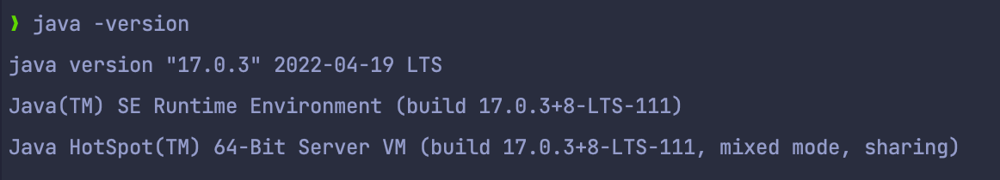
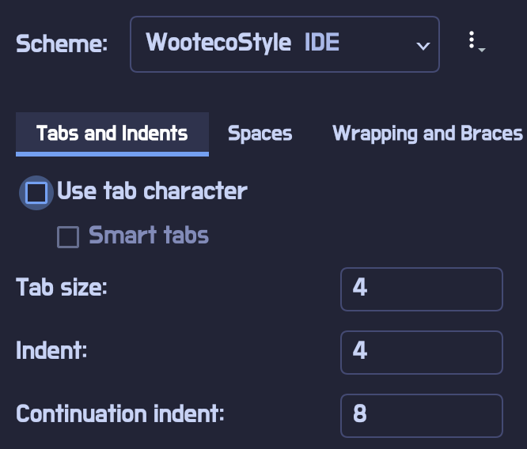
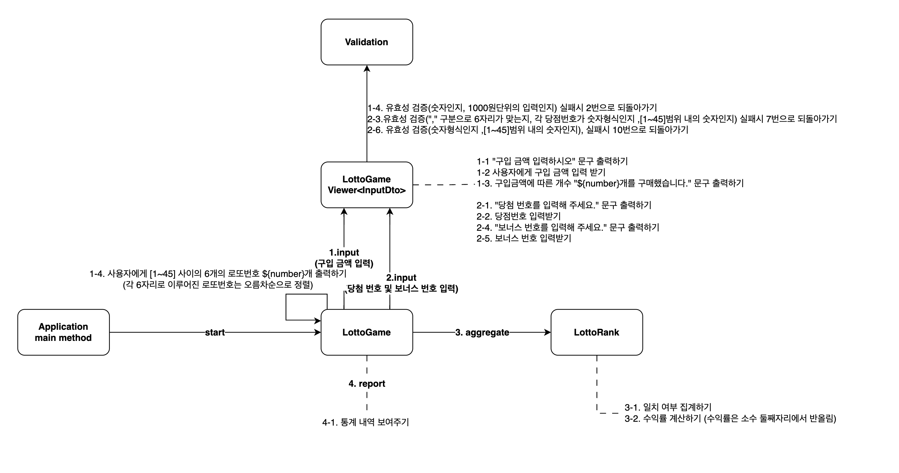

## 📌기능 목록
- [ ] 사용자 입력받기
- [ ] 문구 및 내역 출력하기
- [ ] 사용자가 구매한 갯수 만큼 로또(6자리의 고유한 수로 이루어진) 발행하기
- [ ] 입력 유효성 검증하기
  - [ ] 요구한 길이와 일치하는지
  - [ ] 숫자 형식으로 되어있는지
  - [ ] 유효한 범위 내의 숫자인지
- [ ] 집계하기
  - [ ] 일치여부 집계하기
  - [ ] 수익률 계산하기
- [ ] 통계 내역 보여주기


## whyWhale 숫자야구게임 TODO LIST

### 1. 프로그래밍 요구사항
- [x] java17 버전 점검



- [x] 코드 컨벤션


- 라이브러리 사용
  - [ ] random 값 추출(camp.nextstep.edu.missionutils.Randoms의 pickUniqueNumbersInRange()를 활용)
  - [ ] 사용자 입력 (camp.nextstep.edu.missionutils.Console의 readLine()을 활용)
- [ ] indent(인덴트, 들여쓰기) depth를 3이 넘지 않도록 구현한다. 2까지만 허용한다.
  - 예를 들어 while문 안에 if문이 있으면 들여쓰기는 2이다.
  - 힌트: indent(인덴트, 들여쓰기) depth를 줄이는 좋은 방법은 함수(또는 메서드)를 분리하면 된다.
- [ ] 3항 연산자를 쓰지 않는다.
- [ ] 함수(또는 메서드)가 한 가지 일만 하도록 최대한 작게 만들어라.
- [ ] JUnit 5와 AssertJ를 이용하여 본인이 정리한 기능 목록이 정상 동작함을 테스트 코드로 확인한다.

**추가 요구사항**
- [ ] 함수(또는 메서드)의 길이가 15라인을 넘어가지 않도록 구현한다.
- 함수(또는 메서드)가 한 가지 일만 잘 하도록 구현한다.
- [ ] else 예약어를 쓰지 않는다.
- 힌트: if 조건절에서 값을 return하는 방식으로 구현하면 else를 사용하지 않아도 된다.
- else를 쓰지 말라고 하니 switch/case로 구현하는 경우가 있는데 switch/case도 허용하지 않는다.
- [ ] Java Enum을 적용한다.
- [ ] 도메인 로직에 단위 테스트를 구현해야 한다. 단, UI(System.out, System.in, Scanner) 로직은 제외한다.
- 핵심 로직을 구현하는 코드와 UI를 담당하는 로직을 분리해 구현한다.
- 단위 테스트 작성이 익숙하지 않다면 `test/java/lotto/LottoTest`를 참고하여 학습한 후 테스트를 구현한다.


## 2.입출력 기반 요구사항 메커니즘 분석 [로또 게임]
1. "구입 금액 입력하시오" 문구 출력하기
2. 사용자에게 구입 금액 입력 받기
3. 유효성 검증(숫자인지, 1000원단위의 입력인지) 실패시 2번으로 되돌아가기
4. 구입금액에 따른 개수 "${number}개를 구매했습니다." 문구 출력하기
5. 사용자에게 [1~45] 사이의 6개의 로또번호 ${number}개 출력하기 (각 6자리로 이루어진 로또번호는 오름차순으로 정렬)
6. "당첨 번호를 입력해 주세요." 문구 출력하기
7. 당점번호 입력받기
8. 유효성 검증("," 구분으로 6자리가 맞는지, 각 당점번호가 숫자형식인지 ,[1~45]범위 내의 숫자인지) 실패시 7번으로 되돌아가기
9. "보너스 번호를 입력해 주세요." 문구 출력하기
10. 보너스 번호 입력받기
11. 유효성 검증(숫자형식인지 ,[1~45]범위 내의 숫자인지), 실패시 10번으로 되돌아가기
12. 당첨 통계 내역 보여주기 (수익률은 소수 둘째자리에서 반올림)
13. 게임 종료

기본 시스템 정책
- [ ] 로또 번호의 길이는 6자리이며 각 로또 내의 각 6자리는 고유해야하고, [1~45] 범위의 숫자로만 이루어져야 한다.
  - 사용자가 입력하는 로또 번호의 길이는 6자리이여하며, 로또번호와 당첨번호는 각 [1~45] 범위의 숫자를 만족하고 각 숫자는 고유해야 한다.
- [ ] 로또 1장의 가격은 1,000원이다.
  - [ ] 사용자는 로또를 구매하기 위해 반드시 1000원 단위로 입력해야한다.
- [ ] 사용자가 잘못된 값을 입력할 경우 IllegalArgumentException를 발생시키고, "[ERROR]"로 시작하는 에러 메시지를 출력 후 그 부분부터 입력을 다시 받는다. 
  - Exception이 아닌 IllegalArgumentException, IllegalStateException 등과 같은 명확한 유형을 처리한다.
  - `[ERROR] 로또 번호는 1부터 45 사이의 숫자여야 합니다.`


**초기 메커니즘 설계**




# 미션 - 로또

## 🔍 진행 방식

- 미션은 **기능 요구 사항, 프로그래밍 요구 사항, 과제 진행 요구 사항** 세 가지로 구성되어 있다.
- 세 개의 요구 사항을 만족하기 위해 노력한다. 특히 기능을 구현하기 전에 기능 목록을 만들고, 기능 단위로 커밋 하는 방식으로 진행한다.
- 기능 요구 사항에 기재되지 않은 내용은 스스로 판단하여 구현한다.

## 📮 미션 제출 방법

- 미션 구현을 완료한 후 GitHub을 통해 제출해야 한다.
    - GitHub을 활용한 제출 방법은 [프리코스 과제 제출](https://github.com/woowacourse/woowacourse-docs/tree/master/precourse) 문서를 참고해
      제출한다.
- GitHub에 미션을 제출한 후 [우아한테크코스 지원](https://apply.techcourse.co.kr) 사이트에 접속하여 프리코스 과제를 제출한다.
    - 자세한 방법은 [제출 가이드](https://github.com/woowacourse/woowacourse-docs/tree/master/precourse#제출-가이드) 참고
    - **Pull Request만 보내고 지원 플랫폼에서 과제를 제출하지 않으면 최종 제출하지 않은 것으로 처리되니 주의한다.**

## 🚨 과제 제출 전 체크 리스트 - 0점 방지

- 기능 구현을 모두 정상적으로 했더라도 **요구 사항에 명시된 출력값 형식을 지키지 않을 경우 0점으로 처리**한다.
- 기능 구현을 완료한 뒤 아래 가이드에 따라 테스트를 실행했을 때 모든 테스트가 성공하는지 확인한다.
- **테스트가 실패할 경우 0점으로 처리**되므로, 반드시 확인 후 제출한다.

### 테스트 실행 가이드

- 터미널에서 `java -version`을 실행하여 Java 버전이 17인지 확인한다.
  Eclipse 또는 IntelliJ IDEA와 같은 IDE에서 Java 17로 실행되는지 확인한다.
- 터미널에서 Mac 또는 Linux 사용자의 경우 `./gradlew clean test` 명령을 실행하고,
  Windows 사용자의 경우 `gradlew.bat clean test` 또는 `./gradlew.bat clean test` 명령을 실행할 때 모든 테스트가 아래와 같이 통과하는지 확인한다.

```
BUILD SUCCESSFUL in 0s
```

---

## 🚀 기능 요구 사항

로또 게임 기능을 구현해야 한다. 로또 게임은 아래와 같은 규칙으로 진행된다.

```
- 로또 번호의 숫자 범위는 1~45까지이다.
- 1개의 로또를 발행할 때 중복되지 않는 6개의 숫자를 뽑는다.
- 당첨 번호 추첨 시 중복되지 않는 숫자 6개와 보너스 번호 1개를 뽑는다.
- 당첨은 1등부터 5등까지 있다. 당첨 기준과 금액은 아래와 같다.
    - 1등: 6개 번호 일치 / 2,000,000,000원
    - 2등: 5개 번호 + 보너스 번호 일치 / 30,000,000원
    - 3등: 5개 번호 일치 / 1,500,000원
    - 4등: 4개 번호 일치 / 50,000원
    - 5등: 3개 번호 일치 / 5,000원
```

- 로또 구입 금액을 입력하면 구입 금액에 해당하는 만큼 로또를 발행해야 한다.
- 로또 1장의 가격은 1,000원이다.
- 당첨 번호와 보너스 번호를 입력받는다.
- 사용자가 구매한 로또 번호와 당첨 번호를 비교하여 당첨 내역 및 수익률을 출력하고 로또 게임을 종료한다.
- 사용자가 잘못된 값을 입력할 경우 `IllegalArgumentException`를 발생시키고, "[ERROR]"로 시작하는 에러 메시지를 출력 후 그 부분부터 입력을 다시 받는다.
    - `Exception`이 아닌 `IllegalArgumentException`, `IllegalStateException` 등과 같은 명확한 유형을 처리한다.

### 입출력 요구 사항

#### 입력

- 로또 구입 금액을 입력 받는다. 구입 금액은 1,000원 단위로 입력 받으며 1,000원으로 나누어 떨어지지 않는 경우 예외 처리한다.

```
14000
```

- 당첨 번호를 입력 받는다. 번호는 쉼표(,)를 기준으로 구분한다.

```
1,2,3,4,5,6
```

- 보너스 번호를 입력 받는다.

```
7
```

#### 출력

- 발행한 로또 수량 및 번호를 출력한다. 로또 번호는 오름차순으로 정렬하여 보여준다.

```
8개를 구매했습니다.
[8, 21, 23, 41, 42, 43] 
[3, 5, 11, 16, 32, 38] 
[7, 11, 16, 35, 36, 44] 
[1, 8, 11, 31, 41, 42] 
[13, 14, 16, 38, 42, 45] 
[7, 11, 30, 40, 42, 43] 
[2, 13, 22, 32, 38, 45] 
[1, 3, 5, 14, 22, 45]
```

- 당첨 내역을 출력한다.

```
3개 일치 (5,000원) - 1개
4개 일치 (50,000원) - 0개
5개 일치 (1,500,000원) - 0개
5개 일치, 보너스 볼 일치 (30,000,000원) - 0개
6개 일치 (2,000,000,000원) - 0개
```

- 수익률은 소수점 둘째 자리에서 반올림한다. (ex. 100.0%, 51.5%, 1,000,000.0%)

```
총 수익률은 62.5%입니다.
```

- 예외 상황 시 에러 문구를 출력해야 한다. 단, 에러 문구는 "[ERROR]"로 시작해야 한다.

```
[ERROR] 로또 번호는 1부터 45 사이의 숫자여야 합니다.
```

#### 실행 결과 예시

```
구입금액을 입력해 주세요.
8000

8개를 구매했습니다.
[8, 21, 23, 41, 42, 43] 
[3, 5, 11, 16, 32, 38] 
[7, 11, 16, 35, 36, 44] 
[1, 8, 11, 31, 41, 42] 
[13, 14, 16, 38, 42, 45] 
[7, 11, 30, 40, 42, 43] 
[2, 13, 22, 32, 38, 45] 
[1, 3, 5, 14, 22, 45]

당첨 번호를 입력해 주세요.
1,2,3,4,5,6

보너스 번호를 입력해 주세요.
7

당첨 통계
---
3개 일치 (5,000원) - 1개
4개 일치 (50,000원) - 0개
5개 일치 (1,500,000원) - 0개
5개 일치, 보너스 볼 일치 (30,000,000원) - 0개
6개 일치 (2,000,000,000원) - 0개
총 수익률은 62.5%입니다.
```

---

## 🎯 프로그래밍 요구 사항

- JDK 17 버전에서 실행 가능해야 한다. **JDK 17에서 정상적으로 동작하지 않을 경우 0점 처리한다.**
- 프로그램 실행의 시작점은 `Application`의 `main()`이다.
- `build.gradle` 파일을 변경할 수 없고, 외부 라이브러리를 사용하지 않는다.
- [Java 코드 컨벤션](https://github.com/woowacourse/woowacourse-docs/tree/master/styleguide/java) 가이드를 준수하며 프로그래밍한다.
- 프로그램 종료 시 `System.exit()`를 호출하지 않는다.
- 프로그램 구현이 완료되면 `ApplicationTest`의 모든 테스트가 성공해야 한다. **테스트가 실패할 경우 0점 처리한다.**
- 프로그래밍 요구 사항에서 달리 명시하지 않는 한 파일, 패키지 이름을 수정하거나 이동하지 않는다.
- indent(인덴트, 들여쓰기) depth를 3이 넘지 않도록 구현한다. 2까지만 허용한다.
    - 예를 들어 while문 안에 if문이 있으면 들여쓰기는 2이다.
    - 힌트: indent(인덴트, 들여쓰기) depth를 줄이는 좋은 방법은 함수(또는 메서드)를 분리하면 된다.
- 3항 연산자를 쓰지 않는다.
- 함수(또는 메서드)가 한 가지 일만 하도록 최대한 작게 만들어라.
- JUnit 5와 AssertJ를 이용하여 본인이 정리한 기능 목록이 정상 동작함을 테스트 코드로 확인한다.

### 추가된 요구 사항

- 함수(또는 메서드)의 길이가 15라인을 넘어가지 않도록 구현한다.
    - 함수(또는 메서드)가 한 가지 일만 잘 하도록 구현한다.
- else 예약어를 쓰지 않는다.
    - 힌트: if 조건절에서 값을 return하는 방식으로 구현하면 else를 사용하지 않아도 된다.
    - else를 쓰지 말라고 하니 switch/case로 구현하는 경우가 있는데 switch/case도 허용하지 않는다.
- Java Enum을 적용한다.
- 도메인 로직에 단위 테스트를 구현해야 한다. 단, UI(System.out, System.in, Scanner) 로직은 제외한다.
    - 핵심 로직을 구현하는 코드와 UI를 담당하는 로직을 분리해 구현한다. 
    - 단위 테스트 작성이 익숙하지 않다면 `test/java/lotto/LottoTest`를 참고하여 학습한 후 테스트를 구현한다.

### 라이브러리

- `camp.nextstep.edu.missionutils`에서 제공하는 `Randoms` 및 `Console`
  API를 사용하여 구현해야 한다.
    - Random 값 추출은 `camp.nextstep.edu.missionutils.Randoms`의 `pickUniqueNumbersInRange()`를 활용한다.
    - 사용자가 입력하는 값은 `camp.nextstep.edu.missionutils.Console`의 `readLine()`을 활용한다.

#### 사용 예시

```java
List<Integer> numbers = Randoms.pickUniqueNumbersInRange(1, 45, 6);
```

### Lotto 클래스

- 제공된 `Lotto` 클래스를 활용해 구현해야 한다.
- `numbers`의 접근 제어자인 private을 변경할 수 없다.
- `Lotto`에 필드(인스턴스 변수)를 추가할 수 없다.
- `Lotto`의 패키지 변경은 가능하다.

```java
public class Lotto {
    private final List<Integer> numbers;

    public Lotto(List<Integer> numbers) {
        validate(numbers);
        this.numbers = numbers;
    }

    private void validate(List<Integer> numbers) {
        if (numbers.size() != 6) {
            throw new IllegalArgumentException();
        }
    }

    // TODO: 추가 기능 구현
}
```

---

## ✏️ 과제 진행 요구 사항

- 미션은 [java-lotto-6](https://github.com/woowacourse-precourse/java-lotto-6) 저장소를 Fork & Clone해 시작한다.
- **기능을 구현하기 전 `docs/README.md`에 구현할 기능 목록을 정리**해 추가한다.
- **Git의 커밋 단위는 앞 단계에서 `docs/README.md`에 정리한 기능 목록 단위**로 추가한다.
    - [커밋 메시지 컨벤션](https://gist.github.com/stephenparish/9941e89d80e2bc58a153) 가이드를 참고해 커밋 메시지를 작성한다.
- 과제 진행 및 제출 방법은 [프리코스 과제 제출](https://github.com/woowacourse/woowacourse-docs/tree/master/precourse) 문서를 참고한다.
