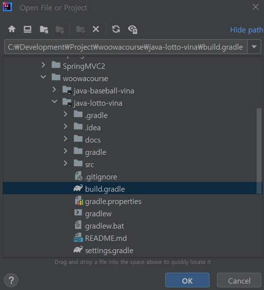
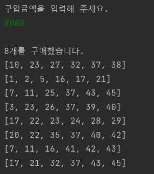
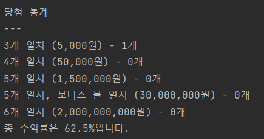

# 미션 - 로또


## :book: 프로젝트 진행
- 우아한테크코스 웹 백엔드 6기 프리코스<br>
- 개발기간: 2023.11.02 ~ 2023.11.08<br>
- 개발자: 이재홍

<br>

## :dollar: 프로젝트 소개
로또 게임을 구현했습니다. 규칙은 다음과 같습니다.

- 로또 구입 금액을 입력하면 구입 금액에 해당하는 만큼 로또를 발행합니다.
- 로또 1장의 가격은 1,000원 입니다.
- 당첨 번호와 보너스 번호를 입력받습니다.
- 사용자가 구매한 로또 번호와 당첨 번호를 비교하여 당첨 내역 및 수익률을 출력하고 로또 게임을 종료합니다.

<br>

## :rocket: 시작 가이드
### 프로그래밍 요구 사항
- 자바 [JDK-17](https://www.oracle.com/java/technologies/downloads/#java17) 버전에서 실행 가능합니다 

### 설치
```
$ git clone -b compasstar --single branch https://github.com/compasstar/java-lotto-vina.git
$ cd java-lotto-vina
```

### 실행
- IntelliJ 시작하고 Open 버튼을 눌러주세요<br>


- java-lotto-vina 폴더 에서 build.gradle 를 선택 후 OK 버튼을 눌러주세요<br>


- `Application`의 `main()`에서 실행`Run`합니다
<br>


## :school: 기술 스택


 

<br>

## :computer: 화면 구성


| 로또구매                      | 당첨번호 및 보너스번호 입력           | 당첨통계                      |
|---------------------------|---------------------------|---------------------------|
|  |  |  |


<br>

## :dart: 주요 기능

### 로또 발행 기능
- 로또 구입 금액을 입력 받는다
- 구입 금액은 1,000원 단위로 입력 받는다
  - [검증] 1,000원으로 나누어 떨어지지 않는 경우 예외 처리
- 구입 금액에 따라 로또를 발행한다

### 당첨번호 및 보너스번호 입력 기능
- 당첨 번호를 입력받는다. 번호는 쉼표(,)를 기준으로 구분한다
  - [검증] 당첨 번호는 6개이다
  - [검증] 당첨 번호는 1에서 45사이의 정수이다
  - [검증] 당첨 번호는 중복되는 수가 없어야 한다
- 보너스 번호를 입력 받는다
  - [검증] 보너스 번호는 1에서 45사이의 정수이다
  - [검증] 보너스 번호는 당첨 번호와 중복될 수 없다

### 당첨 내역 계산 기능
- 당첨번호 및 보너스번호와 일치하는 수에 따라 로또의 당첨내역을 계산한다
- 3개 일치 부터 6개 일치까지 당첨 금액이 존재한다
  - 3개 일치: 5,000원
  - 4개 일치: 50,000원
  - 5개 일치: 1,500,000원
  - 5개 일치, 보너스 볼 일치: 30,000,000원
  - 6개 일치: 2,000,000,000원
- 당첨된 금액과 로또 구입 금액을 비교하여 수익률을 계산한다
  - 수익률은 소수점 둘째 자리에서 반올림한다

<br>

## :mag: 아키텍쳐
### 디렉토리 구조


### 작업 흐름
