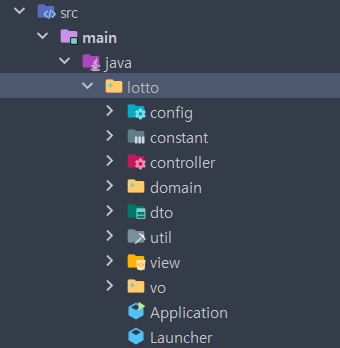
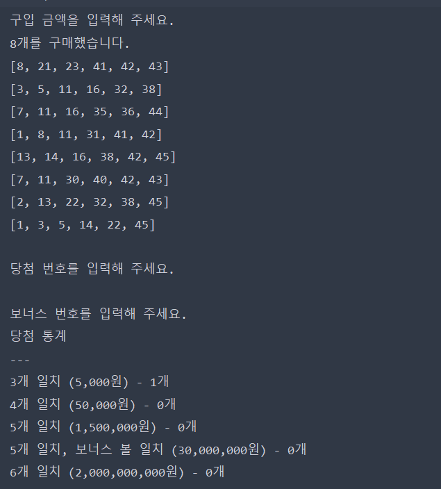

# 로또
사용자가 로또 구입 금액을 입력하면, 컴퓨터가 구입 금액에 맞게 로또를 발급한다.
그 후 사용자가 로또 당첨번호와 보너스 번호를 입력하면 그에 맞게 당첨결과를 콘솔로 출력한다.
### 디렉토리 구조

###  개발스택
Java 17
### 구현 목록
- 로또 구입 금액 입력
- 로또 발행
- 발행한 로또 출력
- 당첨 번호 입력
- 보너스 번호 입력
- 로또 결과 산출
- 당첨 통계 출력
###  프로젝트 결과물

