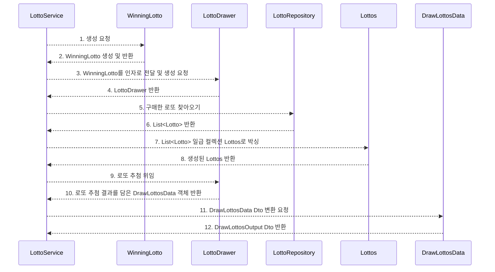

# DOMAIN 기능 명세서 및 설명

`Money`와 `Lotto` 2개의 패키지로 분류했습니다.

금액 계산은 정수 타입만으로도 충분히 가능하지만,

실제 상용 서비스를 개발한다고 생각하면, 가장 엄격하게 검증 및 테스트를 수행하고,

오류가 있어서는 안되는 영역이라고 볼 수 있습니다.

며칠 전, 세계 1위 해외 영양제 사이트에서 주문을 1번하여 주문 목록에는 1개의 주문 현황이 떴는데,

이중 결제가 되어 2번 출금이 되었던 일을 겪고 나니,

돈과 관련된 도메인은 정말로 신경을 훨씬 더 많이 쓸 필요가 있겠다는 생각이 들었습니다.

그래서 혹여나 실수로 금액이 예상치 못하게 변경되는 일이 없도록,

`Money`라는 객체는 불변으로 작성하였습니다.

이에 대한 과정은 `docs/studynote/1_immutable_money_object.md`에 정리해두었으며,

원하신다면 문제 해결 과정을 자세히 살펴보실 수 있습니다.

# MONEY

### `class Money`

잔액, 금액 등을 표현하기 위한 클래스입니다.

#### - properties

```java
int amount; // 잔액 or 금액
```

#### - behaviours

```java
// 현재 잔액에서 인자로 받은 money 잔액만큼 증가된 새로운 Money 객체를 생성 및 반환
Money increased(Money money);

// 현재 잔액에서 인자로 받은 money 잔액만큼 차감된 새로운 Money 객체를 생성 및 반환
Money decreased(Money money);

// 현재 잔액이 인자로 받은 money보다 적은지 확인
boolean isLessThan(Money money);

// 현재 잔액이 인자로 받은 money보다 같거나 큰지 확인
boolean isEqualsOrGreaterThan(Money money);

// 잔액을 double 타입으로 변환(수익률 계산 시 사용)
double toDouble();
```

주요 기능은 위와 같으며,

'금액', '잔액' 등을 표현하고 계산 및 비교하기 위한 기능이 들어있습니다.

필드는 `int amount` 하나이며,

`int`는 `2,147,483,647`이 표현 가능한 최대 범위이므로, overflow를 막기 위해서 `long` 타입을 사용하였습니다.

**사용자가 로또를 구매할 때의 잔액**과 **로또 등수 별 상금** 등, 로또 어플리케이션에서 금액을 표현하기 위한 모든 곳에 사용됩니다.

로또 프로그램 상에서 잔액은 음수가 될 수 없으므로, 양수가 아니라면 예외가 발생합니다.

불변이기 때문에 `increased`, `decreased` 등은 항상 새로운 `Money` 객체를 생성하여 반환하며,

생성 과정에서 항상 검증이 일어나기 때문에 안전하게 사용할 수 있습니다.

---

### `class Wallet`

잔액을 담을 수 있는 지갑을 표현한 클래스입니다.

`Money`를 항상 유효한 상태를 검증하고 부수 효과를 제거하기 위해 불변 객체로 설계했기 때문에,

매 번 객체를 재할당 해야 하는 불편함을 감수해야 합니다.

그래서 `Wallet`의 컴포지션으로 `Money`를 등록하고,

지갑에 돈을 넣고 빼는 기능을 만들어서,

변동이 있을 때마다 컴포지션으로 등록된 `Money`를 재할당 해주는 방식으로 불편함을 해소하였습니다.

#### - properties

```java
Money money; // 지갑 내의 잔액
```

#### - behaviours

```java
// 내부에 들고 있는 Money에서 인자로 받은 잔액 만큼을 제하여 새로운 `Money`를 `Wallet` 내에 생성 및 재할당합니다.
void spend(Money money);

// 내부에 들고 있는 Money에서 인자로 받은 잔액 만큼을 합하여 새로운 `Money`를 `Wallet` 내에 생성 및 재할당합니다.
void fill(final Money money);

//현재 `Wallet` 내의 잔액이 인자로 받은 금액 이상인지 확인합니다.
boolean hasEqualOrMoreThan(Money money);
```

주요 기능은 위와 같습니다.

`Money`가 가지고 있던 기능 일부를 거의 그대로 옮겼으며,

불변 객체를 가변 객체처럼 좀 더 편하게 사용할 수 있다는 점이 다릅니다.

그리고 메소드 명도 `Wallet`이라는 객체의 이름에 걸맞게 맞춰 주었습니다.

`money` 도메인에 존재하는 객체는 이 둘이 전부입니다.

---

# LOTTO

로또 프로그램이다 보니 `lotto` 도메인이 이 어플리케이션의 핵심 도메인입니다.

`money`보다 훨씬 더 많은 도메인 객체 및 기능이 존재합니다.

---

### `class LottoNumber`

로또 번호는 총 6자리로 구성됩니다.

`int`로 구현할 수도 있지만,

항상 1~45 범위 내에 속해야 하기 때문에 이를 생성 시에 스스로 검증하도록 하여 유효성을 보장하고,

타입만으로 역할을 추론할 수 있도록 클래스로 래핑하였습니다.

#### - properties

```java
int value; // 로또 번호
```

#### - behaviours

```java
int getValue(); // 로또 번호 int 값 꺼내기
```

기능은 매우 간단합니다.

그저 로또 번호 하나를 담고 꺼내올 수 있는 것이 전부입니다.

---

### `class BonusNumber extends LottoNumber`

보너스 번호를 표현하기 위한 클래스이며,

`LottoNumber`를 상속 받고 있습니다.

기능은 완전히 똑같지만, 클래스를 분리하여 의도를 확실히 구분해주었습니다.

#### - properties

```java
int value; // 로또 번호
```

#### - behaviours

```java
int getValue(); // 로또 번호 int 값 꺼내기
```

---

### `sealed class Lotto permits WinningLotto`

로또 번호 6자리를 담은 티켓을 표현하는 클래스입니다.

사용자가 로또를 구매할 때, 자동으로 6자리 번호를 골라 `Lotto` 객체가 생성됩니다.

각 로또 번호가 `LottoNumber` 타입이기 때문에, 유효한 번호임이 보장됩니다.

`Lotto`는 오직 6자리 번호인지만 검증해주면 됩니다.

`sealed class`이기 때문에 상속 가능한 클래스가 `WinningLotto`로 제한됩니다.

#### - properties

```java
List<LottoNumber> numbers; // 로또 번호 6자리
```

#### - behaviours

```java
boolean contains(LottoNumber lottoNumber);
```

로또 번호를 인자로 받아서 현재 `Lotto` 객체에 포함된 번호인지 확인합니다.

---

### `class WinningLotto extends Lotto`

당첨 번호 및 보너스 번호를 가진 당첨 티켓입니다.

`Lotto`를 상속하기 때문에 같은 필드가 존재합니다.

#### - properties

```java
List<LottoNumber> numbers; // 로또 번호 6자리
```

#### - behaviours

```java
LottoPrize draw(Lotto lotto);
```

`Lotto` 한 장을 받아서 당첨 번호와 보너스 번호를 비교한 뒤,

해당되는 등수의 `LottoPrize`를 반환합니다.

---

### `enum LottoPrize`

당첨 금액, 일치하는 번호 수, 보너스 번호 유무 등을 가진 enum입니다.

#### - properties

```java
// 당첨 금액(불변이므로 고정 금액)
Money prize;

// 일치하는 번호 수
int matchedCount;

// 보너스 번호 유무
boolean hasBonusNumber;
```

#### - behaviours

```java
// 번호 일치 수 및 보너스 번호 유무로 알맞은 enum constant 반환
LottoPrize of(int matchedCount, boolean hasBonusNumber);

// 등수별 당첨 금액 반환
Money getPrize();
```

로또 번호를 추첨할 때, 일치하는 갯수와 보너스 번호를 `of` 메소드의 인자로 호출하여,

등수별로 알맞은 enum constant를 반환합니다.

1~5등에 모두 포함되지 않는다면 `LottoPrize.X`를 반환합니다.

---

### `class Lottos`

`Lotto`를 담은 일급 컬렉션입니다.

#### - properties

```java
// 저장된 로또를 Deque에 담습니다.
Deque<Lotto> lottos;
```

#### - behaviours

```java
// Deque에 저장된 Lotto를 순차적으로 빼옵니다.
Optional<Lotto> nextLotto();

// 저장된 Lotto의 개수를 반환합니다.
int size();

// Lotto가 더 이상 없는지 체크합니다.
boolean isNotEmpty();
```

`Lotto`를 외부에서 하나씩 추출해서 추첨에 사용할 수 있습니다.

이후 총 구매 금액을 구할 때 `size`로 개수를 구할 수 있고,

`isNotEmpty`로 확인한 뒤, 추출을 멈출 수 있습니다.

---

### `class LottoSeller`

로또 판매자 클래스.

#### - properties

```java
// 로또 장당 가격
static Money LOTTO_PRICE = Money.from(1_000);

// 임의의 로또 번호로 Lotto 객체를 생성합니다.
final LottoGenerator lottoGenerator;
```

#### - behaviours

```java
// Wallet 내의 잔액이 떨어질 때까지 잔액을 차감시키며 Lotto를 구매합니다.
// 구매한 Lotto는 Lottos 일급 컬렉션에 담겨서 반환됩니다.
Lottos buyUntilOutOfMoney(Wallet wallet);
```

주석에 적힌 설명 그대로입니다.

`Wallet`에 잔액이 다 떨어질 때까지 `Lotto`를 최대한 구매하여 `Lottos`에 담아 반환합니다.

---

### `class RandomLottoGenerator`

랜덤 로또 생성기

#### - properties

```java
// 랜덤 N자리 수(중복X)를 담은 List를 생성하는 객체입니다.
final SizedNumbersGenerator sizedNumbersGenerator;
```

#### - behaviours

```java
// 중복 되는 번호 없이, 6자리 임의의 번호를 담은 Lotto를 생성해줍니다.
Lotto generate(); 
```

---

### `class LottoDrawer`

로또 추첨기

#### - properties

```java
// 로또 당첨 번호 및 보너스 번호를 담은 객체입니다.
WinningLotto winningLotto;
```

#### - behaviours

```java
// 사용자가 구매한 로또를 받아서 추첨 결과 데이터를 담은 DrawLottosData를 반환합니다.
DrawLottosData draw(Lottos lottos);
```

로또 추첨을 위해서 당첨 번호 및 보너스 번호가 반드시 필요하며,

이를 `WinningLotto`에 저장했었습니다.

또한, `WinningLotto`도 `draw`라는 메소드가 존재했는데,

`Lotto` 하나를 받아서 당첨금을 담은 `LottoPrize` enum constant를 반환하는 기능이었습니다.

`LottoDrawer`의 `draw` 메소드는 입력 받은 모든 `Lottos` 내의 `Lotto`에 대해서 `WinningLotto`를 통해 추첨 결과를 생성합니다.

각 결과를 `DrawLottosData`에 저장합니다.

그리고 이 결과가 반환되어, `LottoService`에서 Dto로 변환됩니다.

---

### `class DrawLottosData`

로또 추첨 데이터

#### - properties

```java
// 사용자가 구매한 모든 Lottos의 로또 추첨 결과 데이터입니다.
EnumMap<LottoPrize, Integer> data;

// 수익률을 계산하기 위해 총 구매 금액을 저장합니다.
Money totalCost;

// 수익률을 계산하기 위해 총 당첨 금액을 저장합니다.
Money totalEarning;
```

#### - behaviours

```java
// Lotto 하나를 추첨할 때마다 save를 호출하여 결과를 enumMap에 저장합니다.
void save(final LottoPrize lottoPrize);

// 모든 Lotto의 추첨이 끝난 뒤, Output(Dto)으로 변환할 수 있습니다.
DrawLottosOutput toDrawLottosOutput();
```

로또 추첨 결과를 저장하기 위해 `EnumMap`을 `LottoDrawer`에서 바로 사용할 수도 있지만,

좀 더 가독성을 향상시키기 위해서 클래스로 분리하게 되었습니다.

---

# DOMAIN 시퀀스 다이어그램



시퀀스 다이어그램으로 `LottoService`의 `drawLottos`를 나타내면 위와 같은 모습이 됩니다.