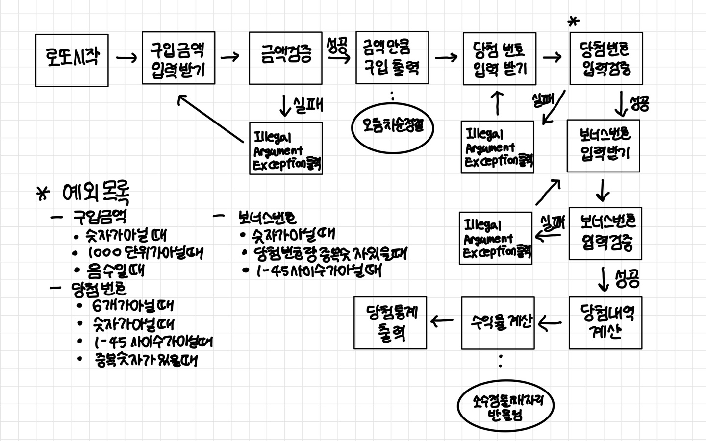

## :heavy_check_mark: 조건

### 규칙
- 로또 구입 금액을 입력하면 구입 금액에 해당하는 만큼 로또 발행
  - 한 장의 가격은 1000원
  - 1개의 로또를 발행할 때 중복되지 않는 6개의 숫자를 뽑는다
- 당첨 번호와 보너스 번호를 입력 받는다
  - 로또 번호의 숫자 범위는 1~45까지이다
  - 중복되지 않는 숫자 6개와 보너스 번호 1개를 뽑는다
- 당첨은 1등부터 5등까지 있다
  - 1등: 6개 번호 일치 / 2,000,000,000원
  - 2등: 5개 번호 + 보너스 번호 일치 / 30,000,000원
  - 3등: 5개 번호 일치 / 1,500,000원
  - 4등: 4개 번호 일치 / 50,000원
  - 5등: 3개 번호 일치 / 5,000원
- 사용자가 구매한 로또 번호와 당첨 번호를 비교하여 당첨 내역 및 수익률을 출력하고 로또 게임 종료
- 사용자가 잘못된 값을 입력할 경우 IllegalArgumentException를 발생시키고,
  "[ERROR]"로 시작하는 에러 메시지를 출력 후 그 부분부터 입력을 다시 받는다.
  - 명확한 유형 처리

### 입출력
- 입력
  - 로또 구입 금액 : 1000원 단위로 나누어 떨어지지 않는 경우 예외 처리
  - 당첨 번호 : 쉼표 (,) 기준으로 구분
  - 보너스 번호
- 출력
  - 발행한 로또 수량 및 번호 출력 : 로또 번호는 오름차순 정렬
  - 당첨 내역 출력
  - 수익률 출력 : 소수점 둘째 자리에서 반올림
  - 예외 상황 시 에러 문구 출력 : "[ERROR]" 로 시작해야 함
 
### 참고 사항
- 함수 길이는 15라인 넘어가지 않도록 구현
- else 예약어 사용 금지
- Java Enum 적용
- 도메인 로직에 단위 테스트 구현
- Lotto 클래스 활용해 구현 : 필드 추가 금지, 접근 제어자 변경 금지, 패키지 변경 가능

## :heavy_check_mark: 플로우 차트

## :heavy_check_mark: 구현
- Lotto
    - 필드 : 숫자들 목록
    - 숫자 개수 검증 기능
    - 리스트 오름차순 정렬 기능
- UserLotto
    - 필드 : 전체 로또 개수, 발행 로또 목록
    - 구입 금액으로 개수 저장 기능
    - 개수만큼 로또 발행하는 기능
    - 구입 금액 검증 기능
    - 로또 발행 기능
- ResultLotto
    - 필드: 당첨 번호 리스트, 보너스 번호
    - 당첨 번호 검증 기능
    - 보너스 번호 검증 기능
    - 당첨 통계 계산 기능
    - 발행 로또와 당첨 번호 일치 개수 계산 기능
    - 당첨 내역 계산 기능
    - 수익률 계산 기능
- Result (ENUM)
  - 필드: 금액
  - 금액 계산 기능
- InputView
    - 구입 금액 입력 받기 
    - 구입 금액 검증 
    - 당첨 번호 입력 받기 
    - 당첨 금액 검증 
    - 보너스 번호 입력 받기 
    - 보너스 번호 검증 
- OutputView
    - 발행한 로또 수량 및 번호 출력
    - 당첨 통계 출력
      - 일치 개수 출력
      - 수익률 출력
- LottoController
    - 로또 시작
    - 로또 진행
    - 로또 결과
- Exception
    - 구입 금액 숫자가 아닐 때
    - 구입 금액 음수일 때
    - 구입 금액 1000 단위가 아닐 때
    - 당첨 번호 숫자가 아닐 때
    - 당첨 번호 1-45 사이 숫자가 아닐 때
    - 당첨 번호 6개가 아닐 때
    - 당첨 번호 중복 숫자가 있을 때
    - 보너스 번호 숫자가 아닐 때
    - 보너스 번호 당첨 번호와 중복 숫자 있을 때
    - 보너스 번호 1-45 사이 숫자가 아닐 때
  
    
