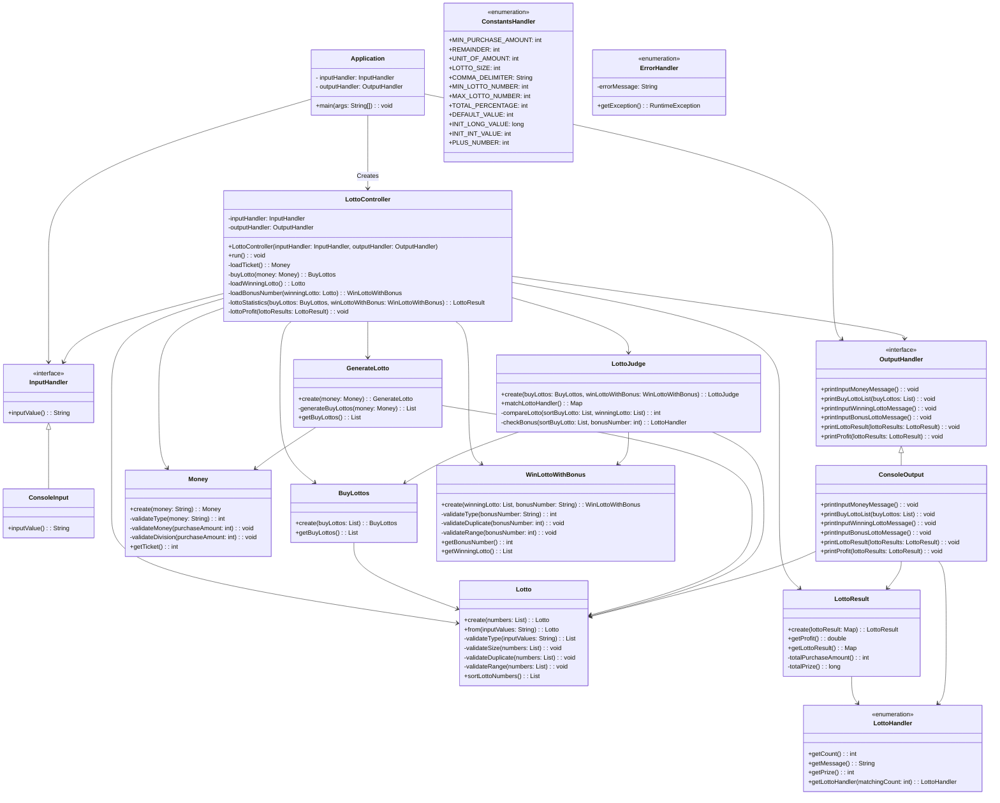

# 🔢 우아한테크코스 프리코스 3주차 : 로또

https://user-images.githubusercontent.com/122594223/280687804-57158e77-0dfb-41ed-893c-476b57a0cc15.mp4

## 목차

- [1. 구현 기능 목록](#ballotboxwithcheck-구현-기능-목록)
- [2. 문제 해결 과정](#bookmark_tabs-문제-해결-과정)
    - [2.1 🧪 2주 차 미션 피드백과 적용 사항](#-2주-차-미션-피드백과-적용-사항)
    - [2.2 ✨ ConsoleInput의 책임과 유효성 검사의 위치](#-consoleinput의-책임과-유효성-검사의-위치)
- [3. 다음 미션에 적용할 학습 내용](#ledger-다음-미션에-적용할-학습-내용)

# :ballot_box_with_check: 구현 기능 목록
- [x] controller Package
    - [x] LottoController
        - view Package와 domain Package의 데이터를 전달하며 값을 출력하는 클래스
        - 프로그램을 실행하는 `run` 메서드
        - 티켓 개수를 불러오는 `loadTicket` 메서드
        - 티켓 개수를 활용하여 구매한 로또 리스트를 불러오고 출력하도록 하는 `buyLotto` 메서드
        - 당첨 번호를 불러오는 `loadWinningLotto` 메서드
        - 보너스 번호를 불러와 당첨번호와 비교하는 `loadBonusNumber` 메서드
        - 당첨 통계를 계산하고 출력하는 `lottoStatistics` 메서드
        - 수익률을 출력하는 `lottoProfit` 메서드

- [x] domain Package
    - [x] LottoJudge
        - 당첨 번호와 구매 번호의 매칭을 판단하는 클래스
        - 새로운 인스턴스를 생성하고 반환하는 create 메서드
        - 일치하는 개수에 따른 결과를 저장하는 `matchLottoHandler` 메서드
        - 구매한 로또와 당첨 번호가 몇개나 일치하는지 비교하는 `compareLotto` 메서드
        - 번호 5개가 일치하는 경우 보너스 번호가 일치하는지 확인하는 `checkBonus` 메서드
    - [x] GenerateLotto
        - 구매 번호를 랜덤한 값으로 구해주는 클래스
        - 새로운 인스턴스를 생성하고 반환하는 create 메서드
        - 구매 번호를 랜덤한 값으로 생성하는 `generateBuyLottos` 메서드
        - 구매한 로또 리스트를 반환하는 `getBuyLottos` 메서드
    - [x] LottoHandler
        - 로또 당첨 상태를 Enum으로 관리하는 클래스
        - 일치하는 개수와 enum 상수의 개수가 일치하는 lottoHandler 타입의 enum 상수를 반환하는 `getLottoHandler` 메서드 구현
        - 일치하는 개수를 반환하는 `getCount` 메서드 구현
        - 추가적인 문장을 반환하는 `getMessage` 메서드 구현
        - 당첨 금액을 반환하는 `getPrize` 메서드 구현
    - wrapper Package 
        - [x] Money
            - 구입 금액에 대한 유효성 검사와 구입 금액에 따른 티켓 수 반환을 진행하는 클래스
            - 새로운 인스턴스를 생성하고 반환하는 create 메서드
            - 구입 금액이 숫자로 반환이 가능한지 확인하는 `validateType` 메서드
            - 구입 금액이 0원 이하인지 확인하는 `validateMoney` 메서드
            - 구입 금액이 1000원으로 나눠 떨어지는지 확인하는 `validateDivision` 메서드
            - 구매 금액에 따른 티켓 수를 반환하는 `getTicket` 메서드
        - [x] Lotto
            - 모든 로또 번호 리스트들에 대한 유효성 검사와 로또 번호의 오름차순 값을 반환하는 일급 컬렉션
            - 새로운 인스턴스를 생성하고 반환하는 create 메서드
            - 매개 변수를 하나 받아서 인스턴스를 생성하고 반환하는 from 메서드
            - 로또 번호가 ,를 기준으로 나눠지고 숫자로 변환이 가능한지 확인하는 `validateType` 메서드
            - 로또 번호가 6개 맞는지 확인하는 `validateSize` 메서드
            - 중복되는 로또 번호가 있는지 확인하는 `validateDuplicate` 메서드
            - 로또 번호가 1 ~ 45 사이의 숫자가 맞는지 확인하는 `validateRange` 메서드
            - 로또 번호의 오름차순 값을 반환하는 `sortLottoNumbers` 메서드
        - [x] BuyLottos
            - 구입한 로또에 대한 정보를 갖고있는 클래스
            - 새로운 인스턴스를 생성하고 반환하는 create 메서드
            - 구매한 로또를 반환하는 `getBuyLottos` 메서드
        - [x] WinLottoWithBonus
            - 당첨 로또와 보너스 번호에 대한 유효성 검사와 반환을 진행하는 클래스 
            - 새로운 인스턴스를 생성하고 반환하는 create 메서드
            - 보너스 번호가 숫자로 반환이 가능한지 확인하는 `validateType` 메서드
            - 로또 번호와 보너스 번호가 중복되는지 확인하는 `validateDuplicate` 메서드
            - 보너스 번호가 1 ~ 45 사이인지 확인하는 `validateRange` 메서드
            - 로또 객체를 반환하는 `getLotto` 메서드
            - 보너스 번호를 반환하는 `getBonusNumber` 메서드
        - [x] LottoResult
            - 당첨 통계 데이터를 저장하고 수익률을 계산하는 클래스
            - 새로운 인스턴스를 생성하고 반환하는 create 메서드
            - 당첨 통계를 반환하는 `getLottoResult` 메서드
            - 수익률을 반환하는 `getProfit` 메서드
            - 전체 구매 금액을 반환하는 `totalPurchaseAmount` 메서드
            - 전체 당첨 금액을 반환하는 `totalPrize` 메서드

- [x] handler Package
    - [x] InputHandler
        - view Package의 ConsoleInput의 확장성과 변경 용이성을 위한 인터페이스
        - `inputValue` 메서드의 추상화
    - [x] OutputHandler
        - view Package의 ConsoleOutput의 확장성과 변경 용이성을 위한 인터페이스
        - `printInputMoneyMessage` 메서드의 추상화
        - `printBuyLottoList` 메서드의 추상화
        - `printInputWinningLottoMessage` 메서드의 추상화
        - `printInputBonusLottoMessage` 메서드의 추상화
        - `printLottoResult` 메서드의 추상화
        - `printProfit` 메서드의 추상화
    - [x] ErrorHandler
        - Enum 클래스를 활용하여 프로그램에서 발생하는 에러 코드들을 관리하는 클래스
        - ErrorMessage와 함께 `IllegalArgumentException` 예외를 발생시키는 `getException` 메서드
    - [x] ConstantsHandler
        - 프로그램내의 상수들을 관리하는 클래스
      

- [x] view Package
    - [x] ConsoleInput
        - 입력을 담당하는 클래스
        - 모든 입력값을 받아오는 `inputValue` 메서드 구현
    - [x] ConsoleOutput
        - 출력을 담당하는 클래스
        - 로또 구입 금액 입력을 요청하는 `printInputMoneyMessage` 메서드 구현
        - 구입한 로또 리스트를 보여주는 `printBuyLottoList` 메서드 구현
        - 당첨 번호 입력을 요청하는 `printInputWinningLottoMessage` 메서드 구현
        - 보너스 번호 입력을 요청하는 `printInputBonusLottoMessage` 메서드 구현
        - 당첨 통계를 보여주는 `printLottoResult` 메서드 구현
        - 수익률을 보여주는 `printProfit` 메서드 구현
  

---

# :bookmark_tabs: 문제 해결 과정

## 🧪 2주 차 미션 피드백과 적용 사항

## ✨ ConsoleInput의 책임과 유효성 검사의 위치

🔹 이번 미션에서는 `ConsoleInput` 클래스가 하는 일이 극단적으로 줄어들었다. 이전 미션까지는 `ConsoleInput` 내에서도 간단한 유효성 검사와 타입 변환을 통해 입력값마다 메서드를 두고 값을 받아왔지만 이번에는 모든 입력을 `inputValue` 메서드 하나에 의지하고 유효성 검사와 타입 변환의 책임을 domain package로 넘기도록 했다. 처음에는 `InputValidator`를 사용해서 view package에서 유효성 검사를 하더라도 테스트 시 불편함이 없도록 하는 것이 목표였지만, 이런 식으로 바뀌게 된 계기는 아래와 같다.

먼저, 입력에 대한 예외를 어떻게 처리할지 고민했다.

1. 입력 예외를 `ConsoleInput` 클래스에서 `InputValidator`없이 처리한다.

➡️ 위와 같은 경우 `ConsoleInput` 클래스에 try - catch 문을 활용해서 예외를 처리하게 될 것이다. 하지만, 이렇게 된다면 다른 클래스에서 사용하지 않을 stringToInt와 stringToList 메서드를 public으로 선언해야 하며, 테스트를 진행할 시 view에 대한 테스트를 따로 진행해야 한다는 불편함이 있다고 생각했다.

2. 입력 예외를 `ConsoleInput` 클래스에서 `InputValidator`를 활용해서 처리한다.

➡️ 다른 경우와 비교했을 때 `stringToInt`와 `stringToList` 메서드를 private으로 지정이 가능하고, 테스트 시에도 유효성 검사를 하기 편하다는 장점이 있지만, 여전히 view package에 유효성 검사와 타입의 변환 책임이 있는 것 같아 다른 방식을 생각하게 되었다.

3. 입력 예외를 domain에서 처리한다.

➡️ domain에서 입력에 대한 예외를 처리하기 위해서는 `ConsoleInput` 클래스에서 List 혹은 Int 등의 타입으로 변환하지 않고 String 상태 그대로 Controller에 전달을 하게 되고, 이렇게 된다면 Controller에서 필요한 타입으로 변환해서 domain 객체로 전달을 해야 한다. 이때, 필연적으로 Controller 클래스에서 변환 과정에 대한 예외 처리가 필요하고 이는 Controller package의 목적과 맞지 않다라고 생각했었다. 하지만, Controller에서 변환을 하지 않고 string 값 그대로 domain 객체로 들어가 그 안에서 예외 처리와 타입 변환을 한다면 테스트, SRP, 접근 제어자 등의 모든 부분을 해결할 수 있다고 생각했다.

---

# :ledger: 다음 미션에 적용할 학습 내용