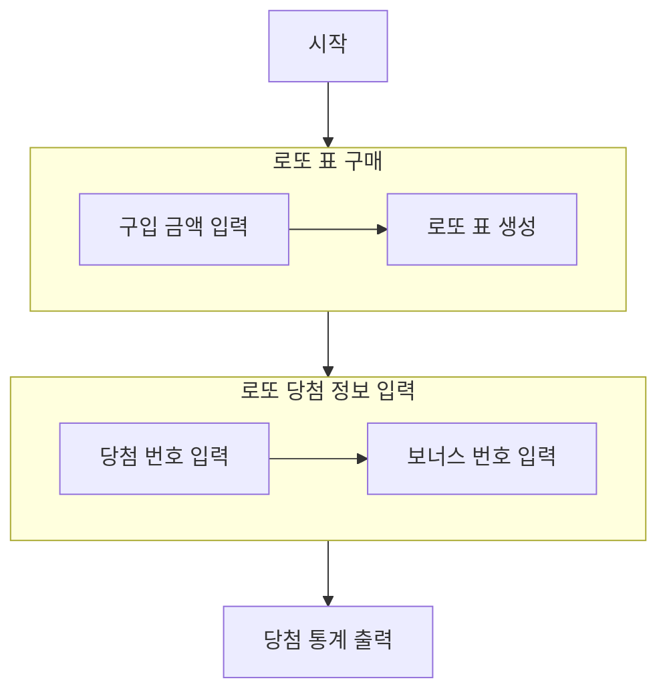

## 순서도

## 기능 구현 목록

* 로또 표를 구매한다.
  - [ ] 구입 금액을 입력받는다.
    - [ ] 로또 표 값보다 낮은 금액 입력 시 예외처리한다. 
    - [ ] 로또 표 값 단위로 나누어떨어지지 않는 경우 예외처리한다.
  - [ ] 로또 표를 생성한다.
    - [x] 겹치지 않는 랜덤 숫자의 묶음을 반환한다.
    - [x] 구입 금액에 맞는 묶음 수를 반환한다.
* 로또 당첨 정보 입력
  - [ ] 당첨 번호를 입력한다.
    - [ ] 지정된 범위를 벗어난 숫자 입력 시 예외처리한다. 
    - [ ] 중복되는 숫자 입력 시 예외처리한다.
    - [ ] 정해진 개수의 숫자가 입력되지 않으면 예외처리한다.
  - [ ] 보너스 번호를 입력한다.
    - 지정된 범위를 벗어난 숫자 입력 시 예외처리한다.
* 당첨 통계 출력
  - [x] 일치한 숫자 개수와 등수를 출력한다.
  - [ ] 총 수익률을 계산하여 출력한다.
    - [ ] 소수점 둘째 자리에서 반올림한다.
* 공통
  - [ ] 숫자가 아닌 입력 시 예외처리한다.
