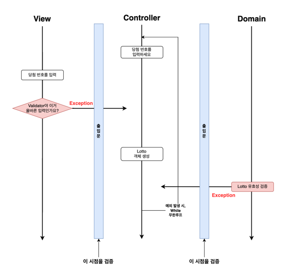
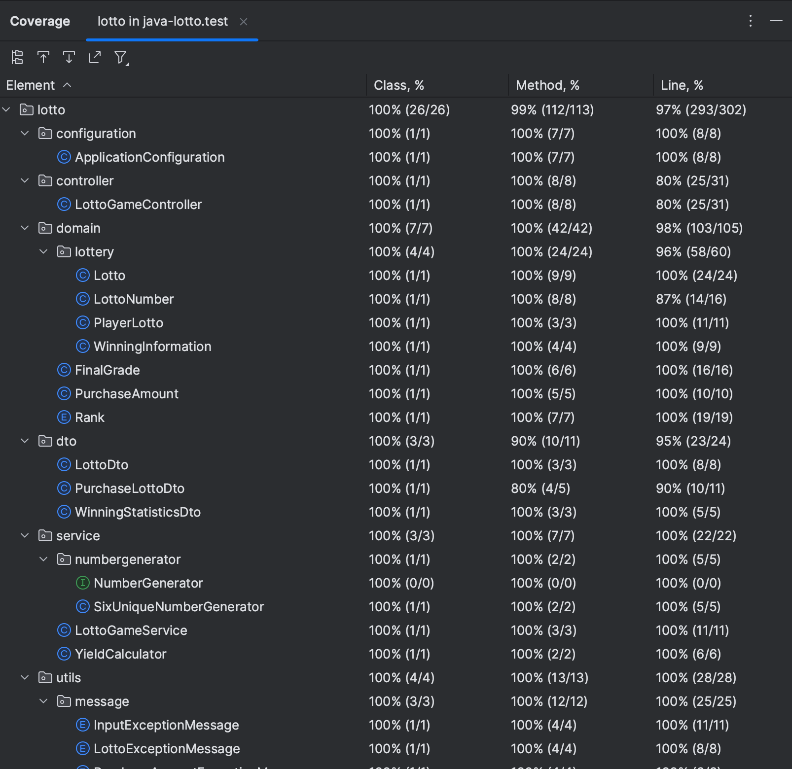
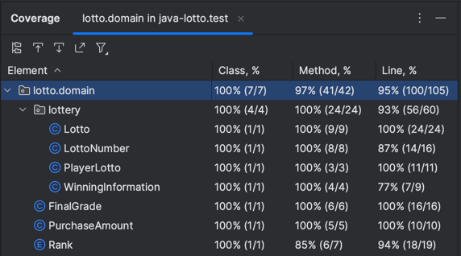

## ✅ 기능 목록 정리

### 로또 게임 시작 기능

- [x] 게임을 순서에 맞게 시작하는 기능
- [x] 로또 구입 개수를 세팅하는 기능
    - 잘못된 값을 입력할 경우 [ERROR] 로 시작하는 에러 메시지 출력과 함께 입력을 다시 받는다.
- [x] 당첨 번호를 세팅하는 기능
    - 잘못된 값을 입력할 경우 [ERROR] 로 시작하는 에러 메시지 출력과 함께 입력을 다시 받는다.
- [x] 보너스 번호를 세팅하는 기능
    - 잘못된 값을 입력할 경우 [ERROR] 로 시작하는 에러 메시지 출력과 함께 입력을 다시 받는다.
- [x] 사용자 로또를 구매하는 기능
- [x] 당첨 정보(당첨 번호, 보너스 번호) 를 공개하는 기능
- [x] 당첨 통계를 출간하는 기능

### 로또 게임 로직 기능

- [x] 입력한 로또 구입 금액을 생성하는 기능
- [x] 구입 금액에 대한 개수만큼 사용자 로또를 생성하는 기능
- [x] 입력한 당첨 번호에 대한 로또를 생성하는 기능
- [x] 입력한 보너스 번호에 대한 로또번호를 생성하는 기능
- [x] 당첨 번호, 보너스 번호에 대한 당첨 정보를 생성하는 기능
- [x] 번호 일치 개수, 보너스 번호 매치 여부로 등수를 계산하는 기능
- [x] 사용자 로또, 당첨 정보를 기반으로 사용자 최종 등수 성적을 계산하는 기능
- [x] 최종 성적을 기반으로 당첨 통계를 계산하는 기능
- [x] 구입 금액, 로또 번호, 로또, 당첨 정보를 생성할 때, `잘못된 입력 시 IllegalArgument 예외를 던진다.`

### 로또 게임 입력 기능

- [x] 로또 구입 금액 입력 기능 `잘못된 입력 시 IllegalArgument 예외를 던진다.`
    - [x] 공백 입력을 검증하는 기능
    - [x] 입력 가능 최대 길이를 검증하는 기능
    - [x] 숫자가 아닌 입력을 검증하는 기능
- [x] 당첨 번호 입력 기능 `잘못된 입력 시 IllegalArgument 예외를 던진다.`
    - [x] 공백 입력을 검증하는 기능
    - [x] 입력 가능 최대 길이를 검증하는 기능
    - [x] 첫 문자에 콤마 입력을 검증하는 기능
    - [x] 마지막 문자에 콤마 입력을 검증하는 기능
    - [x] 콤마로 구분된 문자가 숫자임을 검증 검증하는 기능
- [x] 보너스 번호 입력 기능 `잘못된 입력 시 IllegalArgument 예외를 던진다.`
    - [x] 공백 입력을 검증하는 기능
    - [x] 입력 가능 최대 길이를 검증하는 기능
    - [x] 숫자가 아닌 입력을 검증하는 기능

### 로또 게임 출력 기능

- [x] 구매 로또 수량과 번호를 출력하는 기능
- [x] 로또 번호 출력 화면 폼으로 변환하는 기능
- [x] 당첨 통계를 출력하는 기능
- [x] 수익률을 금액 쉼표(,) 폼으로 변환하는 기능
    - (ex. 100.0%, 1,000.0%, 1,000,000.0%)

## ✅ 예외 상황 및 핸들링 정리

### 로또 구입 금액 `입력`

1. 공백 및 공백 포함 입력
2. 너무 큰 길이의 입력
3. 숫자가 아닌 입력
4. `로또 구입 금액 입력 시점에 검증`하고 잘못된 입력 시 `IllegalArgument 예외를 던진다.`

### 당첨 번호 `입력`

1. 공백 및 공백 포함 입력
2. 너무 큰 길이의 입력
3. 첫 문자에 콤마(,)가 들어간 입력
4. 마지막 문자에 콤마(,)가 들어간 입력
5. 콤마(,)로 구분된 문자가 숫자가 아닌 입력
6. `당첨 번호 입력 시점에 검증`하고 잘못된 입력 시 `IllegalArgument 예외를 던진다.`

### 보너스 번호 `입력`

1. 공백 및 공백 포함 입력
2. 너무 큰 길이의 입력
3. 숫자가 아닌 입력
4. `보너스 번호 입력 시점에 검증`하고 잘못된 입력 시 `IllegalArgument 예외를 던진다.`

### 구입 금액 `PurchaseAmount`

1. 설정한 금액 범위 1천원 ~ 1억원에 맞지 않음
2. 1천원 단위가 아님
3. `객체 생성 시점에 검증`하고 잘못된 입력 시 `IllegalArgument 예외를 던진다.`

### 로또 번호 `LottoNumber`

1. 1 ~ 45 범위를 벗어남
2. `객체 생성 시점에 검증`하고 잘못된 입력 시 `IllegalArgument 예외를 던진다.`

### 로또 `Lotto`

1. 로또 번호가 6개가 이님
2. 중복된 번호가 존재함
3. `객체 생성 시점에 검증`하고 잘못된 입력 시 `IllegalArgument 예외를 던진다.`

### 당첨 정보 (당첨 번호, 보너스 번호) `WinningInformation`

1. 당첨 번호에 중복된 숫자가 존재함
2. 당첨 번호와 보너스 번호가 중복됨
3. `객체 생성 시점에 검증`하고 잘못된 입력 시 `IllegalArgument 예외를 던진다.`

### 예외 핸들링

- `LottoGameController`에서 예외를 핸들링한다.
- 세부적으로는 컨트롤러의 각 기능인 `구입금액 세팅`, `당첨번호 세팅`, `보너스 번호 세팅`에서 예외를 잡는다.
- `IllegalArgument Exception` 인 경우 그 입력을 다시 받는다.
- Exception 발생에 대한 테스트는 **무한 루프 내에서 요청 중인 View, Domain 계층에 대해 예외 테스트하여 확인한다.**

## ✅ 요구 사항 체크 리스트

### 1️⃣ 기능 요구 사항

- [x] 제시된 기능에 맞게 게임을 구현한다.
    - [x] 로또 구입 금액을 입력하면 구입 금액에 해당하는 만큼 로또를 발행한다.
    - [x] 로또 1장의 가격은 1,000원이다.
    - [x] 당첨 번호와 보너스 번호를 입력받는다.
    - [x] 당첨 내역 및 수익률을 출력하고 로또 게임을 종료한다.
    - [x] 사용자가 잘못된 값을 입력할 경우 IllegalArgumentException를 발생시킨다.
    - [x] "[ERROR]"로 시작하는 에러 메시지를 출력 후 그 부분부터 입력을 다시 받는다.
    - [x] `Exception`이 아닌 `IllegalArgumentException`, `IllegalStateException` 등과 같은 명확한 유형을 처리한다.
- [x] 입력 요구사항
    - [x] 구입 금액 입력은 1,000원 단위이다.
    - [x] 1,000원으로 나누어 떨어지지 않는 경우 예외 처리한다.
    - [x] 당첨 번호는 쉼표(,)를 기준으로 구분한다.
    - [x] 보너스 번호를 입력 받는다.
- [x] 출력 요구사항
    - [x] 발행한 로또 수량 및 번호를 출력한다.
    - [x] 로또 번호는 오름차순으로 정렬하여 보여준다.
    - [x] 마지막 로또 번호를 제외한 나머지 로또 번호는 마지막 문자에 공백을 두어 구분하여 출력한다.
    - [x] 당첨 내역을 출력한다.
    - [x] 수익률을 출력한다.
    - [x] 수익률이 1000.0이 넘어가면 1,000.0 과 같이 쉼표 처리한다.
    - [x] 수익률은 소수점 둘째 자리에서 반올림한다. (ex. 100.0%, 51.5%, 1,000,000.0%)
    - [x] 예외 상황 시 에러 문구를 출력해야 한다. 단, 에러 문구는 "[ERROR]"로 시작해야 한다.

### 2️⃣ 프로그래밍 요구 사항

- [x] JDK 17 버전을 사용한다.
- [x] 프로그램 시작점은 Application의 main() 이다.
- [x] build.gradle 파일을 변경하지 않고, 외부 라이브러리 사용하지 않는다.
- [x] Java 코드 컨벤션 가이드를 준수한다.
    - [x] 스태틱 또는 와일드카드 import는 사용하지 않는다.
    - [x] 정확히 하나의 최상위 클래스를 선언한다.
    - [x] 클래스 내용은 논리적 순서로 구성한다.
    - [x] ...
- [x] 프로그램 종료시 System.exit() 호출하지 않는다.
- [x] ApplicationTest 의 모든 테스트를 성공한다.
- [x] 파일, 패키지의 이름을 수정하거나 이동하지 않는다.
- [x] 들여쓰기 depth는 2까지만 허용한다
- [x] 3항 연산자를 쓰지 않는다
- [x] 함수(또는 메서드)가 한 가지 일만 하도록 최대한 작게 만들어라
- [x] JUnit5와 AssertJ를 이용하여 본인이 정리한 기능 목록이 정상 동작함을 테스트 코드로 확인한다  
  

**❗️추가된 요구 사항**

- [x] 함수(또는 메서드)의 길이가 15라인을 넘어가지 않도록 구현한다.
- [x] 함수(또는 메서드)가 한 가지 일만 잘 하도록 구현한다.
- [x] else 예약어를 쓰지 않는다.
    - [x] switch/case도 허용하지 않는다.
- [x] Java Enum을 적용한다.
- [x] 도메인 로직에 단위 테스트를 구현해야 한다.  
  

**❗라이브러리**

- [x] Random값 추출: `camp.nextstep.edu.missionutils.Randoms`의 `pickUniqueNumbersInRange()`
- [x] 사용자 입력: `camp.nextstep.edu.missionutils.Console`의 `readLine()`

**❗Lotto 클래스**

- [x] 제공된 Lotto 클래스를 활용해 구현해야 한다.
- [x] numbers의 접근 제어자인 private을 변경할 수 없다.
- [x] Lotto에 필드(인스턴스 변수)를 추가할 수 없다.
- [x] Lotto의 패키지 변경은 가능하다.

### 3️⃣ 과제 진행 요구 사항

- [x] 미션은 java-baseball-6 저장소를 fork & clone해 시작한다.
- [x] **기능을 구현하기 전 docs/README.md에 구현할 기능 목록을 정리**해 추가한다.
- [x] **Git의 커밋 단위는 앞 단계에서 docs/README.md에 정리한 기능 목록 단위**로 추가한다.
- [x] 커밋 메시지 컨벤션 가이드를 참고해 커밋 메시지를 작성한다.
- [x] 과제 진행 및 제출 방법은 프리코스 과제 제출 문서를 참고한다.

---

## ✅ 1 주차 피드백 반영 체크 리스트

- [x] 요구사항을 점검하고 정확히 준수한다
- [x] Java에서 제공하는 API를 적극 활용한다
- [x] 배열 대신 Java Collection을 사용한다
- [x] 커밋 메시지를 의미 있게 작성한다
- [x] 이름을 통해 의도를 드러낸다
- [x] 축약하지 않는다
- [x] 공백도 코딩 컨벤션이다
- [x] 의미 없는 주석을 달지 않는다
- [x] Java에서 제공하는 API를 적극 활용한다
- [x] 배열 대신 Java Collection을 사용한다
- [x] ...

## ✅ 2 주차 피드백 반영 체크 리스트

- [x] README.md를 상세히 작성한다.
- [x] 기능 목록을 재검토한다.
- [x] 기능 목록을 업데이트하여 살아있는 문서를 만들기 위해 노력한다.
- [x] 값을 하드 코딩하지 않는다.
- [x] 구현 순서도 코딩 컨벤션이다.
- [x] 변수 이름에 자료형은 사용하지 않는다.
- [x] 한 함수가 한 가지 기능만 담당하게 한다.
- [x] 함수가 한 가지 기능을 하는지 확인하는 기준을 세운다.
    - [x] 함수 길이 15라인 넘어가지 않도록 구현한다.
- [x] 테스트를 작성하는 이유에 대해 본인의 경험을 토대로 정리해본다.
- [x] 처음부터 큰 단위의 테스트를 만들지 않는다.