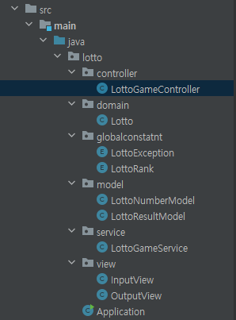

# 1. 프로젝트 소개
[우아한테크코스](https://www.woowacourse.io/) 6기 로또 

# 2. 기능 요구 사항
- [ ] 입력 받기
  - [X] 로또 구입 금액 입력 받기
  - [ ] 구입 금액 입력 에러 처리
  - [ ] 당첨 번호 입력 받기
  - [ ] 당첨 번호 입력 에러 처리
  - [ ] 보너스 번호 입력 받기
  - [ ] 보너스 번호 입력 에러 처리
- [ ] 출력 하기
  - [ ] 발행한 로또 번호 출력
  - [ ] 당첨 내역 출력
  - [ ] 수익률 출력 하기

# 3. 학습 요구 사항 
**학습 테스트 설정**
1. src/test/java/study 폴더에 StringTest class 생성
2. build.gradle 의존성 추가

3. 

**String 클래스에 대한 학습 테스트**
요구사항 1
- [X] "1,2"을 `,`로 split 했을 때 1과 2로 잘 분리되는지 확인
- [X] "1"을 `,`로 split 했을 때 1만을 포함하는 배열이 반환되는지 구현

요구사항 2
- [X] "(1,2)"값이 주어졌을 때 String의 substring() 메소드를 활용해 `()`을 제거 후 "1,2" 반환 구현

요구사항 3
- [X] "abc" 값이 주어졌을 때 String의 charAt() 메소드를 활용해 특정 위치 문자 가져오는 학습 작성
- [X] String의 charAt() 메소드를 활용해 특정 위치의 문자를 가져올 때 위치 값을 벗어나면 StringIndexOutOfBoundException 발생하는 부분 학습 테스트 구현
- [X] JUnit의 @DisplayName을 활용해 테스트 메소드 의도를 드러낸다.

**Set Collection에 대한 학습 테스트**
요구사항 1
- [X] Set의 size() 메소드 활용해 Set의 크기를 확인하는 학습테스트 작성
- [X] @ParameterizedTest 어노테이션을 활용하여 위 요구사항의 중복 코드 제거 작성

  요구사항 2
- [ ] Set의 contains() 메소드를 활용해 1, 2, 3의 값이 존재하는지 확인하는 테스트 구현
- [ ] (발생하는 중복 코드에 대해) JUnit ParameterizedTest를 활용해 중복 코드 제거

요구사항 3
- [ ] 요구사항 2는 contains 메소드 결과 값이 true인 경우만 테스트 가능함. 입력 값에 따라 결과 값이 다른 경우에 대한 테스트도 가능하도록 구현
- [ ] 예를 들어 1, 2, 3 값은 contains 메소드 실행 결과 true, 4, 5 값을 넣으면 false 가 반환되는 테스트를 하나의 Test Case로 구리

