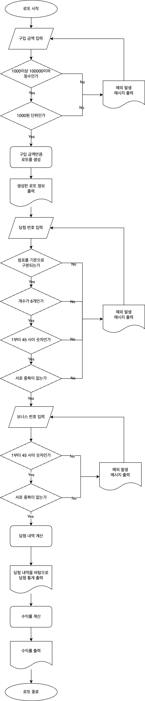

## 📝 추가된 게임 규칙
### "기능 요구 사항에 기재되지 않은 내용은 스스로 판단하여 구현한다." 에 따라 필요한 게임 규칙을 추가하였습니다
- 한 게임당 로또 구매 최대 금액은 10만원(100회)이다.

## 🎰 구현할 기능 목록

### 사용자에게 로또 구입 금액 입력 받기
- 1000이상 100,000이하의 정수여야만 한다 (예외처리) 
- 1000원 단위여야 한다 (예외처리)

### 사용자에게 당첨 번호 입력 받기
- 1~45의 숫자 중 6개의 정수를 입력받는다
  - 1~45의 정수인가 (예외처리)
  - 생성된 숫자가 6개인가 (예외처리)
  - 6개의 숫자는 중복되어선 안된다 (예외처리)
  - 6개의 정수는 쉼표(,)를 기준으로 구분되어야 한다 (예외처리)

### 사용자에게 보너스 번호 입력 받기
- 1~45의 숫자 중 1개의 숫자를 랜덤으로 생성한다
  - 1~45의 정수인가 (예외처리)
  - 생성된 숫자가 1개인가 (예외처리)
  - 기존 생성된 로또 번호 6자리와 중복되어선 안된다 (예외처리)

### 사용자 입력 도중 예외 발생 시 처리하기
- IllegalArgumentException 에러를 발생시킨다
- 에러 문구는 "[ERROR]"로 시작해야 한다
- 에러 문구 출력 후, 다시 입력을 받아야 한다

### 로또 생성하기
- 구입 금액만큼의 로또 생성하기
  - 1장 구매 시 1~45의 숫자 중 중복되지 않는 6개의 정수를 랜덤으로 생성한다
  - 구입 금액 1000원당 로또 1장을 생성한다
- 사용자가 입력한 보너스 번호로 로또 보너스 번호 생성하기

### 당첨 여부 확인하기
- 발행된 로또의 번호와 입력받은 로또의 번호 중 몇개의 번호가 일치하는지 확인
  - 6개 번호가 일치할 경우 1등
  - 5개 번호와 보너스번호 1개가 일치할 경우 2등
  - 5개 번호가 일치할 경우 3등
  - 4개 번호가 일치할 경우 4등
  - 3개 번호가 일치할 경우 3등

### 당첨 여부에 따른 금액 계산하기
- 1등일 경우 당첨금은 2,000,000,000원이다
- 2등일 경우 당첨금은 30,000,000원이다
- 3등일 경우 당첨금은 1,500,000원이다
- 4등일 경우 당첨금은 50,000원이다
- 5등일 경우 당첨금은 5,000원이다

### 수익률 계산하기
- 입력받은 금액과 당첨금을 비교하여 수익률을 계산한다
- 수익률은 소수점 둘째 자리에서 반올림한다

### 로또 당첨 내역과 수익률 출력하기
- 당첨 내역 중 낮은 등수부터 높은 등수 순서대로 출력한다
- 몇개의 숫자가 일치했는지의 정보를 출력한다
- 얼마의 당첨금을 얻는지의 정보를 출력한다
- 각 당첨마다 몇개가 당첨되었는지의 정보를 출력한다

### 발행한 로또 수량과 번호 출력하기
- 입력받은 금액으로 로또를 몇개 구매했는지 출력한다
- 구매한 로또 번호는 오름차순으로 정렬하여 보여준다

## 💡 어플리케이션 흐름 플로우차트로 정리해보기
;