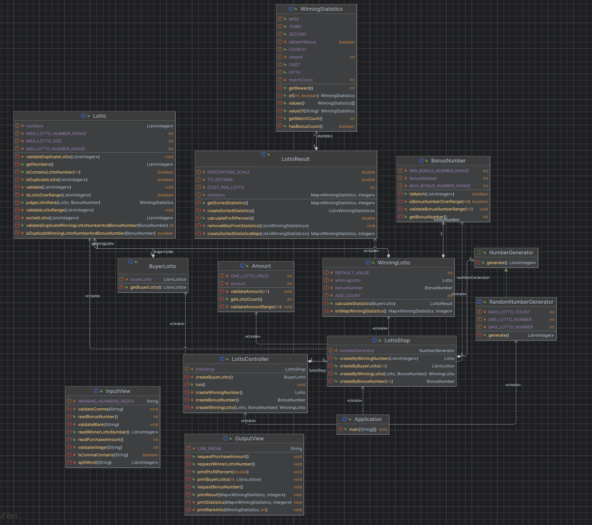

# 🎰 JAVA-lotto : Test your luck!

## 💡 이것은 무엇인가요?

- JAVA 로 구현된 간단한 로또 게임입니다.
- 로또를 구매하고 당첨 번호를 입력하면 당첨 통계를 출력합니다.
- 콘솔 기반 UI를 통해 구현되었습니다.

## 📝 기능 로드맵

- [ ] 로또 구입 금액을 입력받는다.
    - [ ] 사용자가 잘못된 금액을 입력한다면, 적절한 에러 메시지를 출력하고 다시 입력받는다.
- [ ] 시스템은 입력한 금액에 해당하는 로또를 발급한다. (구매 처리)
- [ ] 시스템은 발급된 로또를 출력한다.
- [ ] 시스템은 당첨 번호를 입력받는다.
- [ ] 시스템은 보너스 번호를 입력받는다.
- [ ] 시스템은 당첨 통계를 출력한다.
- [ ] 시스템은 수익률을 계산하여 출력한다.

## 🔥 개선을 위해 노력한 부분들

- 공통 피드백 문서를 참고하여, `README.md` 를 상세하게 작성하였습니다.

## 🧠 고민의 흔적들

### 첫 번째 구현



첫 번째 구현에서는, 위와 같이 객체들의 역할과 책임을 명확하게 정리해둔 후 구현을 시작하였습니다. "객체를 분리하라" 라는 추가 요구 사항에 걸맞게,
"내가 해결하고자 하는 문제에서는 어떤 객체들이 필요할까?" 를 명확히 할 필요가 있었기 때문입니다.

```java
public class Application {
    public static void main(String[] args) {
        // 캐셔는 로또 가게를 오픈합니다.
        Cashier cashier = new Cashier();
        Monitor monitor = new Monitor();

        // 가게를 오픈하고, 캐셔는 손님에게 로또를 판매하기 시작하죠.
        LottoEnvelope boughtLottoEnvelope = cashier.sellLotto();

        // 준비된 모니터는 손님이 구매한 로또의 정보를 출력하는 역할을 합니다.
        monitor.displayBoughtLottoEnvelope(boughtLottoEnvelope);

        // 구매한 손님을 뒤로 하고, 캐셔는 당첨 번호를 추첨해 온 다른 손님으로부터 당첨 번호를 건네받습니다.
        List<Integer> winningNumbers = cashier.getWinningNumbers();
        Integer bonusNumber = cashier.getBonusNumber();

        // 로또 봉투 객체는 당첨 번호를 통해 당첨 통계를 계산합니다.
        HashMap<Integer, Integer> statistics = boughtLottoEnvelope.getStatistics(winningNumbers, bonusNumber);
        Float earningRate = boughtLottoEnvelope.getEarningRate(winningNumbers, bonusNumber);

        // 준비된 모니터는 당첨 통계를 출력하는 역할을 합니다.
        monitor.displayStatistics(statistics);
        monitor.displayEarningRate(earningRate);

        // .. 손님은 더 이상 없고, 캐셔는 가게 문을 닫습니다.
    }
}

```

생각했던 대로 구현된 객체들은, 위처럼 메인 메서드에서 각자의 역할을 수행하며 협력을 통해 문제를 해결해냈습니다.

하지만, 이 구현은 사용자 `UI` 를 담당하는 로직들이 애플리케이션의 핵심 로직들과 섞여 있다는 문제점을 가지고 있습니다. 만약 `UI` 를 `GUI` 로 변경하라는 새로운 요구 사항이
들어온다면, 저는 애플리케이션 핵심 로직을 담당하는 코드들을 건드리지 않고 `GUI` 를 구현할 수 있을까요? 아마도 불가능할 것입니다.  
이러한 문제점들을 개선하기 위해서, 저는 `Layered Architecture` 라는 좋은 도구를 사용하기로 결정했습니다.

### 두 번째 구현

