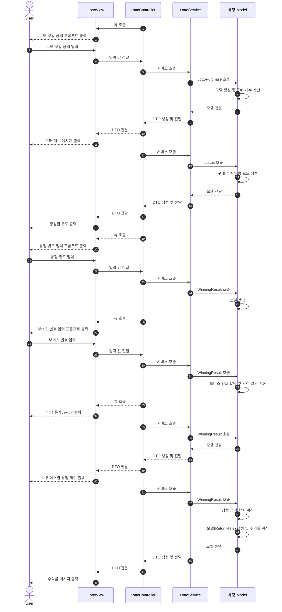

# 🎰 로또 기능 구현 목록

## ✨ 기능 (커밋 단위)

|  분류   | 기능                                     | 책임                          | 비고                                                                         |
|:-----:|----------------------------------------|-----------------------------|----------------------------------------------------------------------------|
|  입출력  | 로또 구입 금액 프롬프트(purchaseAmountPrompt) 출력 | LottoView                   |                                                                            |
|  입출력  | 로또 구입 금액(purchaseAmount) 입력            | LottoView                   |                                                                            |
| 객체 생성 | 구매 객체 (LottoPurchase) 생성               | LottoPurchase               |                                                                            |
|  검증   | 로또 구입 금액(purchaseAmount) 검증            | LottoPurchase               |                                                                            |
|  계산   | 구매 개수(quantity) 계산                     | LottoPurchase               |                                                                            | 
|  입출력  | 구매 개수 메시지(quantity) 출력                 | LottoView, LottoPurchaseDto |                                                                            |
| 객체 생성 | 구매 개수 만큼 로또(Lottos) 생성                 | LottoService, Lottos        | `Randoms.pickUniqueNumbersInRange()` 이용   로또 번호는 중복 없음 로또 번호는 오름차순 |
|  입출력  | 생성된 로또(pickedLottoNumbers) 출력          | LottoView, LottosDto        |                                                                            |
|  입출력  | 당첨 번호 입력(winningNumberPrompt) 프롬프트 출력  | LottoView                   |                                                                            |
|  입출력  | 당첨 번호(winningNumbers) 입력               | LottoView                   |                                                                            |
| 객체 생성 | 당첨 번호 객체(WinningNumbers) 생성            | WinningNumbers              |                                                                            |
|  검증   | 당첨 번호(winningNumbers) 검증               | WinningNumbers              |                                                                            |
| 객체 생성 | 당첨 결과 객체(WinningResult) 생성             | WinningResult               |                                                                            |
|  입출력  | 보너스 번호 입력 프롬프트(bonusNumberPrompt) 출력   | LottoView                   |                                                                            | 
|  입출력  | 보너스 번호(bonusNumber) 입력                 | LottoView                   |                                                                            |
|  검증   | 보너스 번호(bonusNumber) 검증                 | WinningResult               |                                                                            | |
|  할당   | 보너스 번호 할당                              | WinningResult               |                                                                            |             
|  입출력  | "당첨 통계\n---\n"(winningStatsMessage) 출력 | LottoView                   |                                                                            |
|  입출력  | 각 케이스별 당첨 개수(winningCount) 출력          | LottoView, WinningResultDto |                                                                            |
|  계산   | 당첨 금액 합계(totalWinningAmount) 계산        | WinningResult               |                                                                            |
| 객체 생성 | 수익률 객체(ReturnRate) 생성                  | ReturnRate                  |                                                                            |
|  입출력  | 수익률 계산 (returnRate)                    | ReturnRate                  | (당첨 금액 / 구입 금액) * 100 계산(소수점 둘째 자리에서 반올림)                                  |
|  입출력  | 수익률 메시지(returnRateMessage) 출력          | LottoView, ReturnRateDto    |                                                                            |

## ⛔️ 에러 상황

에러 메시지는 \[Error\]로 시작

* 구매 금액 100,000원 미만
* 구매 금액 문자 입력
* 당첨 번호 개수 6개 아닌 경우
* 당첨 번호 1 ~ 45 정수 아닌 경우
* 당첨 번호 중복
* 당첨 번호에 `,`이외 문자 입력
* 보너스 번호 1 ~ 45 아닌 경우
* 보너스 번호에 문자 입력

## 🧪 테스트

테스트는 위 기능 문단에 대응하여 작성한다. 가능한 작은 단위로 나누어 테스트하며, 도메인과 UI 테스트는 분리한다.

## 프로그래밍 시 주의 사항

* indent depth 2 이하 유지
* 함수는 한 가지 일만 하도록 최대한 작게 만들기
* JUnit 5, AssertJ 사용 테스트 코드
* 함수의 길이가 15 라인 이하 유지
* else 예약어 쓰지 않기
* enum 사용
* 도메인 로직에 단위 테스트 구현