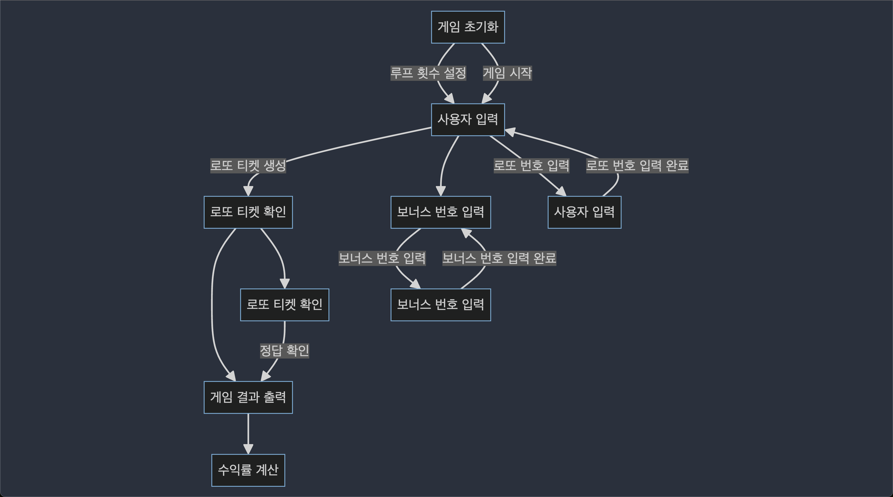

# 로또 게임

## 만들어야할 기능
- 출력문 출력 기능
- 구입 가격 입력 기능
  - 구입 가격이 1000원 단위로 나눠지는지 확인하는 기능
- 구입 가격 만큼 로또 생성
  - 로또 번호 랜덤 생성
    - 랜덤 생성 시 숫자는 1 ~ 45 이내 겹치지 않는 숫자로 생성
  - 로또 번호를 보여주는 출력 기능
- 당첨 번호를 입력 받는 기능
  - 숫자가 겹칠 경우 예외처리
  - 당첨 번호의 입력이 이상한 경우 예외처리
  - 당첨 번호의 숫자가 많아도 예외처리
- 보너스 번호를 입력 받는 기능
  - 보너스 번호의 입력이 이상한 경우 예외처리
- 당첨 통계 출력하기
  - 구매한 로또 갯수 만큼 로또 번호 비교하기
    - 로또 번호 비교하기
    - 맞춘 개수 저장하기
  - 총 맞춘 갯수 보여주기
  - 맞춘 갯수의 수익률 보여주기

# 로또 게임 플로우차트

## 게임 초기화
- `User` 클래스의 새 인스턴스를 생성합니다.
- 로또 티켓 구매를 위한 루프 횟수를 설정합니다 (`loopCountSetUp` 메소드).
- 사용자로부터 구매 금액을 입력 받습니다 (`purchaseAmount` 메소드).
- 금액이 1000원 단위인지 확인합니다 (`loopCheck` 메소드).
- 사용자의 돈을 입력 금액으로 설정합니다.
- 돈을 기반으로 루프 횟수를 계산합니다.
- 사용자의 로또 티켓을 생성하고 설정합니다 (`setLottoTickets` 메소드).
- 각 루프마다 랜덤 로또 티켓을 생성하고 정렬한 후 사용자의 로또 티켓에 추가합니다.
- 사용자의 로또 티켓을 출력합니다 (`printLottoTickets` 메소드).

## 사용자 입력
- 사용자의 입력 번호를 설정합니다 (`setUserInputNumbers` 메소드).
- 사용자로부터 로또 번호를 입력 받습니다 (`inputNumbers` 메소드).
- 입력이 6개의 숫자인지 확인합니다 (`userNumbers` 메소드).
- 입력을 정수 리스트로 변환합니다 (`userInputNumbers` 메소드).
- 각 입력이 1에서 45 사이의 숫자이며 중복되지 않도록 확인합니다 (`userInputNumbers` 메소드).

## 보너스 번호 입력
- 사용자의 보너스 번호를 설정합니다 (`setBonusNumber` 메소드).
- 사용자로부터 보너스 번호를 입력 받습니다 (`inputBonus` 메소드).
- 입력이 1에서 45 사이의 숫자이며 중복되지 않도록 확인합니다 (`inputBonusNumber` 메소드).

## 로또 티켓 확인
- 각 로또 티켓을 사용자의 입력 및 보너스 번호와 비교합니다 (`lottoCheck` 메소드).
- 각 로또 티켓에 대해:
  - 정답 숫자의 개수를 확인합니다 (`lottoNumbersCheck` 메소드).
  - 보너스 번호가 정답인지 확인합니다 (`bonusNumberCheck` 메소드).
  - 사용자에게 정답과 보너스 정답 횟수를 기록합니다.

## 게임 결과 출력
- 사용자에게 당첨 통계와 결과를 출력합니다 (`printResult` 메소드).
- 각 카테고리의 정답 횟수를 출력합니다 (`print` 메소드).
- 총 당첨 금액과 수익률을 계산하고 출력합니다 (`printProfit` 메소드).
- 사용자의 결과 금액을 설정합니다 (`setResultMoney` 메소드).

## 정답 횟수 확인
- 각 카테고리별 정답 횟수를 확인합니다 (`findCorrectCount` 메소드).
- 3개, 4개, 5개, 5개 + 보너스, 6개의 정답 횟수를 계산합니다.
- 정답 횟수 리스트를 반환합니다.

## 수익률 계산
- 사용자의 수익률을 계산합니다 (`getProfit` 메소드).
- 총 당첨 금액과 사용자의 돈을 기반으로 수익률을 계산합니다.
- 수익률을 출력합니다.

# 로또 게임 순서도
