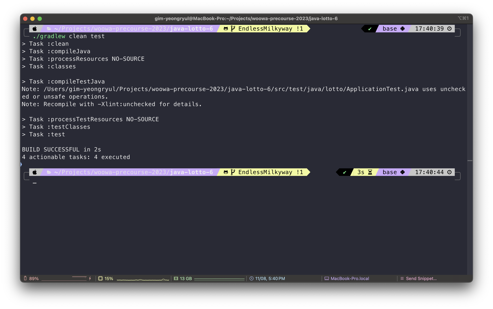

## 기능 목록

### 입력 - `InputHandler`

| 입력 항목      | 자료형 | 특징                    | 구현 현황              |
| -------------- | ------ | ----------------------- | ---------------------- |
| 로또 구입 금액 | `int` | 1,000원 단위로 입력     | :white_check_mark: |
| 당첨 번호      | `List<String>` | 쉼표(,)를 기준으로 구분, 중복되어서는 안된다. | :white_check_mark: |
| 보너스 번호    | `int` |                         | :white_check_mark: |

### 출력 - `View`

- [x] 구입금액 입력 요구 메시지

  ```
  구입금액을 입력해 주세요.
  ```

- [x] 발행한 로또 수량 및 번호를 출력

	```
	4개를 구매했습니다.
	[1, 2, 3, 4, 5, 6] 
	[3, 5, 11, 16, 32, 38] 
	[7, 11, 16, 35, 36, 44] 
	[1, 8, 11, 31, 41, 42] 
	```
	- 제약 조건: 로또 번호는 오름차순으로 정렬하여 표현

- [x] 당첨 번호 입력 요구 메시지

  ```
  당첨 번호를 입력해 주세요.
  ```

- [x] 보너스 번호 입력 요구 메시지

  ```
  보너스 번호를 입력해 주세요.
  ```

- [x] 당첨 내역 제목을 출력

	```
	당첨 통계
	---
	```

- [x] 당첨 내역을 출력

	```
	3개 일치 (5,000원) - 0개
	4개 일치 (50,000원) - 0개
	5개 일치 (1,500,000원) - 0개
	5개 일치, 보너스 볼 일치 (30,000,000원) - 0개
	6개 일치 (2,000,000,000원) - 1개
	```

- [x] 수익률을 출력

	```
	총 수익률은 500,000.0%입니다.
	```

- 제약 조건: 수익률은 소수점 둘째 자리에서 반올림하여 표현

### 입력값 검증 - `InputValidator`

- **공통 사항**

  | 검증 사항                                   | 메시지 형식                                       | 구현 현황          |
  | ------------------------------------------- | ------------------------------------------------- | ------------------ |
  | 아무것도 입력하지 않은 경우                 | [ERROR] 입력은 비어있을 수 없습니다.              | :white_check_mark: |
  | 공백이 입력된 경우                          | [ERROR] 입력은 공백일 수 없습니다.                | :white_check_mark: |
  | 숫자가 아닌 다른 값이 입력될 경우 예외 처리 | [ERROR] 숫자가 아닌 다른 값은 입력할 수 없습니다. | :white_check_mark: |

- **로또 구입 금액**

	| 검증 사항                                                 | 메시지 형식                                           | 구현 현황 |
	| -------------------------------------------------------- | ----------------------------------------------------- | ------- |
  | 입력이 1,000원 단위로 나누어 떨어지지 않는 경우 예외 처리 | [ERROR] 로또 구입 금액은 1,000원 단위로 나누어 떨어져야 합니다. | :white_check_mark: |
- **당첨 번호**
	
  | 검증 사항                                                | 메시지 형식                                                  | 구현 현황          |
	| -------------------------------------------------------- | ------------------------------------------------------------ | ------------------ |
  | 입력이 (,)으로 구분되어 있지 않은 경우 예외 처리         | [ERROR] 당첨 번호는 (,)으로 구분된 6자리의 숫자여야 합니다.  | :white_check_mark: |
  | 입력에 주어진 숫자가 6개 보다 많거나 적을 경우 예외 처리 | [ERROR] 주어진 숫자가 많거나 모자릅니다. 6자리의 숫자를 입력해야 합니다. | :white_check_mark: |
  | 1과 45 사이의 숫자가 아닌 경우 예외 처리                 | [ERROR] 로또 번호는 1부터 45 사이의 숫자여야 합니다.         | :white_check_mark: |
  | 중복된 숫자가 있을 경우 예외 처리                        | [ERROR] 로또 번호에는 중복된 숫자가 존재할 수 없습니다.      | :white_check_mark: |
- **보너스 번호**
	
  | 검증 사항                                       | 메시지 형식                                           | 구현 현황          |
	| ----------------------------------------------- | ----------------------------------------------------- | ------------------ |
  | 1과 45 사이의 숫자가 아닌 경우 예외 처리        | [ERROR] 로또 번호는 1부터 45 사이의 숫자여야 합니다.  | :white_check_mark: |
  | 당첨 번호에 기입한 숫자가 입력될 경우 예외 처리 | [ERROR] 당첨 번호에 입력한 숫자는 입력할 수 없습니다. | :white_check_mark: |

- [x] 에러 출력 후 사용자에게 값을 재입력 받아야 한다.

### 사용자의 입력을 통해 로또 당첨 번호(정답) 생성 - `Answer`

| 필드명      | 자료형       | 구현 현황          |
| ----------- | ------------ | ------------------ |
| hitNumbers  | `HitNumbers` | :white_check_mark: |
| bonusNumber | `int`        | :white_check_mark: |

### 당첨 번호를 관리하는 클래스 - `HitNumbers`

- [x] 당첨 번호를 관리하는 일급 컬렉션
- [x] 숫자의 List 내 존재 여부를 반환하는 메서드가 존재해야 한다.

### Radoms API를 이용한 로또 번호 생성 - `LottoMachine`

- [x] API의 `pickUniqueNumberInRange(시작 번호, 종료 번호, 개수)`메서드를 사용하여 생성
  - 해당 메서드의 반환형은 Integer형 List

- [x] 각 숫자의 범위는 1~45 사이
- [x] 1개의 로또 발행 시 중복되지 않는 6개의 숫자를 선별 - **API의 메서드를 이용하면 고려하지 않아도 된다**
- [x] 생성된 로또는 Lotto 클래스를 통해 관리되어야 한다.

### Lotto 클래스

| 필드명      | 자료형        | 구현 현황 |
| ----------- | ------------- | --------- |
| numbers      | `List<Integer>` | :white_check_mark: |

- [x] 인스턴스 필드 numbers의 접근 제어자를 변경하지 않았는가?
- [x] 인스턴스 필드 추가하지 않았는가?

### Lotto 객체들을 관리하는 클래스 - `Tickets`

- [x] `List<Lotto>`를 관리하는 일급 컬렉션
- [x] `Lotto` 객체들과 `Answer` 객체를 비교하여 당첨 여부를 확인한 후 이를 반환

### 결과를 관리하는 클래스 - `Result`

- [x] 당첨 번호 적중 개수와 보너스 번호 적중 여부를 가지는 클래스

### 최종 결과를 관리하는 클래스 - `TotalResult`

- [x] `Tickets` 클래스에서 계산된 최종 결과를 관리하는 일급 컬렉션
- [x] 수익률을 계산하여 반환하는 로직을 가지고 있어야 한다.

### 당첨 여부 확인 (Enum을 생성하여 관리)

| 순위 | 일치하는 번호 수  | 당첨금          |
| ---- | ----------------- | --------------- |
| 1등  | 6개               | 2,000,000,000원 |
| 2등  | 5개 + 보너스 번호 | 30,000,000원    |
| 3등  | 5개               | 1,500,000원     |
| 4등  | 4개               | 50,000원        |
| 5등  | 3개               | 5,000원         |


## 테스트 케이스

### 목록

#### - AnswerTest

- 보너스 번호가 1부터 45 사이의 숫자가 아닌 경우에 대한 테스트 케이스
- 보너스 번호가 당첨 번호와 중복될 경우에 대한 테스트 케이스
- 매개변수로 주어진 번호가 당첨 번호 내부에 존재하는지 확인한 후 결과를 반환하는 메서드에 대한 테스트 케이스
- 매개변수로 주어진 번호가 보너스 번호와 일치하는지 확인한 후 결과를 반환하는 메서드에 대한 테스트 케이스

#### - LottoTest

- 로또 번호의 개수가 6개가 넘어가는 경우에 대한 테스트 케이스
- 로또 번호의 개수가 6개 보다 적은 경우에 대한 테스트 케이스
- 로또 번호에 중복된 숫자가 존재하는 경우에 대한 테스트 케이스
- 로또 번호에 1부터 45 사이의 숫자를 입력하지 않은 경우에 대한 테스트 케이스
- getter가 불변 리스트를 반환하는지에 대한 테스트 케이스
- 주어진 정답과 번호를 비교한 뒤 결과를 반환하는 메서드에 대한 테스트 케이스
- 매개변수로 주어진 번호가 List 내부에 존재하는지 확인한 후 결과를 반환하는 메서드에 대한 테스트 케이스

#### - ResultTest

- 일치하는 숫자 개수를 반환하는 메서드에 대한 테스트 케이스
- 보너스 번호 일치 여부를 반환하는 메서드에 대한 테스트 케이스

#### - TicketsTest

- getter가 불변 리스트를 반환하는지에 대한 테스트 케이스
- 발행된 로또 티켓의 총 개수를 반환하는 메서드에 대한 테스트 케이스
- 정답 객체를 매개변수로 받아 비교한 뒤 최종 결과를 반환하는 메서드에 대한 테스트 케이스

#### - TotalResultTest

- getter에 대한 테스트 케이스
- 클래스 내부에 존재하는 수익률 반환 메서드에 대한 테스트 케이스

#### - InputValidatorTest

- 입력을 하지 않거나 공백을 입력한 경우에 대한 테스트 케이스
- 구입 금액에 숫자가 아닌 문자가 포함되어 있는 경우에 대한 테스트 케이스
- 구입 금액이 1000원 단위로 나누어 떨어지지 않는 경우에 대한 테스트 케이스
- 당첨 번호에 숫자가 아닌 문자가 존재하는 경우에 대한 테스트 케이스
- 당첨 번호를 정해진 형식으로 입력하지 않은 경우에 대한 테스트 케이스
- 보너스 번호에 숫자가 아닌 문자를 입력한 경우에 대한 테스트 케이스

#### - LottoMachineTest

- Randoms API를 이용해 로또 번호를 생성하는 로직에 대한 테스트 케이스

### 결과




## 제약 조건 (체크리스트)

링- [x] 인덴트 깊이가 3을 넘지 않도록 구현했는가? (2까지는 허용)
- [x] 3항 연산자를 사용하지 않았는가?
- [x] 함수(또는 메서드)가 한 가지 일만 하도록 최대한 작게 만들었는가?
- [x] JUnit 5와 AssertJ를 이용하여 기능 목록이 정상 동작함을 테스트 코드로 확인했는가?
- [x] 함수(또는 메서드)의 길이가 15라인을 넘어가지 않았는가?
- [x] else 예약어를 사용하지 않았는가?
- [x] Java Enum을 적용했는가?
- [x] 도메인 로직에 단위 테스트를 구현 했는가?
- [ ] 모든 원시값과 문자열을 포장했는가? - 구입 금액은 포장하지 않았다.
- [x] 콜렉션에 대해 일급 콜렉션을 적용했는가?
- [x] 3개 이상의 인스턴스 변수를 가진 클래스를 구현하지 않았는가? - 상수를 인스턴스 변수로 보지않는다면 충족
- [x] getter/setter 없이 구현했는가? - getter를 사용했지만 불변 리스트를 반환하도록 하고 부득이하게 필요한 경우를 위해 네이밍을 신경썼다.
- [x] 메소드의 인자 수를 제한했는가? - 3개 이상의 매개변수를 가진 메서드를 설계하지 않았다.
- [x] 코드에 한 줄에 점(.)을 하나만 허용했는가? - enum에 접근하는 경우와 체이닝을 제외하고는 충족하였다.
- [x] 클래스를 작게 유지하기 위해 노력했는가?