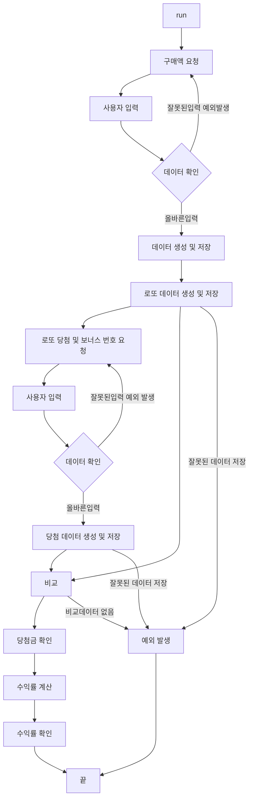

# 로또 미션

- 작성자 : 제민수(우테코 프리코스 6기)
- 작성 기간 : 2023-11-02 pm4:00 ~ 현재 작성 중
- 🔖버전 관리 : 1.05ver
  - 0.x 프로그램 실행 안됨 테스트 및 코딩 작성 중. //x수정 내용은 제일 마지막 페이지에 있음.
  - 1.x 프로그램 실행 가능

## 📜목차

### 1장. 개요

- [미션 프로그램 작성의 목적](#미션-프로그램-작성의-목적)
- [로또 미션의 목적](#로또-미션의-목적)

### 2장. 프로그램

- [기능 요구 사항 정리](#기능-요구-사항-정리)
- [프로그램 진행 구상](#프로그램-진행-구상)
- [기능 구현 목록](#기능-구현-목록)
- [유효성 확인](#유효성-확인)
- [프로그램 FlowChart](#프로그램-FlowChart)

### 3장. 기타

- [사용된 라이브러리](#사용된-라이브러리)
- [요구사항 이외 고려사항](#요구사항-이외-고려사항)
- [ver 수정 내용](#Ver-수정-내용)
---
---

## ⛳미션 프로그램 작성의 목적

- 우아한 테크코스 6기 백앤드 프리코스 3주차 과정으로 이전 1,2 주차의 과제 진행의 피드백 받은 부분을 발전 시키고, 개발자의 역량을 기르기 위함.
- 2주차 공통 피드백
  - README.md를 상세히 작성한다.
  - 기능 목록을 재검토 한다.
  - 기능 목록을 업데이트 한다.
  - 값을 하드 코딩하지 않는다.
  - 구현 순서도 코딩 컨벤션이다.
  - 변수이름에 자료형을 사용하지 않는다.
  - 한 함수가 한가지 기능만 담당하게 한다.
  - 함수가 한가지 기능을 하는지 확인 하는 기준을 세운다.
  - 테스트 작성하는 이유에 대해 본인의 경험을 토대로 정리해 본다.
  - 처음부터 큰 단위의 테스트를 만들지 않는다.
- 해당 src의 문서 및 docs 문서는 우아한테크코스 6기 백앤드 제민수가 작성 하였으며, 이외의 문서 및 파일은 수정 하지 않는다.

## 🎲로또 미션의 목적

- 사용자(input값을 넣는 사람)가 원하는 로또 구입 수량을 정하고 당첨 번호 및 보너스 번호를 입력하면,
  당첨 내역과 수익률을 반환하는 것이 로또 미션의 목적이다.

---
---

## 💾기능 요구 사항 정리

- 기능 요구 사항 정리는 readme를 읽으면서 작성 하기에 좀더 쉽게 작성하기 위해 필요한 내용을 옮겨 쓴 내용이다.
- 시작하기 앞서 이미 기능 요구사항에 대하여 숙지 한 사람은 다음 목차로 넘어간다.-> [프로그램 진행 구상](#프로그램-진행-구상)

로또 게임 기능을 구현해야 한다. 로또 게임은 아래와 같은 규칙으로 진행된다.

```
- 로또 번호의 숫자 범위는 1~45까지이다.
- 1개의 로또를 발행할 때 중복되지 않는 6개의 숫자를 뽑는다.
- 당첨 번호 추첨 시 중복되지 않는 숫자 6개와 보너스 번호 1개를 뽑는다.
- 당첨은 1등부터 5등까지 있다. 당첨 기준과 금액은 아래와 같다.
    - 1등: 6개 번호 일치 / 2,000,000,000원
    - 2등: 5개 번호 + 보너스 번호 일치 / 30,000,000원
    - 3등: 5개 번호 일치 / 1,500,000원
    - 4등: 4개 번호 일치 / 50,000원
    - 5등: 3개 번호 일치 / 5,000원
```

- 로또 구입 금액을 입력하면 구입 금액에 해당하는 만큼 로또를 발행해야 한다.
- 로또 1장의 가격은 1,000원이다.
- 당첨 번호와 보너스 번호를 입력받는다.
- 사용자가 구매한 로또 번호와 당첨 번호를 비교하여 당첨 내역 및 수익률을 출력하고 로또 게임을 종료한다.
- 사용자가 잘못된 값을 입력할 경우 `IllegalArgumentException`를 발생시키고, "[ERROR]"로 시작하는 에러 메시지를 출력 후 그 부분부터 입력을 다시 받는다.
  - `Exception`이 아닌 `IllegalArgumentException`, `IllegalStateException` 등과 같은 명확한 유형을 처리한다.

### 입출력 요구 사항(예시 생략)

#### 입력

- 로또 구입 금액을 입력 받는다. 구입 금액은 1,000원 단위로 입력 받으며 1,000원으로 나누어 떨어지지 않는 경우 예외 처리한다.

- 당첨 번호를 입력 받는다. 번호는 쉼표(,)를 기준으로 구분한다.

- 보너스 번호를 입력 받는다.

#### 출력

- 발행한 로또 수량 및 번호를 출력한다. 로또 번호는 오름차순으로 정렬하여 보여준다.

- 당첨 내역을 출력한다.

- 수익률은 소수점 둘째 자리에서 반올림한다. (ex. 100.0%, 51.5%, 1,000,000.0%)

- 예외 상황 시 에러 문구를 출력해야 한다. 단, 에러 문구는 "[ERROR]"로 시작해야 한다.

### 실행 결과 예시

구입금액을 입력해 주세요.
8000

````
8개를 구매했습니다.
[8, 21, 23, 41, 42, 43]
[3, 5, 11, 16, 32, 38]
[7, 11, 16, 35, 36, 44]
[1, 8, 11, 31, 41, 42]
[13, 14, 16, 38, 42, 45]
[7, 11, 30, 40, 42, 43]
[2, 13, 22, 32, 38, 45]
[1, 3, 5, 14, 22, 45]

당첨 번호를 입력해 주세요.
1,2,3,4,5,6

보너스 번호를 입력해 주세요.
7

당첨 통계
---
3개 일치 (5,000원) - 1개
4개 일치 (50,000원) - 0개
5개 일치 (1,500,000원) - 0개
5개 일치, 보너스 볼 일치 (30,000,000원) - 0개
6개 일치 (2,000,000,000원) - 0개
총 수익률은 62.5%입니다.
````

## 🧐프로그램 진행 구상

- 프로그램 FlowChart 및 기능 구현 목록을 작성하기 전 간략하게 어떤 식으로 진행할지 생각을 적은 페이지이다.

1. 로또를 구입 할 금액을 입력 받기 위한 문구를 화면에 출력 한다.
2. 로또를 구입 할 금액을 입력 받는다.
- 입력을 확인 하고 잘못된 값일 경우 `IllegalArgumentException`을 발생시킨 후 다시 값을 입력 받는다(1번으로 작업이 되돌아 감).
3. 로또 발행 수량을 계산하고 화면에 출력 한다.
4. 로또를 발행 한다.
- 1~45 까지의 무작위 값을 6번 구하되, 중복을 허용하지 않는다.(1번 발행 할 때 로또 번호는 오름 차순으로 정렬한다.)
- 로또 발행 수량 만큼 반복한다.(발행 한번에서 6개의 수는 중복 되면 안되지만 각각 발행한 것들 중 중복은 허용한다.)
5. 발행된 로또를 화면에 출력 한다.
6. 당첨 번호 6개를 입력 받기 위한 문구를 화면에 출력 한다.
7. 당첨 번호 6개를 입력 받는다.
- 1~45까지의 수 6개를 ","로 구분하여 입력받는다.
- 입력을 확인 하고 잘못된 값일 경우 `IllegalArgumentException`을 발생시킨 후 다시 값을 입력 받는다(7번으로 작업이 되돌아 감).
8. 보너스 번호를 입력 받기 위한 문구를 화면에 출력 한다.
- 1~45까지의 수 1개를 입력 받고, 당첨 번호 6개와 겹쳐서 안된다.
- 입력을 확인 하고 잘못된 값일 경우 `IllegalArgumentException`을 발생시킨 후 다시 값을 입력 받는다(8번으로 작업이 되돌아 감).
9. 발행된 로또 번호와 입력받은 당첨번호 및 보너스 번호를 비교하여 당첨 통계를 낸다.
10. 생성된 통계를 화면에 출력 한다.
11. 생성된 통계를 통해 최종 수익 금액을 계산한다.
12. 최종 수익 금액/로또 구입 금액*100으로 수익률을 계산한다.
13. 총 수익률을 화면에 출력 한다.

## 🎯기능 구현 목록

- 코드를 작성하기 이전 구현할 기능의 목록을 작성하는 페이지 이다.

### 1. 입출력 기능 구현

- [X] `camp.nextstep.edu.missionutils.Console.readLine()`를 활용하여 입력을 읽는다.
- [X] java에 있는 `System.out.println()`메서드를 활용해 화면에 출력한다.

### 2. 로또 구매 기능 구현

- [X] 로또는 1,000원이다.
- [X] 로또는 long으로 최대 4,611,686,000원 구매 가능하다.
  - [X] 상금 최대 금액을 1등만 계속 했을 때로 가정하고 9,223,372,000,000,000,000원까지 long으로 표현 가능하다.
  - [X] 모든 로또가 1등만을 생성 했을때 4,611,686회 까지만 표기 가능 하다.
  - 따라서 최대 구매 금액은 4,611,686,000원으로 하고 시작한다.
- [X] 로또 구매액은 숫자가 아닌 문자이거나, 공백이어선 안된다.
- [X] 로또 구매액은 1,000으로 나누어 떨어지지 않으면 IllegalArgumentException을 발생시킨 후 다시 구매액을 입력 받는다.
- [X] 로또 구매액/1,000는 발행 회수로 지정하여 로또를 발행한다.
- [X] 로또 번호는 `camp.nextstep.edu.missionutils.Randoms`를 활용 하여 제작한다.
- [X] 1회의 로또 발행은 6개의 랜덤 숫자를 생성한다.
  - [X] 로또 번호는 1~45사이의 정수이다.
  - [X] 중복이 되어선 안되며, 중복이라면 다시 생성하여 추가한다.
- [X] 발행된 로또 번호 6개는 오름 차순으로 정렬하여 저장하며 화면에 출력시 오름차순대로 보여준다.

### 3. 로또 당첨 확인 및 수익률 기능 구현

- [X] 당첨 번호는 사용자가 입력하며 ","로 구분한다.
  - [X] 당첨 번호는 중복 입력 불가이며, 1~45사이의 정수이다.
- [X] 보너스 번호는 1~45 사이의 숫자이며, 당첨 번호와 중복되면 안된다.
- [X] 당첨 번호는 발행된 로또와 비교하여 일치하는 수에 따라 1등~5등 당첨을 정한다.
- [X] 5등~1등 순서로 당첨된 개수를 화면에 출력한다.
- [X] 등수액*당첨 개수로 총 수익액을 구한다.
- [X] 총 수익액/로또 구매액*100(%)으로 계산하여 총 수익률을 계산하고 소수점 첫째자리 까지만 출력한다.

### 4. 예외처리 기능 구현

- [X] 입력 받은 값이 수가 아닐 경우 `IllegalArgumentException`를 발생시키고 에러문구 출력 후, 다시 입력 받는다.
- [X] 입력 받은 값이 범위를 벗어 났을 경우 `IllegalArgumentException`를 발생시키고 에러문구 출력 후, 다시 입력 받는다.
- [X] 입력 받은 값이 중복 되었을 경우 `IllegalArgumentException`를 발생시키고 에러문구 출력 후, 다시 입력 받는다.
- [X] 로또의 번호가 6개가 아닐 경우 `IllegalArgumentException`를 발생시키고 에러문구 출력 후, 프로그램을 종료한다.(주어진 Lotto클래스의 설정된 부분이며, 수정 불가.)
- [X] 당첨 확인시 Null객체를 참조될 경우 `NullPointerException`를 발생시키고 에러문구 출력 후 프로그램을 종료한다.

## 📝유효성 확인

- Test 문서에서 오류코드 관련 정리한 페이지 이다.

### 1. Error message 내용 및 선언
- 공통 시작에러 문구 "[ERROR] : "
- 구매액이의 입력이 잘못 된경우 "입력하신 구매액이 올바르지 않습니다."
- 구매액의 범위가 1,000~4,611,686,000원 사이가 아닐 경우 "입력하신 구매액의 범위가 알맞지 않습니다."
- 구매액이 1000원 단위가 아닐 경우 "(구매액은 1000원 단위로만 판매함)"
- 당첨 로또 번호가 숫자로 입력 되지 않은 경우"입력하신 당첨 로또의 번호가 올바르지 않습니다."
- 당첨 로또 번호가 1~45가 아닐 경우"입력하신 당첨 로또의 번호의 범위가 알맞지 않습니다."
- 보너스 번호의 범위가 1~45가 아닐 경우"입력하신 보너스 번호의 범위가 알맞지 않습니다."
- 보너스 번호 혹은 당첨 번호 입력을 중복되는 숫자가 포함되게 했을 경우 "로또 번호를 중복 입력 하셨습니다."
- 입력된 것이 숫자로 이루어 지지 않았을 경우 "(숫자로 읽히지 않음)"
- 로또의 번호가 6개가 아닐 경우 "로또 번호가 6개가아닙니다."
- 당첨 확인시 Null객체를 참조될 경우 "잘못된 당첨 카운트""

### 2. Test코드 상에서 Error 체크리스트
- [X] ErrorCheck클래스 관련 예외 처리 범위의 값을 입력하여 에러메시지 출력 및 예외처리를 확인 하였는가?
- [X] ErrorCheck클래스 이외에서 발생하는 에러 상황을 확인 하였는가?

## 💡프로그램 FlowChart

- 프로그램의 동작을 간략하게 FlowChart로 표현한 페이지 이다.



- 잘못된 데이터 저장은 Lotto()함수에서 발생하며, Lotto 생성자 사용 시 Lotto의 값이 중복, 6개가이닌 데이터 일시 예외로 처리함.

---
---

## 📚사용된 라이브러리

- 우아한 테크코스에서 준 라이브러리 및 미리 생성된 클래스를 정리하는 페이지 이다.
- 지원한 라이브러리를 제외하고 추가해선 안된다.
- Lotto클래스는 메서드 추가만 가능하고 기존 내용 수정은 불가.
- 나머지 클래스

### 1. Randoms 클래스

- `camp.nextstep.edu.missionutils.Randoms` 라이브러리의 `pickUniqueNumbersInRange()` 함수를 활용한다.
- `pickUniqueNumbersInRange()`()안에는 시작 수, 마지막 수, 생성 횟수를 입력 받으며 시작수~ 마지막수 범위의 정수 값을 랜덤으로 생성횟수 만큼 생성한다.
  - 시작수 부터 마지막 수까지 List<integer> number에 들어가며 해당 값을 shuffle()(구현되어있음.)을 이용하여 섞고 subList를 이용하여 0~생성 횟수까지의 리스트만 반환 한다.
  - 위의 방식으로 인해 중복이 없으며, 랜덤으로 범위내의 수를 생성하여 받을 수 있다.

### 2. readLine 메서드

- `camp.nextstep.edu.missionutils.Console` 라이브러리의 `readLine()` 함수를 활용한다.
- `readLine()`은 Scanner클래스를 사용하고 있으며 nextLine() 함수로 enter의 입력을 받기 전까지 쓴 문자열을 모두 리턴 한다.

### 3. Lotto 클래스

- List<Integer>로 로또 번호를 입력하고, 입력 받은 값이 6개가 아닐 경우 예외 상황으로 처리한다.
- 추가사항
  - 중복입력이 있는지 확인 하고 예외 상황으로 처리했음.
  - Lotto값을 읽는 것을 만듬.
  - Lotto값 매칭 카운트 반환.

## 😵요구사항 이외 고려사항

- 기존에 임베디드 c언어를 작성 할때 자주 하였던 저장된 자료 검증 -> 애초에 잘못 넣지 않는 이상 잘못된 값이 반환되지 않음.
  - 삭제
- Screen화면을 따로 메소드로 작성하여야하는가... -> Text자체를 따로 선언 함.
  - 메소드는 한번에 무슨 문구가 작성되었는지 바로 알기 힘들지만
    제작한 io를 통해 출력되는 Text를 따로 선언 하면 쉽게 무슨 String이 저장되었는가 확인가능
  - 선언된 Text를 통해 쉽게 어느 문구가 어디에 적용되서 변하는지 알 수 있어 수정도 용이한것으로 생각됨.
- 패키지 생성은 어떻게 할 것인가
  - io는 그대로 intput, output으로 나중에 추가적인 도구들이 생성되는 것을 고려해 인터페이스로 작업 진행
    - io 자체는 어떤 프로그램에서도 똑같이 적용 할 수 있다고 생각해서 util 패키지에 만듬.
  - 로또 구매, 발행, 당첨으로 크게 구분
  - 어디서든 사용가능한 Final값들의 fiexd data 생성
  - 특정 값을 반환 받기 위한 generator 생성(계산으로 따로 빼놨던 것들은 결과적으로 값을 생성하는 것으로 생각되어 합침.)
  - Lotto같이 이미 만들어진 에러를 제외한 모든 에러(예외사항)을 한곳에서 보기 위한 errorcheck
- README.md는 어디까지 작성할 것인가?
  - 현재 문서의 목적을 생각하여 최대한 많이 작성 해볼 예정.
  - 틀리더라도 작성해보고 점차 알맞은 것들로만 구성하게 노력해봐야 할것으로 보임.

---
---

## 👁️‍🗨️Ver 수정 내용

- Ver0.x
  - 프로그램완성 이전 수정 및 추가 사항 관리
  - [23.11.03 am 00:04] 초안 작성 완료
  - [23.11.04 am 10:50] 초안 수정 완료
  - [23.11.04 pm 11:00] fixed data io 작성
  - [23.11.05 am 01:35] Buy 클래스 생성 및 Test
  - [23.11.05 pm 06:50] LottoIssuance, LottoGenerator 클래스 생성 및 테스트
  - [23.11.05 pm 11:10] 최종본 완성 및 테스트
- Ver1.x
  - 프로그램 완성 이후 수정사항 관리
  - [23.11.06 PM 08:00] README.md 문서 수정.
  - [23.11.06 PM 11:50] README.md 문서 수정(다이어그램 추가) 및 코드 분리, 패키지 정리.
  - [23.11.07 AM 01:40] 클래스 다이어그램 오류 수정 실패, 링크 오류 수정 완료.
    - entlij에서는 정상으로 보이는데 github에서 안됨. 너무 길어서 인지 모르겠음.
    - 내용이 많아서 오류 나는것으로 보여 삭제
  - [23.11.07 PM 07:00] ErrorCeck에 추가 한거 Test에 추가안해서 추가함.
  - [23.11.07 PM 07:10] 작성 덜된 부분들 추가 작성 및 필요 없다고 생각되는 부분 삭제.
