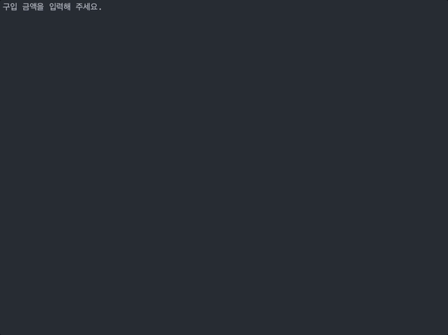

    

# 프리코스 3주차 미션 - 로또
- - -

> 우아한테크코스 6기 3주차 미션, 로또를 구현한 저장소입니다. 

    

## 📚 목차
- [기능 목록](#기능-목록)
  - [로또 구입](#기능-목록)
  - [당첨 결과 확인](#당첨-결과-확인)
- [구현 현황](#구현-현황)
  - [Input](#Input)
  - [Output](#Output)
  - [Main](#Main)

## 📝 기능 목록
- - -
### 로또 구입
- `구입 금액을 입력해 주세요.` 입력 메시지가 콘솔에 출력됩니다.
- 사용자로부터 로또 구입 금액을 입력받습니다.
  - 입력 조건은 다음과 같습니다.
    - 1,000단위의 정수
  - 잘못 입력된 경우 `IllegalArgumentException`을 발생시키고 재입력받습니다.
- 입력한 금액 만큼 로또 번호를 생성해서 오름차순으로 콘솔에 출력합니다.

### 당첨 결과 확인
- `당첨 번호를 입력해 주세요.` 입력 메시지가 콘솔에 출력됩니다.
- 사용자로부터 당첨 번호를 입력받습니다.
  - 입력 조건은 다음과 같습니다.
    - `,`를 구분으로 중복되지 않는 6개의 정수
    - `1 ~ 45`범위의 정수
  - 잘못 입력된 경우 `IllegalArgumentException`을 발생시키고 재입력받습니다.
- 보너스 번호를 입력해 주세요.` 입력 메시지가 콘솔에 출력됩니다.
- 사용자로부터 보너스 번호를 입력받습니다.
  - 입력 조건은 다음과 같습니다.
    - 이전 입력한 당첨 번호에 포함되지 않는 정수 
    - `1 ~ 45`범위의 정수
  - 잘못 입력된 경우 `IllegalArgumentException`을 발생시키고 재입력받습니다.
- 당첨 통계와 총수익률을 콘솔에 출력합니다.

## ✅ 구현 현황
- - -
### Input
- [X] 구입 금액을 입력받는 기능
  - 구입 금액은 1,000원 단위로 입력받는다.
    - ex) 14000 
  - 예외 발생 케이스
    - 1,000원으로 나누어떨어지지 않는 정수가 입력되는 경우
    - 1000 이상의 정수 외 타입의 값이 입력되는 경우
- [X] 당첨 번호를 입력받는 기능
  - 당첨 번호는 쉼표(,)를 기준으로 입력받는다.
    - ex) 1,2,3,4,5,6
  - 예외 발생 케이스
    - 1 ~ 45 범위 외 정수가 입력되는 경우
    - 중복된 정수가 입력되는 경우
    - 정수 외 값이 입력되는 경우
- [X] 보너스 번호를 입력받는 기능
  - 예외 발생 케이스
    - 1 ~ 45 범위 외 정수가 입력되는 경우
    - 정수 외 값이 입력되는 경우
    - 앞서 입력된 당첨 번호와 중복되는 경우

### Output
- [X] 구입한 로또 개수와 번호들을 출력하는 기능
- [X] 로또 당첨 통계와 총수익률을 출력하는 기능
- [X] 에러 메시지를 출력하는 기능

### Main
- [X] 구입 금액만큼 로또를 생성하는 기능
  - 로또 번호의 숫자 범위는 1 ~ 45이다.
  - 1개의 로또를 발행할 때 중복되지 않는 6개의 숫자를 뽑는다.
- [X] 당첨 등수를 검사하는 기능
- [X] 총 수익률을 계산하는 기능
  - 수익률은 소수점 둘째 자리에서 반올림한다.
    - ex) 62.5
