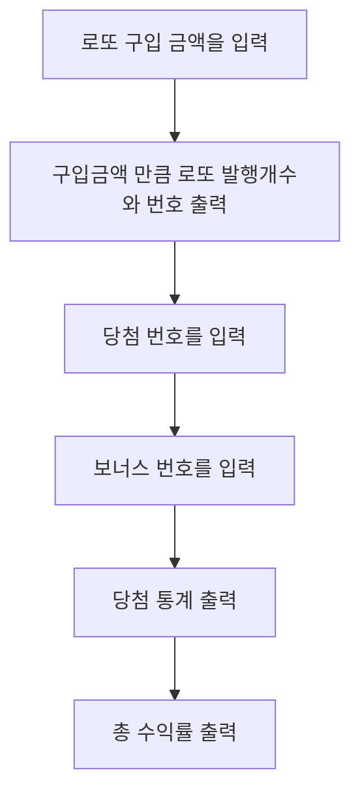

# 🎰︎ 미션 - 로또 (이상준)

---

## 🎮 게임 플로우 차트

---

## 🛠 구현 기능 목록
#### 1. 로또 구입 금액을 입력
- [x] 로또 구입 금액 입력받는다.
  - **예외사항**
  - [x] 아무것도 입력하지 않은 경우.
  - [x] 문자를 입력한 경우.
  - [x] int 범위를 초과한 경우.
  - [x] 0을 입력한 경우.
  - [x] 음수를 입력한 경우.
  - [x] 1000단위로 나누어지지 않는 경우.

#### 2. 구입금액 만큼 로또 발행개수와 번호 출력
- [x] 발행한 로또 개수 구한다.
- [x] 총 발행된 로또 상세 정보를 출력한다.
  - [x] 1 ~ 45 까지 숫자 중 중복되지 않는 6개의 숫자.
  - [x] 오름차순으로 출력.

#### 3. 당첨번호 입력
- [x] 당첨 번호 입력 받는다.
  - [x] 당첨번호는 쉼표(,)를 기준으로 구분한다.
  - **예외사항**
  - [x] 입력이 모두 숫자가 아닌 경우.
  - [x] 아무것도 입력하지 않은 경우.
  - [x] 6개의 숫자가 아닌 경우.
  - [x] 서로 다른 숫자가 아닌 경우.
  - [x] 1 ~ 45까지의 숫자가 아닌 경우.

#### 4. 보너스번호 입력
- [x] 보너스 번호 입력 받는다.
  - **예외사항**
  - [x] 아무것도 입력하지 않은 경우.
  - [x] 문자를 입력한 경우.
  - [x] 1 ~ 45까지의 숫자가 아닌 경우.

#### 5. 당첨 통계 출력
- [x] 3개 일치 ~ 6개 일치까지 당첨내역을 구한다.
- [x] 당첨 통계를 출력한다.

#### 6. 총 수익률 출력
- [x] 당첨 통계를 토대로 총 수익률을 구한다.
- [x] 수익률은 소수점 둘째 자리에서 반올림 한다.
- [x] 수익률을 출력한다.
