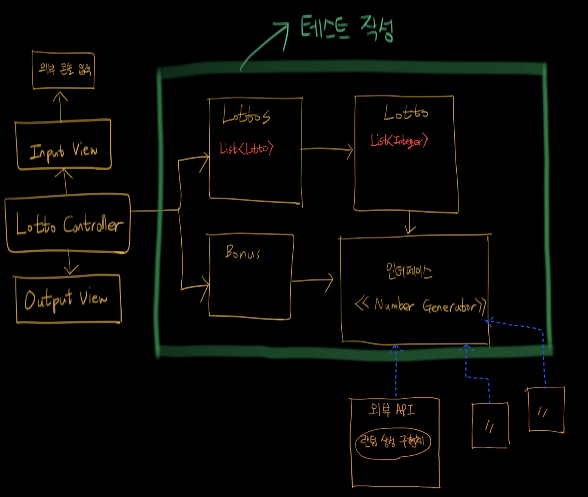

## 객체 관계도 정리

## 요구사항 정리

### Lotto(Class)
- [✅] Lotto를 생성한다.
  - [✅] 예외(IllegalArgumentException) : 로또 숫자는 6자리여야 한다. 
  - [✅] 예외(IllegalArgumentException) : 로또 숫자는 중복될 수 없다.
- [✅] Lotto가 주어지면 일치하는 개수를 구한다.
- [✅] 보너스 금액이 주어지면 일치하는 번호가 있는지 판단한다.
- [✅] LottoDto로 변환한다.

### Lottos(Class)
- [✅] Lottos를 생성한다.
- [✅] 당첨번호와 보너스 번호가 주어지면 모든 로또들 결과를 구한다.
- [✅] List<LottoDto>로 변환한다.

### BonusNumber(Class)
- [✅] 보너스 번호를 생성한다.
  - [✅] 예외(IllegalArgumentException) : 범위는 1 ~45여야 한다.
- [✅] 로또번호가 주어지면 보너스번호가 포함되어있는지 판단한다.

### <<NumberGenerator>> - LottoNumberGenerator(Class)
- [✅] 1 ~ 45번호 6개를 랜덤으로 생성한다.

### LottoResult(Enum)
- [✅] 당첨번호와 보너스 번호를 맞춘 결과에 따라 로또 결과를 생성한다.
- [✅] 값에따라 당첨금을 반환한다.

### StringParser(Class)
- [✅] "1,2,3,4,5,6"형태의 문자열을 List형으로 split한다.

### InputView(Class)
- [✅] 구입 금액을 입력받는다.
  - [✅] 올바른 형태의 값이 들어올때 까지 반복해서 입력받는다.
  - [✅] 올바른 형태의 값이 아니라면 "[ERROR]"로 시작하는 에러 메세지를 출력한다.
- [✅] 당첨 번호를 입력받는다.
- [✅] 보너스 번호를 입력받는다.

### InputValidator(Class)
- [✅] 예외(IllegalArgumentException) : 입력값은 숫자형태여야한다.
- [✅] 예외(IllegalArgumentException) : 입력값은 로또가격으로 나누어지는 형태여야 한다.
- [✅] 예외(IllegalArgumentException) : 입력값은 0보다 커야한다.
- [✅] 예외(IllegalArgumentException) : 입력값은 "1,2,3,4,5,6" 형식이어야 한다.

### OutputView(Class)
- [✅] 구매 개수와 구매한 모든 로또 번호를 출력한다.
  - [✅] 출력할 때 오름차순으로 정렬해서 출력한다.
- [✅] 당첨 통계를 출력한다.
- [✅] 수익률을 출력한다.

### OutputFormatter(Class)
- [✅] 로또들을 출력양식을 만든다.
- [✅] 로또당첨결과 양식을 만든다.
- [✅] 수익률 결과 양식을 만든다.