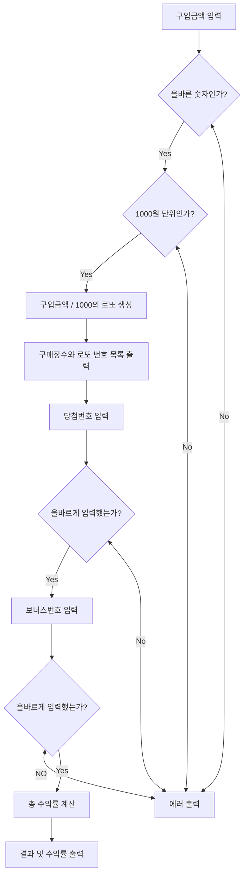
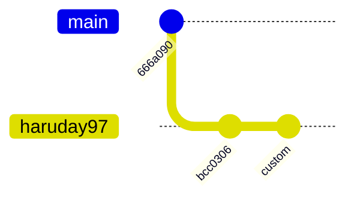

# 기능 명세

## 목차

## Flowchart



## 기능 목록

- 로또 생성 기능
    - 중복하지 않는 숫자 생성 기능
    - 보너스번호 생성 기능
- 당첨 판별 기능
    - 당첨 여부 판별 기능
    - 2등 여부 판별 기능
- 유저 입력 기능
    - 로또 구입 금액 입력 기능
    - 당첨번호 입력 기능
    - 보너스번호 입력 기능
- 출력 기능
    - 발행한 로또 수량 및 번호 출력 기능
    - 당첨내역 출력 기능
    - 수익률 출력 기능

## Gitgraph



## 프로젝트 구조

```
src
  ├─main
  │  └─java
  │      └─lotto
  │          ├─config
  │          │   └─LottoConfig
  │          ├─controller
  │          │   └─LottoController
  │          ├─domain
  │          │   ├──BonusNumber
  │          │   ├──Lotto
  │          │   ├──LottoGenerator
  │          │   ├──LottoResult
  │          │   ├──Lottos
  │          │   ├──Money
  │          │   ├──Prize
  │          │   ├──Quantity
  │          │   ├──RandomLottoGenerator
  │          │   └──WinningLotto
  │          ├─exception
  │          │   ├──Errors
  │          │   ├──FormatException
  │          │   └──LottoException
  │          └─view
  │              ├──InputView
  │              └──OutputView
  └─test
      └─java
          └─lotto
```

## 예외

- 유저입력
    - 로또 구매시
        - [x] 숫자가 아닌 값을 입력했을 경우
        - [x] 1000으로 나누어지지 않을 경우
        - [x] 구매 한도보다 큰 수를 입력했을 경우
    - 당첨번호 입력시
        - [x] 숫자가 아닌 값을 입력했을 경우
        - [x] 입력한 숫자의 개수가 6개가 아닌 경우
        - [x] 범위를 벗어난 수일 경우
        - [x] 중복된 수를 입력했을 경우
    - 보너스번호 입력시
        - [x] 숫자가 아닌 값을 입력했을 경우
        - [x] 입력한 숫자의 개수가 1개가 아닌 경우
        - [x] 범위를 벗어난 수일 경우
        - [x] 당첨번호와 중복된 수를 입력했을 경우
- 로또생성
    - 로또 생성시
        - [x] 중복된 숫자를 생성했을 경우
        - [x] 생성한 숫자의 개수가 6개가 아닌 경우
        - [x] 범위를 벗어난 숫자를 생성했을 경우

## 소감

### 캐싱

현재 코드의 구조는 로또를 생성하면서 랜덤 번호를 추출할 때 Randoms의 pickUniqueNumbersInRange메서드를 매번 호출한다.  
pickUniqueNumbersInRange메서드의 내부에서 다시 최소값에서 최대값까지 반복문을 순환해 list를 만든다음 이를 섞고 0번째 인덱스부터 당첨번호의 갯수만큼의 크기의 list를 반환하는 것으로
보인다.  
이 방식으로는 성능적으로 많은 비용이 들것같다, 대신 시작과 동시에 1부터 45의 숫자를 캐싱한 다음, 범위 내의 숫자 중에서 랜덤한 숫자를 반환하는 식으로 캐싱을 할 수 있을것 같았다.  
그러나 `Random 값 추출은 camp.nextstep.edu.missionutils.Randoms의 pickUniqueNumbersInRange()를 활용한다.` 라는 제약조건이 있어 적용하지 못했다.

### 방어적 복사

프로덕션 코드는 잘 돌아가는데, 아래 테스트에서 UnsupportedOperationException이 발생했다.

```
    @Test
    void 기능_테스트() {
        assertRandomUniqueNumbersInRangeTest(
                () -> {
                    run("8000", "1,2,3,4,5,6", "7");
                    assertThat(output()).contains(
                            "8개를 구매했습니다.",
                            "[8, 21, 23, 41, 42, 43]",
                            "[3, 5, 11, 16, 32, 38]",
                            "[7, 11, 16, 35, 36, 44]",
                            "[1, 8, 11, 31, 41, 42]",
                            "[13, 14, 16, 38, 42, 45]",
                            "[7, 11, 30, 40, 42, 43]",
                            "[2, 13, 22, 32, 38, 45]",
                            "[1, 3, 5, 14, 22, 45]",
                            "3개 일치 (5,000원) - 1개",
                            "4개 일치 (50,000원) - 0개",
                            "5개 일치 (1,500,000원) - 0개",
                            "5개 일치, 보너스 볼 일치 (30,000,000원) - 0개",
                            "6개 일치 (2,000,000,000원) - 0개",
                            "총 수익률은 62.5%입니다."
                    );
                },
                List.of(8, 21, 23, 41, 42, 43),
                List.of(3, 5, 11, 16, 32, 38),
                List.of(7, 11, 16, 35, 36, 44),
                List.of(1, 8, 11, 31, 41, 42),
                List.of(13, 14, 16, 38, 42, 45),
                List.of(7, 11, 30, 40, 42, 43),
                List.of(2, 13, 22, 32, 38, 45),
                List.of(1, 3, 5, 14, 22, 45)
        );
    }
```

```
//기존코드
public Lotto(List<Integer> numbers) {
        Collections.sort(numbers);
        validate(numbers);
        this.numbers = Collections.unmodifiableList(numbers);
}
```

문제는 `Collections.sort(numbers);` 있었다.  
List.of를 통해 생성된 리스트는 불변객체인데, 이를 정렬하려는 시도를 했기에 해당 예외가 발생했던 것이다.  
이를 해결하기 위해 인자로 넘어온 list를 복사한 다음 이를 정렬해서 필드를 할당하는 방식으로 했다.

```
//수정된 코드
    public Lotto(List<Integer> numbers) {
        List<Integer> sortedNumbers = new ArrayList<>(numbers);
        Collections.sort(sortedNumbers);
        validate(sortedNumbers);
        this.numbers = Collections.unmodifiableList(sortedNumbers);
    }
```

나중에 안 것이지만 이를 방어적 복사라고 일컫는 것 같다.  
복사의 종류는 얕은 복사, 깊은 복사, 방어적 복사가 있다.

1. 얕은 복사
    - 객체의 주소값만 복사하는 방식
    - 복사본이나 원본에서 객체 내부의 값을 변경하면 상호간에 영향을 받는다.
2. 깊은 복사
    - 객체를 완전히 복사하는 방식
    - 복사본과 원본은 서로 다른 객체를 참조하므로 상호간에 영향을 미치지 않는다.
3. 방어적 복사
    - 객체의 내부값만 복사하는 방식
    - 사본은 원본과 다른 객체를 참조하지만 객체 내부의 객체는 원본과 동일한 주소를 참조한다.
    - 비유하자면 금붕어를 A어항에서 B어항 옮기는거에 비유할 수 있겠다, 컬렉션을 복사하는 경우 유용하다.

왜 방어적 복사라고 부르나? -> 추측컨대 데이터 무결성을 보호하기 위해 방어라는 워딩을 사용하지 않았나 싶다.

### 아쉬운 점

#### try catch문의 활용

요구사항에는 에러가 발생하면 예외를 발생시키되 해당 부분부터 입력을 다시 받아야한다는 요구사항이 있었다.  
그동안 예외가 발생하면 프로그램을 그냥 종료시키는 식으로만 구현했어서 꽤 생소했고 어려웠다.  
어려웠다는 의미는 구현이 어려웠다는 뜻이 아니라 코드를 어떤식으로 리팩토링해야할지 감이 잡히지 않았다는 의미다.  
코드는 거의 유사하나 다시 해당 메서드를 실행해야한다는 점이 발목을 잡았다.

```
    private Money parseIntToMoney() {
        Money parsedMoney;
        while (true) {
            try {
                parsedMoney = new Money(input.printAskingBudget());
                break;
            } catch (LottoException e) {
                System.out.println(e.getMessage());
            }
        }
        return parsedMoney;
    }
    private Lotto parseListToLotto() {
        Lotto parsedLotto;
        while (true) {
            try {
                parsedLotto = new Lotto(input.printAskingWinningNumbers());
                break;
            } catch (LottoException e) {
                System.out.println(e.getMessage());
            }
        }
        return parsedLotto;
    }
    private BonusNumber parseIntToBonusNumber(Lotto winningNumbers) {
        BonusNumber parsedBonusNumber;
        while (true) {
            try {
                parsedBonusNumber = new BonusNumber(input.printAskingBonusNumber(), winningNumbers);
                break;
            } catch (LottoException e) {
                System.out.println(e.getMessage());
            }
        }
        return parsedBonusNumber;
    }
```

이번과제의 경우 view에도 예외처리를 했다.  
저번 과제를 진행하고 view에도 유저로부터 들어온 입력값자체를 검증하는 책임정도는 부여하는 편이 좋다고 느꼈기 때문이다.

```
    public int printAskingBudget() {
        int budget;
        System.out.println(MSG_ASKING_BUDGET);
        while (true) {
            try {
                budget = Integer.parseInt(getUserInput());
                break;
            } catch (NumberFormatException e) {
                FormatException formatException = Errors.INVALID_NOT_NUMBER.getFormatException();
                System.out.println(formatException.getMessage());
            }
        }
        return budget;
    }
        public List<Integer> printAskingWinningNumbers() {
        List<Integer> winningNumbers;
        System.out.println(MSG_ASKING_WINNING_NUMBERS);
        while (true) {
            try {
                winningNumbers = parseStringToList(getUserInput());
                break;
            } catch (NumberFormatException e) {
                FormatException formatException = Errors.INVALID_NOT_NUMBER.getFormatException();
                System.out.println(formatException.getMessage());
            }
        }
        return winningNumbers;
    }
        public int printAskingBonusNumber() {
        int bonusNumber;
        System.out.println(MSG_ASKING_BONUS_NUMBER);
        while (true) {
            try {
                bonusNumber = Integer.parseInt(getUserInput());
                break;
            } catch (NumberFormatException e) {
                FormatException formatException = Errors.INVALID_NOT_NUMBER.getFormatException();
                System.out.println(formatException.getMessage());
            }
        }
        return bonusNumber;
    }
```

이번 과제에서 가장 아쉽고 후회스러운 부분은 이 부분이 아닐까 싶다.

#### enum을 이용한 if문 처리

enum을 이용해 if문을 없애지 못했다.  
분기할 조건이 많아질수록 if문이 많아지므로 아래 같은 코드는 한계가 있다고 지난 회차 과제부터 느꼈다.

```
        if (numbers.size() != LottoConfig.MAX_BALLS) {
            throw Errors.INVALID_SIZE.getLottoException();
        }
        if (hasDuplicatedNumbers(numbers)) {
            throw Errors.INVALID_DUPLICATED.getLottoException();
        }
        if (hasNumberOutOfRange(numbers)) {
            throw Errors.INVALID_RANGE.getLottoException();
        }
        if (isNotSorted(numbers)) {
            throw Errors.INVALID_SORTING.getLottoException();
        }
    }
```

enum을 활용한다면 대충 아래같은 그림으로 예외를 처리할 수 있는 느낌(?)이 들었었다.

``` 
    // Lotto
    private void validate(List<Integer> numbers) {
        Errors.validate(numbers);
    }
    
    // Errors
    public static validate(List<Integer> numbers) {
        doSomething();
    }    
```

그런데 검색을 해봐도 사실 잘 모르겠더라, 그냥 enum조차도 이번 과제에서 처음써봐서 어렵다고 느꼈다.  
기한은 지켜야 하기에 그냥 그대로 냈다.

### 오버 엔지니어링에 대한 고찰

지난 주 과제 코드를 리뷰하면서 가장 인상에 남았던 분은, 요구사항이 변경될 것을 고려해 설계를 방대하게 한 분이었다.  
전략패턴과 추상클래스, 인터페이스 등 온갖 개념을 한 곳에 모아놓은 코드였는데, 당시에는 감탄했던 기억이 있다.  
트레이드 오프로 코드의 흐름과 의도를 파악하는게 쉽지 않았다. 사실 전부 이해하진 못했었다.

아무튼 이를 본받아 이번 주차에 들어가기 전, '나도 변화에 유연하게 대응 가능한 코드를 짤테야' 라는 생각을 했다.  
그런데 확장성에 대한 기준을 두기가 애매했다, 어디까지의 확장을 고려해야 하는가?  
만약 토토, 스피또, 연금복권이 추후에 생길 가능성을 고려한다면?  
이들의 로직은 기존의 로또 로직과 완벽히 호환된다고 단언할수 있는가?

연금복권의 경우 조번호와 6자리 번호가 총 7개의 번호가 자릿수까지 전부 맞아야 1등에 당첨된다.  
조는 1부터 5까지 있으며, 중복된 번호의 복권은 발행이 불가능하다.  
스포츠토토의 경우 좀 더 복잡하다. 토토는 베팅을 할 스포츠의 종류, 점수 스코어, 배당률 등을 고려해야 한다.

확장성은 복권의 종류만 국한하지 않고 여러가지 고려할 수 있다.  
가령 결제를 한국의 원화가 아닌 토큰, 가상화폐, 미국 달러화, 일본 엔화를 받을 수도 있고, 어느 외국 복권의 경우 보너스번호는 당첨번호와 같을 수 있다.  
유명한 미국의 파워볼의 경우, 1 ~ 69까지의 당첨번호 5개, 1 ~ 26 사이의 파워볼(보너스번호) 하나를 맞히면 1등이고, 기존의 복권 가격에 1달러를 추가하면 기존 당첨금의 최대 10배까지 수령이 가능하다.

#### 결론

`어디까지의 확장을 고려하는가?`에 대한 기준을 명확히 세우는게 중요한 듯 싶다.  
수제치킨을 오토바이로 동네에 배달하는 프로그램을 만들었다고 가정하자, 프로그램이 인기를 끌면서 사용자는 전국으로 퍼져나갔다.  
장거리에서 주문하는 사용자가 있어 오토바이로 배달이 어렵다 판단되면 해당 사용자에게는 자동차로 배달하는 로직의 추가를 고려할 수 있다.  
혹은 지하철을 타고 간다던가, 비행기를 타고 간다던가, 비행기편이 없어 배를 타고 가야한다던가, 현재엔 개념조차 존재하지 않는 머나먼 미래의 이동수단을 타고 간다던가, 그럴일은 없겠지만 심지어는 로켓에
탑승해 우주 정거장으로 치킨을 배달하는 상황까지 고려해봄직하다.  
만약 인기를 끌 것을 예상하고 위 모든 상황을 고려해 프로그램을 설계했다면 적은 양의 코드 추가만으로 끝날 것이다.

그러나 만에 하나 어플리케이션이 인기를 끌지 못해 그저 동네에서나 이따금씩 쓰인다면?  
수많은 추상화와 클래스가 유명무실해지고, 타인으로 하여금 코드 파악만 힘들게하는 냄새나는 코드가 될 것이다.  
인기를 끌 때까지는 좋은 코드와 나쁜 코드가 프로그램내에서 중첩된 상태로 공존하는, 이른바 슈뢰딩거의 코드가 될 뿐이다.

나는 `변경될 가능성이 높거나 예견된 부분`에 대해서만 고려하기로 결정했다.  
주어진 과제의 요구사항을 읽고 판단했을 때 그나마 해당되는 부분은 뽑는 번호의 범위, 뽑는 공의 갯수 정도로만 국한했다.  
설계는 확장성을 얻으면 가독성을 희생하며, 가독성을 얻으면 확장성을 희생하는 등가교환에서 결코 자유로워질 수 없다.  
확장성을 고려한 설계를 지향하되 오버 엔지니어링에 대한 경계는 잊지 않길 다짐한다.  
       