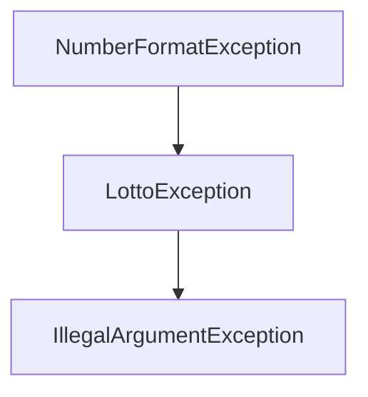

<div align="center">

[%20-%20변해빈&fontSize=40&fontAlign=50&fontAlignY=33&descSize=20&descAlign=50&descAlignY=55)](https://github.com/h-beeen/java-lotto-6/blob/h-beeen/docs/README.md)

</div>

---

## 📦&nbsp;&nbsp;패키지 구조

[//]: # (&nbsp;&nbsp;FinalResponse</b>)

<div align="center">
<table>
    <tr>
        <th align="center">Package</th>
        <th align="center">Class</th>
        <th align="center">Description</th>
    </tr>
    <tr>
        <td rowspan="5"><b>&nbsp;&nbsp;controller</b></td>
        <td><b>&nbsp;&nbsp;BuyerController</b></td>
        <td>구입 금액 입/출력(View) ↔️ Buyer (Model)</td>
    </tr>
    <tr>
        <td><b>&nbsp;&nbsp;FinalResultController</b></td>
        <td>FinalResults 객체를 바탕으로 최종 결과 산출 요청 및 출력</td>
    </tr>
    <tr>
        <td><b>&nbsp;&nbsp;LottoMainController</b></td>
        <td>게임 로직을 메인으로 동작하는 컨트롤러</td>
    </tr>
    <tr>
        <td><b>&nbsp;&nbsp;PrizeController</b></td>
        <td>당첨 번호, 보너스 번호 입/출력(View) ↔️ Prize (Model)</td>
    </tr>
    <tr>
        <td><b>&nbsp;&nbsp;PurchaseController</b></td>
        <td>Buyer 객체를 바탕으로 로또 구매 요청 및 출력</td>
    </tr>
    <tr><td colspan="3"></td></tr>
    <tr>
        <td rowspan="4">&nbsp;&nbsp;<b>domain<br></b>&nbsp;&nbsp;lottery</td>
        <td><b>&nbsp;&nbsp;Buyer</b></td>
        <td>구입 금액과 로또 구입 갯수를 갖는 클래스</td>
    </tr>
    <tr>
        <td><b>&nbsp;&nbsp;Lotto</b></td>
        <td>로또의 숫자들을 List 일급 컬렉션 클래스</td>
    </tr>
    <tr>
        <td><b>&nbsp;&nbsp;Lottos</b></td>
        <td>구입한 로또들을 갖는 List 일급 컬렉션 클래스</td>
    </tr>
    <tr>
        <td><b>&nbsp;&nbsp;NumberChecker</b></td>
        <td>Prize, Lotto의 공통 검증 요건에 대한 추상 클래스</td>
    </tr>
    <tr>
        <td>&nbsp;&nbsp;constants</td>
        <td><b>&nbsp;&nbsp;LottoConstraint</b></td>
        <td>로또 게임에 필요한 전역 제약조건 열거형 클래스</td>
    </tr>
    <tr><td colspan="3"></td></tr>
    <tr>
        <td rowspan="5">&nbsp;&nbsp;<b>domain<br></b>&nbsp;&nbsp;prize</td>
        <td><b>&nbsp;&nbsp;FinalResults</b></td>
        <td>최종 로또 등급/갯수를 갖는 EnumMap 일급 컬렉션 클래스</td>
    </tr>
    <tr>
        <td><b>&nbsp;&nbsp;MatchingResult</b></td>
        <td>로또의 PrizeMatchingCount와,<br>보너스 번호 매칭 여부를 갖는 클래스</td>
    </tr>
    <tr>
        <td><b>&nbsp;&nbsp;MatchingResults</b></td>
        <td>로또들의 PrizeMatchingCount와,<br>보너스 번호 매칭 여부를 갖는 List 일급 컬렉션 클래스</td>
    </tr>
    <tr>
        <td><b>&nbsp;&nbsp;Prize</b></td>
        <td>당첨 로또 번호와, 보너스 번호를 갖는 클래스</td>
    </tr>
    <tr>
        <td><b>&nbsp;&nbsp;Revenue</b></td>
        <td>로또 결과로 얻은 수익과 수익률을 갖는 클래스</td>
    </tr>
    <tr>
        <td rowspan="2">&nbsp;&nbsp;constants</td>
        <td><b>&nbsp;&nbsp;PrizeGrade</b></td>
        <td>당첨 등급 별 prizeMatchingCount, 보너스 매칭 조건 검증,<br>당첨 금액을 갖는 열거형 클래스</td>
    </tr>
    <tr>
        <td><b>&nbsp;&nbsp;PrizeMatchingCount</b></td>
        <td>상품의 매칭 횟수를 갖는 열거형 클래스</td>
    </tr>
    <tr><td colspan="3"></td></tr>
    <tr>
        <td rowspan="3">&nbsp;&nbsp;<b>dto</b></td>
        <td><b>&nbsp;&nbsp;FinalResultResponse</b></td>
        <td>최종 수익률을 전달하는 DTO 레코드/td>
    </tr>
    <tr>
        <td><b>&nbsp;&nbsp;LottoNumberResponse</b></td>
        <td>구매한 로또의 번호를 전달하는 DTO 레코드</td>
    </tr>
    <tr>
        <td><b>&nbsp;&nbsp;LottoNumberResponses</b></td>
        <td>구매한 로또들의 번호를 전달하는 DTO 레코드</td>
    </tr>
    <tr><td colspan="3"></td></tr>
    <tr>
        <td rowspan="2"><b><b>&nbsp;&nbsp;exception</b></td>
        <td><b>&nbsp;&nbsp;ErrorMessage</b></td>
        <td>예외를 던질 때 사용되는 에러 메세지 열거형 클래스</td>
    </tr>
    <tr>
        <td><b>&nbsp;&nbsp;LottoException</b></td>
        <td>전역에서 에러를 핸들링하는 Custom Exception</td>
    </tr>
    <tr><td colspan="3"></td></tr>
    <tr>
        <td rowspan="3">&nbsp;&nbsp;<b>service</b></td>
        <td><b>&nbsp;&nbsp;FinalResultService</b></td>
        <td>최종 결과를 담은 EnumMap을 컬렉션 생성하는 서비스</td>
    </tr>
    <tr>
        <td><b>&nbsp;&nbsp;LottoService</b></td>
        <td>자동 로또 숫자를 생성하는 서비스</td>
    </tr>
    <tr>
        <td><b>&nbsp;&nbsp;Parser</b></td>
        <td>문자형 입력을 정수형, List형으로 파싱하는 서비스</td>
    </tr>
    <tr><td colspan="3"></td></tr>
    <tr>
        <td rowspan="1"><b>&nbsp;&nbsp;view<br></b>&nbsp;&nbsp;input</td>
        <td><b>&nbsp;&nbsp;InputReader</b></td>
        <td>표준 입력을 담당하는 클래스</td>
    </tr>
    <tr>
        <td rowspan="3"><b>&nbsp;&nbsp;view<br></b>&nbsp;&nbsp;output</td>
        <td><b>&nbsp;&nbsp;FinalResultWriter</b></td>
        <td>FinalResponse를 활용해 결과를 출력하는 클래스</td>
    </tr>
    <tr>
        <td><b>&nbsp;&nbsp;OutputWriter</b></td>
        <td>표준 출력을 담당하는 클래스</td>
    </tr>
    <tr>
        <td><b>&nbsp;&nbsp;PurchaseWriter</b></td>
        <td>LottoNumberResponses를 활용해 결과를 출력하는 클래스</td>
    </tr>
    <tr>
        <td rowspan="4"><b>&nbsp;&nbsp;view<br></b>&nbsp;&nbsp;constants</td>
        <td><b>&nbsp;&nbsp;PrintablePrizeGrade</b></td>
        <td>전체 등급 중, 사용자에게 결과로 출력할 등급을 갖는 열거형 클래스</td>
    </tr>
    <tr>
        <td><b>&nbsp;&nbsp;PrintFormat</b></td>
        <td>소수와, 정수의 구두점 표시에 대한 제약조건을 갖는 열거형 클래스</td>
    </tr>
    <tr>
        <td><b>&nbsp;&nbsp;PrintMessage</b></td>
        <td>사용자에게 출력할 메세지를 담은 열거형 클래스</td>
    </tr>
    <tr>
        <td><b>&nbsp;&nbsp;PrizeResultFormat</b></td>
        <td>보너스 볼 매칭 여부에 따라 분기하는<br>출력 메세지를 담은 열거형 클래스</td>
    </tr>
    <tr><td colspan="3"></td></tr>
    <tr><th colspan="3">Project Test Result</th></tr>
    <tr>
      <td colspan="3"></td>
    </tr>
    <tr>
      <td colspan="3"></td>
    </tr>
</table>
</div>

<br>

---

## ✨&nbsp;&nbsp;구현 목록

### 1️⃣ Non-Functional Requirement

<br>

+ [X] 로또 프로그램은 [MVC 패턴]("https://ko.wikipedia.org/wiki/%EB%AA%A8%EB%8D%B8-%EB%B7%B0-%EC%BB%A8%ED%8A%B8%EB%A1%A4%EB%9F%AC")에 따라 설계한다.
+ [X] 로또의 세부 조건이 바뀔 것이라 기대되지는 않지만, [YAGNI]("https://ko.wikipedia.org/wiki/YAGNI") 원칙에 의거해, 필요 구현 요소를 구현하는 것을 목표로 한다.

<br>

### 2️⃣ Functional Requirement (Controller Code Flow)

+ [X] [Application.main] LottoMainController.start()
+ [X] [start] BuyerController.requestPayment()를 호출
  * [OutputWriter] 사용자에게 `REQUEST_PURCHASE_PAYMENT("구입금액을 입력해주세요.")` 구입 금액 메세지 출력
  * [InputWriter] 사용자에게 `구입 금액을 입력` 요청
  * [Parser] parseStringToInt 메소드로 입력받은 구입 금액을 `int` 형으로 파싱
    * `<Exception>` 구입 금액에 whiteSpace가 포함되어 있다면 예외처리
      
    * `<Exception>` 구입 금액이 정수가 아니라면 예외처리
      
  * [BuyerController] 사용자에게 입력 받은 금액을 Buyer 객체 생성자를 호출해 생성 요청
  * [Buyer] 구입 금액 정수값을 인자로 `from 정적 팩토리 호출`
    * `<Exception>` 구입 금액이 로또 단위 당 가격(Default : 1,000) 미만이라면 예외처리
      
      
    * `<Exception>` 구입 금액이 1회 최대 구입 가격(Default : 10,000,000)을 초과한다면 예외처리
      
    * `<Exception>` 구입 금액이 로또 단위 당 가격으로 나누어 떨어지지 않는다면 예외처리
      
    * 검증된 구입 금액을 바탕으로, `구매 장수를 계산해 객체로 생성`

+ [X] [start] PurchaseController.purchase(buyer)를 호출
  * [PurchaseController] Buyer 객체의 ticketCount를 기준으로, Lottos 객체를 생성
  * [Lottos] ticketCount를 인자로, LottoService.generateLottos를 호출해 로또 리스트 lottos를 만든다.
  * [LottoService] 요청된 티켓 수 만큼 로또 제약조건에 맞게 랜덤 수 조합을 만들고, 이를 로또 리스트로 반환한다.
  * [LottoNumberResponse] 파라미터로 받은 buyer 객체와, 생성한 lottos를 바탕으로 응답 Dto를 생성한다.
  * [PurchaseWriter] 형식에 맞게 구매 장수와, 각 로또의 생성 번호를 출력한다.
+ [X] [start] PrizeController.requestPrizeNumbers()를 호출
  * [PrizeController] 사용자에게 `REQUEST_PRIZE_NUMBER("당첨 번호를 입력해주세요."),`
    구입 금액 메세지 출력 요청
  * [InputReader] 사용자에게 `당첨 번호 입력` 요청
  * [Parser] splitByDelimiter 메소드로, 요청한 당첨 번호 문자열을 `, (COMMA)` 기준으로 파싱하고 `List<Integer>`로 반환
    * `<Exception>` 당첨 번호 문자열에 whiteSpace가 포함되어 있다면 예외처리
      
    * `<Exception>` 당첨 번호 문자열이 `, (COMMA)` 로 끝나는 경우 예외처리
      
    * `<Exception>` `, (COMMA)` 로 파싱한 각 문자열이 숫자가 아닐 경우 예외처리
      
  * [PrizeController] 파싱된 `List<Integer>` numbers를 기준으로, Lotto 객체를 생성
  * [Lotto] numbers를 인자로 new 생성자를 통해 객체 생성
    * `<Exception>` 리스트 내부 숫자의 갯수가 제약조건(Default: 6)이랑 일치하지 않는다면 예외처리
      
      
    * `<Exception>` 리스트 내부 각 숫자의 갯수가 제약조건(Default: 1 ~ 45)이랑 일치하지 않는다면 예외처리
      
    * `<Exception>` 리스트 내부에 중복되는 숫자가 존재할 경우 예외처리
      
  * [InputReader] 사용자에게 `보너스 번호 입력 요청`
  * [Parser] parseStringToInt 메소드로 입력받은 구입 금액을 `int` 형으로 파싱
    * `<Exception>` 보너스 번호에 whiteSpace가 포함되어 있다면 예외처리
      
    * `<Exception>` 보너스 번호가 정수가 아니라면 예외처리
      
  * [PrizeController] 사용자에게 입력 받은 보너스 번호와, 검증된 prizeNumbers 객체를 인자로
  Prize 객체 생성자를 호출해 생성 요청
  * [Prize] Lotto와 bonusNubmer를 인자로 객체를 생성한다.
    * `<Exception>` 보너스 숫자가 제약조건(Default: 1 ~ 45)이랑 일치하지 않는다면 예외처리
      
    * `<Exception>` 보너스 숫자가 기존에 뽑았던 당첨 번호랑 중복된다면 예외처리
      
+ [X] [start] FinalResultController.generateFinalResult() 호출
  * [FinalResultController] 사용자의 Lottos와 당첨 객체 Prize를 바탕으로 MatcingResults 객체 생성
  * [MatchingResults] MatchingResults 객체를 기준으로 당첨 등급별 갯수를 담은 EnumMap 컬렉션 생성
  * [FinalResultController] 최종적으로 당첨된 등급과 갯수를 담은 EnumMap 컬렉션 리턴
+ [X] [start] FinalResultWriter.responseMatchingResult(finalResultResponse)를 통해 최종 응답 출력
+ [X] [start] FinalResultWriter.responseTotalYield(finalResultResponse)를 통해 최종 수익률 응답 출력
+ [X] [Application] `Console.close` 메소드를 호출해 Scanner.close
  <br>

--------------------------------------------------------

## 🆘&nbsp;&nbsp;고민의 흔적

### 1️⃣&nbsp;&nbsp;&nbsp;Domain과 Service 계층의 책임

- [DDD](https://ko.wikipedia.org/wiki/%EB%8F%84%EB%A9%94%EC%9D%B8_%EC%A3%BC%EB%8F%84_%EC%84%A4%EA%B3%84) 방식으로 개발하면서, Domain과 Service Layer간 구분이 모호하다고 느꼈습니다.
- 현재 getter 없는 구조를 지향하면서, 도메인 로직의 책임을 강화하고, 도메인의 멤버변수를 사용하지 않는 부분을 Service로 분리했습니다.
- 해당 기준으로 설계한 구조가 올바르게 분리되었는지 리뷰를 받아보고 싶습니다.

### 2️⃣&nbsp;&nbsp;&nbsp;Dto 계층의 책임

- 지난 리뷰에서, 도메인이 Dto 변환 로직을 갖고 있는 것에 대해 적절하지 못하다는 리뷰를 받았습니다.
- 이번 코드에서 Dto 변환 로직의 책임이 적절한지 리뷰를 받고 싶어요 :)

### 3️⃣️&nbsp;&nbsp;&nbsp;싱글톤 구조 VS Static Method 활용

- 1, 2주차에도 그래왔듯 컨트롤러 Layer에서 싱글톤을 활용하지 않고,
Static Method를 활용해 각 컨트롤러의 정적 메소드를 사용하는 방식으로 활용했어요.
- 코드리뷰를 진행하면서 많은 분들이 싱글톤 구조로 설계하는 것을 많이 보았는데요. 
여러분은 이번 과제에서 어떤 구조가 더 적절하다고 생각하시나요?
- 캡슐화, 다형성을 해친다는 이야기도 있고, 전역 접근할 필요도 없는데 View 메서드를 정적으로 선언하는 것이 과연 좋은 설계일까요!!?

---------------------------------------------------------

## 👬&nbsp;&nbsp;70명과 함께한 520개의 소중한 코드리뷰 적용기

- [1주차 숫자 야구 Pull Request](https://github.com/woowacourse-precourse/java-baseball-6/pull/1613)
  - 1주차에서 받은 리뷰로 2주차에서는 아래 사항 고민하고 적용할 수 있었어요!
  > 0x00. 어떤 객체가 기능들을 할당하는지도 같이 리드미에 명시되어 있으면 좋을 것 같다.
      0x01. 검증 메소드에서 긍정 조건을 사용하는게 가독성에 좋다.
      0x02. 컨벤션이 없는 상황에서 정적 팩토리 메소드 사용은 혼선을 가져올 수 있다.
      0x03. MVC 패턴에서 모델에서 뷰의 정보를 알아서는 안 된다.
      0x04. 일부 접근지정자가 세밀하게 조정되지 않았다.
      0x05. Open-Closed Principle vs YAGNI
      0x06. Flag 네이밍은 boolean의 의미가 강하다. 정수는 다른 네이밍이 필요하다.
      0x07. 클래스 내부 함수의 선언 순서가 세밀하게 조정될 필요가 있다.
      0x08. 커스텀 예외 선언은 정적 팩토리 메소드보다, 직접 선언하는게 정확하다.
      0x09. Protected 생성자 vs Private 생성자
      0x0a. 조건에 따라 분기하는 것은 검증(Validator)계층이 아니다.
- [2주차 숫자 야구 Pull Reqeust](https://github.com/woowacourse-precourse/java-racingcar-6/pull/356)
  - 지난 리뷰에서 **좋은 활용 법이라 생각되어 활용한 부분과, 아쉽다고 리뷰를 받은 부분**을 아래와 같이 반영하고자 노력했습니다.

<table>
    <tr>
        <th align="center">Review</th>
        <th align="center">Reviewers</th>
    </tr>
    <tr><td colspan="3"></td></tr>
    <tr>
        <td>0x00. 메소드 파라미터를 final로 선언하면 어떤 이점이 있을까?</td>
        <td><b>@IMWoo94</b></td>
    </tr>
      <tr>
        <td>0x01. Static Import를 과하게 사용해, 코드를 읽는데 혼선이 생긴다.</td>
        <td><b>@DonggeonMoon</b></td>
    </tr>
      <tr>
        <td>0x02. Primitive Type Vs Wrapper Class</td>
        <td><b>@JaeHongDev,<br>@developerhongjulee,<br>@IMWoo94,<br>@wooteco-daram</b></td>
    </tr>
      <tr>
        <td>0x03. 도메인과 Dto의 의존성 끊어내기</td>
        <td><b>@JaeHongDev,<br>@Arachneee</b></td>
    </tr>
      <tr>
        <td>0x04. Exception을 try-catch할 때, catch한 Exception도 같이 처리하면 좋다!</td>
        <td><b>@june-777</b></td>
    </tr>
      <tr>
        <td>0x05. Enum의 극한 활용! 조건과 검증 기능까지 수행해보기</td>
        <td><b>@DonggeonMoon,<br>@JaeHongDev</b></td>
    </tr>
</table>

<br>

---

#### 🌱 0x00 `메소드 파라미터를 final로 선언하면 어떤 이점이 있을까?`

> `Primitive type` 은 주소가 아닌 값을
메모리 상에 가지고 있기 때문에 `불변의 기능이 제대로 활용`이 됩니다.
다만, `Reference type` 은 주소값을 메모리 상에 가지는 것이므로 
주소는 불변이지만 주소 값을 이용해 객체의 상태는 
바꿀 수 있는 상황이 될 수 있으므로 생각한 `불변의 기능이 아니다`.

**[@IMWoo94 2주차 코드리뷰 중 발췌 후 정리](https://github.com/woowacourse-precourse/java-racingcar-6/pull/356#discussion_r1379566904)**

- primitive Type에 대해서는 final을 통해 불변 기능을 보장하고,
Reference Type에 대해서는 불필요한 final 인자를 제거하는 방향으로 설계했습니다!
좋은 레퍼런스를 소개시켜주신 @IMWoo94님 감사드립니다.

---

#### 🌱 0x01 `Static Import를 과하게 사용해 코드를 읽는데 혼선이 생긴다.`

- 기존에 조금은 기준없이 사용하던 Static Import에 아래와 같은 컨벤션을 개인적으로 정의해 활용했습니다.
  |  Type  |               Description              |
  |:--------:|:------------------------------:|
  |   Enum   |  enum.getMessage()와 같이 단순 호출 부분에서 Enum Static Import     |
  |   Assertions   | assertJ와 JUnit5 메소드에 대해 Static Import     |

- 해당 부분을 제외하고는 static Import를 피하면서 직관적인 설계를 지향했습니다.

---

#### 🌱 0x02 `Primitive Type Vs Wrapper Class`

> primitive type 과 Wrapper type 의 경우 상황에 따라 바뀔 수 있는 설계 인거 같습니다.
  꼭 누가 좋다/나쁘다 를 나누기보다는 사용처에 따라 혹은 값이 주소인지 실제 값인지 
  이러한 것들을 알고 계시는게 더 정확하게 판단하여 적절한 사용을 할 수 있을거 같습니다.
  int 타입과 Integer 타입을 예시로 기본 타입의 경우 초기화 값이 필수로 처리가 되므로
  API 연계 시 해당 값이 null 이 아닌 초기화 된 "0" 값으로 전달될 수 있지요.
  다만 "0"이라는 값도 무언가에 대한 정보를 전달하고 
  실제 데이터를 식별하는데 사용되는 것이라면 무작정 "0" 을 보낼 수 없겟지요.
  
  > 이러할때 래퍼타입이나 객체타입의 null 을 가지는 점을 이용해 
  데이터가 없음을 나타낼 수 있을 겁니다.
  이거는 각각의 상황에 따라 달라질 수 있는 내용이라 
  정확한 답이 없지 않을가 싶습니다.

**[@IMWoo94 2주차 코드리뷰 중 발췌 후 정리](https://github.com/woowacourse-precourse/java-racingcar-6/pull/356#discussion_r1379566904)**

> 저도 래퍼 클래스를 언제 사용할까, 고민을 해봤어요!
  래퍼 클래스를 사용한다는 건, '참조형' 으로 사용하겠다는 말과 동일합니다.
  값이 Null 을 가져야할 때 사용할 수 있다고 생각했어요.
  하지만, 이 역시 Optional 이란 객체로 감쌀 수 있고, 
  더 명확하게 표현해서 큰 이점은 없을 것 같더라고요.
  참조형이다 보니 관리를 하지 못하면 NPE 같은 문제도 있을 수 있고요..!

**[@wooteco-darm 2주차 코드리뷰 중 발췌 후 정리](https://github.com/woowacourse-precourse/java-racingcar-6/pull/356#discussion_r1379387734)**

- 그동안 primitive type과 래퍼 타입에 대한 명확한 구분 없이 사용했던 점에 대해서 반성했어요!
- 현재 java 환경에서 구동하는 환경에서 Null 값을 갖는 Integer형을 상수로 선언해서 사용할 필요성을 느끼지 못 했고
이번 과제에서는 이 부분을 면밀히 고려해, 변수 선언 하나하나 신중하게 사용했습니다!

---

#### 🌱 0x03 `도메인과 Dto의 의존성 끊어내기`

- 지금까지 Getter 사용을 지양한다는 이유로, 도메인에서 Dto 생성 로직을 설계했어요.
- Dto를 생성하는 과정에서 도메인을 의존하게 되었고, 이 의존성을 끊기 위해, 부득이 getter를 활용해
Dto에서 직접 도메인을 파라미터로 받아, Dto Response를 생성하는 방식으로 개선했습니다.

---

#### 🌱 0x04 `Exception을 try-catch할 때, catch한 Exception도 같이 처리하면 좋다!`

- try-catch문을 통해, 예외를 잡고, 해당 예외를 모두 LottoException으로 전역에서 핸들링하는 과정에서
LottoException이 상위 Exception에 하위 Exception도 전달할 수 있도록 정적 팩토리 메소드를 개선했습니다.

```java
    private LottoException(
            ErrorMessage errorMessage,
            Exception exception
    ) {
        super(errorMessage.getMessage(), exception);
    }

    private LottoException(ErrorMessage errorMessage) {
        super(errorMessage.getMessage());
    }

    public static LottoException of(
            ErrorMessage errorMessage,
            Exception exception
    ) {
        return new LottoException(errorMessage, exception);
    }

    public static LottoException from(ErrorMessage errorMessage) {
        return new LottoException(errorMessage);
    }
```

- 하위 예외를 catch해서 LottoException으로 던지는 경우 `of`를 활용하고
예외 상황을 LottoException으로 핸들링 하는 경우 `from` 메소드를 활용합니다.



- NumberFormatException이 발생하면 해당 예외를 포함해 LottoException에 위임합니다.
- LottoException이 발생하면 해당 예외 메세지와 하위 예외를 IllegalArgumentException에 위임합니다.

--- 

#### 🌱 0x05 `Enum의 극한 활용! 조건과 검증 기능까지 수행해보기`

> [Exception을 생성할 때 Enum 내부에서 Exception을 발생시키기](https://github.com/cheese10yun/spring-guide/blob/master/docs/exception-guide.md) @JaeHongDev
[Enum을 사용한 상수값 관리](https://medium.com/webeveloper/enum%EC%9D%84-%EC%82%AC%EC%9A%A9%ED%95%9C-%EC%83%81%EC%88%98%EA%B0%92-%EA%B4%80%EB%A6%AC-a3e3fb73eae1) @DonggeonMoon
[Enum 활용사례 3가지](https://jojoldu.tistory.com/137) @DonggeonMoon

- 이번에 활용한 내 친구 `enum`을 소개합니다.

```java
public enum PrizeGrade {
        HIT_SIX(
                SIX,
                always -> true,
                2_000_000_000
        ),
        HIT_FIVE_AND_BONUS(
                FIVE,
                keep -> keep,
                30_000_000
        ),
        HIT_FIVE(
                FIVE,
                reverse -> !reverse,
                1_500_000
        );

  private final PrizeMatchingCount prizeMatchingCount;
  private final UnaryOperator<Boolean> matchingBonus;
  private final int prizeAmount;
```

- 사용자가 상품 번호를 맞춘 갯수가 같은 `HIT_FIVE`, `HIT_FIVE_AND_BONUS`
케이스를 구분하는 로직을 짜는데 굉장히 많은 시간을 쏟았어요.
- EnumMap을 활용해 최종 결과를 산출하기 때문에, Enum에서 검증과 구현을 마치고 싶었어요!
(무엇보다 if문 덕지덕지 하면서 분기하기는 너무 싫었고, 로또 번호가 10000개라면? 끔찍;)
- Enum 자체가 `UnaryOperator`를 통해 boolean 검증 람다문을 갖도록 설계하면서 해결했습니다!
  - 보너스와 무관하게 산출하는 케이스 `always -> true`
  - bonus가 true여야만 할 때 케이스 `keep -> keep`
  - bonus가 false여야만 할 때 케이스 `reverse -> !reverse`

```java
public class FinalResults {
    private final EnumMap<PrizeGrade, Integer> finalResults;
```

- 최종 결과도 Grade를 Key로, 해당 Grade의 갯수를 Value로 만들면서 예쁜 일급 컬렉션도 구현할 수 있었어요!
- 다만, 이 부분에서 View가 도메인 계층의 Enum을 의존하는 것이 아닌가? 하는 고민을 품고 있어요..!

---


