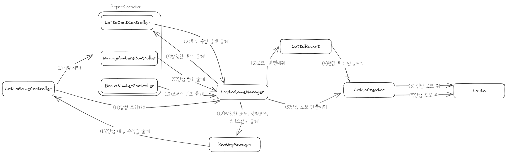

# 프로젝트 소개

우테코 프리코스 3주차 미션인 로또 게임 프로젝트입니다.


# 프로젝트 개요

- [로또 게임의 규칙](#로또-게임의-규칙)
- [사용자 입력 항목](#사용자-입력-항목)
- [게임 출력 항목](#게임-출력-항목)
- [사용자 입력값 검증](#사용자-입력값-검증)
- [프로그램 실행 흐름](#프로그램-실행-흐름)
- [실행 결과 예시](#실행-결과-예시)
- [기능 목록](#기능-목록)

## 로또 게임의 규칙

- 로또 번호의 숫자 범위는 1~45까지입니다.
- 1개의 로또를 발행할 때 중복되지 않는 6개의 숫자를 뽑습니다.
- 당첨 번호 추첨 시 중복되지 않는 숫자 6개와 보너스 번호 1개를 뽑습니다.
- 당첨은 1등부터 5등까지 있습니다. 당첨 기준과 금액은 아래와 같습니다.
    - 1등: 6개 번호 일치 / 2,000,000,000원
    - 2등: 5개 번호 + 보너스 번호 일치 / 30,000,000원
    - 3등: 5개 번호 일치 / 1,500,000원
    - 4등: 4개 번호 일치 / 50,000원
    - 5등: 3개 번호 일치 / 5,000원
- 로또 1장의 가격은 1,000원입니다.

## 사용자 입력 항목

사용자는 1번부터 순서대로 입력해야합니다.
1. 로또 구입 금액 
2. 당첨 번호
3. 보너스 번호

## 게임 출력 항목

로또 게임은 1번부터 순서대로 출력합니다.
1. 발행된 로또 수량 및 번호(오름차순)
2. 당첨 기준별 당첨 내역
3. 총 수익률(소수점 둘째 자리에서 반올림)

## 사용자 입력값 검증

사용자가 잘못된 값을 입력할 경우 "[ERROR]"로 시작하는 에러 메시지를 출력 후 그 부분부터 입력을 다시 받습니다.<br>
에러 메시지 예시) `[ERROR] 로또 번호는 1부터 45 사이의 숫자여야 합니다.`

## 프로그램 실행 흐름

1. 게임을 시작합니다.
2. 로또 구입 금액 입력 문구를 출력합니다.
3. 로또 구입 금액을 입력 받고 검증합니다.
4. 구입 금액에 해당하는만큼 로또를 발행합니다.
5. 발행된 로또를 출력합니다.
6. 당첨 번호 입력 문구를 출력합니다.
7. 당첨 번호를 입력 받고 검증합니다.
8. 보너스 번호 입력 문구를 출력합니다.
9. 보너스 번호를 입력 받고 검증합니다.
10. 로또 게임의 규칙에 따라 사용자가 구매한 로또번호와 당첨 번호를 비교합니다. 
11. 당첨 내역과 총 수익률을 계산합니다.
12. 당첨 내역과 총 수익률을 출력합니다.

아래 그림은 각 객체들간 협력 관계입니다.


## 실행 결과 예시

```
구입금액을 입력해 주세요.
8000

8개를 구매했습니다.
[8, 21, 23, 41, 42, 43] 
[3, 5, 11, 16, 32, 38] 
[7, 11, 16, 35, 36, 44] 
[1, 8, 11, 31, 41, 42] 
[13, 14, 16, 38, 42, 45] 
[7, 11, 30, 40, 42, 43] 
[2, 13, 22, 32, 38, 45] 
[1, 3, 5, 14, 22, 45]

당첨 번호를 입력해 주세요.
1,2,3,4,5,6

보너스 번호를 입력해 주세요.
7

당첨 통계
---
3개 일치 (5,000원) - 1개
4개 일치 (50,000원) - 0개
5개 일치 (1,500,000원) - 0개
5개 일치, 보너스 볼 일치 (30,000,000원) - 0개
6개 일치 (2,000,000,000원) - 0개
총 수익률은 62.5%입니다.
```

## ✅기능 목록

### 입출력

- CLI로 입력 읽어들이기
  - `camp.nextstep.edu.missionutils.Console.readLine()` 사용하기
- CLI로 메시지 출력하기

### 화면

- 로또 구입 금액 입력 문구를 출력하고 로또 구입 금액 입력 받기
- 발행된 로또 출력하기
- 당첨 번호 입력 문구를 출력하고 당첨 번호 입력 받기
  - 당첨번호는 `,`를 기준으로 구분하기
- 보너스 번호 입력 문구 출력하고 보너스 번호 입력 받기
- 모든 등수의 당첨 내역 출력하기
- 총 수익률 출력하기

### 유효성 검증

- 공통 예외 처리하기
  - 숫자가 아닌 값을 입력 받으면 에러 문구 출력<br>
    `[ERROR] 숫자로만 입력해주세요.`
  - 빈값을 입력 받으면 에러 문구 출력<br>
    `[ERROR] 공백이 아닌 문자를 입력해주세요.`

- 입력 받은 로또 구입 금액 예외 처리하기
  - 1000원 단위로 나누어떨어지지 않으면 에러 문구 출력<br>
    `[ERROR] 로또 구입 금액은 1,000원 단위여야 합니다.`

- 입력 받은 당첨 번호 예외 처리하기
  - 로또 번호의 숫자 범위가 아니면 에러 문구 출력<br>
    `[ERROR] 당첨 번호의 숫자 범위는 1~45까지입니다.`
  - 번호의 개수가 6개가 아니면 에러 문구 출력<br>
    `[ERROR] 당첨 번호는 6개여야 합니다.`
  - 번호가 중복되면 에러 문구 출력<br>
    `[ERROR] 당첨 번호의 숫자는 중복되지 않아야 합니다.`

- 입력 받은 보너스 번호 예외 처리하기
  - 보너스 번호가 당첨 번호와 중복되면 에러 문구 출력<br>
    `[ERROR] 보너스 번호는 당첨 번호와 중복되지 않아야 합니다.`
  - 보너스 번호가 로또 번호의 숫자 범위가 아니면 에러 문구 출력<br>
    `[ERROR] 보너스 번호의 숫자 범위는 1~45까지입니다.`
  - 보너스 번호가 1개가 아니면 에러 문구 출력<br>
    `[ERROR] 보너스 번호는 1개만 입력해주세요.`

### 로또 게임

- 랜덤 로또와 입력받은 당첨 번호를 로또로 생성하는 기능 구현하기
- 로또 구입 금액만큼 랜덤 로또 발행하기
- 입력 받은 당첨 번호 및 보너스 번호로 비교 기준 번호 생성하기
- 발행된 로또와 비교 기준 번호를 비교해서 1~5등까지 당첨 여부 판단 후 당첨 내역에 추가하기
- 총 수익률 계산하기<br>
  `총 수익률 = 총 당첨 금액 / 로또 구입 금액 * 100`
