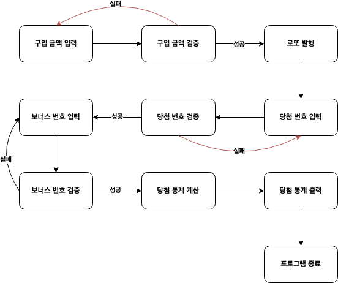

# 로또 미션

## 프로그램 설명

사용자로부터 입력받은 금액으로 로또를 생성해 당첨 번호와 결과를 비교한다. 최종적으로 사용자의 로또 당첨 등수와 수익률을 계산하는 프로그램이다.

## 🖥️ 프로그램 동작 순서

## 🎯 기능 구현 목록
 
### 입출력 기능

- [ ] `구입금액을 입력해 주세요.` 문구 출력 후 구입 금액을 입력 받는다.
  - [ ] 입력받은 구입 금액이 올바른 값이 아니면 예외를 발생한다.
- [ ] `당첨 번호를 입력해 주세요.` 문구 출력 후 당첨 번호를 입력 받는다.
  - [ ] 입력받은 당첨번호가 올바른 값이 아니면 예외를 발생한다.
- [ ] `보너스 번호를 입력해 주세요.` 문구 출력 후 보너스 번호를 입력 받는다.
  - [ ] 입력받은 보너스번호가 올바른 값이 아니면 예외를 발생한다.

- [ ] `(로또 갯수)개를 구매했습니다.`문구와 함께 로또 갯수를 출력한다.
- [ ] `[1, 2, 3 ,4 ,5, 6]` 로또 번호는 다음과 같이 출력한다.
  - [ ] 각 로또 번호는 오름차순으로 출력한다.
- [ ] `총 수익률은 (수익률)%입니다.`문구와 함께 수익률을 출력한다.
  - [ ] 수익률은 소수점 둘째자리에서 반올림 후 출력한다.
- [ ] `(일치 갯수)개 일치 (당첨 금액) - (로또 당첨 갯수)개` 문구와 함께 당첨 내역을 출력한다.
- [ ] `5개 일치, 보너스 볼 일치 (30,000,000원)` 2등일때는 문구와 함깨 당첨 내역을 출력한다.

### 로또 기능

- [ ] 로또를 관리한다.
  - [x] 로또 생성시 숫자가 범위를 벗어날 경우 예외를 발생한다. : 로또 숫자 범위 `1~45`
  - [x] 로또 생성시 중복되는 숫자가 있을 경우 예외를 발생한다.
  - [x] 로또 생성시 로또 숫자 갯수 범위를 벗어날 경우 예외를 발생한다. : 로또 숫자 갯수 범위 `6`
- [ ] 당첨 로또와 비교해 등수를 비교한다.

### 로또 티켓 기능

- [x] 발행된 여러개의 로또를 관리한다.

### 로또 발행 기능

- [x] 전달받은 금액만큼 로또를 발행한다.
  - [x] 전달받은 금액을 기반으로 발행할 로또 갯수를 계산한다. : 로또 가격 `1000`
- [x] 로또를 발행할때 6개의 숫자를 랜덤으로 추천한다. : 로또 숫자 범위 `1~45`

### 당첨 로또 기능

- [x] 당첨 번호를 갖는 로또를 관리한다.
- [x] 보너스 번호를 갖는다.
  - [ ] 보너스 번호가 범위를 벗어날 경우 예외를 발생한다. : 보너스 번호 범위 `1~45`
  - [x] 보너스 번호와 당첨 번호가 중복될 경우 예외를 발생한다.

### 당첨 내역 기능

- [ ] 발행된 로또와 당첨 로또를 비교해 수익률을 계산한다.
- [ ] 발행된 로또와 당첨 로또를 비교해 당첨 결과 통계를 계산한다.
