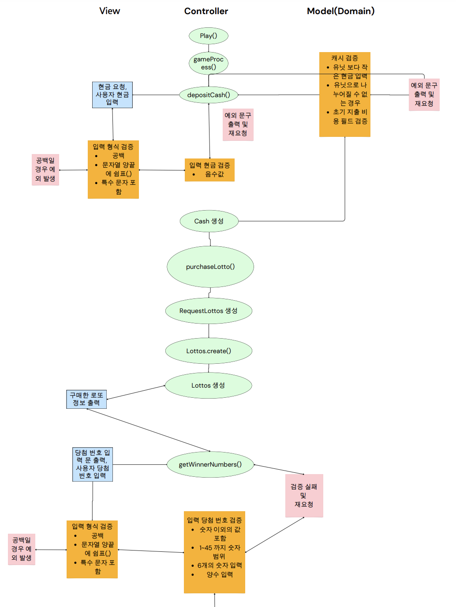
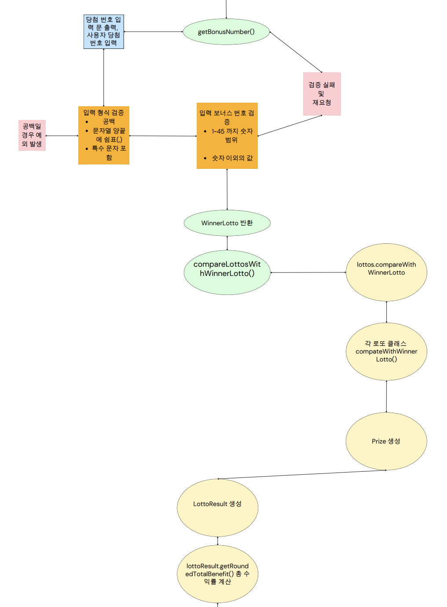

# 👯‍여늘's 우테코 프리코스 3주차 - 로또 👯‍


## 🔊 프로젝트 소개 목차
> 1. 프로젝트 구조
> 2. 주요 클래스 기능
> 3. 프로젝트 작동 흐름

## 📌 1. 프로젝트 구조
```
📦 lotto
├─ constant
│  ├─ CashConstant.java
│  ├─ LottoConstant.java
│  └─ LottoResultConstant.java
├─ controller
│  └─ GameController.java
├─ domain
│  ├─ Cash.java
│  ├─ Lotto.java
│  ├─ LottoMachine.java
│  ├─ LottoResult.java
│  ├─ Lottos.java
│  ├─ Prize.java
│  └─ WinnerLotto.java
├─ dto
│  ├─ RequestCash.java
│  ├─ RequestLotto.java
│  ├─ RequestLottoResult.java
│  ├─ RequestLottos.java
│  └─ RequestWinnerLotto.java
├─ exception
│  ├─ CashExceptionMessage.java
│  ├─ InputViewExceptionMessage.java
│  ├─ LottoExceptionMessage.java
│  └─ WinnerLottoExceptionMessage.java
parse
│  └─ Parser.java
├─ util
│  ├─ CharacterUnits.java
│  ├─ NumberGenerator.java
│  ├─ PatternUnits.java
│  └─ UniqueRandomNumberGenerator.java
├─ validator
│  └─ InputValidator.java
├─ view
│  ├─ InputView.java
│  ├─ InputViewMessage.java
│  ├─ OutputView.java
│  └─ OutputViewMessage.java
└─ Application.java
```

## 📌 2. 주요 클래스 기능

<div text-align="center">
<table>
    <tr>
        <th text-align="center">Package</th>
        <th text-align="center">Class</th>
        <th text-align="center">Description</th>
    </tr>
    <tr>
        <td rowspan="4"><b>constant</b></td>
        <tr>
            <td><b>CashConstant</b></td>
            <td>Cash 클래스의 상수를 보관하는 Enum클래스</td>
        </tr>
        <tr>
            <td><b>LottoConstant</b></td>
            <td>Lotto 클래스의 상수를 보관하는 Enum클래스</td>
        </tr>
        <tr>
            <td><b>LottoResultConstant</b></td>
            <td>LottoResult 클래스의 상수를 보관하는 Enum클래스</td>
        </tr>
        </td>
    </tr>
    <tr><td colspan="3"></td></tr>
    <tr>
        <td rowspan="2"><b> controller</b></td>
        <tr>
            <td><b>GameController</b></td>
            <td>애플리케이션(게임)의 진행 흐름을 제어하는 클래스</td>
        </tr>
        </td>
    </tr>
    <tr><td colspan="3"></td></tr>
    <tr>
        <td rowspan="8"><b> domain</b></td>
        <tr>
            <td><b>Cash</b></td>
            <td>유저가 입력한 금액을 사용을 결정하는 클래스</td>
        </tr>
        <tr>
            <td><b>Lotto</b></td>
            <td>생성된 로또 번호를 보관하며 당첨 번호와 비교하여 당첨금을 결정하는 클래스</td>
        </tr>
        <tr>
            <td><b>LottoMachine</b></td>
            <td>Cash 클래스에 의존하여 사용한 금액만큼 로또를 발행하는 클래스</td>
        </tr>
        <tr>
            <td><b>LottoResult</b></td>
            <td>로또의 결과를 보관하여 총 상금, 수익율을 계산하는 클래스</td>
        </tr>
        <tr>
            <td><b>Lottos</b></td>
            <td>발행된 로또의 묶음으로 구매한 로또의 결과를 측정하여 로또 결과 클래스 생성을 요청하는 클래스</td>
        </tr>
        <tr>
            <td><b>Prize</b></td>
            <td>로또 당첨 내역을 관리하는 Enum 클래스</td>
        </tr>
        <tr>
            <td><b>WinnerLotto</b></td>
            <td>당첨 로또와 보너스 번호를 보관하는 클래스</td>
        </tr>
        </td>
    </tr>
    <tr><td colspan="3"></td></tr>
    <tr>
        <td rowspan="6"><b>constant</b></td>
        <tr>
            <td><b>RequestCash</b></td>
            <td>사용자가 입력한 금액 원시값을 포장한 DTO 레코드</td>
        </tr>
        <tr>
            <td><b>RequestLotto</b></td>
            <td>로또 머신에서 생성한 로또 번호 원시값을 포장한 DTO 레코드</td>
        </tr>
        <tr>
            <td><b>RequestLottoResult</b></td>
            <td>Lottos 클래스에서 생성한 당첨 내역을 포장한 DTO 레코드</td>
        </tr>
        <tr>
            <td><b>RequestLottos</b></td>
            <td>RequestLotto 묶음을 필드로 관리, 로또 리스트를 생성하는 DTO 레코드</td>
        </tr>
        <tr>
            <td><b>RequestWinnerLotto</b></td>
            <td>사용자가 입력한 당첨 번호와 금액을 포장한 DTO 레코드</td>
        </tr>
        </td>
    </tr>
    <tr><td colspan="3"></td></tr>
    <tr>
        <td rowspan="2"><b>parser</b></td>
        <tr>
            <td><b>Parser</b></td>
            <td>입력문을 요청 상황에 맞게 적절히 파싱해주는 클래스</td>
        </tr>
        </td>
    </tr>
    <tr><td colspan="3"></td></tr>
    <tr>
        <td rowspan="5"><b>util</b></td>
        <tr>
            <td><b>CharacterUnits</b></td>
            <td>애플리케이션 운영 과정에서 사용되는 문자 유닛을 관리하는 Enum 클래스</td>
        </tr>
        <tr>
            <td><b>NumberGenerator</b></td>
            <td>LottoMachine 클래스에서 활용하는 번호 생성 기능 인터페이스</td>
        </tr>
        <tr>
            <td><b>PatternUnits</b></td>
            <td>입출력 클래스에서 활용하는 패턴 유닛 관리하는 Enum 클래스</td>
        </tr>
        <tr>
            <td><b>UniqueRandomNumbersGenerator</b></td>
            <td>LottoMachine 클래스에서 사용하는 번호 생성 기능 인터페이스의 구현체</td>
        </tr>
        </td>
    </tr>
    <tr><td colspan="3"></td></tr>
    <tr>
        <td rowspan="2"><b>validator</b></td>
        <tr>
            <td><b>InputValidator</b></td>
            <td>입력문을 검증하는 클래스</td>
        </tr>
        </td>
    </tr>
    <tr><td colspan="3"></td></tr>
    <tr>
        <td rowspan="5"><b>view</b></td>
        <tr>
            <td><b>InputView</b></td>
            <td>입력문을 처리하는 클래스</td>
        </tr>
        <tr>
            <td><b>InputViewMessage</b></td>
            <td>입력문에서 사용되는 문구를 관리하는 Enum 클래스</td>
        </tr>
        <tr>
            <td><b>OutputView</b></td>
            <td>출력문을 처리하는 클래스</td>
        </tr>
        <tr>
            <td><b>OutputViewMessage</b></td>
            <td>출력문에서 사용되는 문구를 관리하는 Enum 클래스</td>
        </tr>
        </td>
    </tr>
    <tr>
</table>
</div>
<br>


## 📌 3. 프로젝트 동작 흐름





----

#### 📝 기능 요구 사항 

- 입력한 금액에 해당하는 만큼 로또 발행
  - 로또 1장의 가격은 1,000원
  - 1,000원으로 나누어 떨어지는 금액만 가능 그외의 경우 예외 처리

- 로또
  - 숫자 범위 1~45, 중복 x
  - 6개 숫자


- 당첨 번호
  - 숫자 범위 1~45, 중복 x
  - 6개 숫자 + 보너스 번호 1개


- 사용자가 당첨 번호와 보너스 번호 입력
  - 당첨 번호는 쉼표(,)를 구분자로 입력
  - [예시] : 1,2,3,4,5,6
  - 보너스 번호 1개만 입력
  - [예시] : 7


- 발행한 로또 내용 출력
  - 로또 숫자를 쉼표(,)를 구분자로 오름차순으로 출력
  - [예시] : [1, 2, 3, 4, 5, 6]


- 당첨 내역 출력
  - 당첨은 1 ~ 5등까지 구성
  - 출력 형식
    - '당첨 번호와 일치하는 개수' 개 일치 ('당첨 금액'원) - '당첨된 개수'개
    - [예시] : 3개 일치 (5,000원) - 1개


- 총 수익률 출력
  - 당첨 내역을 기반으로 수익률을 계산해서 출력함
  - 출력 형식
    - 소수점 둘째 자리에서 반올림
    - [예시] : 총 수익률은 62.5%입니다.

### 🚀 기능 목록 

#### 1. 입/출력

[✅] 금액을 입력받는 기능
- 예시 :

      10000

- 에외 1 : 숫자가 아닌 값을 입력한 경우
- 예외 2 : 1,000원으로 나누어떨어지지 않은 금액


[✅] 당첨 번호 받기 기능
- 당첨 번호를 쉼표(,)를 기준으로 입력함
- 예시 :

      1,2,3,4,5,6

- 예외 1 : 숫자가 아닌 값을 입력한 경우
- 예외 2 : 1~45 범위를 벗어난 경우
- 예외 3 : 중복된 경우
- 예외 4 : 6개 보다 많은 숫자 입력한 경우


[✅] 보너스 번호 받기 기능
- 보너스 번호 1개만 입력함
- 예시 :

      7

- 예외 1 : 숫자가 아닌 값을 입력한 경우
- 예외 2 : 1~45 범위를 벗어난 경우
- 예외 3 : 당첨 번호와 중복된 경우
- 예외 4 : 1개 보다 많은 숫자 입력한 경우


[✅] 사용자가 잘못된 값을 입력한 경우 그 부분부터 다시 입력 받는 기능
- 사용자에게 에러 메시지 보여주기


[✅] 발행한 로또 수량 및 번호 출력하는 기능
- 괄호([]),쉼표(,),공백( )을 활용하여 출력
- 예시 :

      2개를 구매했습니다.
      [8, 21, 23, 41, 42, 43]
      [3, 5, 11, 16, 32, 38]

[✅] 당첨 내역을 출력하는 기능
- '당첨 번호와 일치하는 개수' 개 일치 ('당첨 금액'원) - '당첨된 개수'개
- 예시 :

      3개 일치 (5,000원) - 1개 
      4개 일치 (50,000원) - 0개 
      5개 일치 (1,500,000원) - 0개 
      5개 일치, 보너스 볼 일치 (30,000,000원) - 0개 
      6개 일치 (2,000,000,000원) - 0개

[✅] 수익률을 출력하는 기능
- 백분율, 소수점 둘째 자리에서 반올림
- 예시 :

      총 수익률은 62.5%입니다.


#### 2. 기능

[✅] 입력한 금액 및 사용 금액 관리
- 입금한 금액 보관
- 예외 1 : 1,000원 이하의 금액 입력
- 예외 2 : 1,000원으로 나누어 떨어지지 않는 금액 입력

[✅] 로또 발행 기능
- 사용자가 입력한 금액만큼 로또 발행함
- 1~45까지 범위에서 6개
- 예외 1 : 1~45 범위를 벗어난 경우
- 예외 2 : 중복된 경우

[✅] 로또 번호 문자열로 표현하는 기능
- 예시 : [8, 21, 23, 41, 42, 43]

[✅] 당첨 내역 계산하는 기능
- 당첨 번호와 발행한 로또 번호를 비교
- 당첨 번호와 보너스 번호를 몇 개 맞추었는지 계산

[✅] 상금 계산하는 기능
- 당첨 내역을 기반으로 당첨금을 판단하는 기능
- 1 ~ 5등, 꽝 중에 어디에 해당하는지 계산

[✅] 총 수익률을 계산하는 기능
- 당첨 상금을 기반으로 수익률 계산
- 백분률, 소수점 둘째자리 반올림


