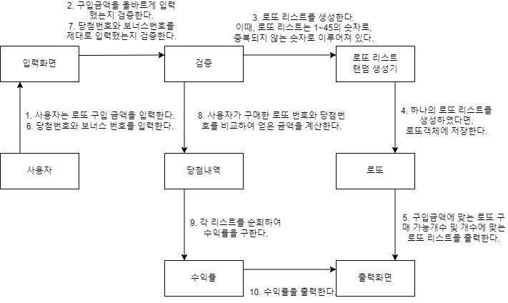

### 객체 간의 협력관계 파악하기

### 프로그래밍 요구사항

- [ ✅ ] JDK 17 버전에서 실행 가능해야 한다.
- [ ] indent(인덴트, 들여쓰기) depth를 3이 넘지 않도록 구현한다. 2까지만 허용한다.
- [ ] 3항 연산자를 쓰지 않는다.
- [ ] JUnit 5와 AssertJ를 이용하여 본인이 정리한 기능 목록이 정상 동작함을 테스트 코드로 확인한다.

### 추가 요구사항

- [ ] 함수(또는 메서드)의 길이가 15라인을 넘어가지 않도록 구현한다.
- [ ] else 예약어를 쓰지 않는다.
- [ ] Java Enum을 적용한다.
- [ ] 도메인 로직에 단위 테스트를 구현해야 한다. 단, UI(System.out, System.in, Scanner) 로직은 제외한다.
- [ ] `camp.nextstep.edu.missionutils`에서 제공하는 `Randoms` 및 `Console` API를 사용하여 구현해야 한다.
    - [ ] Random 값 추출은 `camp.nextstep.edu.missionutils.Randoms`의 `pickUniqueNumbersInRange()`를 활용한다.
    - [ ] 사용자가 입력하는 값은 `camp.nextstep.edu.missionutils.Console`의 `readLine()`을 활용한다.
- [ ] 주어진 로또 클래스를 사용한다.