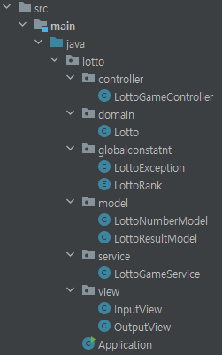

# 우아한 테크 코스 3주차 미션

## 프로젝트 명 - 로또
로또 자동 발행 및 입력에 따른 당첨 금액/수익률 계산

## 프로젝트 설명
### 주요 기능
1. 로또 티켓 발행: 주어진 금액에 맞게 1~45 사이 정수 6개로 이루어진 로또 티켓 발행
2. 로또 티켓 확인: 주어진 숫자들과 로또 티켓 번호가 같은지 여부 확인
3. 로또 가격 확인: 가격 입력 시 1000으로 나누어 떨어지지 않으면 예외 발생, 로또 티켓 발매 수 계산
4. 현재 발행 로또 출력
5. 당첨 숫자 발행 기능: 로또 티켓 발행과 메커니즘 동일, 사용자가 입력
6. 보너스 숫자 발행 기능: 숫자 유효성 검사 후, 보너스 숫자 설정
7. 랭킹 확인: 당첨 숫자, 보너스 숫자 토대로 해당 로또 티켓 랭킹 확인
8. 랭킹 출력
9. 상금 계산: 로또 티켓마다 당첨 여부를 확인하여 상금 계산
10. 수익률 계산: 로또 티켓 발행 시 지불했던 금액과 상금을 비교해 수익률 계산
11. 결과 출력

### 사용 기술
**MVC 패턴**

&#42; 사용자 입력은 controller로 분류<br>
&#42; 콘솔 출력은 view로 분류

- controller: 주로 서비스 로직을 담당<br>
- model: 데이터 캡슐화 및 객체 간 동작/연산 담당<br>
&#42; `equals`, `hashCode` 오버라이드를 통해 연산 지원

**TDD**

- 단순한 콘솔 출력을 제외한 나머지 모든 컴포넌트 검사 수행
- 사용 프레임워크: JUnit, AssertJ<br>
&#42; 콘솔 입/출력을 `src/test/java/lotto/controller/IOConfig.java`로 캡슐<br>
&#42; 당첨금 및 수익률 계산 테스트(`src/test/java/lotto/controller/ResultCalculationServiceTest.java`)에서 리플렉션을 활용한 데이터 주입 &rarr; 4주차 미션에서 더 적극적으로 활용할 예정

### 프로젝트 회고

**좋았던 점**
- MVC 패턴 적응 후 수월함을 느낌. 향후 프로젝트 진행 시 적극적으로 도입할 예정.
- try-catch 문을 이용한 간단한 에러 로깅.
- Service-Model Layer &rarr; 서비스 설계 시 데이터/행동 추상화 학습
- TDD &rarr; 객체 행동 기반 설계와 다른 방식의 체계 경험.

**아쉬운 점**
- 후반부 docs/README.md 파일 관리 미숙.
- README 파일 내용 구상 &rarr; 테스트 코드 작성 &rarr; 어플리케이션 로직 구상 순서 위반.
- 컴포넌트 스캔과 의존성 주입 미사용.
- 다소 단조로운 패키징.
- 기능의 세부 구분 전무함.

**알게된 점**
- MVC 패턴의 구조
- TDD 방식 어플리케이션 설계 방법
- 리플렉션을 활용한 데이터 주입
- 서비스 레이어 설계

## 프로젝트 설치 및 실행 방법
### 사용 언어 및 IDE
> ```text
> openjdk 17.0.8.1 2023-08-22 LTS
> OpenJDK Runtime Environment Corretto-17.0.8.8.1 (build 17.0.8.1+8-LTS)
> OpenJDK 64-Bit Server VM Corretto-17.0.8.8.1 (build 17.0.8.1+8-LTS, mixed mode, sharing)
> 
> IntellijIDEA
> ```

### 프로젝트 설치 & 실행 과정

1. 프로젝트 폴더로 이동 (주의: 빈 디렉토리이어야 함)
> ```bash
> cd your_project_directory
> ```
2. 현재 레포지토리를 로컬으로 클론
> ```bash
> git clone https://github.com/gsgh3016/java-lotto-6.git
> ```
3. IntellijIDEA 세팅 (아래 그림은 MacOS 기준)

4. Application 실행 (혹은 `src/main/java/lotto/Application.java`에서 아래 그림처럼 실행)

5. 값 입력 후 결과 확인

### 실행 예시
> ```text
> 11:46:00 PM: Executing ':Application.main()'...
>
> Task :compileJava UP-TO-DATE
> Task :processResources NO-SOURCE
> Task :classes UP-TO-DATE
>
> Task :Application.main()
> 구입금액을 입력해 주세요.
> 8000
> 
> 8개를 구매했습니다.
> [37, 5, 40, 21, 15, 1]
> [31, 45, 35, 24, 30, 22]
> [9, 4, 42, 3, 23, 39]
> [26, 27, 25, 6, 5, 1]
> [26, 27, 31, 36, 25, 30]
> [25, 13, 40, 4, 14, 17]
> [22, 30, 34, 14, 23, 38]
> [31, 25, 24, 37, 36, 12]
> 
> 당첨 번호를 입력해 주세요.
> 1,3,5,7,9,11
> 
> 보너스 번호를 입력해 주세요.
> 13
> 
> 당첨 통계
> ---
> 3개 일치 (5,000원) - 0개
> 4개 일치 (50,000원) - 0개
> 5개 일치 (1,500,000원) - 0개
> 5개 일치, 보너스 볼 일치 (30,000,000원) - 0개
> 6개 일치 (2,000,000,000원) - 0개
> 총 수익률은 0.0%입니다.
>
> BUILD SUCCESSFUL in 26s
> 2 actionable tasks: 1 executed, 1 up-to-date
> 11:46:26 PM: Execution finished ':Application.main()'.
> ```

### 테스트 방법
&#42; 본 프로젝트는 단위 테스트 기반으로 설계됨.

테스트 하고 싶은 클래스가 매핑된 테스트 폴더에서 테스트 진행

> ex) `src/main/java/lotto/controller/RankingService.java` 테스트 시
> <code>src/<span style="color: skyblue">test</span>/java/lotto/controller/RankingServiceTest.java</code>에서 테스트 진행


**실행 결과**
> ```text
> > Task :compileJava UP-TO-DATE
> Task :processResources NO-SOURCE
> Task :classes UP-TO-DATE
> Task :compileTestJava UP-TO-DATE
> Task :processTestResources NO-SOURCE
> Task :testClasses UP-TO-DATE
> Task :test
> BUILD SUCCESSFUL in 337ms
> 3 actionable tasks: 1 executed, 2 up-to-date
> 11:54:11 PM: Execution finished ':test --tests "lotto.controller.RankingServiceTest.checkRankingResultMaking"'.
> ```
