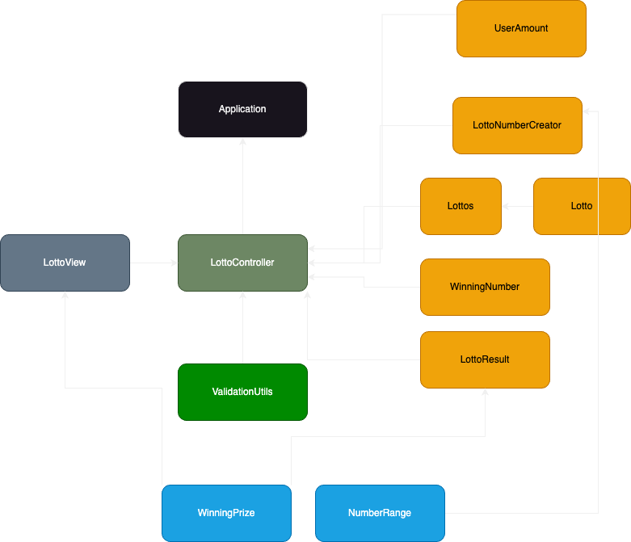

# 📑 기능명세서

## 🗂️ 패키지 구조 & 클래스 목록

<table class="tg">
<thead>
  <tr>
    <th class="tg-9sg9">패키지</th>
    <th class="tg-9sg9">클래스 명</th>
    <th class="tg-9sg9">역할 및 책임</th>
  </tr>
</thead>
<tbody>
  <tr>
    <td class="tg-u479">controller</td>
    <td class="tg-u479">Game</td>
    <td class="tg-q2ja">전체 게임의 흐름을 관리하는 컨트롤러 클래스</td>
  </tr>
  <tr>
    <td class="tg-km2t" rowspan="9">domain</td>
    <td class="tg-km2t">Cash</td>
    <td class="tg-zv4m">구매자가 지불할 금액 관련 로직을 담당하는 도메인 클래스</td>
  </tr>
  <tr>
    <td class="tg-u479">Customer</td>
    <td class="tg-q2ja">로또 판매자에게 금액을 지불하고 로또를 구매하는 역할을 수행하는 도메인 클래스</td>
  </tr>
  <tr>
    <td class="tg-km2t">Lotto</td>
    <td class="tg-zv4m">로또 번호 관련 로직을 담당하는 도메인 클래스</td>
  </tr>
  <tr>
    <td class="tg-u479">LottoSeller</td>
    <td class="tg-rwdp">로또를 생성하고 판매하는 로직을 담당하는 도메인 클래스</td>
  </tr>
  <tr>
    <td class="tg-km2t">BonusNumber</td>
    <td class="tg-zv4m">보너스 숫자 관련 로직을 담당하는 도메인 클래스</td>
  </tr>
  <tr>
    <td class="tg-u479">Profit</td>
    <td class="tg-q2ja">수익 관련 로직을 담당하는 도메인 클래스</td>
  </tr>
  <tr>
    <td class="tg-km2t">Rank</td>
    <td class="tg-zv4m">당첨 순위 관련 로직을 담당하는 도메인 클래스</td>
  </tr>
  <tr>
    <td class="tg-u479">WinningRanks</td>
    <td class="tg-q2ja">당첨 순위를 계산하는 로직을 담당하는 도메인 클래스</td>
  </tr>
  <tr>
    <td class="tg-km2t">WinningYield</td>
    <td class="tg-zv4m">수익률을 계산하는 로직을 담당하는 도메인 클래스</td>
  </tr>
  <tr>
    <td class="tg-u479" rowspan="3">dto</td>
    <td class="tg-u479">Lottos</td>
    <td class="tg-q2ja">로또 리스트를 저장하는 일급 컬렉션</td>
  </tr>
  <tr>
    <td class="tg-km2t">Ranks</td>
    <td class="tg-zv4m">순위 리스트를 저장하는 일급 컬렉션</td>
  </tr>
  <tr>
    <td class="tg-u479">WinningNumbers</td>
    <td class="tg-q2ja">당첨 로또 번호와 보너스 번호를 저장하는 클래스</td>
  </tr>
  <tr>
    <td class="tg-km2t" rowspan="2">exception</td>
    <td class="tg-km2t">ErrorMessage</td>
    <td class="tg-zv4m">에러 원인에 해당하는 메시지를 관리하는 Enum 클래스</td>
  </tr>
  <tr>
    <td class="tg-u479">LottoGameException</td>
    <td class="tg-q2ja">로또 게임의 전체 에러를 관리하는 커스텀 에러 클래스</td>
  </tr>
  <tr>
    <td class="tg-km2t" rowspan="2">util</td>
    <td class="tg-km2t">LottoConstants</td>
    <td class="tg-zv4m">로또 관련 상수를 관리하는 Enum 클래스</td>
  </tr>
  <tr>
    <td class="tg-u479">LottoNumberGenerator</td>
    <td class="tg-q2ja">랜덤한 6개의 로또 번호를 생성하는 유틸 클래스</td>
  </tr>
  <tr>
    <td class="tg-km2t" rowspan="2">view</td>
    <td class="tg-km2t">InputView</td>
    <td class="tg-zv4m">사용자 입력 관련 로직을 담당하는 뷰 클래스</td>
  </tr>
  <tr>
    <td class="tg-u479">OutputView</td>
    <td class="tg-q2ja">결과 출력 관련 로직을 담당하는 뷰 클래스</td>
  </tr>
</tbody>
</table>

## 🔗 클래스 다이어그램

## 📝 구현 기능 목록

### ⚙️ Controller Layer

- [X]  게임을 세팅한다.
    - [X]  로또를 생성한다.
    - [X]  로또 구매자를 생성한다.
    - [X]  로또 판매자를 생성한다.
    - [X]  당첨번호와 보너스 번호를 생성한다.
- [X]  게임을 진행한다.
    - [X]  잘못된 값을 입력시 에러 메시지를 출력하고 해당 데이터를 재입력.
    - [X]  로또를 구매한다.
    - [X]  당첨 통계를 계산한다.
        - [X]  당첨 내역을 계산한다.
        - [X]  수익률을 계산한다.
- [X]  게임을 종료한다.
    - [X]  Scanner 를 반환한다.

### 📦 Domain Layer

- [X]  로또 번호를 발행한다.
    - [X]  로또 번호가 6개 인지 검증한다.
    - [X]  로또 번호에 중복이 있는지 검증한다.
    - [X]  로또는 오름차순으로 정렬한다.
- [X] 로또를 구매한다.
- [X]  구입금액을 생성한다.
    - [X]  입력한 금액이 1000원 단위인지 검증한다.
- [X]  당첨 번호를 저장한다.
    - [X]  번호가 6개인지 검증한다.
    - [X]  번호의 중복을 검증한다.
    - [X]  1~45 사이의 숫자인지 검증한다.
- [X]  보너스 번호를 저장한다.
    - [X]  입력이 정수인지 검증한다.
    - [X]  1~45 사이의 숫자인지 검증한다.
    - [X]  당첨 번호와 중복을 검증한다.
- [X]  당첨 통계를 계산한다.
    - [X]  수익률을 계산한다.
        - [X]  수익률은 소수점 둘째 자리에서 반올림한다.
        - [X]  수익을 저장한다.
        - [X]  수익은 0을 포함한 양수만 더할 수 있다.
    - [X]  당첨 내역을 계산한다.
        - [X]  매칭 규칙에 맞는 랭크를 반환한다.

### 🖥️ View Layer

- [X]  구입 금액 입력 UI를 출력한다.
    - [X]  구입 금액 사용자 입력을 처리한다.
        - [X] 구입 금액은 정수만 입력할 수 있다.
        - [X] 구입 금액은 양의 정수만 입력할 수 있다.
- [X]  구매한 로또 UI를 출력한다.
- [X]  당첨 번호 입력 UI를 출력한다.
    - [X]  당첨 번호 사용자 입력을 처리한다.
        - [X]  공백을 제거한다.
        - [X]  입력이 정수인지 검증한다.
        - [X]  콤마가 연속으로 입력되어 있는지 검증한다.
        - [X]  입력의 마지막이 콤마인지 검증한다.
        - [X]  정수는 6개만 입력할 수 있다.
- [X]  보너스 번호 UI를 출력한다.
    - [X]  보너스 번호 UI 사용자 입력을 처리한다.
        - [X] 공백을 제거한다.
        - [X] 한 개의 정수만 입력할 수 있다.
        - [X] 양수의 정수만 입력할 수 있다.
- [X]  당첨 통계를 출력한다.
    - [X]  당첨 내역을 출력한다.
    - [X]  수익률을 출력한다.
- [X]  예외 상황시 에러 문구를 출력한다.
    - [X]  에러문구는 [ERROR] 로 시작한다.

### 🛠️ Util

- [X] 범위 내의 랜덤한 6개의 로또 번호를 생성한다.
- [X] 로또 관련 상수를 제공한다.

### ⚠️ Exception

- [X] 각 에러 원인에 대한 적절한 메시지를 제공한다.