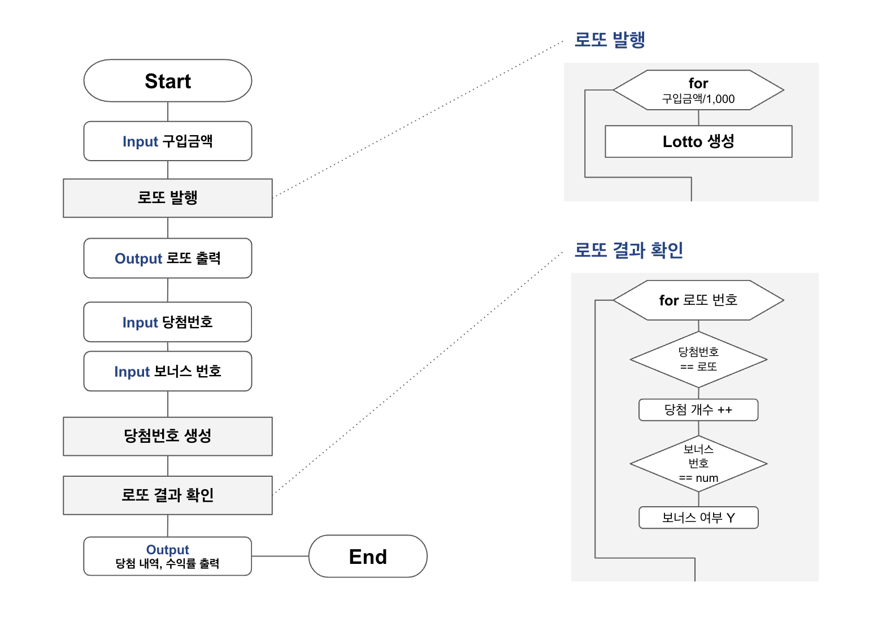

# 미션 - 로또 💰

--- 
## ✏️ 요구사항 

로또 게임 기능을 구현한다. 로또 게임은 아래와 같은 규칙으로 진행된다.

- 로또 구입 금액을 입력하면 구입 금액에 해당하는 만큼 로또를 발행한다. (로또 1장의 가격은 1,000원이다.)
- 당첨 번호와 보너스 번호를 입력받는다.
- 사용자가 구매한 로또 번호와 당첨 번호를 비교하여 당첨 내역 및 수익률을 출력하고 로또 게임을 종료한다.

이를 정리해보면 다음과 같다.

---

## 🚀 기능 목록

### 핵심 로직

| 역할           | 기능(책임)                                                      | 비고                                                                                                                                                                             |
|:-------------|:------------------------------------------------------------|:-------------------------------------------------------------------------------------------------------------------------------------------------------------------------------|
| 로또           | 6개의 숫자를 가진다 입력받은 숫자를 가지고 있는지 확인한다                       | 숫자는 1~45 사이의 **랜덤** 값이며, 각 숫자는 중복되지 않는다                                                                                                                                        |
| 당첨 번호 (당첨 로또) | 6개의 숫자와 보너스 숫자 1개를 가진다                                      | 1~45 사이의 값이며 숫자와 보너스 숫자는 모두 중복되지 않는다                                                                                                                                           |
| 로또 결과        | 맞춘 개수와 보너스 번호 일치 여부에 따른 결과 상태를 가진다  당첨 결과에 해당하는 상금을 반환한다 | 열거형 타입 1등: 6개 번호 일치 / 2,000,000,000원  2등: 5개 번호 + 보너스 번호 일치 / 30,000,000원  3등: 5개 번호 일치 / 1,500,000원  4등: 4개 번호 일치 / 50,000원  5등: 3개 번호 일치 / 5,000원  이외는 낙첨 |
| 로또 발행        | 입력받은 금액만큼 로또를 발행한다                                          | 로또 1장의 가격은 1,000원이다 구입금액/1,000 만큼 로또를 발행한다                                                                                                                                 |
| 로또 결과 확인     | 로또와 당첨 번호를 비교해 결과를 반환한다                                     | 일치하는 개수와 보너스 숫자 일치 여부를 반환한다                                                                                                                                                    |                                                                                                                                                                         |

### UI 로직

| 구분 | 책임                  | 비고                                                          |
|:---|:--------------------|:------------------------------------------------------------|
| 입력 | 로또 구입 금액을 입력받는다     | 금액은 1,000원 단위이다                                             |
| 입력 | 당첨 번호를 입력받는다        | 1~45 사이의 숫자 6개를 입력받는다  숫자는 쉼표(,)로 구분된다                  |
| 입력 | 보너스 번호를 입력받는다       | 1~45 사이의 숫자 1개를 입력받는다                                       |
| 출력 | 발행한 로또 수량과 번호를 출력한다 | 번호는 오름차순으로 정렬해 출력한다                                         |
| 출력 | 당첨 내역과 수익률을 출력한다.   | 수익률의 경우 소수점 둘째 자리에서 반올림한다                                   |

입력 부분에서 해당 조건에 부합하지 않는 잘못된 값을 입력한 경우, IllegalArgumentException이 발생한다.
에러 메시지와 함께 에러 발생 후, 해당 부분부터 다시 입력받는다.

---

## ✅ 테스트 

주어진 요구사항에 따라 UI 로직을 제외한 핵심 로직에만 테스트를 구현했다.

### 로또

`로또 번호는 1~45 사이의 중복되지 않는 6개의 숫자여야 한다. `

이는 세부적으로 나누면 다음의 세 가지 경우이다.

- 로또 번호는 **6개**여야 한다.
- 로또 번호는 **중복**되지 않아야 한다.
- 로또 번호는 **1~45** 사이의 값이어야 한다.

세 가지 경우에는 예외가 발생해야 하므로 다음의 테스트를 진행한다.

| 테스트 내용                    | 입력 예시               | 통과 여부 |
|:--------------------------|:--------------------|:------|
| 로또 번호가 6개가 아니면 예외 발생      | 1, 2, 3, 4, 5, 6, 7 | ✔️ |
| 로또 번호가 중복이면 예외 발생         | 1, 2, 3, 4, 5, 5    | ✔️ |
| 로또 번호가 1~45 사이에 없으면 예외 발생 | 1, 2, 3, 4, 5, 46   | ✔️ |

---

### 당첨 번호(당첨 로또)

당첨 로또는 6개의 당첨 번호와 1개의 보너스 번호로 이루어져 있다.
6개의 당첨 번호의 경우 위의 로또 번호와 마찬가지로 세 가지 조건을 모두 만족해야 한다.

| 테스트 내용                    | 입력 예시                     | 통과 여부 |
|:--------------------------|:--------------------------|:------|
| 당첨 번호가 6개가 아니면 예외 발생      | (1, 2, 3, 4, 5, 6, 7), 45 | ✔️ |
| 당첨 번호가 중복이면 예외 발생         | (1, 2, 3, 4, 5, 5), 45    | ✔️ |
| 당첨 번호가 1~45 사이에 없으면 예외 발생 | (1, 2, 3, 4, 5, 46), 45   | ✔️ |

보너스 번호의 경우 두 가지 조건을 만족해야 한다.

- 보너스 번호는 1~45의 숫자여야 한다.
- 당첨 번호와 중복되지 않아야 한다. 

| 테스트 내용                     | 입력 예시                  | 통과 여부 |
|:---------------------------|:-----------------------|:------|
| 보너스 번호가 1~45 사이에 없으면 예외 발생 | (1, 2, 3, 4, 5, 6), 46 | ✔️ |
| 보너스 번호가 당첨 번호와 중복이면 예외 발생  | (1, 2, 3, 4, 5, 6), 6  | ✔️ |

---

### 로또 결과

로또 결과는 맞춘 개수에 대한 변수와 상금 변수로 구성되어 있다.

| 테스트 내용                          | 입력 예시                  | 결과 예시         | 통과 여부 |
|:--------------------------------|:-----------------------|:--------------|:-------|
| 맞힌 개수와 보너스 번호 일치 여부에 맞는 결과를 가진다 | (5, true)              | FIRST_PRIZE   | ✔️  |
| 결과에 맞는 상금을 반환한다 | FIRST_PRIZE.getPrize() | 2_000_000_000 | ✔️           |

---

### 로또 발행

로또 발행의 경우, 구입 금액에 대해 검증한 뒤 해당 금액만큼 로또를 발행한다.

로또 1장의 가격은 1,000원 이므로 구입 금액에 대한 조건은 다음의 두가지이다.

- 구입 금액은 1,000원 이상이어야 한다.
- 구입 금액은 1,000원 단위여야 한다. (1,000으로 나누어 떨어져야 한다.)

| 테스트 내용                        | 입력 예시 | 통과 여부 |
|:------------------------------|:------|:------|
| 구입 금액이 1,000원보다 적으면 예외 발생     | 900   | ✔️    |
| 구입 금액이 1,000원 단위가 아니면 예외 발생   | 1800  | ✔️    |

로또 생성에 대한 테스트는 다음의 두 가지로 진행했다.

| 테스트 내용               | 테스트 방식                   | 통과 여부        |
|:---------------------|:-------------------------|:-------------|
| 로또를 생성한다             | 생성된 값의 클래스와 Lotto 클래스 비교 |  ✔️          |
| 구입금액/1000만큼 로또를 생성한다 | size()와 구입금액/1000 값 비교   | ✔️           |

---

### 로또 결과 확인

로또 결과 확인의 경우 개별 로또와 당첨 번호를 비교해 결과를 반환하는 check 메서드와 로또 리스트의 결과를 리스트로 반환하는 getResults 메서드가 있다.

getResults 메서드가 check() 메서드로 작동하므로, check 메서드에 대한 별도의 테스트는 진행하지 않았다.

| 테스트 내용                          | 입력 예시                                                                                                 | 결과 예시         | 통과 여부 |
|:--------------------------------|:------------------------------------------------------------------------------------------------------|:--------------|:-------|
| 로또 리스트와 당첨 번호를 비교해 결과 리스트를 반환한다 | 로또1 (1,2,3,4,5,6) 로또2 (1,2,3,4,5,7) 로또3 (11, 22, 33, 44, 5, 45)  (당첨번호, 보너스 번호): ((1,2,3,4,5,6), 7) | FIRST_PRIZE, SECOND_PRIZE, NO_PRIZE | ✔️           |

---

## 🤔 고려 사항

- 열거형 

- 예외 처리

