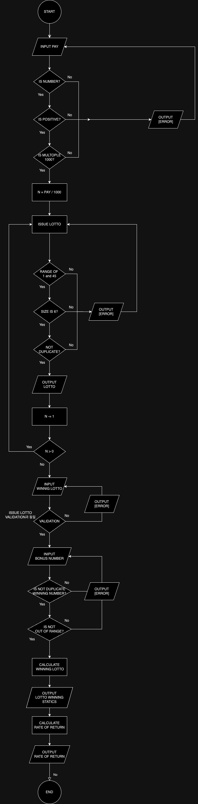

## 🎫  Directory Structure
```
src
├─ main
│  └─ java
│       └─ lotto
│          ├─ constant
│          │   └─ LottoConstant ["로또 기본 상수"]
│          ├─ controller
│          │   └─ LottoDraw ["로또 비지니스 로직"]
│          ├─ model
│          │   ├─ Customer ["고객 클래스"]
│          │   ├─ Lotto ["로또 클래스"]
│          │   ├─ LottoWinning ["당첨 로또 클래스"]
│          │   ├─ Money ["돈 클래스"]
│          │   └─ WinningEnquiry ["당첨 통계 클래스"]
│          ├─ view
│          │   ├─ constant 
│          │   │   ├─ ConstantMessage ["로또 기본 출력 문구"]
│          │   │   └─ ErrorMessage ["로또 에러 메시지"]
│          │   ├─ OutputView ["출력 뷰"]
│          │   └─ InputView ["입력 뷰"]
│          └─ Application
└─ test
   └─ java
        ├─ lotto
        │   ├─ ApplicationTest
        │   └─ LottoTest 
        └─ model
            ├─ MoneyTest ["Money class test"]
            ├─ LottoWinningTest ["LottoWinning class test"]
            └─ CustomerTest ["Customer class test"]
```

## 📦&nbsp;&nbsp;패키지 구조

<div>
    <table>
        <tr>
            <th align="center">Package</th>
            <th align="center">Class</th>
            <th align="center">Description</th>
        </tr>
        <tr>
            <td><b>🕹&nbsp;&nbsp;controller</b></td>
            <td><b>✨&nbsp;&nbsp;LottoDraw</b></td>
            <td>로또 발행 및 당첨 로직에 관한 컨트롤러 클래스</td>   
        </tr>
        <tr><td></td></tr>
        <tr>
            <td rowspan="3"><b>🎱&nbsp;&nbsp;Model</b></td>
            <td><b>✨&nbsp;&nbsp;Lotto</b></td>
            <td>로또 기본정보를 가지고 있는 클래스</td>
        </tr>
        <tr>
            <td><b>✨&nbsp;&nbsp;Customer</b></td>
            <td>로또 구매자를 의미하는 클래스로 지불금액, 구매한 로또 리스트, 당첨된 로또 정보를 가지고 있다.</td>
        </tr>
        <tr>
            <td><b>✨&nbsp;&nbsp;LottoWinning</b></td>
            <td>당첨 로또 관련 정보를 가지고 있는 클래스</td>
        </tr>
        <tr><td></td></tr>
        <tr>
            <td rowspan="2"><b>🖥&nbsp;&nbsp;View</b></td>
            <td><b>✨&nbsp;&nbsp;InputView</b></td>
            <td>입력을 위한 클래스</td>
        </tr>
        <tr>
            <td><b>✨&nbsp;&nbsp;OutputView</b></td>
            <td>출력을 위한 클래스</td>
        </tr>
        <tr><td></td></tr>
        <tr>
            <td rowspan="1"><b>⚙️&nbsp;&nbsp;Validation</b></td>
            <td><b>✨&nbsp;&nbsp;Validator</b></td>
            <td>유효성 검사 로직을 가지고 있는 클래스</td>
        </tr>
        <tr><td></td></tr>
        <tr>
            <td rowspan="3"><b>📌️&nbsp;&nbsp;Constant</b></td>
            <td><b>✨&nbsp;&nbsp;LottoConstant</b></td>
            <td>로또와 관련된 상수 enum</td>
        </tr>
        <tr>
            <td><b>✨&nbsp;&nbsp;ConstantMessage</b></td>
            <td>로또 발행과 관련된 메시지 enum</td>
        </tr>
        <tr>
            <td><b>✨&nbsp;&nbsp;ErrorMessage</b></td>
            <td>에러 관련 메시지 enum</td>
        </tr>
    </table>    
</div>

---
# 📊 Flow Chart

---

## 🚀&nbsp;&nbsp;구현 목록
### 1️⃣ Non-Functional
- [x] MVC Pattern 구현
<br>

### 2️⃣ Functional
- [x] [LottoDraw] 사용자에게 로또 구입 금액을 입력받는다. (Pay)
- [x] [LottoDraw] pay / 1000 만큼 로또 발행
- [x] [LottoDraw] 당첨 번호 입력 받는다.
- [x] [LottoDraw] 보너스 번호 입력 받는다.
- [x] [LottoDraw] 발행한 로또 중 당첨된 로또 확인
- [x] [LottoDraw] 당첨 통계 출력
- [x] [LottoDraw] 수익률 계산
- [x] [LottoDraw] 수익률 출력

### 3️⃣ Exceptional case
- [x] 로또 구입 금액이 1000으로 나누어 떨어지지 않는 경우 (PAY_NOT_MULTIPLE_OF_1000)
- [x] 로또 구입 금액이 숫자가 아닌 경우 (PAY_NOT_NUMBER)
- [x] 로또 구입 금액이 양수가 아닌 경우 (PAY_IS_NOT_POSITIVE)
- [x] 당첨 번호가 1 ~ 45 사이의 값이 아닌 경우
- [x] 당첨 번호가 6개가 아닌경우
- [x] 당첨 번호 가 숫자로 이루어 지지 않은 경우
- [x] 당첨 번호가 중복되는 경우
- [x] 보너스 번호가 1 ~ 45 사이 값이 아닌 경우
- [x] 보너스 번호가 당첨 번호랑 중복되는 경우

---


