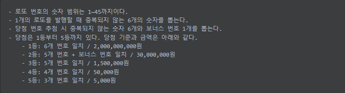

## 🎱기능 요구사항  
  

## ☘ 기능 목록
- [0] 로또 구입 금액 입력 howMuchMoney
  -> 1000으로 나눠지지 않음, 숫자가 아닌 경우
- [o] 당첨 번호를 입력 받는다. 번호는 쉼표(,) 기준으로 구분 winningNumbers  
  -> 6개의 입력이 아닌 경우, 숫자가 아닌 경우, 1~45의 수가 아닌 경우 예외
- [o] 보너스 번호를 입력 받는다 bonusNumbers  
  -> 숫자가 아닌 경우, 1~45의 수가 아닌 경우 예외  
- [o] 모든 입력에 대한 오류를 검사한다. ValidateService
  - [o] 숫자가 아닐 경우 validateAuthorizedLength
  - [o] 돈이 1000으로 나누어 떨어지지 않을 경우 validateProperMoney
  - [o] 6개의 입력이 아닌 경우 validateAuthorizedLength
  - [o] 1~45의 수가 아닌 경우 validateProperNumbers
  - [o] 중복된 숫자를 가지는지 검증 validateDuplicatedNums
- [o] 로또 한개를 발행한다. Lotto#new Lotto()
  - [o] 로또 번호 반환 Lotto#getLotto()List\<Integer>
  - [o] 로또 번호 검증 Lotto#validate(List<Integer> nums)
    - [o] 로또의 길이는 6가 맞는지 검증. Lotto#void validateBoundLength()
    - [o] 로또 번호는 1~45 사이의 숫자를 가지는지 검증. Lotto#void validateProperNums()
    - [o] 로또는 중복된 숫자를 가지는 지 검증. Lotto#void validateDuplicatedNums()
- [o] 로또를 구입한 개수만큼 발행한다. LottoMarketService#List\<Lotto> issueLottoes(int lottoCount)
  - [o]중복되지 않는 무작위 수를 6개를 생성한다. LottoMarketService#List\<Integer> generateNonduplicatedNums(Supplier\<Integer> lottoNumSupplier)
  - [o]입력 받은 돈으로 로또 발행 개수를 구한다. LottoMarketService#int calculateLottoCount(int money)
  - [o]무작위의 숫자를 반환한다. LottoNumGenerator#integer get()
- [o] 구매한 로또의 번호와 당첨 번호를 비교, 수익률 계산
  - [o] 등수와 관련된 데이터를 묶어 놓은 enum 구현. Rank
  - [o] 하나의 로또와 당첨 번호, 보너스 번호 비교하고 등수 구하기. Domain#ranking()
  - [o] 로또 전체에 대해 등수 구하기 Domain#allRanking()
  - [o] 로또 전체에 대해 수익 구하기 Domain#calcultateProfit()
  - [o] 수익에 대한 구입 비율 백분율로 반환 Domain#calcualtePercent()
- [o] 당첨 내역 출력 OutputService#printAllWinRecord
- [o] 수익률 출력 OuputService#printReturnOfRate

