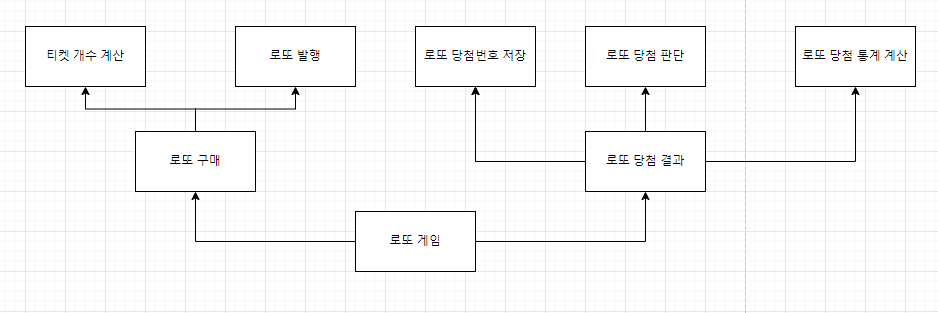

# 도메인
## 책임/역할 큰 틀

## 구성도
> 꼭 최종완성본 이미지를 붙이자!!!!
> 꼭 최종완성본 이미지를 붙이자!!!!
> 꼭 최종완성본 이미지를 붙이자!!!!
> 꼭 최종완성본 이미지를 붙이자!!!!
> 꼭 최종완성본 이미지를 붙이자!!!!
> 꼭 최종완성본 이미지를 붙이자!!!!

## 각 도메인 별 설명
> ***"도메인" : "역할"***
### I/O
- InputView : 입력뷰
- OutputView : 출력뷰
### 로또 게임
- LotteryController : 로또 게임 진행
- User : {구매한 여러개의 로또들},{구매액}을 가지고 있는 사용자 
- Lotto : 여러개의 로또 번호에 대한 일급 컬렉션 객체
### 로또 구매 :: 티켓 처리 / 로또 발행
- LotteryPurchaseController : 로또 구매 진행

- LotteryCountService : 티켓 개수 처리
- CashValidator : 금액에 대한 검증
- CashMapper : 금액에 대해 매핑
- LottoCountCalculator : 티켓 가격에 따른 티켓 개수 계산

- LotteryIssueService : 로또 발행 처리
- LottoIssuer : 로또 번호 생성자
- LottoSizePolicy : 로또 번호 개수 정책
- LottoNumberRangePolicy : 로또 번호 범위 정책
### 로또 당첨 :: 당첨 번호 저장 / 당첨 판단 / 이익률 통계
- LotteryAnswerController : 로또 당첨 진행

- LotteryAnswerNumberService : 로또 당첨번호 처리
- LottoAnswerNumberValidator : 로또 당첨번호 검증
- LottoAnswerNumberMapper : 로또 당첨번호 매핑
- LotteryAnswerService : 로또 보너스번호 처리
- LottoAnswerValidator : 로또 보너스번호 검증
- LottoAnswerMapper : 로또 보너스번호 매핑

- LotteryAnswerCheckService : 로또 당첨 판단
- WinningPolicy : 당첨 정책
- WinningPolicyWooWaCourse : 우아한테크코스 당첨 정책
- WinningMoneyCalculator : 등수 별 상금 배정

- LotteryRateService : 이익률 처리
- RateCalculator : 계산 정책에 따른 이익률 계산
- RatePolicy : 이익률 계산 정책

# 기능구현 리스트
> (선행)테스트케이스에 대한 (후행)구현에 대한 검증 이후 체크한다.  
- [x] 구입금액 입력뷰를 출력한다. 
- [x] 구입금액 입력을 받는다.
- [x] 구입금액 입력에 대한 예외 검증을 처리한다.
- [x] 구입금액 입력에 대한 매핑 처리한다.
- [x] 구입금액에 따라 티켓 개수를 계산한다.
- [x] 티켓 개수에 따라 티켓을 발행한다.
- [x] 아래 조건에 따라 티켓을 발행한다.
   - [x] 중복되지 않는 6개의 숫자
   - [x] 숫자의 범위는 1~45 사이
- [x] 발행받은 모든 티켓들을 포맷에 맞추어 출력한다.
- [x] 당첨번호 입력뷰를 출력한다.
- [x] 당첨번호를 입력받는다.
- [x] 당첨번호 입력에 대한 예외 검증을 처리한다.
- [x] 당첨번호를 파싱한다.
- [x] 보너스 번호를 입력받는다.
- [x] 보너스 번호 입력에 대한 예외 검증을 처리한다.
- [ ] 당첨 정책에 따른 당첨 등수를 확인한다.
- [ ] 당첨 등수에 따른 당첨 금액을 확인한다.
- [ ] 입력액과 당첨액에 따른 수익률을 계산한다.
  - [ ] 수익률 계산 시, 계산 정책에 따라 계산한다
  > 수익률은 소수점 둘째 자리에서 반올림한다. (ex. 100.0%, 51.5%, 1,000,000.0%)
- [ ] 당첨통계 포맷에 따라 당첨 정책과 당첨 등수와 당첨 금액을 출력한다.

# 예외사항 리스트
## 구입액 입력
- [ ] 숫자가 아닌 다른 문자가 오는 경우 예외처리한다.
- [ ] 구입금액 단위로 떨어지지 않는 경우, 예외처리한다.
## 당첨번호 입력
- [ ] 숫자와 ","가 아닌 다른 문자가 오는 경우 예외처리한다.
- [ ] 입력 로또 번호가 1미만인 경우 예외처리한다.
- [ ] 입력 로또 번호가 45초과인 경우 예외처리한다.
- [ ] ","를 기준으로 구분한 숫자의 개수가 6개가 아닌 경우 예외처리한다.
## 보너스 번호
- [ ] 숫자가 아닌 다른 문자가 오는 경우 예외처리한다.
- [ ] 입력 로또 번호가 1미만인 경우 예외처리한다.
- [ ] 입력 로또 번호가 45초과인 경우 예외처리한다.
## 예외메시지 처리
- [ ] 에러 메시지 처리는 "[ERROR]"로 시작해야한다.

# 이런 확장성을 생각해보았다.
- 모든 매직넘버는 변경가능하다.
  - 로또 번호의 숫자 범위
  - 1개의 티켓에 대한 번호 개수
  - 로또 1장의 가격
- 모든 정책(=기준)은 변경가능하다.
  - 당첨기준
  - 등수에 따른 당첨금액
  - 수익률 계산 기준

# 체크리스트
## 오버엔지니어링 여부
- [ ]  주어진 기능 + 확장성에만 집중하였는가

## 지난주차 피드백 체크리스트
- [ ]  MVC 간 분리도 떨어짐
- [ ]  컨트롤러의 역할이 너무 비대함
- [ ]  DI 처리해야하는 명확한 이유가 불명확함
- [ ]  싱글톤을 써야하는 명확한 이유가 불명확함
- [ ]  매직넘버 처리
- [ ]  Pattern 매칭에 대해서는 새로 생성하지 말고 캐싱할 것

## 시도사항
- [ ]  너무 MVC에 종속되어 생각하지 말기
- [ ]  정적 팩토리 메서드를 사용할 때와 사용하지 않을 때를 구분지었다 :: 너무 무분별하게 사용하지 않도록 함
- [ ]  최대한 매직넘버는 ENUM으로 따로 추출하였다.
- [ ]  대신, 최대한 객체지향적 관점으로 유연하게 설계하려고 노력하자
- [ ]  InputView, OutputView 나누기
- [ ]  시퀀스다이어그램과 유스케이스를 통해 명확한 도메인 분석 프로세스를 거칠 것
- [ ]  Tool을 사용하여 추출한 도메인,시퀀스,유스케이스를 README에 기입 => 가독성,리팩토링 향상
- [ ]  { 컬렉션 + 로직 } 에 대해서는 First Class Collection을 사용할 것
    - [일급컬렉션(First Clss Collection)? 언제 쓰고 왜 써야할까?](https://www.notion.so/First-Clss-Collection-7b093eef1f3c442e9ee2e690d954f7ef?pvs=21) 
- [ ]  테스트 시, 하나의 케이스에 대한 여러 데이터셋들은 `@ParameterizedTest`, `@ValueSource` 어노테이션을 사용할 것

## 리팩토링
- [ ]  도메인에 대해서
    - [ ]  역할 분리가 잘 되어있는가
    - [ ]  기입한 역할을 충실히 이행했는가
- [ ]  컨트롤러/서비스 레이어에 대해서
    - [ ]  기능구현을 충실히 이행했는가?
        - [ ]  어색한 구현은 없는가
    - [ ]  시스템에 도메인이 짙게 결합되어있는가
    - [ ]  주어진 추가요구사항을 지켰는가
- [ ]  테스트에 대해서
    - [ ]  레이어,도메인,각 메서드에 대한 테스트를 하였는가?
    - [ ]  각 케이스를 촘촘히 따졌는가?
    - [ ]  검증로직이 유효한 구현인가?
   
## 구현제한조건 체크리스트
- [ ] Java 코드 컨벤션 준수했는가 ?
- [ ] 모든 테스트 성공했는가 ?
- [ ] indent depth 3이상을 넘지 않았는가 ?
- [ ] 3항 연산자 사용하지 않았는가 ?
- [ ] SRP(함수가 한 가지 일)을 준수했는가 ?
- [ ] 함수(또는 메서드)의 길이가 15라인을 넘어가지 않도록 구현했는가?
- [ ] else문을 사용하지 않았는가 ?
- [ ] ENUM을 적용했는가 ? 
- [ ] 모든 도메인과 레이어에 테스트를 구현했는가 ?
  > UI 로직은 제외한다.