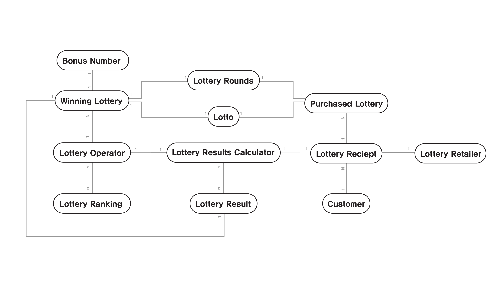
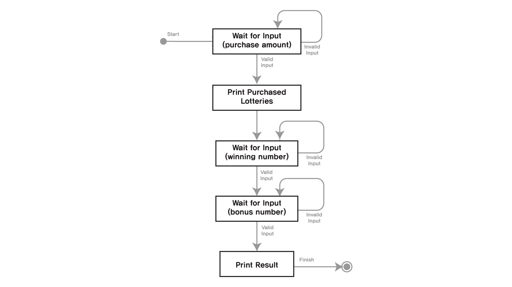
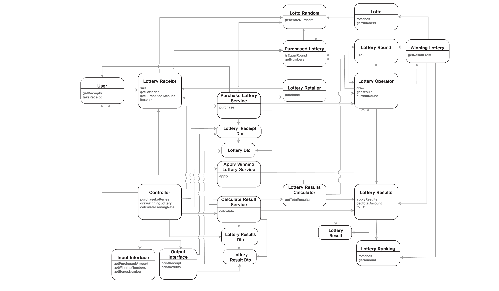

### 설계

---
#### 기능 목록 
- 로또 구입 금액을 입력 받는다 
  - [X] "구입금액을 입력해 주세요."를 출력한다 
  - [X] 로또 구입 금액이 정수(Long)로 변환할 수 없을 시 IllegalArgumentException을 발생시킨다
  - [X] 로또 구입 금액이 정수(Long)로 변환할 수 없을 시 "[ERROR]"로 시작하는 에러 메시지 내용을 출력한다
  - [X] 로또 구입 금액이 정수(Long)로 변환할 수 없을 시 예외를 발생시킨 후 종료되지 않는다
  - [X] 로또 구입 금액이 음수일 때 IllegalArgumentException을 발생시킨다
  - [X] 로또 구입 금액이 음수 일 때 "[ERROR]"로 시작하는 에러 메시지 내용을 출력한다
  - [X] 로또 구입 금액이 음수 일 때 예외를 발생시킨 후 종료되지 않는다
  - [X] 로또 구입 금액이 1000원으로 나누어 떨어지지 않는 경우, IllegalArgumentException을 발생시킨다
  - [X] 로또 구입 금액이 1000원으로 나누어 떨어지지 않는 경우, "[ERROR]"로 시작하는 에러 메시지 내용을 출력한다
  - [X] 로또 구입 금액이 1000원으로 나누어 떨어지지 않는 경우, 예외 발생 후 종료되지 않는다
  
   
  
- 로또 구입 금액을 성공적으로 입력 받은뒤 발행한 로또의 번호를 출력한다
  - [X] 로또 구입이 입력 받은 뒤 "n개를 구매했습니다."를 출력한다  
  - [X] 발행한 로또의 개수는 구입 금액에서 1000을 나눈 몫의 갯수이다.
  - [X] 각 로또 번호가 "[n, n, n, n, n, n]"포맷으로 출력된다
  - [X] 각 로또 번호가 오름차순으로 출력된다.
  - [X] 각 로또의 번호는 중복되지 않는 6개의 숫자로 이루어져 있다.
  - [X] 각 로또의 숫자는 1부터 45사이의 숫자이다.
  
   
  
- 로또 번호를 입력 받는다
  - [X] "당첨 번호를 입력해 주세요."를 출력한다 
  - [X] 구분자(",")로 구분될 수 없는 문자열인 경우 IllegalArgumentException을 발생시킨다
  - [X] 구분자(",")로 구분될 수 없는 문자열인 경우 "[ERROR]"로 시작하는 메시지 내용을 출력시킨다
  - [X] 구분자(",")로 구분될 수 없는 문자열인 경우 예외발생 후 종료되지 않는다
  - [X] 입력받은 문자열의 토큰이 정수형으로 변환할 수 없으면 IllegalArgumentException을 발생시킨다
  - [X] 입력받은 문자열의 토큰이 정수형으로 변환할 수 없으면 "[ERROR]"로 시작하는 메시지 내용을 출력시킨다
  - [X] 입력받은 문자열의 토큰이 정수형으로 변환할 수 없으면 예외발생 후 종료되지 않는다
  - [X] 각 당첨번호의 숫자는 1부터 45사이의 숫자가 아니면 IllegalArgumentException을 발생시킨다
  - [X] 각 당첨번호의 숫자는 1부터 45사이의 숫자가 아니면 "[ERROR]"로 시작하는 메시지 내용을 출력시킨다
  - [X] 각 당첨번호의 숫자는 1부터 45사이의 숫자가 아니면 예외발생 후 종료되지 않는다
  - [X] 당첨번호가 중복되지 않는 6개의 숫자로 이루어지지 않는다면 IllegalArgumentException을 발생시킨다
  - [X] 당첨번호가 중복되지 않는 6개의 숫자로 이루어지지 않는다면 "[ERROR]"로 시작하는 에러 메시지 내용을 출력한다
  - [X] 당첨번호가 중복되지 않는 6개의 숫자로 이루어지지 않는다면 예외발생 후 종료되지 않는다

 

- 보너스 번호를 입력 받는다
  - [X] "보너스 번호를 입력해 주세요."를 출력한다 
  - [X] 입력이 정수형으로 변환할 수 없으면 IllegalArgumentException을 발생시킨다
  - [X] 입력이 정수형으로 변환할 수 없으면 "[ERROR]"로 시작하는 에러 메시지 내용을 출력한다
  - [X] 입력이 정수형으로 변환할 수 없으면 예외발생 후 종료되지 않는다
  - [X] 보너스 번호가 1부터 45 사이의 숫자가 아니라면 IllegalArgumentException을 발생시킨다
  - [X] 보너스 번호가 1부터 45 사이의 숫자가 아니라면 "[ERROR]"로 시작하는 에러 메시지 내용을 출력한다
  - [X] 보너스 번호가 1부터 45 사이의 숫자가 아니라면 예외발생 후 종료되지 않는다
  - [X] 보너스 번호가 당첨 번호에 있으면 IllegalArugmnetException을 발생시킨다 
  - [X] 보너스 번호가 당첨 번호에 있으면 "[ERROR]"로 시작하는 에러 메시지 내용을 출력한다 
  - [X] 보너스 번호가 당첨 번호에 있으면 예외 발생 후 종료되지 않는다

 

- 당첨 내역을 계산한다
  - [X] 로또 별 당첨 등수및 당첨 금액을 계산한다. 
  - [X] 총 당첨 금액을 계산한다
  - [X] 총 수익률을 계산한다
  
- 당첨 통계를 출력한다 
  - [X] "당첨 통계"와 "---"를 출력한다
  - [X] 각 등수를 모두 출력한다
  - [X] 각 등수를 등수 출력 포맷에 맞게 출력한다
  - [X] 총 수익률을 수익률 출력 포맷에 맞게 출력한다 

#### 초기 도메인 모델 다이어그램

* 고객 (Customer)
* 영수증 (Lotto Tickets)
* 발행된 로또 (Purchased Lottery)
* 로또 (Lotto)
* 로또 판매점 (Lottery Retailer)
* 이번 회차 당첨 로또 (Winning Lottery)
* 로또 시행사 (Lottery operator)
* 로또 결과 계산기 (Lottery Result Calculator)
* 로또 등수 (Lottery Ranking)
* 로또 회차 (Lottery Rounds)
* 보너스 번호(Bonus Number)

#### 초기 도메인 상태 다이어그램 

1. 상태 
   * Wait For Input(purchase amount) : 복권 구매 금액을 입력 받는다
   * Print Purchased Lotteries : 구매한 복권들을 출력한다
   * Wait For Input(winning number) : 우승 번호를 입력 받는다
   * Wait For Input(bonus number) : 보너스 번호를 입력 받는다
   * Print Result : 최종 결과와 수익률을 출력한다
2. 트리거
  * Invalid Input : 유효하지 않은 입력을 한다 
  * Valid Input : 유효한 입력을 한다

### 최종 결과물

