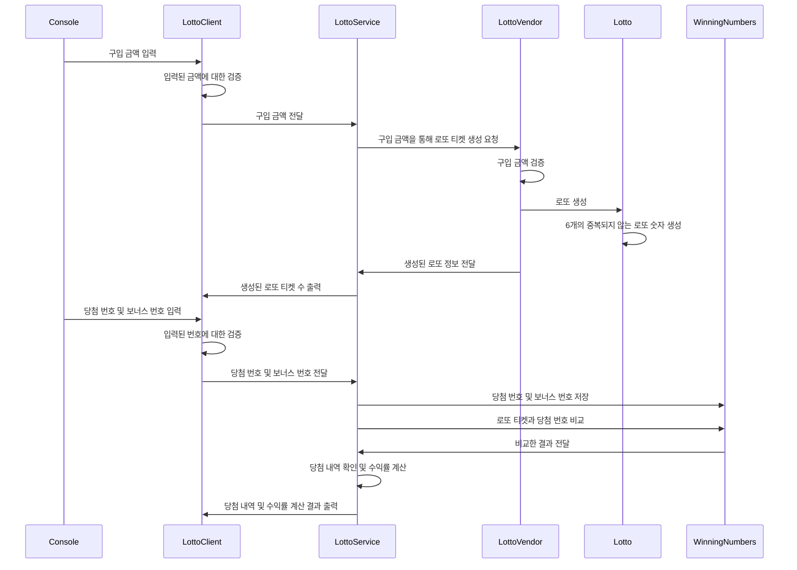

# 💲 로또

## ⭐요구 사항

### **🚀기능 요구 사항**

- 로또 번호의 숫자 범위는 1 ~ 45 까지
- 1개의 로또를 발행할 때 중복되지 않는 6개의 숫자를 뽑는다.
- 당첨 번호 추첨 시 중복되지 않는 숫자 6개와 보너스 번호 1개를 뽑는다.
- 당첨은 1등부터 5등까지 있다.
    - **1등** :  6개 번호 일치 / 2,000,000,000원
    - **2등** :  5개 번호 + 보너스 번호 일치 / 30,000,000원
    - **3등** :  5개 번호 일치 / 1,500,000원
    - **4등** :  4개 번호 일치 / 50,000원
    - **5등** :  3개 번호 일치 / 5,000원
- 로또 구입 금액을 입력시 구입 금액에 해당하는 만큼 로또 발행
- 로또 1장의 가격은 1,000원
- 당첨 번호와 보너스 번호를 입력받는다.
- 사용자가 구매한 로또 번호와 당첨 번호를 비교하여 당첨 내역 및 수익률을 출력하고 로또 게임을 종료한다.
- 사용자가 잘못된 값을 입력할 경우`IllegalArgumentException`를 발생시키고, "[ERROR]"로 시작하는 에러 메시지를 출력 후 그 부분부터 입력을 다시 받는다.
    - `Exception`이 아닌`IllegalArgumentException`,`IllegalStateException`등과 같은 명확한 유형을 처리한다.

### ⌨️입출력 요구 사항

⌨️ **입력**

- **로또 구입 금액** 입력
    - 구입 금액은 1,000 원 단위로 입력
    - 1,000원으로 나누어 떨어지지 않는 경우 예외처리

    ```
    구입금액을 입력해 주세요.
    8000
    ```

- **당첨 번호** 입력
    - 당첨 번호는 쉼표(,)를 기준으로 구분

    ```
    당첨 번호를 입력해 주세요.
    1,2,3,4,5,6
    ```

- **보너스 번호** 입력

    ```
    보너스 번호를 입력해 주세요.
    7
    ```


🖥️ **출력**

- 발행한 **로또 수량 및 번호**를 출력
    - 로또 번호는 오름차순하여 정렬후 보여준다.

    ```
    8개를 구매했습니다.
    [8, 21, 23, 41, 42, 43] 
    [3, 5, 11, 16, 32, 38] 
    [7, 11, 16, 35, 36, 44] 
    [1, 8, 11, 31, 41, 42] 
    [13, 14, 16, 38, 42, 45] 
    [7, 11, 30, 40, 42, 43] 
    [2, 13, 22, 32, 38, 45] 
    [1, 3, 5, 14, 22, 45]
    ```

- **당첨 내역** 출력

    ```
    당첨 통계
    ---
    3개 일치 (5,000원) - 1개
    4개 일치 (50,000원) - 0개
    5개 일치 (1,500,000원) - 0개
    5개 일치, 보너스 볼 일치 (30,000,000원) - 0개
    6개 일치 (2,000,000,000원) - 0개
    ```

- **수익률** 출력
    - 소수점 둘째 자리에서 반올림한다.

    ```
    총 수익률은 62.5%입니다.
    ```

- 예외 상황시 **에러 문구** 출력
    - 에러 문구는 <span style='color:red'>[ERROR]</span> 로 시작

    ```
    [ERROR] 로또 번호는 1부터 45 사이의 숫자여야 합니다.
    ```


### ⚙️프로그래밍 요구 사항

- `JDK 17` 버전에서 실행 가능 여부
- 프로그램 실행 시작점의 Application의 `main()`
- build.gradle 파일 변경 ❌
- [**Java 코드 컨벤션**](https://github.com/woowacourse/woowacourse-docs/tree/main/styleguide/java) 가이드 준수
- 프로그램 종료 시 `System.exit()` 호출하지 않는다 ❌
- ApplicationTest의 모든 테스트 성공
- 프로그래밍 요구 사항에서 달리 명시하지 않는 한 파일, 패키지 이름 수정 / 이동 ❌
- `indent(인덴트, 들여쓰기) depth`를 **3**이 넘지 않도록 구현한다. 2까지만 허용한다.
    - 예를 들어 while문 안에 if문이 있으면 들여쓰기는 2이다.
    - 함수를 분리하자!!!!
- 3항 연산자를 쓰지 않는다.
- 함수(또는 메서드)가 한 가지 일만 하도록 최대한 작게 만들어라.
- JUnit 5와 AssertJ를 이용하여 본인이 정리한 기능 목록이 정상 동작함을 테스트 코드로 확인한다.

### 🧸추가 요구 사항

- [ ]  함수(또는 메서드)의 길이가 **15라인**을 넘어가지 않도록 구현한다.
    - 함수(또는 메서드)가 한 가지 일만 잘 하도록 구현한다.
- [ ]  else 예약어를 사용하지 않는다. ❌
    - if 조건 절에서 값을 return하는 방식으로 구현하자.
    - switch / case 도 허용하지 않는다. ❌
- [ ]  Java Enum을 적용한다
- [ ]  도메인 로직에 단위 테스트를 구현한다. 단, UI 로직은 제외
    - 핵심 로직을 구현하는 코드와 UI를 담당하는 로직을 분리해 구현
    - `test/java/lotto/LottoTest` 를 참고하여 학습후 구현

## 🧑🏻‍💻구현

### 〰️Sequence



### 🤖도메인 기능 목록

- 🤑 **Lotto**
    - 제공된 Lotto 클래스를 활용해 구현
    - numbers의 접근 제어자인 **private**를 변경할 수 없다. **❌**
    - Lotto에 **필드(인스턴스 변수)**를 추가할 수 없다. ❌
    - Lotto의 **패키지 변경**은 가능 ⭕
    - [ ]  6개의 중복되지 않는 로또 숫자를 가진다.
  

- 🔢 **Lotto Number**
    - [ ]  로또 번호는 1 ~ 45개의 범위안에서 생성된다.
  

- ✔️ **Winning Number**
    - [ ]  입력된 당첨번호와 보너스 번호이 정상적인지 검증을 한다. 잘못된 경우 예외를 발생시킨다.
        - 당첨 번호와 보너스 번호는 1 ~ 45개의 범위안에서 생성된다.
        - 당첨 번호는 6개, 보너스 번호는 1개를 가진다.
    - [ ]  로또 당첨번호는 중복되지 않는 6개의 숫자와 보너스 숫자 1개를 가진다.
    - [ ]  로또 티켓과 자신의 당첨번호, 보너스 번호를 비교한다.
  

- **🏪 Lotto Vender**
    - [ ]  로또 티켓 한 장의 가격은 1,000원이다.
    - [ ]  사용자가 입력한 구입 금액이 정상적인지 검증한다. 잘못된 경우 예외를 발생시킨다.
    - [ ]  로또 구입 금액에 해당하는 만큼 로또를 발행한다.
  

- 💼 **LottoService**
    - [ ]  구매한 로또들과 당첨 번호를 비교한다.
    - [ ]  비교한 결과를 통해 당첨 내역을 계산한다.
    - [ ]  수익률을 계산한다.
  

- 🔗 **LottoClient**
    - [ ]  입력받은 로또 구입 금액에 대한 검증을 한다.
    - [ ]  생성된 로또에 대한 정보를 출력한다.
    - [ ]  입력받은 당첨 번호에 대한 검증을 한다.
    - [ ]  입력받은 보너스 번호에 대한 검증을 한다.
    - [ ]  당첨 내역 및 수익률 결과를 출력한다.
  

- **⌨️ InputView**
    - [ ]  로또 구입 금액을 입력받는다.
    - [ ]  당첨 번호를 입력받는다.
    - [ ]  보너스 번호를 입력받는다.
  

- 🖥️ **OutputView**
    - [ ]  발행한 로또 수량 및 번호 출력
        - 로또 번호는 오름 차순으로 정렬
    - [ ]  당첨 내역을 출력
    - [ ]  수익률 출력
        - 소수점 둘째 자리에서 반올림
    - [ ]  예외 상황시 에러 문구 출력
        - 에러 문구는 [ERROR] 로 시작