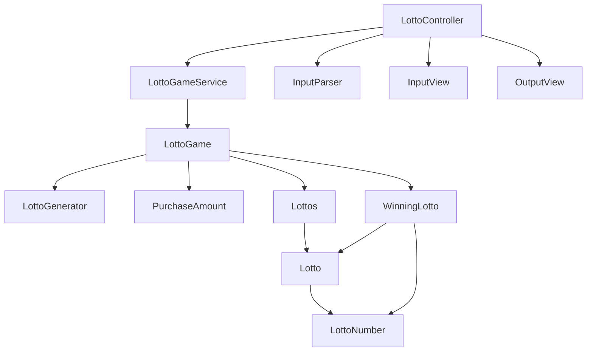

### 로또 게임 의존 방향

### 로또 게임 기능 목록

> 사용자가 잘못된 값을 입력할 경우 `IllegalArgumentException`을 발생시키고, 
"[ERROR] " 로 시작하는 에러 메세지를 출력 후 그 부분부터 입력을 다시 받는다.

- 로또 구입 금액을 입력받는다.
    - [x] "구입금액을 입력해 주세요." 출력한다.
        - 구입 금액 검증
            - [x] 숫자가 아닌 문자가 포함된 경우.
            - [x] 구입 금액이 0인 경우.
            - [x] 1,000원으로 나누어 떨어지지 않는 경우.
- 입력받은 로또 구입 금액을 1,000으로 나눈 몫 n만큼 로또를 발급한다.
    - [x] "%d개를 구매했습니다." 출력한다.
    - [x] 무작위로 1~45 범위의 중복없는 로또 번호 6자리를 한 묶음으로 n장 발급한다.
    - [x] 발급한 로또 번호 6자리를 한 묶음으로 출력한다.
- 당첨 번호를 입력받는다.
    - [x] "당첨 번호를 입력해 주세요." 출력한다.
    - [x] 1~45 범위의 중복없는 6자리 수를 콤마를 구분자로 입력받는다.
        - 당첨 번호 검증
            - [x] 숫자가 정확히 6개가 아닌 경우.
            - [x] 숫자가 중복된 경우.
            - [x] 숫자와 콤마 이외의 문자를 입력한 경우.
            - [x] 1~45 범위를 벗어난 수를 입력한 경우.
- 보너스 번호를 입력받는다.
    - [x] "보너스 번호를 입력해 주세요." 출력한다.
    - [x] 1~45 범위의 1자리 수를 입력받는다.
        - 보너스 번호 검증
            - [x] 당첨 번호에 이미 포함된 수를 입력한 경우.
            - [x] 숫자가 정확히 1개가 아닌 경우.
            - [x] 숫자 이외의 문자를 입력한 경우.
            - [x] 1~45 범위를 벗어난 수를 입력한 경우.
- 구매한 로또 번호를 입력한 당첨 번호, 보너스 번호와 비교하여 등수를 얻는다.
    - [x] 출력문구, 일치하는 숫자 갯수, 당첨 금액을 저장하여 비교한다.
        - [x] "3개 일치 (5,000원) - %d개"
        - [x] "4개 일치 (50,000원) - %d개"
        - [x] "5개 일치 (1,500,000원) - %d개"
        - [x] "5개 일치, 보너스 볼 일치 (30,000,000원) - %d개"
        - [x] "6개 일치 (2,000,000,000원) - %d개"
    - [x] 등수별 당첨 갯수를 저장한다.
    - [x] 당첨된 등수별 금액과 갯수를 연산하여 수익률을 구한다.
- 당첨 내역을 출력한다.
    - [x] "당첨 통계" 출력한다.
    - [x] "n개 일치 (m원) - %d개" 형식으로 5등부터 내림차순으로 출력한다.
- 총 수익률을 출력한다.
    - [x] "총 수익률은 %.1f%입니다." 출력한다.
    - [x] 수익률은 소수점 둘째 자리에서 반올림한다.
