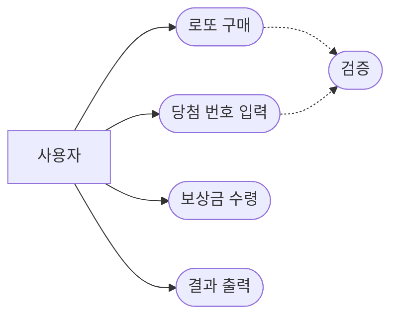
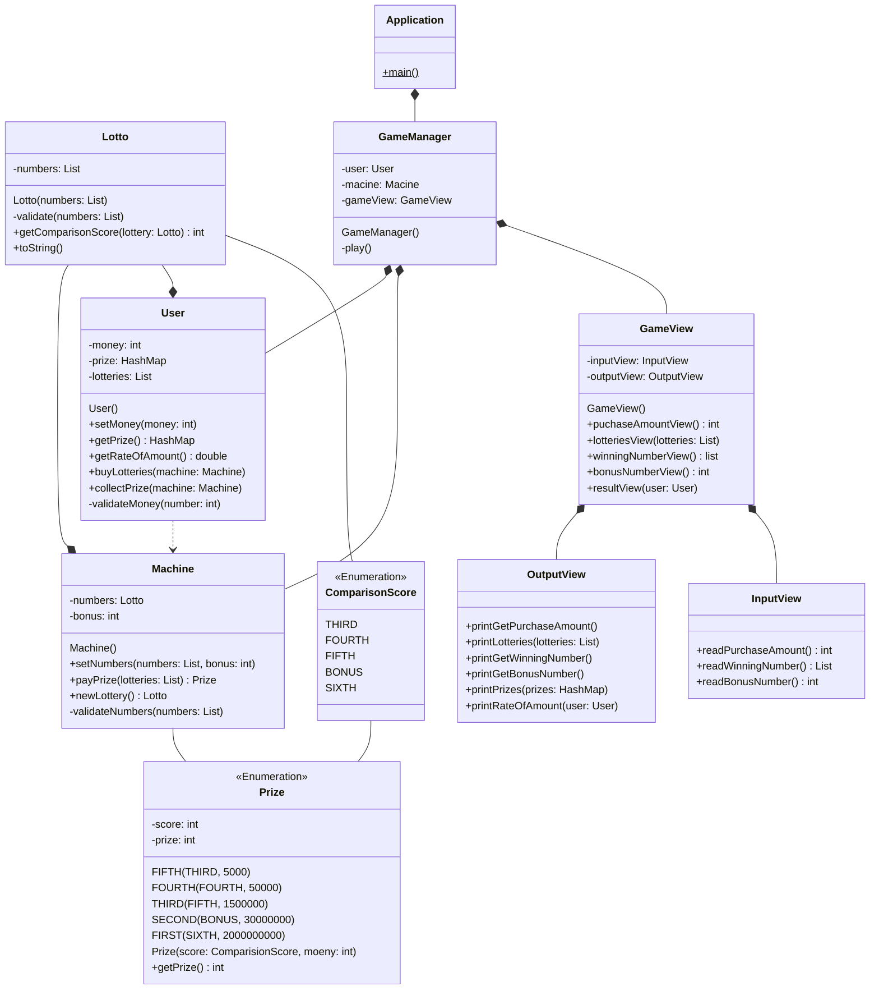
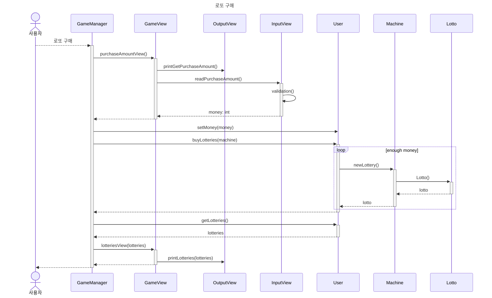
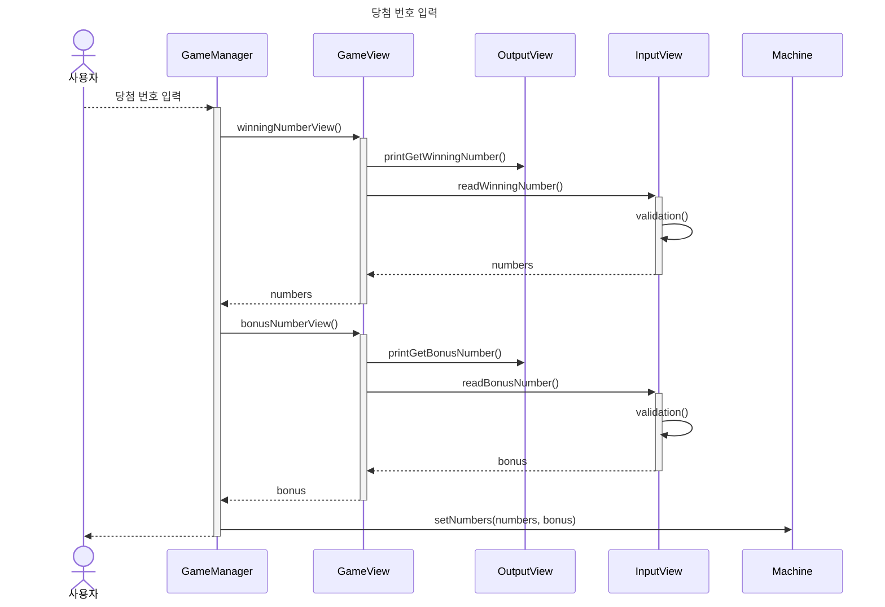
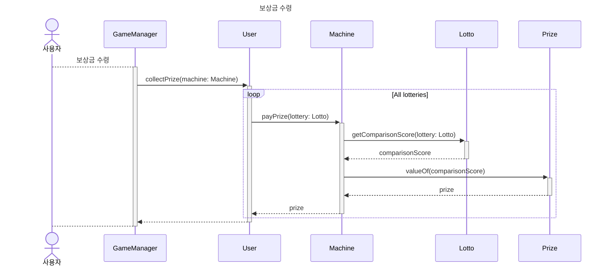
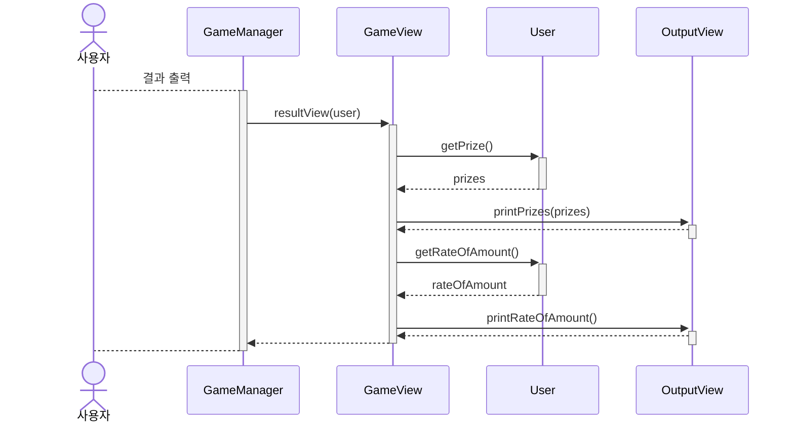

# 요구사항 분석
## 도메인 사전
| 명칭     | 타입   | 설명                                                                                                      |
|--------|------|---------------------------------------------------------------------------------------------------------|
| 로또 발행  | 기능   | **사용자**가 **로또기계**에게 **로또**를 발급 받음.                                                                         |
| 로또     | 객체   | 1~45사이의 중복되지 않은 6가지 번호를 가짐.                                                                             |
| 로또 추첨  | 기능   | **로또기계**는 **사용자**에게 **로또** 하나와 **로또** 번호와 중복되지 않는 보너스 번호 1개를 입력받음.                                                     |
| 당첨     | 프로세스 | **로또기계**는 **발행된 로또**와 **추첨한 로또**를 **결과 조회**하여 **당첨금**을 **지급**함.                                                                |
| 로또 기계  | 객체   | **로또**를 **발행**하고 **결과를 조회**하고 **당첨금**을 **지급**함.                                                                            |
| 결과 조회  | 기능   | **로또기계**가 **발행 로또**와 **추첨 로또**를 비교하여 같은 숫자 개수를 비교함.                                                                |
| 당첨금    | 객체   | 6개 일치-2,000,000,000원   5개 + 보너스 일치-30,000,000원   5개 일치-1,500,000원   4개 일치-50,000원   3개 일치-5,000원 | 
| 사용자    | 객체   | 가진 금액만큼 **로또를 발행**하고 **로또 당첨**을 진행한다.                                                                          |
| 당첨금 지급 | 기능   | **로또기계**가 **결과 조회**에 따라 **당첨금**을 지급함.                                                                              |

## 요구사항 명세
### 제약사항

1. JDK 17 버전에서 실행 가능해야 한다.
2. 외부 라이브러리를 사용하지 않는다.
3. 프로그램 종료 시 `System.exit()`를 호출하지 않는다.
4. 요구 사항에서 달리 명시하지 않는 한 파일, 패키지 이름을 수정하거나 이동하지 않는다.
5. `camp.nextstep.edu.missionutils` 에서 제공하는 `Randoms` 및 `Console` API를 사용하여 구현해야 한다.
    1. Random 값 추출은 `camp.nextstep.edu.missionutils.Randoms`의 `pickUniqueNumbersInRange()`를 활용한다.
    2. 사용자가 입력하는 값은 `camp.nextstep.edu.missionutils.Console`의 `readLine()`을 활용한다.
6. indent depth를 3이 넘지 않도록 구현한다.
7. 3항 연산자를 쓰지 않는다.
8. 함수 혹은 메서드가 한 가지 일만 하도록 최대한 작게 만든다.
9. JUnit 5와 AssertJ를 이용하여 정리한 기능 목록이 정상 동작함을 테스트 코드로 확인한다.
10. Java Enum을 적용한다.
11. else 예약어를 쓰지 않는다.
12. 도메인 로직 단위 테스트를 구현해야 한다. 단, UI 로직은 제외한다.
    1. 핵심 로직을 구현하는 코드와 UI를 담당하는 로직을 분리해 구현한다.
    2. 단위 테스트 작성이 익숙하지 않다면 `test/java/LottoTest` 를 참고하여 학습한 후 테스트를 구현한다.

### 기능요구

**Java 코드 컨벤션을 준수한다.**

| 기능종류 | 구현여부 | ID              | 기능명         | 설명                                                                                                                                                                                                                                                                                              |
|------|------|-----------------|-------------|-------------------------------------------------------------------------------------------------------------------------------------------------------------------------------------------------------------------------------------------------------------------------------------------------|
| 입력   | O    | I-01(Input)     | 로또 구입 금액 입력 | 사용자로부터 로또 구입 금액을 1,000원 단위로 입력 받는다.                                                                                                                                                                                                                                                             |
| 입력   | O    | I-02(Input)     | 당첨 번호 입력     | 사용자로부터 로또 당첨 번호를 쉼표(,)를 기준으로 구분하여 입력받는다.                                                                                                                                                                                                                                                        |
| 입력   | O    | I-03(Input)     | 보너스 번호 입력     | 사용자로부터 보너스 번호를 입력받는다.                                                                                                                                                                                                                                                                           |
| 검증   | O    | V-01(Validation) | 로또 구매 금액 검증  | 금액이 1,000 원으로 나누어 떨어지지 않으면 IllegalArgumentException 을 발생시키고 .[ERROR]로 시작하는 에러 메시지를 출력 후 입력을 다시 받는다.                                                                                                                                                                                             |
| 검증   | O    | V-02(Validation) | 당첨 번호 입력 검증       | 1. 입력한 번호가 6개가 아니라면 IllegalArgumentException 을 발생시키고 [ERROR]로 시작하는 에러 메시지를 출력 후 입력을 다시 받는다.   2. 입력한 번호가 중복되면 IllegalArgumentException을 발생시키고 [ERROR]로 시작하는 에러 메시지를 출력 후 입력을 다시 받는다.   3. 입력한 번호가 1~45사이의 정수가 아니라면 IllegalArgumentException을 발생시키고 [ERROR]로 시작하는 에러 메시지를 출력 후 입력을 다시 받는다. |
| 검증   | O    | V-03(Validation) | 보너스 번호 검증         | 1. 입력한 번호가 당첨 번호와 중복되면 IllegalArgumentException을 발생시키고 [ERROR]로 시작하는 에러 메시지를 출력 후 입력을 다시 받는다.   2. 입력한 번호가 1~45 사이의 정수가 아니라면 IllegalArgumentException을 발생시키고 [ERROR]로 시작하는 에러 메시지를 출력 후 입력을 다시 받는다.                                                                                          |
| 진행   | O    | P-01(Process)   | 로또 발행             | 로또기계가 중복되지 않는 6개의 번호를 반환한다.                                                                                                                                                                                                                                                                     |
| 진행   | O    | P-02(Process)   | 결과 조회            | 로또기계가 사용자에게 입력 받은 당첨 번호와 발행된 로또들을 비교(1)하여 일치 여부에 따른 당첨금을 반환(2)한다.                                                                                                                                                                                                                               |
| 진행   | O    | P-03(Process)   | 당첨금 수령           | 사용자가 로또 기계에게 로또 결과에 따른 당첨금을 수령한다.                                                                                                                                                                                                                                                               |
| 출력   | O    | O-01(Output)    | 발행 로또 출력         | 발행한 로또 수량 및 번호를 출력한다. 로또 번호는 오름차순으로 출력한다.   ”x개를 구매했습니다.   [1, 2, 3, 4, 5, 6]”                                                                                                                                                                                                            |
| 출력   | O    | O-02(Output)    | 당첨 내역 출력         | 당첨 내역을 출력한다.   ”당첨 통계   ---   3개 일치 (5,000원) - a개   4개 일치 (50,000원) - b개   5개 일치 (1,500,000원) - c개   5개 일치, 보너스 볼 일치 (30,000,000원) - d개   6개 일치 (2,000,000,000원) - e개”                                                                                                     |
| 출력   |      | O-03(Output)    | 수익률 출력           | 총 수익률을 출력한다. 수익률은 소수점 두 자리에서 반올림한다.   ”총 수익률은 x%입니다.”                                                                                                                                                                                                                                        |
| 출력   | O    |  O-04(Output)   | 입력 안내 문구 출력      | 1. 구입금액 입력 - “구입금액을 입력해 주세요.”   2. 당첨번호 입력 - “당첨 번호를 입력해 주세요.”   3. 보너스 번호 입력 - “보너스 번호를 입력해 주세요.”                                                                                                                                                                                        |

## usecase diagram

## class Diagram

## sequence Diagram

