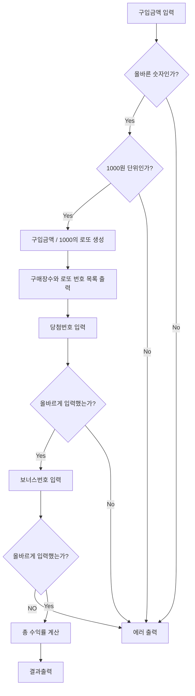
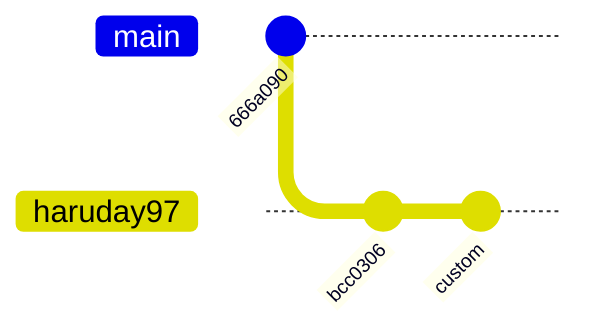

# 기능 명세

## 목차

## Flowchart



## 기능 목록

- 로또 생성 기능
    - 중복하지 않는 숫자 생성 기능
    - 보너스번호 생성 기능
- 당첨 판별 기능
    - 당첨 여부 판별 기능
    - 2등 여부 판별 기능
- 유저 입력 기능
    - 로또 구입 금액 입력 기능
    - 당첨번호 입력 기능
    - 보너스번호 입력 기능
- 출력 기능
    - 발행한 로또 수량 및 번호 출력 기능
    - 당첨내역 출력 기능
    - 수익률 출력 기능

## Gitgraph



## 프로젝트 구조

```
src
  ├─main
  │  └─java
  │      └─lotto
  │          ├─config
  │          │   └─LottoConfig
  │          ├─constants
  │          ├─controller
  │          │   └─LottoConfig
  │          ├─domain
  │          │   ├──BonusNumber
  │          │   ├──Lotto
  │          │   ├──LottoGenerator
  │          │   ├──LottoResult
  │          │   ├──Lottos
  │          │   ├──Money
  │          │   ├──Prize
  │          │   ├──Quantity
  │          │   ├──RandomLottoGenerator
  │          │   └──WinningLotto
  │          ├─exception
  │          │   ├──Errors
  │          │   ├──FormatException
  │          │   └──LottoException
  │          └─view
  │              ├──InputView
  │              └──OutputView
  └─test
      └─java
          └─lotto
```

## 예외

- 유저입력
    - 로또 구매시
        - [x] 숫자가 아닌 값을 입력했을 경우
        - [x] 1000으로 나누어지지 않을 경우
        - [x] 구매 한도보다 큰 수를 입력했을 경우
    - 당첨번호 입력시
        - [x] 숫자가 아닌 값을 입력했을 경우
        - [x] 입력한 숫자의 개수가 6개가 아닌 경우
        - [x] 범위를 벗어난 수일 경우
        - [x] 중복된 수를 입력했을 경우
    - 보너스번호 입력시
        - [x] 숫자가 아닌 값을 입력했을 경우
        - [x] 입력한 숫자의 개수가 1개가 아닌 경우
        - [x] 범위를 벗어난 수일 경우
        - [x] 당첨번호와 중복된 수를 입력했을 경우
- 로또생성
    - 로또 생성시
        - [x] 중복된 숫자를 생성했을 경우
        - [x] 생성한 숫자의 개수가 6개가 아닌 경우
        - [x] 범위를 벗어난 숫자를 생성했을 경우

### 예외가 아닌경우

- 유저입력
    - 로또 구매시
        - 유저가 구분을 위해 쉼표를 넣었을 경우
        - 유저가 숫자의 시작이나 끝에 공백을 넣었을 경우

## 적용해 볼 것

- 정적팩토리
- 열거형

## 소감

### 캐싱

### 전략 패턴 사용 여부

### 내부 상태를 갖는 컨트롤러

### 오버 엔지니어링에 대한 고찰

