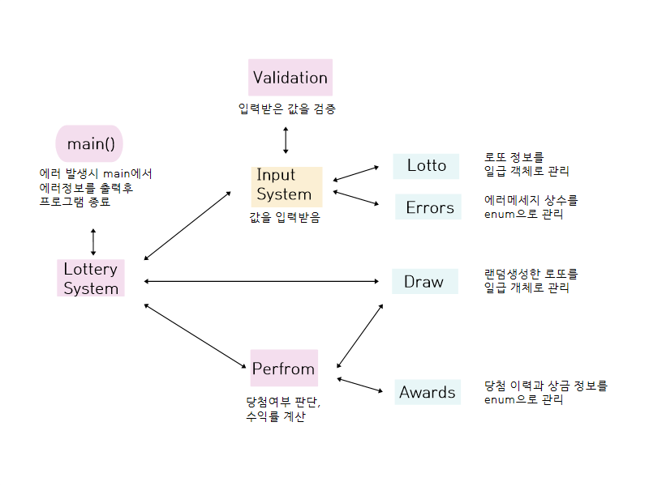

# java-lotto-6 개요

입력받은 금액과 당첨번호에 따라 당첨 결과와 수익률을 출력하는 시스템입니다. 
<br>
# 구현기능 상세

``` java
public static void main(String[] args) {  
    LotterySystem lottery = new LotterySystem();  
    try {  
        lottery.input();  
        lottery.draw();  
        lottery.getNumbers();  
        lottery.bonus();  
        lottery.perform();  
        lottery.result();  
    } catch (Exception e) {  
        System.out.println(e.getMessage());  
    }  
}
```
1. 다음과 같이 try-catch 구조를 main 함수에 적용하였습니다.<br>
	- try 에서 동작하는 중 에러가 날 경우 main으로 나와, 각 에러에 해당하는 메세지를 출력하고 프로그램을 종료하도록 작성했습니다. <br><br>
2. 기능의 동작 순서는 다음과 같습니다. <br>
		-  `lottery.input()` : 금액을 입력받고 숫자를 검증<br>
		-  `lottery.draw()` : 로또번호를 랜덤으로 생성하여 저장<br>
		-  `lottery.getNumbers()` : 당첨번호 입력 및 숫자 검증<br>
		-  `lottery.bonus()` : 보너스 번호 입력받고 숫자 검증<br>
		-  `lottery.perform()` : 당첨번호/보너스번호와 랜덤번호를 비교하여 당첨 집계<br>
		-  `lottery.result()` : 수익률 계산하여 당첨결과 출력<br>

# 클래스 구성

패키지의 구성은 다음과 같습니다.

```
📁 main/java/lotto
	ㄴ📁model
	    ㄴ☕ Awards       
	    ㄴ☕ Draw       
	    ㄴ☕ Errors        
	    ㄴ☕ Lotto    
	ㄴ☕ Application
	ㄴ☕ InputSystem
	ㄴ☕ LotterySystem
	ㄴ☕ Perform
	ㄴ☕ Validation
```

클래스 간 관계는 다음과 같습니다.



- `Application` : 에러 발생시 main에서 에러정보를 출력 후 프로그램 종료
- `InputSystem` : 값을 입력받음
- `LotterySystem` : 세부 기능을 관리하는 상위 함수
- `Perform` : 당첨여부 판단, 수익률 계산
- `Validation` : 입력받은 값을 검증함
-  `Awards` : 당첨 이력과 상금 정보를 enum으로 관리함
- `Draw` : 랜덤생성한 로또를 일급 객체로 관리함
- `Errors` : 에러메세지 상수를 enum으로 관리함
- `Lotto` : 로또 정보를 일급 객체로 관리

<br>

# 테스트 목록
테스트 패키지의 구성은 다음과 같습니다. 

```
📁 test
	ㄴ☕ ApplicationTest
	ㄴ☕ LottoTest
```

다음 항목들을 테스트했습니다. 
### ApplicationTest
- `기능 테스트` : 전체 기능 테스
- `예외 테스트` : 금액을 입력받을 때 정수형 숫자가 들어오는지 검사
- `금액이_숫자로만_되어있는지` : 금액을 입력받을 때 정수형 숫자가 들어오는지 검사
- `금액이_1000원_단위인지` : 1000원 단위가 아닌 수가 들어오면  에러가 발생하는지 검사

### LottoTest
- 로또 번호의 개수가 6개가 넘어가면 예외가 발생
- 로또 번호에 중복된 숫자가 있으면 예외가 발생
- 번호를 받을 때 정수형이 아닌 문자열이 들어오면 예외가 발생
- 숫자가 1 ~ 45 사이 수가 아니면 예외 발생
- 입력한 번호 6자리 중 보너스가 있을 때 예외 발생


# 테스트 케이스

1. 금액 입력받기
   
   ```
   "3,000"
   "3400"
   "800"
   "8천원"
   ```

2. 당첨번호 6개 입력받기
   
   ```
   "3,4,5,6,7,8,9"
   "46,47,5,6,3,2"
   "4,,5,3,2,5"
   "4, ,5,3,2,5"
   "2,3,4"
   ```

3. 보너스 번호 입력받기
   
   ```
   "3,4,5,6,7,8"
   "47"
   ""
   " "
   ```

<br>
