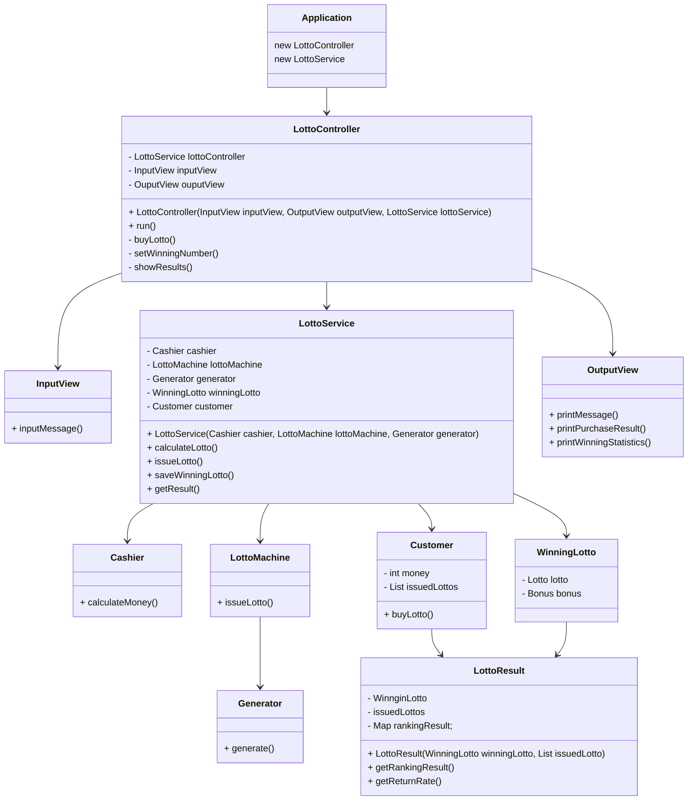

## 🎱 로또 LOTTO 게임

### ▶️ 실행 방법

터미널에서 다음 명령어로 실행한다. (Java 17)

Mac 또는 Linux : `./gradlew clean test`  
Windows : `gradlew.bat clean test` 또는 `./gradlew.bat clean test`

### 🕹 게임 진행 순서

1. 구입금액을 입력 받는다.
2. 발행한 로또 수량 및 번호를 출력한다. (오름차순 정렬)
3. 당첨 번호를 입력 받는다. (번호는 쉼표(,)를 기준)
4. 보너스 번호를 입력 받는다.
5. 당첨 내역을 출력한다.
6. 총 수익률을 출력한다. (소수점 둘째 자리에서 반올림)

### 🪧 게임 규칙

```
- 로또 번호의 숫자 범위는 1~45까지이다.
- 1개의 로또를 발행할 때 중복되지 않는 6개의 숫자를 뽑는다.
- 당첨 번호 추첨 시 중복되지 않는 숫자 6개와 보너스 번호 1개를 뽑는다.
- 당첨은 1등부터 5등까지 있다. 당첨 기준과 금액은 아래와 같다.
    - 1등: 6개 번호 일치 / 2,000,000,000원
    - 2등: 5개 번호 + 보너스 번호 일치 / 30,000,000원
    - 3등: 5개 번호 일치 / 1,500,000원
    - 4등: 4개 번호 일치 / 50,000원
    - 5등: 3개 번호 일치 / 5,000원
    
- 로또 구입 금액을 입력하면 구입 금액에 해당하는 만큼 로또를 발행해야 한다.
- 로또 1장의 가격은 1,000원이다.
- 당첨 번호와 보너스 번호를 입력받는다.
- 사용자가 구매한 로또 번호와 당첨 번호를 비교하여 당첨 내역 및 수익률을 출력하고 로또 게임을 종료한다.
- 사용자가 잘못된 값을 입력할 경우 IllegalArgumentException를 발생시키고, 
  "[ERROR]"로 시작하는 에러 메시지를 출력 후 그 부분부터 입력을 다시 받는다.
  Exception이 아닌 IllegalArgumentException, IllegalStateException 등과 같은 명확한 유형을 처리한다.
```

---

## 기능 목록

✅ 입력 기능

- [x] 입력 기능

✅ 출력 기능

- [x] 로또 구입 수량 출력 기능
- [x] 발행한 로또 번호 출력 기능
- [x] 당첨 통계 출력 기능
- [x] 당첨 내역 출력 기능
- [x] 총 수익률 출력 기능

✅ 입력 검사 기능

- [x] 구입 금액 검사 기능
    - [x] [ERROR] 숫자가 아닌 경우
    - [x] [ERROR] 1000원 단위가 아닌 경우
    - [x] [ERROR] 20억 이상의 숫자를 입력한 경우
- [x] 당첨 번호 검사 기능
    - [x] [ERROR] 숫자가 아닌 경우
    - [x] [ERROR] 1~45 사이의 값이 아닌 경우
    - [x] [ERROR] 6개가 아닌 경우
    - [x] [ERROR] 중복된 경우
- [x] 보너스 번호 검사 기능
    - [x] [ERROR] 숫자가 아닌 경우
    - [x] [ERROR] 1~45 사이의 값이 아닌 경우
    - [x] [ERROR] 당첨 번호와 중복된 경우

✅ 로또 발행 기능

- [x] 구입 금액에 따른 수량 반환 기능
- [x] 1-45 사이의 무작위 값 6개 생성 기능
- [x] 로또 발행 해주는 기능
- [x] 오름차순으로 정렬 기능
- [x] 중복 검사 기능
- [x] 1-45 범위 검사 기능
- [x] 오름차순 정렬 검사 기능

✅ 로또 당첨 번호 체크 기능

- [x] 당첨 번호와 비교 해주는 기능
- [x] 수익률 계산해주는 기능

✅ 보너스 번호 체크 기능

- [x] 보너스 번호 체크 기능

✅ 보조 기능

- [x] 들어온 String을 int 로 변환하는 기능
- [x] 들어온 String을 List 로 변환하는 기능
- [x] 소수점 둘째 자리에서 반올림 하는 기능

---

### 📦 package 구조

- Controller
    - LottoController
- Domain
    - lotto
        - Lotto
        - LottoMachine
        - LottoResult
        - WinningLotto
        - Bonus
    - Cashier
    - Customer
- Service
    - LottoService
    - LottoDto
    - ResultDto
- Util
    - RandomNumberGenerator
    - Utils
    - Validator
- View
    - InputView
    - OutputView



### 🚀 달성 목표

- 단위 테스트부터 돌아가게 만들기
    - 함수형 인터페이스 사용, 주입을 통해 의존성 낮추기
- 객체를 최대한 분리하기
    - 역할별 나누기

### 📜 피드백 적용 사항

- README
    - 클래스별이 아닌 구현해야 할 기능 목록을 정리하는 데 집중
    - 예외적인 상황도 기능 목록에 정리
- 변수명에 자료형 사용 안하기
- 매직넘버, 리터럴 사용 안하기
- 가독성 좋게 메서드 분리하기 (15줄 이하)