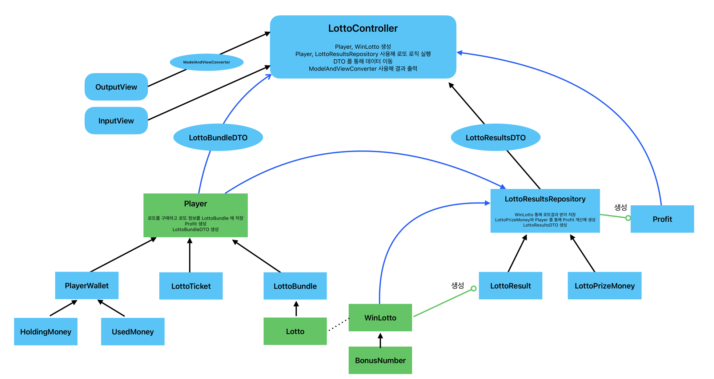

# 요구사항
- 로또 구입 금액을 입력하면 구입 금액에 해당하는 만큼 로또를 발행해야 한다.
- 로또 1장의 가격은 1,000원이다.
- 당첨 번호와 보너스 번호를 입력받는다.
- 사용자가 구매한 로또 번호와 당첨 번호를 비교하여 당첨 내역 및 수익률을 출력하고 로또 게임을 종료한다.
- 사용자가 잘못된 값을 입력할 경우 IllegalArgumentException를 발생시키고, "[ERROR]"로 시작하는 에러 메시지를 출력 후 그 부분부터 입력을 다시 받는다.
- Exception이 아닌 IllegalArgumentException, IllegalStateException 등과 같은 명확한 유형을 처리한다.
# Class Diagram

# Model
- ###  Player
- [x] 로또 구입 금액을 보유 금액에 저장 - HoldingMoney
- [x] 로또 구입 금액 만큼 보유 금액을 사용 - HoldingMoney
- [x] 로또 구입 금액 만큼 사용 금액을 업데이트 - UsedMoney
- [x] 로또 구입에 사용한 금액을 사용 금액에 저장 - UsedMoney
- [x] 로또 상금을 받아 사용 금액과 비교한 수익률을 계산함 - UsedMoney
- [x] 로또 구입 금액을 보유 금액, 사용금액에 저장 및 업데이트 - PlayerWallet
- [x] UsedMoney 에 수익률 계산을 명령함 - PlayerWallet
- [x] 로또 구입 금액에 따라 Ticket 을 발급해줌 - LottoTicket
- [x] 티켓 수 만큼 랜덤 로또로 변경하며 로또를 lottoBundle 에 넣음 - LottoTicket
- [x] 보유 금액 전부를 로또 구매에 사용해 LottoTicket 을 받음 - Player
- [x] 가지고 있는 티켓 전부로 로또를 구매함 - Player
- [x] 로또 결과를 통해 수익률 가져오기 - Player
- [x] 수익률을 저장함 - Profit
- ### Lotto
- [x] 로또에 번호가 있는지 확인 - Lotto
- [x] 로또끼리 비교해 서로 일치하는 숫자 개수 반환 - Lotto
- [x] Lotto 를 필요 형식으로 출력하기 위해 toString 오버라이딩 - Lotto
- [x] 로또 생성 시 숫자를 정렬함 - Lotto
- [x] Lotto 를 상속받아 당첨번호와 보너스 번호를 저장 - WinLotto
- [x] Lotto 와 비교해 일치하는 개수를 반환 - WinLotto
- [x] Lotto 에 보너스 번호가 있는지 확인 - WinLotto
- [x] 비교 결과를 통해 당첨 등수 계산 - WinLotto
- [x] 보너스 번호를 저장 - BonusNumber
- [x] 로또에 보너스 번호가 있는지 확인 - BonusNumber
- [x] LottoTicket 에서 생성한 Lotto 를 저장 - LottoBundle
- [x] 출력을 위해 가지고 있는 Lotto 를 DTO 로 변환하기 - LottoBundle
- [x] Lotto 와 WinLotto 를 비교해 결과 리스트를 만들어 반환 - LottoBundle
- ### LottoResult
- [x] 로또 당첨 결과를 저장하는 Enum - LottoResult
- [x] 로또 일치에 따라 당첨 결과를 반환 - LottoResult
- [x] 로또 결과별 상금 정보 저장 및 반환 - LottoResult
- [x] 로또 결과 저장소의 초기화를 위한 Map 제공 - LottoResult
- [x] 로또 당첨 결과를 통해 총 상금 업데이트 - LottoPrizeMoney
- [x] 로또 결과를 저장하기 위한 저장소 - LottoResultsRepository
- [x] 로또 결과를 받아 추가 - LottoResultRepository
- [x] 로또 당첨 결과를 통해 당첨 내역 DTO 로 변환 - LottoResultRepository
- [x] LottoPrizeMoney 에 당첨내역 업데이트해 총 상금 업데이트하기 - LottoResultRepository
- [x] 로또 결과 리스트를 받아 결과 업데이트 하기 - LottoResultsRepository
- [x] 총 상금 반환하기 - LottoResultsRepository
- ### Service
- [x] Player 가 로또를 구매해 저장함 - LottoPurchaseService
- [x] 로또 구매 내역을 LottoBundleDto 를 통해 반환 - LottoPurchaseService
- [x] 로또 데이터와 WinLotto 받아 당첨 결과를 업데이트 - LottoResultsService
- [x] 로또 당첨 결과를 LottoResultsDto 를 통해 반환 - LottoResultsService
- [x] LottoResultsRepository 와 Player 를 통해 Profit 계산 및 반환 - LottoResultsService
- ### DTO
- [x] 로또 번호를 전달하기 위한 DTO - LottoBundleDto
- [x] 로또의 총 개수를 반환하기 - LottoBundleDto
- [x] 로또 결과와 총 상금을 전달하기 위한 DTO - LottoResultsDto
- ### Util
- [x] 컨트롤러에서 뷰로 모델을 전달하기 위해 모델을 저장함 - ModelAndViewConverter
- [x] LottoBundleDto 를 통해 로또 개수 데이터를 int 형으로 반환  - ModelAndViewConverter
- [x] LottoBundleDto 를 통해 로또들의 데이터를 List<String> 형으로 반환  - ModelAndViewConverter
- [x] LottoResultDto 를 통해 로또 당첨 통계 데이터를 Map<LottoResult, Integer> 형으로 반환  - ModelAndViewConverter
- [x] Profit 을 통해 수익률 데이터를 double 형으로 반환  - ModelAndViewConverter
- [x] 에러를 저장하고 메시지를 반환 - ModelAndViewConverter
- [x] ModelAndViewConverter 싱글톤 구현하기 - ModelAndViewConverter
- [x] 랜덤 숫자로 로또 생성하기 - RandomLottoGenerator

# View
- [x] 로또 구입 금액 입력 - InputView
- [x] 당첨번호 입력 - InputView
- [x] 보너스 번호 입력 - InputView 
- [x] 로또 출력 - OutputView
- [x] 당첨 내역 출력 - OutputView
- [x] 수익률 출력 - OutputView
- [x] 에러 출력 - OutputView

# Controller
- [x] 로또 구입 금액 입력받아 Player 생성 - LottoController
- [x] LottoPurchaseService 통해 로또 구입 - LottoController
- [x] 구입한 로또 출력 - LottoController
- [x] 로또 당첨번호, 보너스 번호 입력받아 WinLotto 생성 - LottoController
- [x] 당첨 내역 및 수익률 계산해 출력하기 - LottoController
- [x] 입력값에 오류 발생시 메시지 출력 후 입력 재실행 - LottoController

# 에러 상황
- [x] 구입 금액에 숫자를 입력하지 않음 (빈칸 포함) - InputView
- [x] 로또 당첨 번호에 숫자가 아닌 값을 입력함 (빈칸 포함) - InputView
- [x] 로또 당첨 번호를 콤마 "," 로 구분하지 않음 - InputView
- [x] 보너스 번호에 숫자를 입력하지 않음 - InputView
- [x] 구입 금액을 1000단위로 입력하지 않음 - HoldingMoney
- [x] 로또 당첨 번호를 6개로 입력하지 않음 - Lotto
- [x] 로또 당첨 번호에 중복된 숫자를 입력함 - Lotto
- [x] 로또 당첨 번호가 1~45의 숫자가 아님 - Lotto 
- [x] 당첨 번호와 보너스 번호에 중복이 있는지 확인 - WinLotto
- [x] 보너스 번호가 1~45의 숫자가 아님 - BonusNumber

# AppConfig
- [x] AppConfig 를 통해 객체를 생성한다 - AppConfig

