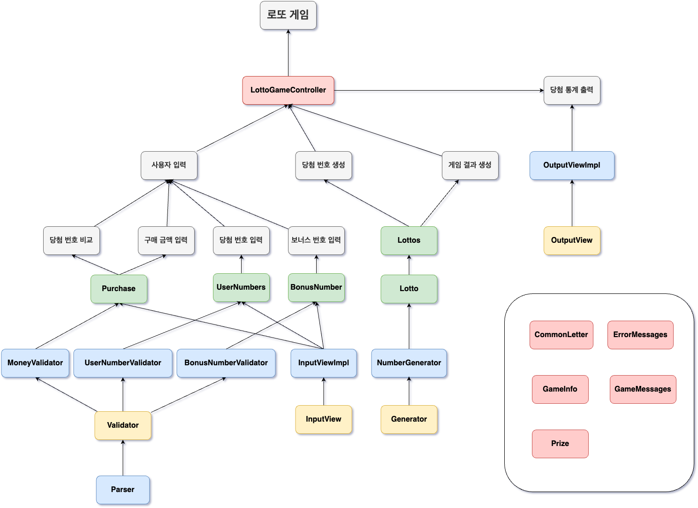

# 요구사항 분석

> ## [ 입력 ]
> ### 구입 금액 입력
> - [ ] 구입 금액은 1000원 단위로 입력한다.
> - [ ] 구입 금액은 1000원 이상이어야 한다.
> - [ ] 구입 금액은 숫자로만 입력한다.
> - [ ] 구입 금액은 1000원으로 나누어 떨어져야 한다.
> - [ ] 에러가 발생하면 에러 메시지를 출력하고 다시 입력받는다.
>
> ### 로또 번호 입력
> - [ ] 로또 번호의 숫자는 1~45까지이다.
> - [ ] 로또 번호는 6개를 입력한다.
> - [ ] 로또 번호는 쉼표를 기준으로 구분한다.
> - [ ] 반드시 숫자를 입력해야 한다.
> 
> ### 보너스 번호 입력
> - [ ] 보너스 번호를 하나 입력받는다.
> - [ ] 보너스 번호는 로또 번호와 중복되지 않아야 한다.
> - [ ] 에러가 발생하면 에러 메시지를 출력하고 다시 입력받는다.
> - [ ] 반드시 숫자를 입력해야 한다.

> ## [ 게임 로직 ]
> ### 로또 발행
> - [ ] 구입 금액에 해당하는 만큼 로또를 발행한다.
> - [ ] 로또 1장의 가격은 1000원이다.
> - [ ] 로또 번호는 1~45까지의 숫자 중 6개를 랜덤으로 뽑는다.
> - [ ] 로또 번호는 중복되지 않는다.
> 
> ### 당첨 번호 비교
> - [ ] 당첨 기준에 따라 당첨 번호를 비교한다.
> - [ ] 5개 일치 시 보너스 번호를 비교한다.

> ## [ 출력 ]
> ### 로또 번호 출력
> - [ ] 발행한 로또 수량 및 번호를 출력한다.
> - [ ] 로또 번호는 오름차순으로 정렬하여 보여준다.
> - [ ] 로또 번호는 쉼표를 기준으로 구분한다.
> - [ ] 로또 번호 앞 뒤에는 대괄호를 붙인다.
>
> ### 당첨 통계 출력
> - [ ] 당첨 개수에 따라 결과를 출력한다.
> - [ ] 당첨 개수가 0이라도 출력한다.
> - [ ] 마지막에 수익률을 출력한다.
> - [ ] 수익률은 소수점 둘째 자리에서 반올림한다.

---

# 예외 상황
- [ ] 구입 금액이 숫자가 아닌 경우
- [ ] 구입 금액이 1000원으로 나누어 떨어지지 않는 경우
- [ ] 입력 번호가 숫자가 아닌 경우
- [ ] 입력 번호가 범위를 벗어난 경우
- [ ] 입력 번호가 중복되는 경우
- [ ] 입력 번호가 6개가 아닌 경우
- [ ] 보너스 번호가 숫자가 아닌 경우
- [ ] 보너스 번호가 범위를 벗어난 경우
- [ ] 보너스 번호가 로또 번호와 중복되는 경우

---

# 클래스 다이어그램
