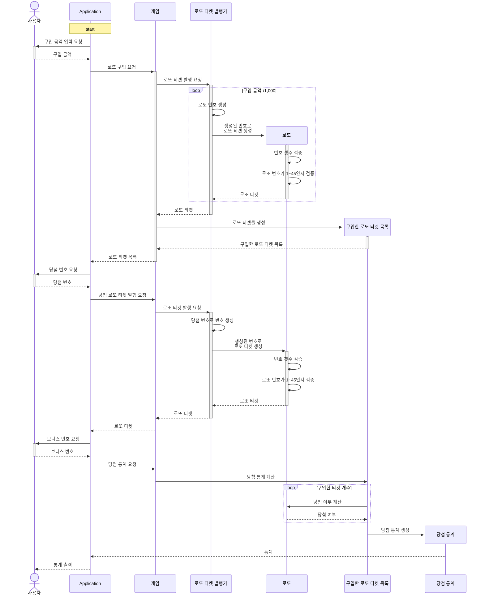

## 💻기능 목록
> 사용자 상호작용 기능
> ###### 사용자의 입력과 출력을 받는 책임을 수행한다.

- 사용자에게 로또 구입 금액을 요청할 수 있다.
- 사용자에게 당첨 번호 입력을 요청할 수 있다.
- 사용자에게 보너스 번호 입력을 요청할 수 있다.

- 사용자에게 에러 메시지를 출력한다.
- 사용자에게 로또 구매한 로또 티켓 목록을 출력한다.
- 사용자에게 통계를 출력한다.

> Application 기능 정리
> ###### 상호작용을 통해 얻어온 값으로 로또 게임 기능을 실행하는 책임을 수행한다.

- 로또 게임에 구입 금액을 바탕으로 로또 구입을 요청한다.
- 로또 구입 과정에서 문제가 발생하면 사용자에게 재 입력을 요청한다.
- 로또 구입을 통해 반환된 로또 목록을 사용자에게 전달한다.
- 당첨 번호를 받아 당첨 로또를 만든다.
- 당첨 번호로 당첨 로또를 만드는 과정에서 문제가 발생하면 사용자에게 재 입력을 요청한다.
- 보너스 번호를 바탕으로 당첨 통계를 요청한다.
- 당첨 통계 요청과정에서 문제가 발생하면 사용자에게 재 입력을 요청한다.
- 당첨 통계를 사용자에게 전달한다.

> 로또 게임 기능 정리
> ###### 로또 게임 진행을 위한 책임을 수행한다.
- 구입 금액을 통해 로또 티켓 발행기를 이용하여 구입한 로또 티켓 목록을 만든다.
- 구입하고자 하는 금액이 숫자가 아닌 경우 IllegalArgumentException 을 발생 시킨다.
- 당첨 번호를 통해 당첨 로또 티켓을 발행기를 이용하여 만든다.
- 당첨 번호들이 숫자가 아닌 경우 IllegalArgumentException 을 발생 시킨다.
- 보너스 번호를 통해 로또 통계를 만든다.
- 입력한 보너스 번호가 숫자가 아닌 경우 IllegalArgumentException 을 발생 시킨다.

> 로또 티켓 발행기 기능 정리
> ###### 로또 티켓 발행의 책임을 수행한다.
- 금액을 입력 받으면 금액 만큼 로또 티켓을 발행한다.
- 금액을 입력 받아 로또 티켓을 발행하는 경우 자체적으로 번호를 생성한다.
- 번호를 입력 받으면 번호에 해당하는 로또 티켓을 발행한다.

> 로또 기능 정리
> ###### 실제 로또 티켓의 책임을 수행한다.
- 주어진 번호로 생성되어야 한다.
- 주어진 번호의 갯수가 로또 숫자 갯수와 다르면 IllegalArgumentException 을 발생 시킨다.
- 주어진 번호들이 로또 게임의 범위 숫자가 아니라면 IllegalArgumentException 을 발생 시킨다.
- 로또가 원하는 번호를 가지고 있는지 확인한다.

> 구입한 로또 티켓 목록 기능 정리
> ###### 구입한 로또 티켓을 관리하는 책임을 수행한다.
- 로또 티켓들을 바탕으로 생성되어야 한다.
- 구입된 로또 티켓들로 당첨 여부를 계산할 수 있다.
- 당첨 여부를 계산하면 당첨 통계를 만든다.

> 당첨 통계 정리
> ###### 로또의 통계를 계산하는 책임을 수행한다.
- 로또 티켓이 당첨된 통계를 가질 수 있다.

## 🚀 기능 요구 사항 분석
### 요구사항을 바탕으로 각 부분에 위치할 기능 분리
