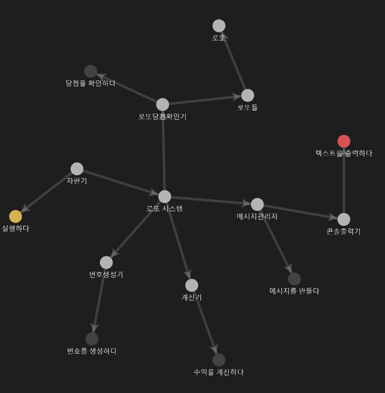

## 기능 요구 사항

### 게임 규칙

1. 로또 번호의 숫자 범위는 `1 ~ 45` 이다.
2. `1`개의 로또를 발행할 때 중복되지 않는 `6`개의 숫자를 뽑는다.
3. 번호 추첨 시, 중복되지 않는 숫자 `6` 개와 보너스 번호 `1`개를 뽑는다.
4. 당첨은 `1`등부터 `5`등까지 있다.
    1. 1등 : `6`개 번호 일치 · `2,000,000,000`원
    2. 2등 : `5`개 번호 + 보너스 번호 일치 · `30,000,000`원
    3. 3등 : 5개 번호 일치 · `1,500,000`원
    4. 4등 : 4개 번호 일치 · `50,000`원
    5. 5등 : 3개 번호 일치 · `5,000`원

### 그 외 요구 사항

1. 로또 구입 금액을 입력하면 구입 금액에 해당하는 만큼 **로또를 발행**한다.
    1. 로또 금액으로 나누어 떨어지지 않는 금액을 입력할 시 **예외 처리**한다.
2. 로또 1장의 가격은 `1,000`원이다.
3. 당첨 번호와 보너스 번호를 입력 받는다.
4. 사용자가 구매한 로또 번호와 당첨 번호를 비교하여 당첨 내역 및 수익률을 출력하고 로또 게임을 종료한다.
5. 잘못된 값을 입력할 경우 `IllegalArgumentException`을 발생시키고, `[ERROR]` 로 시작하는 에러 메시지를 출력 후, 그 부분 부터 입력을 받는다.
    1. 명확한 exception을 명시하여 처리한다.


## 입출력 요구 사항

### 입력 요구 사항

- 로또 구입 금액을 입력받는다. 구입 금액은 1,000원 단위로 입력받으며 나누어 떨어지지 않는 경우 예외 처리한다.

```
14000
```

- 당첨 번호를 입력받는다.

```
1,2,3,4,5,6
```

- 보너스 번호를 입력받는다.

```
7
```


### 출력 요구 사항

- 발행한 로또 수량과 번호를 출력한다. 로또 번호들은 오름차순으로 정렬하여 보여준다.

```
8개를 구매했습니다.
[8, 21, 23, 41, 42, 43] 
[3, 5, 11, 16, 32, 38] 
[7, 11, 16, 35, 36, 44] 
[1, 8, 11, 31, 41, 42] 
[13, 14, 16, 38, 42, 45] 
[7, 11, 30, 40, 42, 43] 
[2, 13, 22, 32, 38, 45] 
[1, 3, 5, 14, 22, 45]
```


- 당첨 내역을 출력한다.

```
3개 일치 (5,000원) - 1개
4개 일치 (50,000원) - 0개
5개 일치 (1,500,000원) - 0개
5개 일치, 보너스 볼 일치 (30,000,000원) - 0개
6개 일치 (2,000,000,000원) - 0개
```


- 수익률을 출력하고 소수점 둘째 자리에서 반올림해서 출력한다.

```
총 수익률은 62.5%입니다.
```


- 예외 상황시 에러 문구를 출력하고 `[ERROR]` 로 시작해야한다.

```
[ERROR] 로또 번호는 1부터 45 사이의 숫자여야 합니다.
```


- 실행 결과 예시

```
구입금액을 입력해 주세요.
8000

8개를 구매했습니다.
[8, 21, 23, 41, 42, 43] 
[3, 5, 11, 16, 32, 38] 
[7, 11, 16, 35, 36, 44] 
[1, 8, 11, 31, 41, 42] 
[13, 14, 16, 38, 42, 45] 
[7, 11, 30, 40, 42, 43] 
[2, 13, 22, 32, 38, 45] 
[1, 3, 5, 14, 22, 45]

당첨 번호를 입력해 주세요.
1,2,3,4,5,6

보너스 번호를 입력해 주세요.
7

당첨 통계
---
3개 일치 (5,000원) - 1개
4개 일치 (50,000원) - 0개
5개 일치 (1,500,000원) - 0개
5개 일치, 보너스 볼 일치 (30,000,000원) - 0개
6개 일치 (2,000,000,000원) - 0개
총 수익률은 62.5%입니다.
```


## 구현해야할 기능 정리


1. 로또 구입 금액을 입력받아 개수를 구하는 기능
    1. 1000원으로 나누어 떨어지지 않는 경우 예외 처리
2. 당첨 번호를 입력받는 기능
    1. `,`를 기준으로 구분
    2. 당첨 번호 입력 시, 1부터 45이하의 숫자여야 함
    3. 중복되는 수가 존재하면 안됨
3. 보너스 번호를 입력받는 기능
    1. 당첨 숫자와 중복되는 숫자이면 안됨
    2. 1부터 45 이하의 숫자여야함
4. 랜덤한 숫자들로 `n`개 만큼 로또 번호를 생성하는 기능
    1. 생성한 숫자들은 중복되지 않는 1부터 45 이하인 6개의 숫자로 구성
    2. 오름차순으로 정렬되어 있어야 함
5. 당첨 번호를 바탕으로 몇개 일치하는지 구하는 기능
6. 사용자가 구매하는데 사용한 금액과 당첨 금액을 바탕으로 수익률을 구하는 기능
    1. 수익률은 소숫점 둘째 자리에서 반올림


## 클래스 관계도 정리


