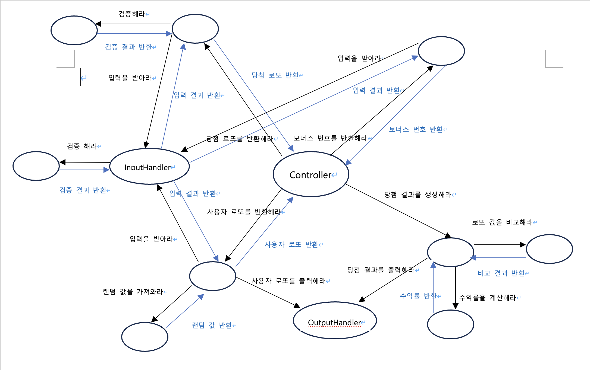
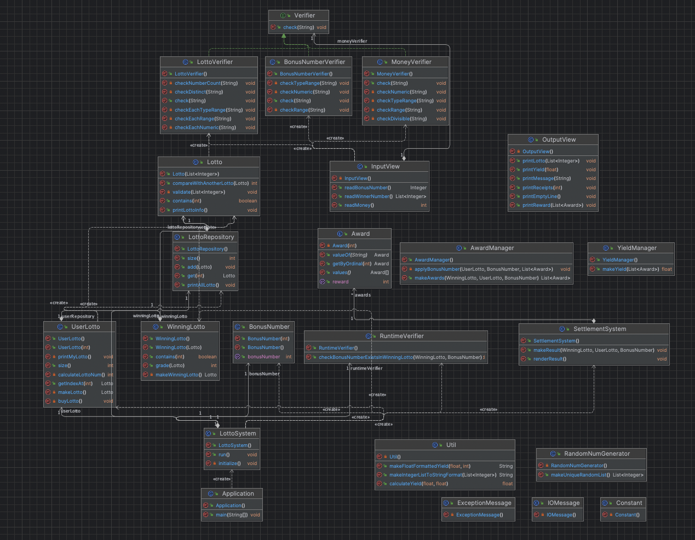

## 📝 구현 대상

### 로또

### - 목표

=> 변화에 유동적으로 대응하기 쉽고 객체지향의 이점을 살릴 수 있는 로또 게임을 만든다.
중앙처리식 시스템보다는 객체와 객체가 서로 협력하는, '살아있는' 시스템을 구성한다. 또한, 모든 도메인 로직에 단위 테스트를 작성함으로써 시스템의 무결성을 보장한다.

### - 세부 목표 및 지침

- 클래스 분리 및 역할 부여
- 높은 재사용성
- 역할, 책임, 협력 설계
- 클래스보다는 메시지 중심 설계
- 객체 자율성 보장
- 효과적인 테스트 작성
- 디자인 패턴 등의 원칙에 크게 의존하지 않는다.

---

### - 설계

#### 1차 단계 (메세지 다이어그램 구성)

#### 기능 명세

- 입력

> [기능] 구입 금액을 입력받는 기능 
> [기능] 당첨번호를 입력받는 기능 
> [기능] 보너스 번호를 입력받는 기능 

- 출력

> [기능] 로또 수량을 출력하는 기능 
> [기능] 로또 정보를 출력하는 기능 
> [기능] 당첨통계를 출력하는 기능 
> [기능] 수익률을 출력하는 기능 

- 로직

> [기능] 구입 금액으로 구매할 수 있는 로또의 갯수 계산하는 기능 
> [기능] 랜덤 값으로 로또 객체를 만드는 기능 
> [기능] 로또 객체를 로또 번호 오름차순으로 정렬하는 기능 
> [기능] 돈에 맞는 최대 갯수만큼의 사용자 로또를 생성하는 기능 
> [기능] 사용자 로또중에서 N번째 로또 객체를 반환하는 기능 
> [기능] 입력된 당첨번호 바탕으로 당첨로또 객체 생성하는 기능 
> [기능] 보너스 객체를 반환하는 기능 
> [기능] 로또가 해당 숫자를 포함하는지 알려주는 기능 
> [기능] 로또가 가지는 로또번호들을 모두 반환하는 기능 
> [기능] 로또 등수에 따른 당첨 금액을 반환하는 기능 
> [기능] 사용자 로또 중에 N등 로또의 갯수를 반환하는 기능 
> [기능] 사용자 로또와 당첨로또 비교해 채점하는 기능 
> [기능] 사용자 로또가 보너스 점수를 포함하는지 확인하는 기능 
> [기능] 수익률을 계산하는 기능 
> [기능] 수익률을 소수점 둘째자리에서 반올림하는 기능 
> [기능] 수익률을 주어진 형태로 포매팅하는 기능 
> [기능] 당첨 통계를 만드는 기능 
>

- 예외
    1. 로또 구입 금액에 대한 예외처리
  > [예외] 로또 구입 금액이 숫자가 아닌 경우 
  [예외] 로또 구입 금액이 자료형의 범위를 벗어나는 경우 
  [예외] 로또 구입 금액이 1000원으로 나누어 떨어지지 않는 경우 
  [예외] 로또 구입 금액이 음수인 경우 
    2. 로또에 대한 예외처리
  > [예외] 로또 번호가 숫자가 아닌 경우 
  > [예외] 로또 번호가 자료형의 범위를 벗어나는 경우
  > [예외] 로또 번호가 6개가 아닌 경우 
  > [예외] 로또 번호가 중복이 되는 경우 
  > [예외] 로또 번호가 1부터 45사이의 수가 아닌 경우 
    3. 보너스 번호 입력에 대한 예외처리
  > [예외] 보너스 번호가 당첨번호에 포함되는 경우 
  > [예외] 보너스 번호가 자료형의 범위를 벗어나는 경우
  > [예외] 보너스 번호가 1부터 45사이의 수가 아닌 경우 
  > [예외] 보너스 번호가 숫자가 아닌 경우
    4. 런타임 예외처리
  > 입력받은 당첨 번호와 보너스 번호가 중복되는 경우 
  
---
### - 최종 클래스 다이어그램
