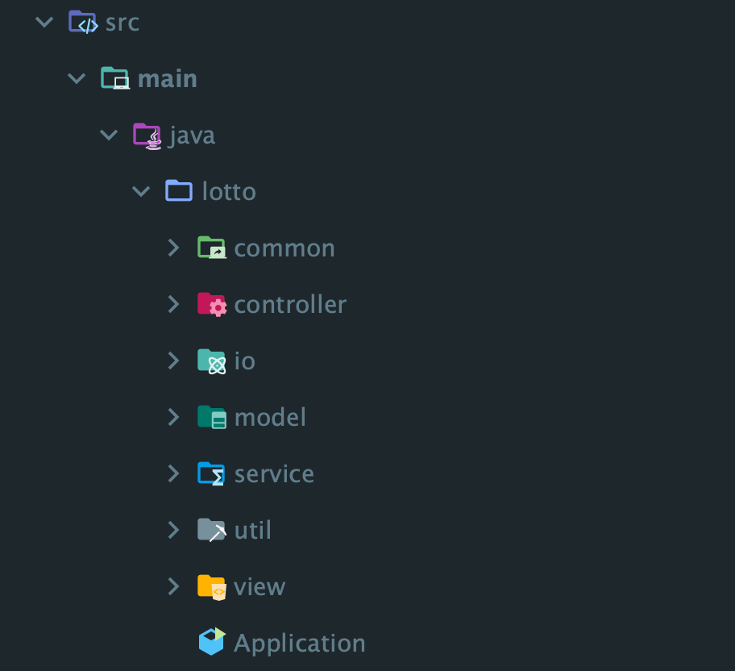
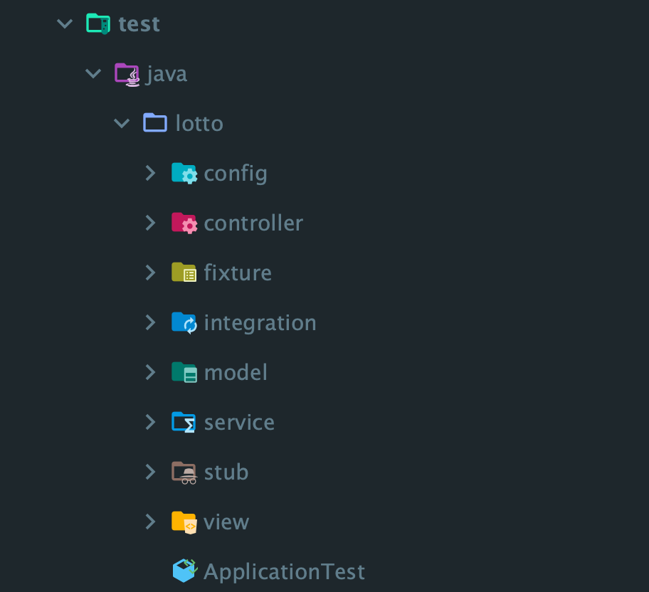

# 로또

## 🔄 프로그램 실행 흐름

1. 로또 구입 금액 입력 문구를 출력하고 로또 구입 금액을 입력 받는다.
    - 입력을 검증하고 잘못된 값인 경우 `IllegalArgumentException`을 발생시키고 재입력 받는다.
2. 구매한 로또 개수 문구와 구매한 로또들의 번호를 출력한다.
3. 당첨 번호 입력 문구를 출력하고 당첨 번호를 입력 받는다.
    - 입력을 검증하고 잘못된 값인 경우 `IllegalArgumentException`을 발생시키고 재입력 받는다.
4. 보너스 번호 입력 문구를 출력하고 보너스 번호를 입력 받는다.
    - 입력을 검증하고 잘못된 값인 경우 `IllegalArgumentException`을 발생시키고 재입력 받는다.
5. 당첨 통계를 출력한다.

<br/>

## 🖨️ 출력 예시

```
구입금액을 입력해 주세요.
8000

8개를 구매했습니다.
[8, 21, 23, 41, 42, 43] 
[3, 5, 11, 16, 32, 38] 
[7, 11, 16, 35, 36, 44] 
[1, 8, 11, 31, 41, 42] 
[13, 14, 16, 38, 42, 45] 
[7, 11, 30, 40, 42, 43] 
[2, 13, 22, 32, 38, 45] 
[1, 3, 5, 14, 22, 45]

당첨 번호를 입력해 주세요.
1,2,3,4,5,6

보너스 번호를 입력해 주세요.
7

당첨 통계
---
3개 일치 (5,000원) - 1개
4개 일치 (50,000원) - 0개
5개 일치 (1,500,000원) - 0개
5개 일치, 보너스 볼 일치 (30,000,000원) - 0개
6개 일치 (2,000,000,000원) - 0개
총 수익률은 62.5%입니다.
```

<br/>

## 🗳️패키지 구조

### main 패키지 구조



| 패키지 이름         | 설명                                                                                                                                                            |
|----------------|---------------------------------------------------------------------------------------------------------------------------------------------------------------|
| **common**     | 프로젝트 실행을 위한 구성을 담당하는 `config` 패키지, <br/> 비즈니스 규칙 중 상수값을 정의한 `constants` 패키지, <br/> 에러 메시지를 정의한 `exception` 패키지를 가집니다.                                         |
| **controller** | 프로젝트의 전반적인 흐름을 담당하는 `LottoController`, <br/> controller와 view 간 데이터 전달을 담당하는 `dto` 패키지를 가집니다.                                                                 |
| **io**         | 입출력을 담당하는 패키지로, <br/> 입력을 담당하는 `reader` 패키지, <br/> 출력을 담당하는 `writer` 패키지를 가집니다.                                                                               |
| **model**      | 로또의 도메인 모델 객체를 가진 패키지로, <br/> 로또 자체와 관련된 `lotto` 패키지, <br/> 로또 구매와 관련된 `purchase` 패키지를 가집니다.                                                                  |
| **service**    | 도메인 로직을 가지는 패키지로, <br/> 로또 발급 방식을 담당하는 `generator` 패키지, <br/> 로또 구매를 담당하는 `LottoPurchaseService`, <br/> 로또 당첨 통계를 계산하는 `LottoWinningStatisticsService`가 있습니다. |
| **util**       | 프로젝트에서 사용하는 유틸리티 패키지로, <br/> 입력값 검증을 담당하는 `InputValidator`, <br/> 입력값을 파싱하는 `Parser`, <br/> 랜덤 관련 메서드를 가지는 `Random`이 있습니다.                                    |
| **view**       | 화면을 담당하는 패키지로, <br/> 화면에 사용되는 메시지 문구나 포맷을 정의한 `constants` 패키지, <br/> 화면을 담당하는 `LottoView`가 있습니다.                                                              |

### test 패키지 구조



| 패키지 이름          | 설명                                                                                                                                                                       |
|-----------------|--------------------------------------------------------------------------------------------------------------------------------------------------------------------------|
| **config**      | 통합 테스트를 위한 초기 구성을 담당하는 `IntegrationTest`를 가집니다.                                                                                                                          |
| **controller**  | `dto` 패키지의 `input` 패키지에 해당하는 객체들의 입력값 검증 및 파싱을 테스트하는 패키지입니다.                                                                                                             |
| **fixture**     | 테스트에 필요한 여러 객체들을 생성하는 기능을 제공하는 패키지입니다.                                                                                                                                   |
| **integration** | 통합 테스트 패키지로, <br/> 프로그램이 성공적으로 수행되는 경우를 테스트하는 `SuccessTest`, <br/> 프로그램에 예외가 발생하는 경우를 테스트하는 `ExceptionTest`를 가집니다.                                                       |
| **model**       | 로또의 도메인 모델 객체 테스트를 담당하는 패키지로, <br/> 로또 자체와 관련된 테스트를 담당하는 `lotto` 패키지, <br/> 로또 구매와 관련된 테스트를 담당하는 `purchase` 패키지를 가집니다.                                                   |
| **service**     | 도메인 로직 테스트를 담당하는 패키지로, <br/> 로또 구매를 테스트하는 `LottoPurchaseServiceTest`, <br/> 로또 당첨 통계 계산을 테스트하는 `LottoWinningStatisticsServiceTest`가 있습니다.                                |
| **stub**        | 테스트하기 어려운 객체에 의존하는 객체를 테스트하기 위해 만든 stub을 가진 패키지로, <br/> 가짜 입력을 담당하는 `StubReader`, <br/> 가짜 출력을 담당하는 `StubWriter`, <br/> 가짜 로또 번호를 발급하는 `StubLottoNumberGenerator`을 가집니다. |
| **view**        | 화면 테스트를 담당하는 `LottoViewTest`를 가집니다.                                                                                                                                      |

<br/>

## 📝 기능 구현 목록

**입출력**

- ✅ 콘솔로 입력을 읽어들인다.
  - ✅ `camp.nextstep.edu.missionutils.Console.readLine()`을 활용한다.
- ✅ 콘솔로 메시지를 출력한다.

**입력 유효성 검증**

- ✅ 입력된 값의 일반적인 유효성을 검증한다.
  - ✅ 입력된 값에 공백이 아닌 문자가 존재해야 한다.
  - ✅ 입력할 수 있는 최대 문자열 길이 이하여야 한다.
  - ✅ 숫자 형식의 입력인 경우, 입력값에 숫자만 존재해야 한다.
  - ✅ 검증 실패 시 `IllegalArgumentException`을 발생시킨다.

**도메인 모델 유효성 검증**

- ✅ 로또 구입 금액의 유효성을 검증한다.
  - ✅ 1000원 단위 금액이어야 한다.
  - ✅ 구입할 수 있는 금액의 범위는 1000원 이상 1억원 이하이다.
  - ✅ 검증 실패 시 `IllegalArgumentException`을 발생시킨다.

- ✅ 로또의 유효성을 검증한다.
  - ✅ 6개 숫자여야 한다.
  - ✅ 각 숫자가 1이상 45이하여야 한다.
  - ✅ 각 숫자간 중복이 없어야 한다.
  - ✅ 검증 실패 시 `IllegalArgumentException`을 발생시킨다.

- ✅ 보너스볼의 유효성을 검증한다.
    - ✅ 1개 숫자여야 한다.
    - ✅ 숫자가 1이상 45이하여야 한다.
    - ✅ 검증 실패 시 `IllegalArgumentException`을 발생시킨다.

- ✅ 당첨 로또 정보의 유효성을 검증한다.
  - ✅ 보너스볼 번호와 당첨 로또 번호가 중복되지 않아야 한다.
  - ✅ 검증 실패 시 `IllegalStateException`을 발생시킨다.

**화면**

- ✅ 구매 금액 입력 문구를 출력하고 구입 금액을 입력 받는다.
- ✅ 구매 로또 개수 문구를 출력하고, 구매 로또 개수만큼 로또를 출력한다.
- ✅ 당첨 번호 입력 문구를 출력하고 당첨 번호를 입력 받는다.
  - ✅ 당첨 번호는 `,`를 기준으로 구분한다.
- ✅ 보너스 번호 입력 문구를 출력하고 보너스 번호를 입력 받는다.
- ✅ 당첨 통계를 출력한다.
  - ✅ 당첨 통계는 당첨 순위별 숫자 일치 개수, 금액, 당첨된 로또의 개수와 총 수익률을 포함한다.
  - ✅ 총 수익률은 소숫점 둘째 자리에서 반올림하고, 소숫점 아래 0은 절삭하지 않는다.

**도메인 로직**

- ✅ 구입 금액을 기반으로 구매한 로또 개수를 계산한다.
- ✅ 구매한 로또 개수만큼 로또를 생성한다.
  - ✅ `camp.nextstep.edu.missionutils.Randoms.pickUniqueNumbersInRange()`을 활용한다.
- ✅ 당첨 번호와 보너스볼을 기반으로 구매한 로또의 당첨 통계를 계산한다.

**어플리케이션 로직**

- ✅ 로또 게임 실행에 필요한 요소들을 구성하고 로또 게임을 실행한다.

**예외 처리**

- ✅ 잘못된 입력으로 예외 발생 시 에러 메시지를 출력하고 재입력 받는다.
  - ✅ 에러 메시지는 `[ERROR]`로 시작한다.

<br/> 