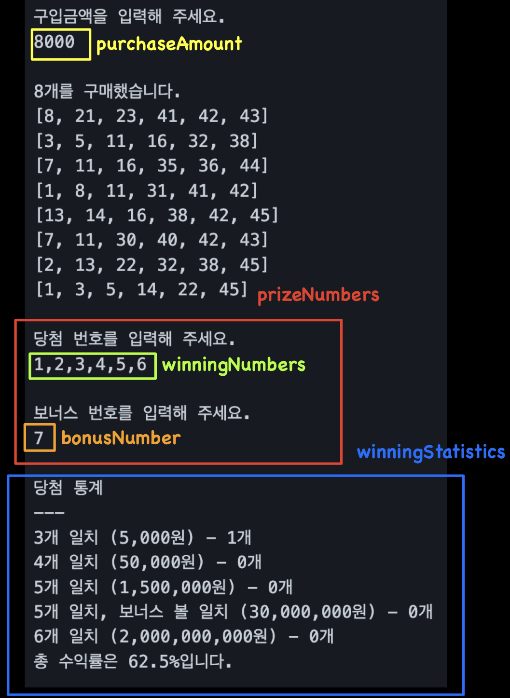
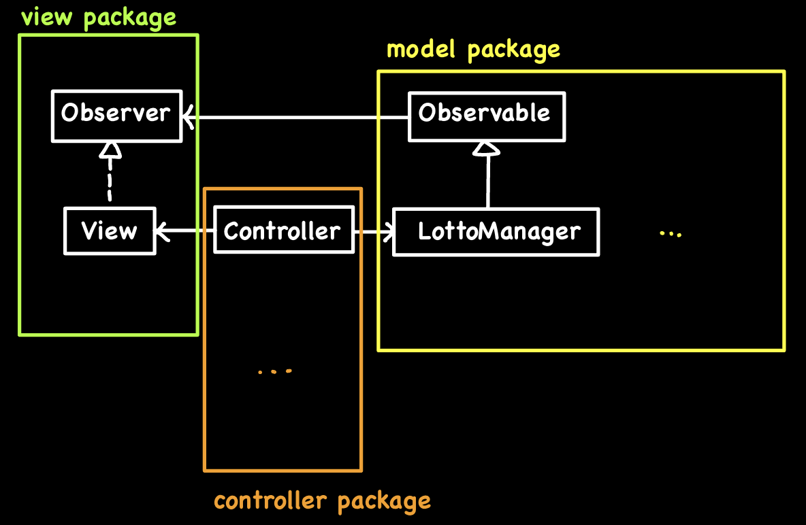
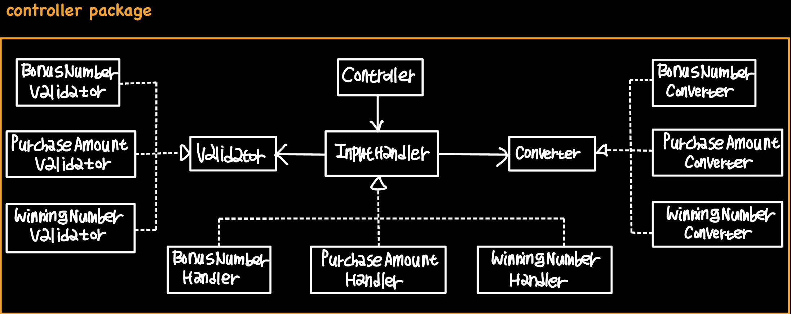

# Week3

# **우아한테크코스 3주 차**

## **로또 게임**

<aside>

1️⃣ **게임 규칙**

</aside>

1. 로또 번호의 숫자 범위는 1 ~ 45
2. 1개의 로또에 대해 중복되지 않는 6개의 숫자 발행
3. 중복되지 않는 숫자 6개와 보너스 번호 1개를 당첨 번호로 추첨
4. 당첨은 1등부터 5등까지 있으며, 당첨 기준과 금액 상이

<aside>

2️⃣ **구현 요구사항**

</aside>

1. 로또 구입 금액을 입력 받아 해당 금액으로 로또 발행
2. 사용자가 당첨 번호와 보너스 번호를 입력받아 당첨 내역 및 수익률을 출력
3. 사용자가 잘못된 값을 입력할 경우 예외 처리를 하고 에러 메시지를 출력

<aside>

3️⃣ **프로그래밍 요구 사항**

</aside>

1. JDK 17 버전
2. 프로그램 실행의 시작점은 Application의 **`main()`** 메서드
3. 외부 라이브러리를 사용하지 않아야 하며, build.gradle 파일을 변경할 수 없음
4. Java 코드 컨벤션을 준수하고, System.exit()를 호출하지 않음
5. 프로그램 구현이 완료되면 테스트 코드를 작성하여 테스트가 성공
6. 함수(또는 메서드)의 길이가 15라인을 넘지 않도록 하고, 하나의 함수가 한 가지 일만 하도록 구현
7. else 예약어를 사용하지 않아야 하며, Java Enum을 적용

## **기능 목록**

- [x]  구입금액을 입력받고, 유효성 확인
    - [x]  금액이 숫자로만 이루어져 있는가?
    - [x]  금액이 0이 아닌가?
    - [x]  금액이 1000으로 나누어 떨어지는가?
- [x]  구입금액에 맞춰 로또 발행: 각 로또는 1 ~ 45 사이의 중복되지 않는 6개의 수
- [x]  발행된 로또를 오름차순으로 정렬
- [x]  당첨번호를 입력받고, 유효성 확인
    - [x]  구분자를 기준으로 6개로 구분되는가?
    - [x]  구분된 각 문자열은 숫자인가?
    - [x]  각 숫자는 1 ~ 45 사이 값인가?
    - [x]  중복된 숫자가 있는가?
- [x]  보너스 번호를 입력받고, 유효성 확인
    - [x]  숫자인가?
    - [x]  1 ~ 45 사이 값인가?
    - [x]  당첨 번호와 중복이 있는가? → 인터페이스 일관성 유지를 위해 ***Controller***에서 확인
- [x]  당첨 통계, 수익률 계산

## 용어집

1. purchaseAmount : 구매금액
2. winningNumber : 당첨 번호
3. bounsNumber : 보너스 번호
4. prizeNumbers : 당첨 번호와 보너스 번호를 포함하는 개념
5. winningStatistics : 당첨 통계

## 전체 설계

**MVC 패턴** 기반

**옵저버 패턴**을 적용해 ***Controller***의 비대한 중계 역할이 덜어냄

## Controller

***Controller***의 기능을 클래스로 나누다보니,

자연스레 비슷한 역할을 하는 클래스들(입력 문자열 유효성 검사, 입력 문자열 변환)로 군집화가 되었으며,

의존성 관리를 위해 인터페이스를 생성해 관리

## Model

데이터 관리와 비즈니스 로직은 아래와 같이 구분

1. Lotto : 사용자가 구입한 로또 번호를 저장하고, 문자열로 바꾸는 등의 관련 기능
2. WinningStatistics : 당첨 통계 저장 및 계산
3. RankEvaluator : Lotto 객체를 입력 받아 등수를 계산해주는 로직 담당
4. PrizeNumbers : 당첨 번호와 보너스 번호를 저장하고, 번호 매칭을 담당
5. LottoManager : model 패키지 내부 객체들의 상호작용 및 패키지 외부 요청 담당