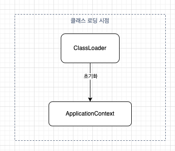
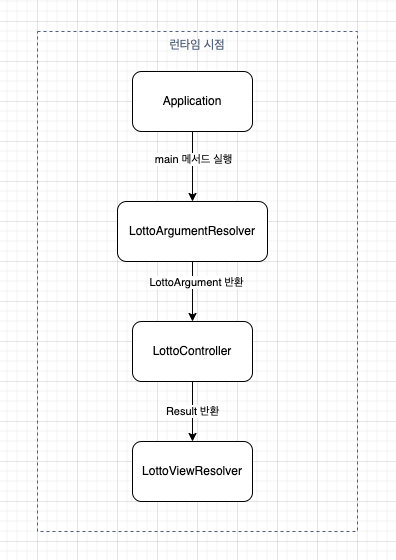

# 미션 - 로또

### IoC 컨테이너 초기화

### Application 실행

- `LottoArgumentResolver`: 사용자로부터 입력받은 값을 파싱하여 `LottoArgument` 객체로 변환하여 반환한다.
- `LottoController`: 비즈니스 로직을 호출하여 `Result`를 반환한다.
- `LottoViewResolver`: `Result`를 출력한다.

## 기능 구현

- [x] 로또 구입 금액 입력받는다.
    - [x] 금액이 1000 단위가 아니면 `IllegalArgumentException`를 발생시키고, "[ERROR] 금액은 1000의 배수여야 합니다." 에러 메시지를 출력 후 다시 입력 받는다.
- [x] 로또 구입 금액에 따른 개수의 로또 리스트를 출력한다.
    - [x] 1개의 로또를 발행할 때 중복되지 않는 6개의 숫자를 뽑는다.
    - [x] 발행한 로또 수량 및 번호를 출력한다. 로또 번호는 오름차순으로 정렬하여 보여준다.
- [x] 중복되지 않는 숫자 6개의 로또 번호 입력받는다.
    - [x] 올바르지 않으면 `IllegalArgumentException`를 발생시키고, "[ERROR] " 에러 메시지를 출력 후 다시 입력 받는다.
- [x] 보너스 번호 입력한다.
    - [x] 올바르지 않으면 `IllegalArgumentException`를 발생시키고, "[ERROR] " 에러 메시지를 다시 입력 받는다.
- [x] 당첨 결과를 생성한다.
    - [x] 당첨 숫자와 로또를 비교한다
- [x] 당첨 통계 출력한다.
    - [x] 수익률은 소수점 둘째 자리에서 반올림한다.

## 요구사항

- [x] indent(인덴트, 들여쓰기) depth를 3이 넘지 않도록 구현한다. 2까지만 허용한다.
- [x] 3항 연산자를 쓰지 않는다.
- [x] 함수(또는 메서드)가 한 가지 일만 하도록 최대한 작게 만들어라.
- [x] JUnit 5와 AssertJ를 이용하여 본인이 정리한 기능 목록이 정상 동작함을 테스트 코드로 확인한다.
- [x] 함수(또는 메서드)의 길이가 15라인을 넘어가지 않도록 구현한다.
- [x] 함수(또는 메서드)가 한 가지 일만 잘 하도록 구현한다.
- [x] else 예약어를 쓰지 않는다.
- [x] Java Enum을 적용한다.
- [x] camp.nextstep.edu.missionutils에서 제공하는 Randoms 및 Console API를 사용하여 구현해야 한다.
- [x] 제공된 Lotto 클래스를 활용해 구현해야 한다.
- [x] numbers의 접근 제어자인 private을 변경할 수 없다.
- [x] Lotto에 필드(인스턴스 변수)를 추가할 수 없다.

