<p align="center">
    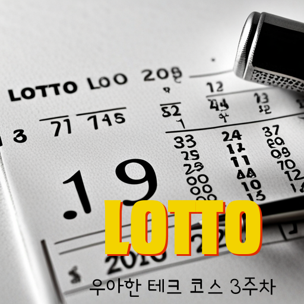
</p>

# 3주차 미션 - 로또
> 3주차 미션 로또를 구현한 저장소입니다.

<div style="text-align:center;">
    
</div>

## 목차
 - [실행하기](#실행하기)
 - [기능](#기능)
	- [로또 구입 금액 입력](#로또-구입-금액-입력)
		- [예외 처리 - 로또 구입 금액 입력](#예외-처리---로또-구입-금액-입력)
	- [로또 발행](#로또-발행)
	- [당첨 번호 입력](#당첨-번호-입력)
		- [예외 처리 - 당첨 번호 입력](#예외-처리---당첨-번호-입력)
	- [보너스 번호 입력](#보너스-번호-입력)
		- [예외 처리 - 보너스 번호 입력](#예외-처리---보너스-번호-입력)
	- [당첨 통계 출력](#당첨-통계-출력)

<br>

## 실행하기
현재 Repository를 Clone한 후 Eclipse(혹은 그 외 IDE)를 통해 실행합니다.
```git
git clone -b ilot12 https://github.com/ilot12/java-lotto-6
```
<br>

## 기능
게임 시작시 특별한 메세지 없이 다음 순서로 기능이 수행됩니다.
<br>
<br>

### 로또 구입 금액 입력
- 최초 시작시에 `구입금액을 입력해 주세요.`가 출력됩니다.
- 로또 구입 금액을 입력하면 구입 금액에 해당하는 만큼 로또를 발행합니다.

#### 예외 처리 - 로또 구입 금액 입력

- 0자의 입력을 받는 경우를 예외 처리했습니다.
- 수 이외의 입력을 받는 경우를 예외 처리했습니다.
- 올바르지 않은 수(음수와 0)를 입력하는 경우를 예외 처리했습니다.
- 로또 1개 가격(기본 1000)으로 나누어 떨어지지 않는 수를 입력하는 경우를 예외 처리했습니다.

	<details>
	<summary>예외 처리 코드 보기</summary>
		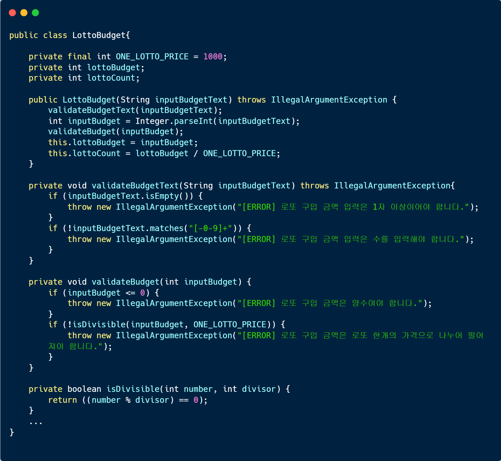
	</details>
	<details>
	<summary>실행 결과 및 테스트 코드 보기</summary>
		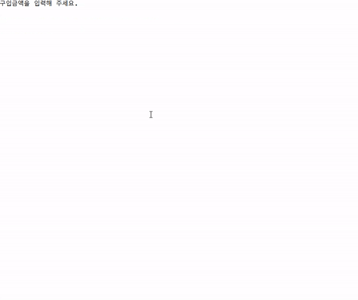
		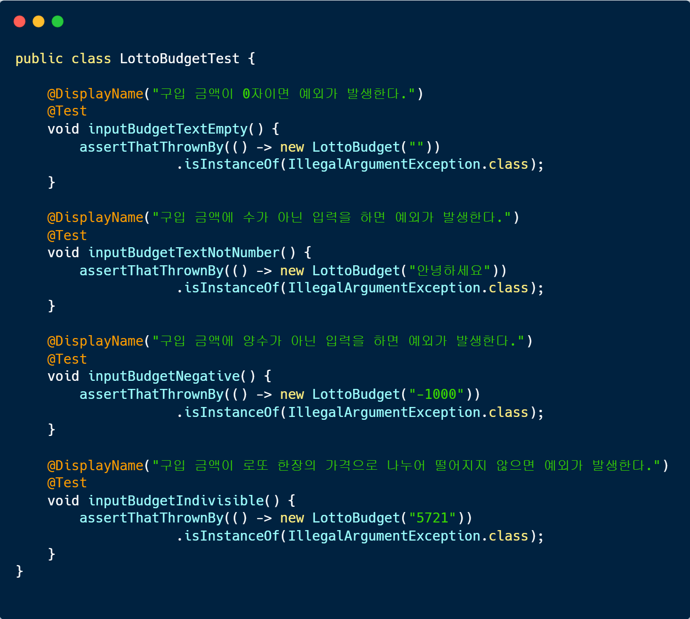
	</details>

### 로또 발행
- 위 입력한 구입 금액에 대해 `((로또 구입 금액) / (로또 1개 가격))개를 구매했습니다`가 출력됩니다.
- 기본 로또 1개 가격은 1000원 입니다.
- 발행된 로또 수 만큼 1 ~ 45까지의 중복되지 않은 6개의 수를 뽑습니다.
- 이후 발행된 각각의 로또를 출력합니다.

### 당첨 번호 입력
- `당첨 번호를 입력해 주세요.`가 출력됩니다.
- 1 ~ 45의 수로 이루어져 있고 쉼표(,)로 구분되는 당첨 번호 6개를 입력해야 합니다.

#### 예외 처리 - 당첨 번호 입력

- 쉼표로 구분했을 때 6개의 입력이 아닌 경우를 예외 처리했습니다.
- 쉼표로 구분했을 때 0자의 입력을 받는 경우를 예외 처리했습니다.
- 수 이외의 입력을 받는 경우를 예외 처리했습니다.
	<details>
	<summary>예외 처리 코드 보기</summary>
		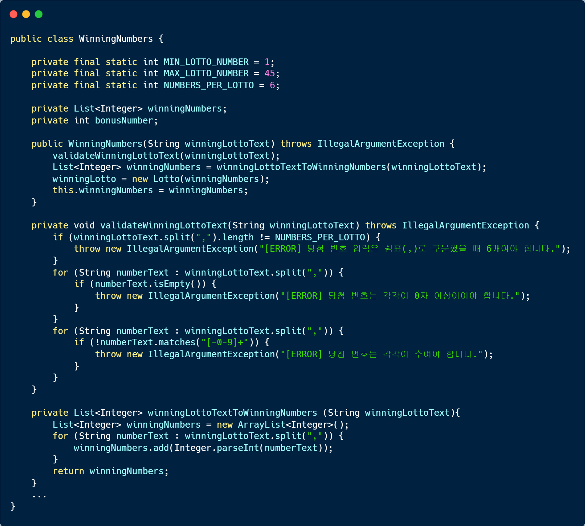
	</details>

- 범위(1 ~ 45) 밖의 수를 입력하는 경우를 예외 처리했습니다.
- 6개의 수에 중복이 있는 경우를 예외 처리했습니다.
	<details>
	<summary>예외 처리 코드 보기</summary>
		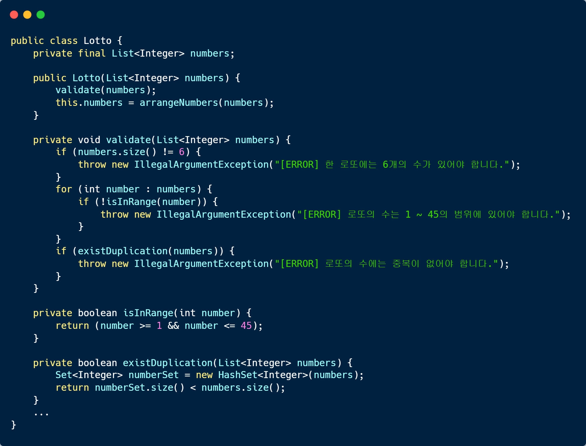
	</details>
	
	<details>
	<summary>실행 결과 및 테스트 코드 보기</summary>
		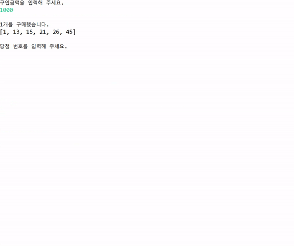
		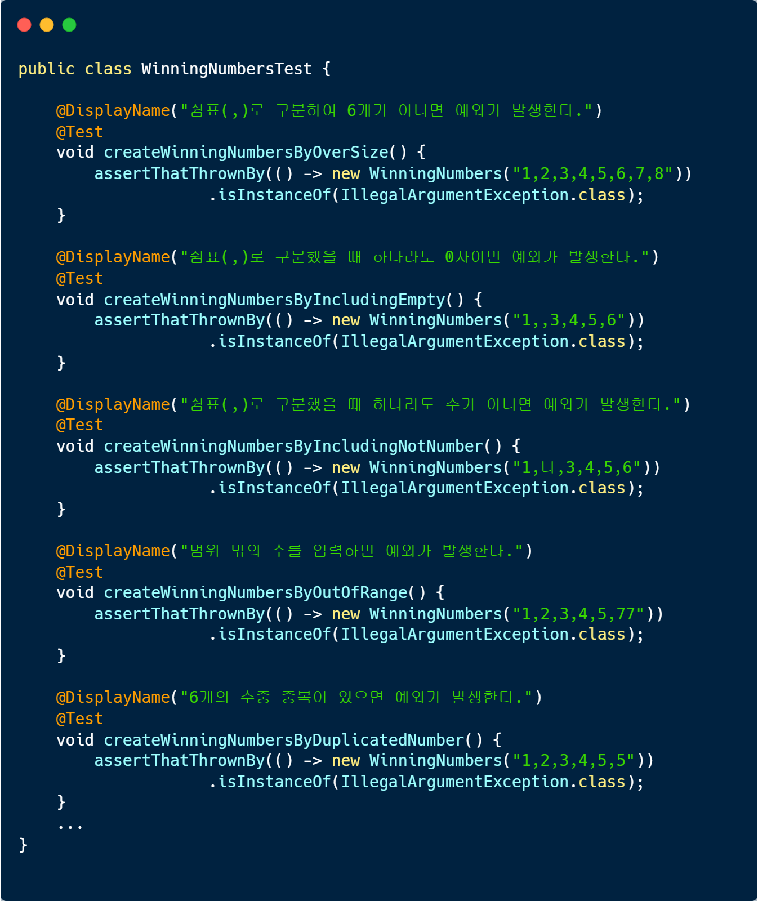
	</details>
	
### 보너스 번호 입력
- `보너스 번호를 입력해 주세요.`가 출력됩니다.
- 같은 범위(1 ~ 45)에서 보너스 번호 한 개를 입력해야 합니다.
	
#### 예외 처리 - 보너스 번호 입력
- 위 당첨 번호 입력과 같은 예외를 처리했습니다.
	- 0자입력
	- 수 입력
	- 범위에 맞는 수 입력
	- 기존 6개의 당첨 번호와 중복
	
	
		<details>
		<summary>예외 처리 코드 보기</summary>
			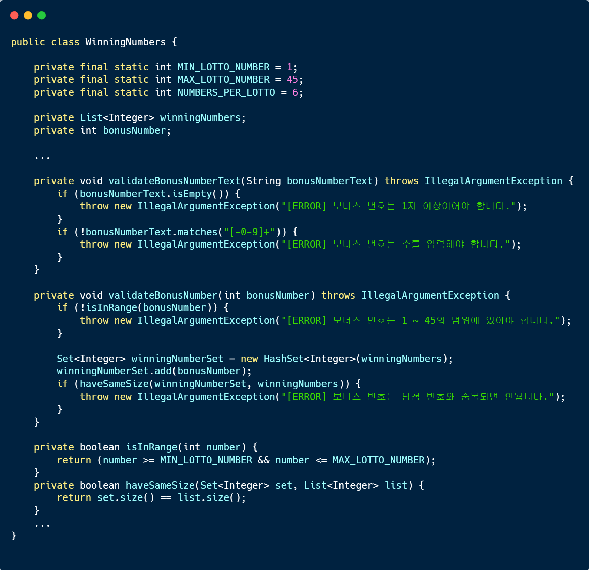
		</details>
		
		<details>
		<summary>실행 결과 및 테스트 코드 보기</summary>
			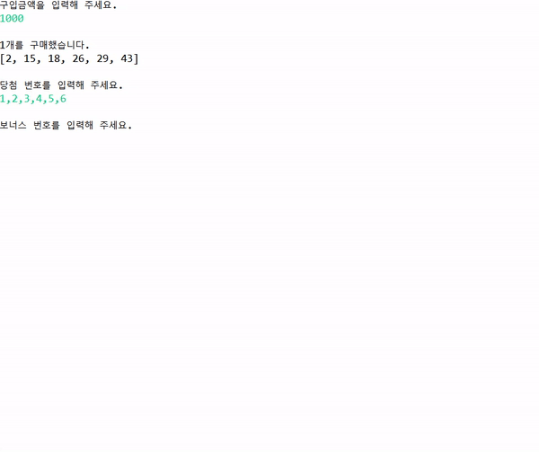
			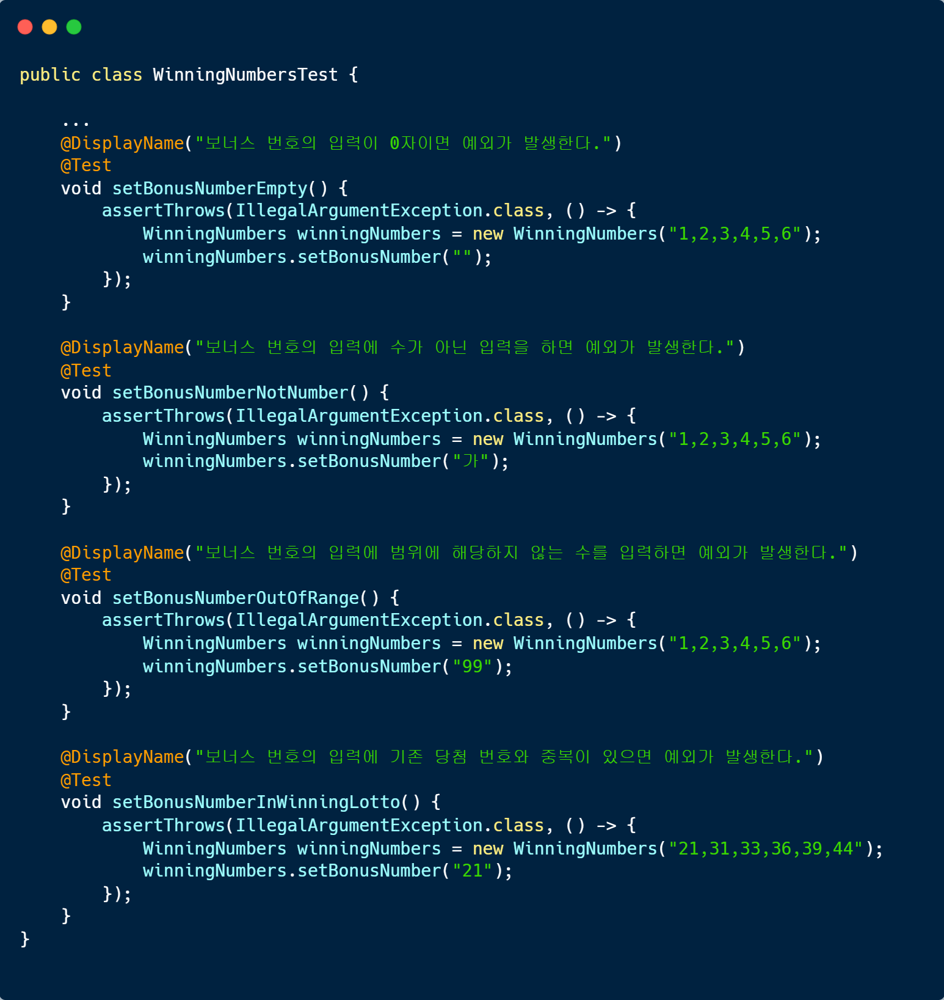
		</details>

### 당첨 통계 출력
- 각 로또에 대해 당첨 내역을 계산하고 이를 종합한 결과를 계산합니다.
- `당첨 통계`와 그 아래에 구분선으로 `---`가 출력된 후 그 아래로 종합 결과가 출력됩니다.
- 보너스 볼이 일치하는 2등 외에 각 줄에는 `n개 일치 (당첨금) - m개`와 같은 형식으로 출력됩니다.
- 보너스 볼이 일치하는 2등은 `n개 일치, 보너스 볼 일치 (당첨금) - m개`와 같은 형식으로 출력됩니다.
- 마지막 줄에 총 수익률((당첨금 합계) / (로또 구입 금액)) \* (100%)을 계산하여
<br> `총 수익률은 (총 수익률)%입니다.`가 출력됩니다.