# 로또 게임 App 🎰

## 진행 과정

- [X] 사용자에게 금액, 당첨번호, 보너스번호를 입력 받는다.
    - 금액은 1000원 단위로 입력해야하며, 로또는 1장당 1000원 이다. 지불한 금액만큼 로또를 발행한다.
    - 당첨 번호는 1과 45 사이의 숫자를 쉼표(,)로 구분하여 총 6개를 입력해야 한다.
    - 보너스 번호는 당첨 번호와 중복이 불가하고, 1과 45사이의 숫자 1개를 입력해야 한다.
    - 사용자가 입력을 잘못했을 경우에는 ERROR 메세지가 출력되고, 그 부분 부터 다시 입력을 할 수 있다.
    ```
    구입금액을 입력해 주세요.
    1000j
    [ERROR] 금액은 숫자여야 합니다.
    구입금액을 입력해 주세요.
    1000 
    ```
- [X] 로또 게임의 결과들을 출력 한다.
    - 발행한 로또 수량 및 번호를 출력한다. 로또 번호는 오름차순으로 정렬하여 보여준다.
    - 당첨 내역을 출력한다. 내역은 당첨된 상금의 종류와 갯수 이다.
    ```
    3개 일치 (5,000원) - 1개
    4개 일치 (50,000원) - 0개
    5개 일치 (1,500,000원) - 0개
    5개 일치, 보너스 볼 일치 (30,000,000원) - 0개
    6개 일치 (2,000,000,000원) - 0개
    ```
    - 총 수익률은 소수점 둘째 자리에서 반올림하고, 숫자 3개씩 쉼표(,)로 구분하여 보여준다.
    ```
    총 수익률은 0.0%입니다.
    총 수익률은 62.5%입니다.
    총 수익률은 1,000,000.0%입니다.
    ```

## 클래스 및 기능 구현 목록

### 1. domain

#### Lotto

로또 번호를 저장하고, 관련된 기능을 수행한다.

- [X] 랜덤 숫자를 전달 받아 필드에 List<Integer> 타입으로 갖고 있는다.
- [X] 로또 번호 중 당첨 번호와 일치하는 숫자의 갯수를 카운팅한다.
- [X] 로또 번호에 보너스 번호 포함여부를 확인한다.
- [X] 예외 처리
    - 로또 번호에 중복된 숫자들이 존재할 경우
    - 로또 번호의 갯수가 6개가 아닐 경우
    - 각 로또 번호가 1과 45 사이를 벗어 나는 경우

#### LottoQuantity

발행된 로또를 저장하고, 관련된 기능을 수행한다.

- [X] 티켓의 수를 전달 받아 로또를 발행 한다.
    - 1~45사이의 랜덤 숫자 6개를 티켓의 수만큼 생성하여 로또를 발행하는 형식이다.
- [X] 발행된 로또들은 필드에 List<Lotto> 형태로 갖고 있는다.

#### Money

금액을 저장하고, 관련된 기능을 수행한다.

- [X] 입력 받은 금액 String 타입을 int 타입으로 변환 한다.
- [X] 변환된 int 타입의 금액을 필드에 갖고 있는다.
- [X] 구입 금액의 단위를 int 상수 타입으로 갖고 있는다.
- [X] 지불한 금액으로 발행 가능한 로또 티켓의 수를 계산한다.
- [X] 총 수익률을 계산한다.
- [X] 예외처리
    - 금액이 숫자가 아닌 경우
    - 금액이 1000원 단위가 아닌 경우
    - 금액이 음수인 경우

#### Winning

당첨 번호를 저장하고, 관련된 기능을 수행한다.

- [X] 입력 받은 당첨번호 String 타입을 List<Integer> 타입으로 변환한다.
- [X] 변환된 List<Integer> 타입의 당첨번호를 필드에 갖고 있는다.
- [X] 예외처리
    - 숫자가 아닌 경우
    - 당첨 번호에 중복된 숫자들이 존재할 경우
    - 당첨 번호의 갯수가 6개가 아닐 경우
    - 각 당첨 번호가 1과 45 사이를 벗어 나는 경우

#### Bonus

보너스 번호를 저장하고, 관련된 기능을 수행한다.

- [X] 보너스 번호를 필드에 int 타입으로 갖고 있는다.
- [X] 입력 받은 보너스 번호 String 타입을 int 타입으로 변환한다.
- [X] 예외처리
    - 숫자가 아닌 경우
    - 당첨 번호와 중복이 될 경우
    - 번호가 1과 45 사이를 벗어 나는 경우

#### Prize

상금의 정보를 저장하고, 관련된 기능을 수행한다.

- [X] 상금의 정보들을 Enum 타입으로 갖고 있는다.
    - 상금 메세지 (message)
    - 상금 (reward)
    - 당첨 번호와 일치 하는 번호 갯수 (sameNumberCount)
    - 보너스 번호 일치 여부 (bonus)
- [X] 당첨 번호와 일치 하는 숫자의 갯수 및 보너스 번호 일치 여부를 이용해서 상금의 정보를 찾는다.

#### PrizeResult

<u>**FAIL을 제외한**</u> 상금 종류들의 갯수를 저장하고, 관련된 기능을 수행한다.

- [X] 당첨된 상금 종류와 갯수를 필드에 Map<Prize,Integer> 타입으로 갖고 있는다.
    - 당첨된 상금 종류의 결과를 전달 받아 이를 Map타입으로 변환하여 갖고 있는 형식이다.

### 2. service

#### LottoService

비지니스 로직에 필요한 기능을 수행한다.

- [X] LottoQuantity 도메인을 생성하고, 해당 필드 값을 가져온다.
    - 컨트롤러로 부터 Money 도메인을 전달 받아 티켓 수를 확인한다.
    - 티켓 수를 이용하여 LottoQuantity 도메인을 생성한다.
- [X] Winning 도메인을 생성하고, 해당 필드 값을 가져온다.
    - 컨트롤러로 부터 사용자가 입력한 당첨번호를 전달받아 Winning 도메인을 생성한다.
- [X] Bonus 도메인을 생성하고, 해당 필드 값을 가져온다.
    - 컨트롤러로 부터 사용자가 입력한 보너스 번호를 전달받아 Bonus 도메인을 생성한다.
- [X] PrizeResult 도메인을 생성하고, 해당 필드 값을 가져온다.
    - 컨트롤러로 부터 발행 된 로또, 당첨번호, 보너스번호를 전달 받아 당첨된 상금 종류들을 계산한다.
    - 당첨된 상금 종류들을 이용하여 PrizeResult 도메인을 생성한다.
- [X] 총 수익률을 가져온다.
    - 컨트롤러로 부터 당첨 결과와 Money 도메인을 전달 받아 총 수익률을 계산한다.
    - 직접적인 계산은 Money 도메인의 기능을 통해 수행한다.

### 3. view

#### InputView

사용자가 입력한 값을 읽는 기능을 한다.

- [X] 사용자가 입력한 값들을 읽는다.
    - 금액
    - 당첨번호
    - 보너스번호

#### OutputView

입력 요청 메세지 및 게임의 결과를 사용자에게 보여주는 기능을 한다.

- [X] 로또 게임에 필요한 값들의 입력 요청 메세지를 출력한다.
    - 금액
    - 당첨번호
    - 보너스번호
- [X] 로또 게임의 결과들을 출력한다.
    - 구입한 로또 목록
    - 당첨된 상금의 종류와 갯수
    - 총 수익률

### 4. controller

#### LottoController

애플리케이션 실행 시 view를 통해 사용자의 입력을 받고, 이를 서비스에 전달하여 비지니스 로직을 실행한다.
완료 후 view를 통해 사용자에게 결과를 보여준다.

- [X] 입력 받은 금액 만큼 로또를 구매 후 출력한다.
- [X] 당첨 번호를 요청한다.
- [X] 보너스 번호를 요청한다.
- [X] 입력 받은 당첨 번호와 보너스 번호를 이용해 당첨된 상금의 종류와 갯수를 출력한다.
- [X] 총 수익률을 출력한다.

## 다이어그램

### 1. 어플리케이션 플로우


### 2. 클래스

#### controller -> service -> domain

```mermaid
classDiagram
    direction BT
    class Bonus {
        - int number
        + getNumber() int
    }
    class Lotto {
        - List~Integer~ numbers
        + countSameNumber(List~Integer~) int
        + containsBonus(int) boolean
        + getNumbers() List~Integer~
    }
    class LottoController {
        - LottoService lottoService
        - InputView inputView
        - OutputView outputView
        + run() void
        - requestBonusNumber(List~Integer~) int
        - requestMoney() Money
        - buyLottos(Money) List~Lotto~
        - responsePrizeResult(Map~Prize, Integer~) void
        - responseLottos(List~Lotto~, Money) void
        - responseRevenue(Map~Prize, Integer~, Money) void
        - requestWinningNumbers() List~Integer~
    }
    class LottoQuantity {
        - List~Lotto~ lottos
        + getLottos() List~Lotto~
        - createLottos(int) List~Lotto~
        - putLotto(List~Lotto~) void
    }
    class LottoService {
        + getMoney(String) Money
        + getWinningNumbers(String) List~Integer~
        + getLottos(Money) List~Lotto~
        + getPrizeResult(List~Lotto~, List~Integer~, int) Map~Prize, Integer~
        + getRevenue(Map~Prize, Integer~, Money) double
        + getBonusNumber(String, List~Integer~) int
        - findPrize(Lotto, List~Integer~, int) Prize
        - calculatePrize(List~Lotto~, List~Integer~, int) List~Prize~
        - calculateRewards(Map~Prize, Integer~) double
    }
    class Money {
        - int money
        + calculateTicket() int
        + calculateRevenue(double) double
    }
    class Prize {
        <<enumeration>>
        +  FIRST
        +  FOURTH
        +  FAIL
        +  THIRD
        +  SECOND
        +  FIFTH
        - String message
        - int reward
        - boolean bonus
        - int sameNumberCount
        + getReward() int
        + findBySameNumberCountAndBonus(int, boolean) Prize
        + valueOf(String) Prize
        + values() Prize[]
        + getMessage() String
        - existBySameNumberCountAndBonus(Prize, int, boolean) boolean
    }
    class PrizeResult {
        - Map~Prize, Integer~ result
        + getResult() Map~Prize, Integer~
        - putPrize(List~Prize~, Map~Prize, Integer~) void
        - createResult(List~Prize~) Map~ Prize, Integer~
    }
    class Winning {
        - List~Integer~ numbers
        + getNumbers() List~Integer~
    }

    LottoController ..> LottoService: «create»
    LottoController "1" *--> "lottoService 1" LottoService
    LottoQuantity "1" *--> "lottos *" Lotto
    LottoQuantity ..> Lotto: «create»
    LottoService ..> Bonus: «create»
    LottoService ..> LottoQuantity: «create»
    LottoService ..> Money: «create»
    LottoService ..> PrizeResult: «create»
    LottoService ..> Winning: «create»
    PrizeResult "1" *--> "result *" Prize

```



#### view -> controller


#### util & constant

