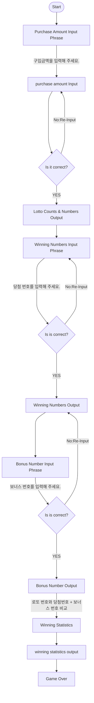

# 우아한테크코스 프리코스 6th - 로또 미션

## 📊 FlowChart - java-lotto-6 Mission



## 🧑‍💼기능 명세서

### 0. 로또 게임 규칙

```
- 로또 번호의 숫자 범위는 1~45까지이다.
- 1개의 로또를 발행할 때 중복되지 않는 6개의 숫자를 뽑는다.
- 당첨 번호 추첨 시 중복되지 않는 숫자 6개와 보너스 번호 1개를 뽑는다.
- 당첨은 1등부터 5등까지 있다. 당첨 기준과 금액은 아래와 같다.
    - 1등: 6개 번호 일치 / 2,000,000,000원
    - 2등: 5개 번호 + 보너스 번호 일치 / 30,000,000원
    - 3등: 5개 번호 일치 / 1,500,000원
    - 4등: 4개 번호 일치 / 50,000원
    - 5등: 3개 번호 일치 / 5,000원
```

### 1. 🤔 어떤 기능을 구현해야 하는가

> 로또 게임에 구현할 기능을 나열해본다.

* 로또 번호의 숫자 범위는 1부터 45까지이다.
* 1개의 로또를 발행 시, 중복되지 않는 6개의 숫자를 뽑는다.
* 당첨 번호 추첨 시, 중복되지 않는 6개의 숫자와 보너스 번호 1개를 뽑는다.
* 당첨자는 1등부터 5등까지 있다.
* 로또 구입 금액만큼 로또를 발행해 주어야 한다.
* 로또 1장의 가격은 1,000원으로 설정한다.
* 당첨 번호와 보너스 번호는 입력받아 사용한다.
* 사용자가 구매한 로또 번호와 당첨 번호를 비교한다.
  * 당첨 내역 및 수익률을 출력한다.
  * 로또 게임을 종료한다.
* 사용자가 잘못된 값을 입력할 경우 `IllegalArgumentException` 를 발생시킨다.
  * [ERROR] 로 시작하는 에러 메시지를 출력한다.
  * 잘못 입력한 부분부터 다시 입력을 받는다.

### 2. 👩‍👩‍👧‍👧 어떤 객체들로 이루어졌는가

> 게임에 사용될 객체들을 분석한다.

`사용자`

1. 로또 구입 금액을 입력한다.
    * 구입 금액만큼 로또를 받는다.
2. 당첨 번호와 보너스 번호를 입력한다.
3. 잘못된 값을 입력한 경우 에러 메시지를 읽고 다시 입력한다.

`게임 컴퓨터`

0. 사용자가 잘못된 값을 입력할 경우 `IllegalArgumentException` 를 발생시킨다.
   * [ERROR] 로 시작하는 에러 메시지를 출력한다.
   * 잘못 입력한 부분부터 다시 입력을 받는다.
1. 게임 시작 문구를 출력한다.
2. 구매한 로또의 개수를 출력한다.
3. 생성된 로또의 번호들을 출력한다.
4. 당첨 번호 입력 문구를 출력한다.
5. 보너스 번호 입력 문구를 출력한다.
6. 모든 로또와 당첨 번호 + 보너스 번호를 비교하여 당첨 통계를 출력한다.
    * 1등부터 5등까지의 당첨 내역을 출력한다.
    * 수익률을 소수점 둘째 자리에서 반올림하여 출력한다.
7. 게임을 종료한다.

`로또 숫자 생성기`

1. 1~45사이에서 무작위 값을 생성한다.
    * 위 범위에서 중복되지 않는 6개의 숫자를 생성한다.
2. 생성된 무작위 값을 "게임 컴퓨터"에게 전달한다.

### 3. 🔄 어떻게 상호작용 하는가
> (1,2) 분석 이후, 각 객체들의 상호작용을 분석한다.

`사용자`

1. 로또 구입 금액을 `게임 컴퓨터`에게 입력한다.
    * `게임 컴퓨터`에게 구입 금액만큼 로또를 발행 받는다.
2. 당첨 번호 6개와 보너스 번호 1개를 `게임 컴퓨터`에게 입력한다.
3. 잘못된 값을 입력한 경우 에러 메시지를 읽고 다시 입력한다.

`게임 컴퓨터`

0. `사용자`가 잘못된 값을 입력할 경우 `IllegalArgumentException`를 발생시킨다.
    * [ERROR] 로 시작하는 에러 메시지를 `사용자`에게 출력한다.
    * 잘못 입력한 부분부터 다시 입력을 받는다.
1. 게임 시작 문구를 `사용자`에게 출력한다.
2. 구매한 로또의 개수를 `사용자`에게 출력한다.
3. 생성된 로또의 번호들을 `사용자`에게 출력한다.
4. 당첨 번호 6개와 보너스 번호 1개를 `사용자`에게 입력 받는다.
   * 당첨 번호 입력 문구를 `사용자`에게 출력한다.
   * 보너스 번호 입력 문구를 `사용자`에게 출력한다.
5. 모든 로또와 당첨 번호 + 보너스 번호를 비교하여 당첨 통계를 `사용자`에게 출력한다.
    * 1등부터 5등까지의 당첨 내역을 출력한다.
    * 수익률을 소수점 둘째 자리에서 반올림하여 출력한다.
6. 게임을 종료한다.


`로또 숫자 생성기`

1. 1~45사이에서 무작위 값을 생성한다.
    * 위 범위에서 중복되지 않는 6개의 숫자를 생성하여 `게임 컴퓨터`에게 전달한다.

---
## 요구사항

* [ ] 프로그래밍 요구 사항에서 달리 명시하지 않는 한 파일, 패키지 이름을 수정하거나 이동하지 않는다.

* [ ] indent(인덴트, 들여쓰기) depth를 3이 넘지 않도록 구현한다. 2까지만 허용한다.
   * 예를 들어 while문 안에 if문이 있으면 들여쓰기는 2이다. 
   * 힌트: indent(인덴트, 들여쓰기) depth를 줄이는 좋은 방법은 함수(또는 메서드)를 분리하면 된다.

* [ ] 3항 연산자를 쓰지 않는다.

* [ ] 함수(또는 메서드)가 한 가지 일만 하도록 최대한 작게 만들어라.

* [ ] JUnit 5와 AssertJ를 이용하여 본인이 정리한 기능 목록이 정상 동작함을 테스트 코드로 확인한다.

* [ ] 함수(또는 메서드)의 길이가 15라인을 넘어가지 않도록 구현한다.

* [ ] 함수(또는 메서드)가 한 가지 일만 잘 하도록 구현한다.

* [ ] else 예약어를 쓰지 않는다.
  * 힌트: if 조건절에서 값을 return하는 방식으로 구현하면 else를 사용하지 않아도 된다.
  * else를 쓰지 말라고 하니 switch/case로 구현하는 경우가 있는데 switch/case도 허용하지 않는다.
* [ ] Java Enum을 적용한다.
* [ ] 도메인 로직에 단위 테스트를 구현해야 한다. 단, UI(System.out, System.in, Scanner) 로직은 제외한다.
      핵심 로직을 구현하는 코드와 UI를 담당하는 로직을 분리해 구현한다.
      단위 테스트 작성이 익숙하지 않다면 test/java/lotto/LottoTest를 참고하여 학습한 후 테스트를 구현한다.

---

## Git Commit 기능 목록 단위

-[x] docs: 기능 명세서 작성

-[x] docs: flowchart 그리기

-[x] feat: 로또 구입 금액을 입력받는다. (한장당 1000원)
    - [x] feat: 한장당 1부터 45까지 서로 다른 6개의 임의의 수를 생성한다.
    - [x] feat: 1000원으로 나누어 떨어지지 않는경우 `IllegalArgumentException`를 발생시킨다.
    - [x] feat: 로또 번호는 오름차순으로 정렬한다.

- [x] feat: 당첨 번호를 입력받는다.
    - [] feat: 서로 다른 6개의 임의의 수를 입력한다.
        - [ ] feat: 입력한 서로 다른 6개의 임의의 수는 오름차순으로 정렬한다.
    - [ ] feat: 보너스 번호 1개를 입력한다.
  
- [ ] feat: 일치하는 로또 번호와 당첨 금액을 정의하는 enum 클래스 생성한다.

- [ ] feat: 사용자가 구매한 로또 번호와 당첨번호를 비교해 당첨 내역을 확인할 수 있다.
    - [ ] feat: 일치하는 번호의 개수를 확인할 수 있다.
    - [ ] feat: 일치하는 번호의 수만큼 수익이 측정된다.
        - [ ] 3개 번호가 일치하면 5,000원이며, 5등이다.
        - [ ] 4개 번호가 일치하면 50,000원이며, 4등이다.
        - [ ] 5개 번호가 일치하면 1,500,000원이며, 3등이다.
        - [ ] 5개 번호가 일치하고 보너스 번호가 일치하면 30,000,000원 2등이다.
        - [ ] 6개 번호가 일치하면 2,000,000,000원이다.

- [ ] feat: 사용자가 구입한 로또 금액과 당첨 금액으로 수익률을 확인할 수 있다.
    - [ ] feat: 수익률은 소수점 둘재 자리에서 반올림한다.

